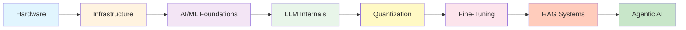
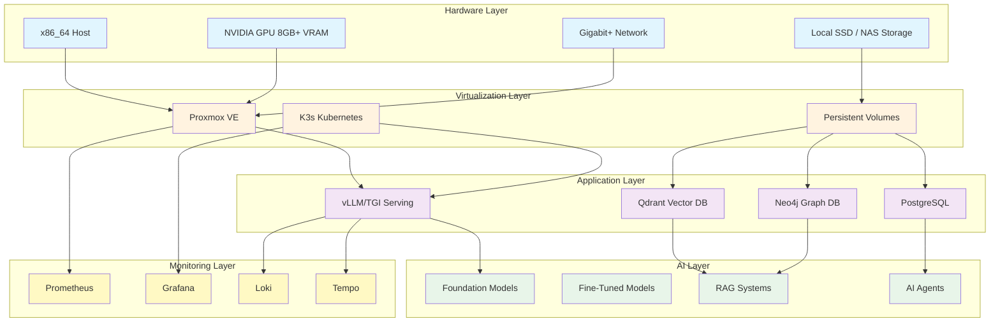
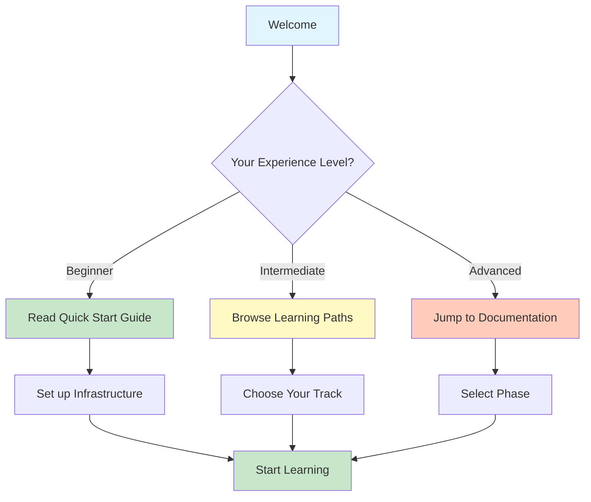
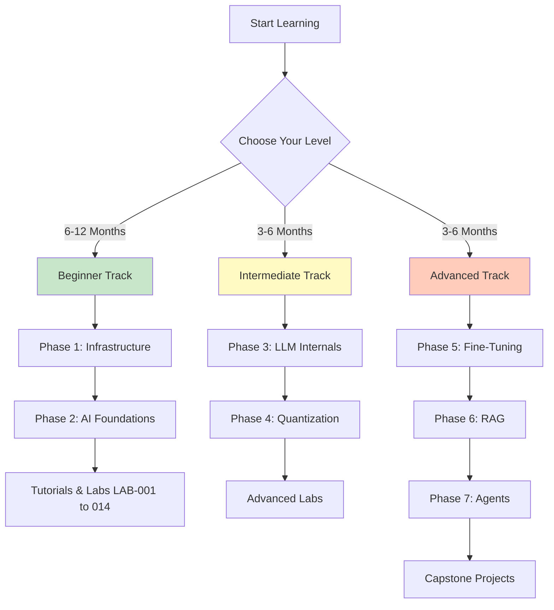

<div align="center">


# Minder Academy

## Master Documentation

[](LICENSE)
[](./docs)
[](#-learning-phases)
[](#-summary-statistics)

**A comprehensive, production-grade AI engineering curriculum — run it on your own hardware or in the cloud**

[](#-quick-start)
[](#-learning-path)
[](#-documentation-index)
[](#-contributing)

---
</div>

## Table of Contents

- [Overview](#overview)
- [Key Takeaways](#key-takeaways)
- [Why Minder Academy](#why-minder-academy)
- [Key Features](#key-features)
- [Architecture](#architecture)
- [Quick Start](#quick-start)
- [Learning Path](#learning-path)
- [Learning Phases](#learning-phases)
- [Documentation Index](#documentation-index)
- [Practical Applications](#practical-applications)
- [Experiments](#experiments)
- [Configurations](#configurations)
- [Hardware Requirements](#hardware-requirements)
- [Installation](#installation-1)
- [Common Pitfalls](#common-pitfalls)
- [Pro Tips](#pro-tips)
- [Performance Benchmarks](#performance-benchmarks)
- [Quick Reference](#quick-reference)
- [Usage](#usage)
- [Statistics](#summary-statistics)
- [Roadmap](#roadmap)
- [Contributing](#contributing)
- [Troubleshooting](#troubleshooting)
- [Community](#community)
- [License](#license)
- [Acknowledgments](#acknowledgments)

---

## Overview

<div align="center">



</div>

**Minder Academy** is a **production-grade AI infrastructure and learning platform**. It serves as both:

### 1. Technical Reference
Implementation guides for enterprise-grade AI systems on affordable hardware. Learn to deploy, optimize, and scale AI models using practical, battle-tested configurations — locally or in the cloud.

### 2. Educational Platform
A structured curriculum taking you from foundations to production mastery. Each module includes theory, hands-on exercises, quizzes, and real-world projects.

### What You'll Build

| Project | Description | Tech Stack |
|---------|-------------|------------|
| 🌐 **Network Foundation** | High-throughput infrastructure | Wired networking, VLANs, bandwidth planning |
| 🔧 **GPU Passthrough** | Multi-GPU virtualization | Proxmox, IOMMU, VFIO |
| ☸️ **K8s Cluster** | Container orchestration | K3s, Helm, persistent storage |
| 🚀 **LLM Serving** | Production inference | vLLM, TGI, Ollama |
| 🧠 **Fine-Tuning** | Custom model training | LoRA, QLoRA, DPO |
| 🔍 **RAG System** | Knowledge retrieval | Qdrant, GraphRAG |
| 🤖 **AI Agents** | Autonomous systems | ReAct, Multi-Agent |

---

## Key Takeaways

### ✅ What You'll Master

After completing Minder Academy, you will be able to:

1. **Build Production AI Infrastructure**
   - Design a network that sustains AI workloads
   - Configure GPU passthrough on Proxmox
   - Set up a K3s Kubernetes cluster
   - Implement monitoring (Prometheus, Grafana)

2. **Understand LLM Internals**
   - Implement self-attention from scratch
   - Master Flash Attention for memory optimization
   - Work with RoPE positional embeddings
   - Compare tokenization strategies

3. **Optimize Model Performance**
   - Apply quantization (GGUF, EXL2, AWQ)
   - Extend context windows
   - Implement speculative decoding
   - Profile and benchmark models

4. **Fine-Tune Custom Models**
   - Train with LoRA and QLoRA
   - Apply DPO for alignment
   - Generate synthetic data
   - Use distributed training

5. **Build RAG Systems**
   - Deploy vector databases (Qdrant)
   - Implement hybrid search
   - Build knowledge graphs (Neo4j)
   - Create GraphRAG systems

6. **Create AI Agents**
   - Implement ReAct pattern
   - Build multi-agent systems
   - Add memory and tools
   - Secure against prompt injection

---

## Why Minder Academy?

| Challenge | Minder Academy Solution |
|:----------:|:----------------------:|
| 💸 **AI infrastructure is expensive** | Run production-grade AI on affordable hardware or modest cloud instances |
| 📚 **Documentation is scattered** | **488 files** in one organized, cross-referenced repository |
| 🎯 **Learning gaps exist** | Complete curriculum from infrastructure to agentic systems |
| 📝 **Theory without practice** | **33 PRACTICE files** with runnable solutions, **47 experiments** |
| 🗺️ **No clear path forward** | **7 phases**, **3 learning tracks**, progress tracking built-in |

---

## Key Features

### 🎓 Comprehensive Curriculum
- **7 Learning Phases** covering the full AI stack
- **33 Technical Modules** with detailed documentation
- **33 PRACTICE Files** with complete, runnable solutions
- **33 QUIZ Files** for knowledge verification
- **47 Experiment Files** for hands-on validation

### 🏗️ Production-Ready Infrastructure
- Docker Compose reference stack (vLLM inference + Qdrant vector DB)
- Environment-driven configuration (`.env.example`) — no secrets in the repo
- k6 load-testing scenarios for inference, retrieval, and end-to-end latency
- Monitoring and observability recipes (Prometheus, Grafana, Loki) in the Phase 1 curriculum

### 📚 Rich Learning Resources
- **15 hands-on lab files** with solutions (LAB-000 setup + LAB-001 to LAB-014 system)
- **15 tutorials** with step-by-step instructions
- **22 project files** for capstone projects
- **13 cheat sheets** for quick reference

### 🔧 Real-World Applications
- Vector database implementation guides
- RAG system deployment patterns
- Multi-agent system architectures
- Enterprise knowledge base solutions
- Industry-specific use cases (Healthcare, Finance)

---

## Architecture

The curriculum is hardware-agnostic. Below is the target architecture any suitable machine (or a small set of cloud instances) can realize:



### Deployment Targets

| Target | Fits | Notes |
|--------|------|-------|
| **Local Docker host** | Quick start, RAG experiments | Any machine with Docker; no GPU required for Qdrant |
| **GPU workstation** | Inference, fine-tuning | NVIDIA GPU with 8GB+ VRAM, Docker + NVIDIA Container Toolkit |
| **Home server / mini-PC cluster** | Full curriculum | Proxmox + K3s as taught in Phase 1 |
| **Cloud instances** | Everything above | Any VM shape with an NVIDIA GPU works; sizes per module |

---

## Quick Start

### Prerequisites

```bash
# Hardware Requirements
- CPU: x86_64 with VT-x/AMD-V
- RAM: 16GB minimum, 32GB+ recommended
- GPU: 8GB+ VRAM (NVIDIA recommended)
- Storage: 100GB+ SSD
- Network: 1Gbps+
```

### Installation

```bash
# 1. Clone the repository
git clone https://github.com/minderhq/academy.git
cd academy

# 2. Copy environment configuration
cp configs/.env.example configs/.env

# 3. Update configuration with your settings
nano configs/.env

# 4. Start the reference stack (Qdrant + vLLM)
docker compose -f configs/docker-compose.yml up -d

# 5. Verify deployment
docker compose ps
curl http://localhost:6333/collections   # Qdrant
curl http://localhost:8000/v1/models     # vLLM
```

### Your First Steps

<div align="center">



</div>

| Step | Action | Resource |
|:----:|--------|----------|
| 1️⃣ | Read the Quick Start Guide | [docs/00-META/QUICK-START.md](docs/00-META/QUICK-START.md) |
| 2️⃣ | Explore the 7 Phases | [docs/00-META/VOLUME-GUIDE.md](docs/00-META/VOLUME-GUIDE.md) |
| 3️⃣ | Choose your Learning Path | [docs/00-META/0000-LEARNING-PATH.md](docs/00-META/0000-LEARNING-PATH.md) |
| 4️⃣ | Track your Progress | [docs/00-META/PROGRESS-TRACKER.md](docs/00-META/PROGRESS-TRACKER.md) |

---

## Learning Path

### Choose Your Track

<div align="center">



</div>

### Beginner Track (6-12 months)

**Goal:** Build your AI infrastructure and learn fundamentals

| Phase | Focus | Duration | Output |
|:-----:|-------|:--------:|--------|
| 1 | Infrastructure Setup | 4-6 weeks | Proxmox host with GPU passthrough, K3s cluster |
| 2 | AI/ML Foundations | 8-12 weeks | Math understanding, framework skills |
| Labs | Hands-on Practice | Ongoing | LAB-001 to LAB-014 completed |

**What you'll build:**
- ✅ High-throughput network design
- ✅ GPU passthrough VM with Proxmox
- ✅ K3s Kubernetes cluster
- ✅ Basic LLM serving stack (Ollama)

### Intermediate Track (3-6 months)

**Goal:** Understand LLM internals and optimize performance

| Phase | Focus | Duration | Output |
|:-----:|-------|:--------:|--------|
| 3 | LLM Internals | 6-8 weeks | Transformer architecture understanding |
| 4 | Quantization | 4-6 weeks | Optimized model deployment |

**What you'll master:**
- ✅ Self-attention and transformer architectures
- ✅ Embeddings and tokenization
- ✅ Quantization (GGUF, EXL2, AWQ)
- ✅ Context window optimization

### Advanced Track (3-6 months)

**Goal:** Deploy production AI systems

| Phase | Focus | Duration | Output |
|:-----:|-------|:--------:|--------|
| 5 | Model Adaptation | 4-6 weeks | Custom fine-tuned models |
| 6 | Data Nexus | 4-6 weeks | Production RAG systems |
| 7 | Agentic AI | 4-6 weeks | Multi-agent systems |

**What you'll deploy:**
- ✅ Custom fine-tuned models (LoRA, QLoRA, DPO)
- ✅ Production RAG systems (GraphRAG)
- ✅ Multi-agent systems (ReAct, Hierarchical)
- ✅ Enterprise knowledge bases

---

## Learning Phases

### Phase 1: Infrastructure Fabric [1000]
**Turning commodity hardware into a programmable, scalable AI factory**

| Module | Topic | Docs | Status |
|:------:|-------|:----:|:------:|
| [1100](./docs/phases/phase1-infra/1100-network/README.md) | Network Topology | 3 | ✅ |
| [1200](./docs/phases/phase1-infra/1200-virtualization/README.md) | Virtualization | 4 | ✅ |
| [1300](./docs/phases/phase1-infra/1300-kubernetes/README.md) | Kubernetes | 3 | ✅ |
| [1400](./docs/phases/phase1-infra/1400-llmops/README.md) | LLMOps | 5 | ✅ |
| [1500](./docs/phases/phase1-infra/1500-monitoring/README.md) | Monitoring | 3 | ✅ |

**Topics:** Network Design, Proxmox, GPU Passthrough, K3s, vLLM, TGI, Observability

---

### Phase 2: Cognitive Science & Frameworks [2000]
**Deep-diving into the "Laws of Physics" of AI and Deep Learning**

| Module | Topic | Docs | Status |
|:------:|-------|:----:|:------:|
| [2100](./docs/phases/phase2-foundations/2100-calculus/README.md) | Tensor Algebra | 2 | ✅ |
| [2200](./docs/phases/phase2-foundations/2200-frameworks/README.md) | Frameworks | 3 | ✅ |
| [2300](./docs/phases/phase2-foundations/2300-framework-engineering/README.md) | Framework Engineering | 4 | ✅ |
| [2400](./docs/phases/phase2-foundations/2400-pretraining/README.md) | Pre-training | 3 | ✅ |

**Topics:** Backpropagation, PyTorch Computational Graphs, TensorFlow XLA, CUDA Kernels, Framework Design Patterns, Model Serving, API Design, Production Deployment

---

### Phase 3: Transformer Physics [3000]
**Dismantling the Generative Pre-trained Transformer architecture**

| Module | Topic | Docs | Status |
|:------:|-------|:----:|:------:|
| [3100](./docs/phases/phase3-transformers/3100-attention/README.md) | Attention | 2 | ✅ |
| [3200](./docs/phases/phase3-transformers/3200-embeddings/README.md) | Embeddings | 2 | ✅ |
| [3300](./docs/phases/phase3-transformers/3300-decoding/README.md) | Decoding | 3 | ✅ |
| [3400](./docs/phases/phase3-transformers/3400-architectures/README.md) | Architectures | 4 | ✅ |
| [3500](./docs/phases/phase3-transformers/3500-multimodal/README.md) | Multimodal | 2 | ✅ |

**Topics:** Self-Attention, Flash Attention, RoPE, Tokenizers, Activations, Encoder-Decoder, VLMs

---

### Phase 4: Quantization & Compression [4000]
**Maximizing limited VRAM for 8B-70B model execution**

| Module | Topic | Docs | Status |
|:------:|-------|:----:|:------:|
| [4100](./docs/phases/phase4-quantization/4100-low-bit/README.md) | Low-Bit Quantization | 4 | ✅ |
| [4200](./docs/phases/phase4-quantization/4200-kv-cache/README.md) | KV-Cache Engineering | 3 | ✅ |
| [4300](./docs/phases/phase4-quantization/4300-quantization-aware-training/README.md) | Quantization Aware Training | 5 | ✅ |
| [4400](./docs/phases/phase4-quantization/4400-advanced-techniques/README.md) | Advanced Quantization | 4 | ✅ |

**Topics:** GGUF, EXL2, AWQ, Double Quantization, Context Windows, Speculative Decoding, QAT, Fake Quantization, GPTQ

---

### Phase 5: Fine-Tuning & Alignment [5000]
**Evolving pre-trained weights for specialized domains**

| Module | Topic | Docs | Status |
|:------:|-------|:----:|:------:|
| [5100](./docs/phases/phase5-finetuning/5100-peft/README.md) | PEFT | 5 | ✅ |
| [5200](./docs/phases/phase5-finetuning/5200-alignment/README.md) | Alignment | 3 | ✅ |
| [5300](./docs/phases/phase5-finetuning/5300-synthetic/README.md) | Synthetic Data | 4 | ✅ |
| [5400](./docs/phases/phase5-finetuning/5400-distributed-training/README.md) | Distributed Training | 2 | ✅ |
| [5500](./docs/phases/phase5-finetuning/5500-advanced-optimization/README.md) | Advanced Optimization | 1 | ✅ |

**Topics:** LoRA, QLoRA, DPO, Knowledge Distillation, Distributed Training, Federated Learning, Data Parallelism, Optimizer Variants

---

### Phase 6: Data Nexus [6000]
**Integrating your data into the LLM logic flow**

| Module | Topic | Docs | Status |
|:------:|-------|:----:|:------:|
| [6100](./docs/phases/phase6-rag/6100-vector/README.md) | Vector Architectures | 5 | ✅ |
| [6200](./docs/phases/phase6-rag/6200-retrieval/README.md) | Retrieval | 3 | ✅ |
| [6300](./docs/phases/phase6-rag/6300-context/README.md) | Context Management | 5 | ✅ |
| [6400](./docs/phases/phase6-rag/6400-vector-databases/README.md) | Vector Databases | 3 | ✅ |
| [6500](./docs/phases/phase6-rag/6500-mlops-pipelines/README.md) | MLOps Pipelines | 5 | ✅ |

**Topics:** HNSW, Hybrid Search, Re-ranking, GraphRAG, Neo4j, Qdrant, CI/CD for ML

---

### Phase 7: Agentic Systems [7000]
**Creating a team of agents that can manage infrastructure and code**

| Module | Topic | Docs | Status |
|:------:|-------|:----:|:------:|
| [7100](./docs/phases/phase7-agentic/7100-architecture/README.md) | Agent Architecture | 6 | ✅ |
| [7200](./docs/phases/phase7-agentic/7200-tools/README.md) | Tool Use | 4 | ✅ |
| [7300](./docs/phases/phase7-agentic/7300-orchestration/README.md) | Orchestration | 1 | ✅ |
| [7400](./docs/phases/phase7-agentic/7400-memory/README.md) | Agent Memory | 4 | ✅ |
| [7500](./docs/phases/phase7-agentic/7500-security/README.md) | Security | 4 | ✅ |

**Topics:** ReAct Loop, Tool Calling, Multi-Agent Systems, Memory Systems, Prompt Injection Defense

---

## Documentation Index

<details>
<summary><b>📁 Phase 1: Infrastructure Fabric [1000]</b> - 18 documents</summary>

### [1100: Network Topology](./docs/phases/phase1-infra/1100-network/README.md)
- [1101: Internet Uplink & Modem Configuration](./docs/phases/phase1-infra/1100-network/1101-Fiber-GPON-Modem.md)
- [1102: Network Topology Design](./docs/phases/phase1-infra/1100-network/1102-Star-Topology-Core.md)
- [1103: Jumbo Frames and MTU](./docs/phases/phase1-infra/1100-network/1103-Jumbo-Frames-and-MTU.md)

### [1200: Virtualization](./docs/phases/phase1-infra/1200-virtualization/README.md)
- [1201: Proxmox Hypervisor SOP](./docs/phases/phase1-infra/1200-virtualization/1201-Proxmox-Hypervisor-SOP.md)
- [1202: GPU Passthrough (IOMMU/VFIO)](./docs/phases/phase1-infra/1200-virtualization/1202-TB3-UT3G-Passthrough.md)
- [1203: Nvidia Kernel Module](./docs/phases/phase1-infra/1200-virtualization/1203-Nvidia-Kernel-Module.md)
- [1204: Multi-GPU Setup](./docs/phases/phase1-infra/1200-virtualization/1204-Multi-GPU-Setup.md)

### [1300: Kubernetes](./docs/phases/phase1-infra/1300-kubernetes/README.md)
- [1301: K3s Architecture](./docs/phases/phase1-infra/1300-kubernetes/1301-K3s-Master-Worker-Arch.md)
- [1302: GPU Scheduler](./docs/phases/phase1-infra/1300-kubernetes/1302-GPU-Scheduler.md)
- [1303: Storage Classes](./docs/phases/phase1-infra/1300-kubernetes/1303-Storage-Classes.md)

### [1400: LLMOps](./docs/phases/phase1-infra/1400-llmops/README.md)
- [1401: Ollama Enterprise](./docs/phases/phase1-infra/1400-llmops/1401-Ollama-Enterprise.md)
- [1402: vLLM and TGI](./docs/phases/phase1-infra/1400-llmops/1402-vLLM-and-TGI.md)
- [1405: SGLang RadixAttention Serving](./docs/phases/phase1-infra/1400-llmops/1405-SGLang.md)
- [1403: vLLM Production](./docs/phases/phase1-infra/1400-llmops/guides/1403-vLLM-Production-Deployment.md)
- [1404: TGI Deployment](./docs/phases/phase1-infra/1400-llmops/guides/1404-TGI-Deployment-Guide.md)

### [1500: Monitoring](./docs/phases/phase1-infra/1500-monitoring/README.md)
- [1501: Monitoring Stack](./docs/phases/phase1-infra/1500-monitoring/1501-Monitoring-and-Observability.md)
- [1502: Model Drift Detection](./docs/phases/phase1-infra/1500-monitoring/1502-Model-Drift-Detection.md)
- [1503: LLM Observability](./docs/phases/phase1-infra/1500-monitoring/1503-LLM-Observability.md)

</details>

<details>
<summary><b>📁 Phase 2: Cognitive Science & Frameworks [2000]</b> - 12 documents</summary>

### [2100: Calculus](./docs/phases/phase2-foundations/2100-calculus/README.md)
- [2101: Tensor Algebra](./docs/phases/phase2-foundations/2100-calculus/2101-Tensor-Algebra.md)
- [2102: Backpropagation](./docs/phases/phase2-foundations/2100-calculus/2102-Backpropagation-and-Derivatives.md)

### [2200: Frameworks](./docs/phases/phase2-foundations/2200-frameworks/README.md)
- [2201: PyTorch Graphs](./docs/phases/phase2-foundations/2200-frameworks/2201-PyTorch-Computational-Graphs.md)
- [2202: TensorFlow XLA](./docs/phases/phase2-foundations/2200-frameworks/2202-TensorFlow-XLA-Compilers.md)
- [2203: CUDA Kernels](./docs/phases/phase2-foundations/2200-frameworks/2203-CUDA-Kernel-Programming.md)

### [2300: Framework Engineering](./docs/phases/phase2-foundations/2300-framework-engineering/README.md)
- [2301: Framework Design Patterns](./docs/phases/phase2-foundations/2300-framework-engineering/2301-Framework-Design-Patterns.md)
- [2302: Model Serving Architectures](./docs/phases/phase2-foundations/2300-framework-engineering/2302-Model-Serving-Architectures.md)
- [2303: API Design for ML](./docs/phases/phase2-foundations/2300-framework-engineering/2303-API-Design-for-ML.md)
- [2304: Production Deployment](./docs/phases/phase2-foundations/2300-framework-engineering/2304-Production-Deployment-Patterns.md)

### [2400: Pre-training](./docs/phases/phase2-foundations/2400-pretraining/README.md)
- [2401: Pre-training Fundamentals](./docs/phases/phase2-foundations/2400-pretraining/2401-Pre-training-Fundamentals.md)
- [2402: Large-Scale Training](./docs/phases/phase2-foundations/2400-pretraining/2402-Large-Scale-Training.md)
- [2403: Evaluation Frameworks](./docs/phases/phase2-foundations/2400-pretraining/2403-Evaluation-Frameworks.md)

</details>

<details>
<summary><b>📁 Phase 3: Transformer Physics [3000]</b> - 14 documents</summary>

### [3100: Attention](./docs/phases/phase3-transformers/3100-attention/README.md)
- [3101: Self-Attention](./docs/phases/phase3-transformers/3100-attention/3101-Self-Attention-DeepDive.md)
- [3102: Flash Attention](./docs/phases/phase3-transformers/3100-attention/3102-Flash-Attention.md)
- [3103: SDPA and torch.compile](./docs/phases/phase3-transformers/3100-attention/3103-SDPA-and-torch-compile.md)

### [3200: Embeddings](./docs/phases/phase3-transformers/3200-embeddings/README.md)
- [3201: RoPE](./docs/phases/phase3-transformers/3200-embeddings/3201-Rotary-Positional-Embeddings-RoPE.md)
- [3202: Tokenizer Sciences](./docs/phases/phase3-transformers/3200-embeddings/3202-Tokenizer-Sciences.md)

### [3300: Decoding](./docs/phases/phase3-transformers/3300-decoding/README.md)
- [3301: Activation Functions](./docs/phases/phase3-transformers/3300-decoding/3301-Activation-Functions.md)
- [3302: Normalization Layers](./docs/phases/phase3-transformers/3300-decoding/3302-Normalization-Layers.md)
- [3303: Activation Comparison](./docs/phases/phase3-transformers/3300-decoding/guides/3303-Activation-Function-Comparison.md)

### [3400: Architectures](./docs/phases/phase3-transformers/3400-architectures/README.md)
- [3401: Encoder-Decoder](./docs/phases/phase3-transformers/3400-architectures/3401-Encoder-Decoder-Architectures.md)
- [3402: Decoder-Only](./docs/phases/phase3-transformers/3400-architectures/3402-Decoder-Only-Models.md)
- [3404: Beyond Attention](./docs/phases/phase3-transformers/3400-architectures/3404-Beyond-Attention-SSMs-and-MLA.md)
- [3403: Architecture Comparison](./docs/phases/phase3-transformers/3400-architectures/guides/3403-Model-Architecture-Comparison.md)

### [3500: Multimodal](./docs/phases/phase3-transformers/3500-multimodal/README.md)
- [3501: Vision-Language Models](./docs/phases/phase3-transformers/3500-multimodal/3501-Vision-Language-Models.md)
- [3502: Audio Models](./docs/phases/phase3-transformers/3500-multimodal/3502-Audio-Models.md)

</details>

<details>
<summary><b>📁 Phase 4: Quantization & Compression [4000]</b> - 16 documents</summary>

### [4100: Low-Bit Quantization](./docs/phases/phase4-quantization/4100-low-bit/README.md)
- [4101: GGUF Physics](./docs/phases/phase4-quantization/4100-low-bit/4101-GGUF-Physics.md)
- [4102: EXL2 and AWQ](./docs/phases/phase4-quantization/4100-low-bit/4102-EXL2-and-AWQ.md)
- [4103: Double Quantization](./docs/phases/phase4-quantization/4100-low-bit/4103-Double-Quantization.md)
- [4104: MXFP4 and NVFP4](./docs/phases/phase4-quantization/4100-low-bit/4104-MXFP4-and-NVFP4.md)

### [4200: KV-Cache](./docs/phases/phase4-quantization/4200-kv-cache/README.md)
- [4201: Context Window Physics](./docs/phases/phase4-quantization/4200-kv-cache/4201-Context-Window-Physics.md)
- [4202: Speculative Decoding](./docs/phases/phase4-quantization/4200-kv-cache/4202-Speculative-Decoding.md)
- [4203: Context Optimization](./docs/phases/phase4-quantization/4200-kv-cache/guides/4203-Context-Window-Optimization.md)

### [4300: Quantization Aware Training](./docs/phases/phase4-quantization/4300-quantization-aware-training/README.md)
- [4301: QAT Foundations](./docs/phases/phase4-quantization/4300-quantization-aware-training/4301-QAT-Foundations.md)
- [4302: Fake Quantization](./docs/phases/phase4-quantization/4300-quantization-aware-training/4302-Fake-Quantization.md)
- [4303: QAT for Transformers](./docs/phases/phase4-quantization/4300-quantization-aware-training/4303-QAT-for-Transformers.md)
- [4304: Low-bit QAT](./docs/phases/phase4-quantization/4300-quantization-aware-training/4304-Low-bit-QAT.md)
- [4305: Quantization Configuration](./docs/phases/phase4-quantization/4300-quantization-aware-training/4305-Quantization-Configuration.md)

### [4400: Advanced Quantization](./docs/phases/phase4-quantization/4400-advanced-techniques/README.md)
- [4401: GPTQ](./docs/phases/phase4-quantization/4400-advanced-techniques/4401-GPTQ.md)
- [4402: AWQ](./docs/phases/phase4-quantization/4400-advanced-techniques/4402-AWQ.md)
- [4403: GGUF Format](./docs/phases/phase4-quantization/4400-advanced-techniques/4403-GGUF-Format.md)
- [4404: EXL2 Format](./docs/phases/phase4-quantization/4400-advanced-techniques/4404-EXL2-Format.md)

</details>

<details>
<summary><b>📁 Phase 5: Fine-Tuning & Alignment [5000]</b> - 15 documents</summary>

### [5100: PEFT](./docs/phases/phase5-finetuning/5100-peft/README.md)
- [5101: LoRA Logic](./docs/phases/phase5-finetuning/5100-peft/5101-LoRA-Logic.md)
- [5102: QLoRA Pipelines](./docs/phases/phase5-finetuning/5100-peft/5102-QLoRA-Pipelines.md)
- [5104: LoRA Implementation](./docs/phases/phase5-finetuning/5100-peft/guides/5104-LoRA-Implementation-Guide.md)
- [5105: Model Merging](./docs/phases/phase5-finetuning/5100-peft/5105-Model-Merging.md)

### [5200: Alignment](./docs/phases/phase5-finetuning/5200-alignment/README.md)
- [5201: DPO Theory](./docs/phases/phase5-finetuning/5200-alignment/5201-DPO-Theory.md)
- [5202: Alignment Orchestration](./docs/phases/phase5-finetuning/5200-alignment/5202-Alignment-Orchestration.md)
- [5206: Best-of-N and Rejection Sampling](./docs/phases/phase5-finetuning/5200-alignment/5206-Best-of-N-and-Rejection-Sampling.md)

### [5300: Synthetic Data](./docs/phases/phase5-finetuning/5300-synthetic/README.md)
- [5301: Knowledge Distillation](./docs/phases/phase5-finetuning/5300-synthetic/5301-Knowledge-Distillation.md)
- [5302: Distributed Training](./docs/phases/phase5-finetuning/5300-synthetic/5302-Distributed-Training.md)
- [5303: Federated Learning](./docs/phases/phase5-finetuning/5300-synthetic/5303-Federated-Learning.md)
- [5304: Self-Instruct and Model Collapse](./docs/phases/phase5-finetuning/5300-synthetic/5304-Self-Instruct-and-Model-Collapse.md)

### [5400: Distributed Training](./docs/phases/phase5-finetuning/5400-distributed-training/README.md)
- [5401: Data Parallelism](./docs/phases/phase5-finetuning/5400-distributed-training/5401-Data-Parallelism.md)
- [5405: FSDP2 and torchao](./docs/phases/phase5-finetuning/5400-distributed-training/5405-FSDP2-and-torchao.md)
- [5406: Distributed LR Scaling](./docs/phases/phase5-finetuning/5400-distributed-training/5406-Distributed-LR-Scaling.md) - the linear rule, the stability wall, warmup sizing, the critical batch size

### [5500: Advanced Optimization](./docs/phases/phase5-finetuning/5500-advanced-optimization/README.md)
- [5501: Optimizer Variants](./docs/phases/phase5-finetuning/5500-advanced-optimization/5501-Optimizer-Variants.md)

</details>

<details>
<summary><b>📁 Phase 6: Data Nexus [6000]</b> - 21 documents</summary>

### [6100: Vector](./docs/phases/phase6-rag/6100-vector/README.md)
- [6101: HNSW Indexing](./docs/phases/phase6-rag/6100-vector/6101-HNSW-Indexing.md)
- [6102: Semantic Similarity](./docs/phases/phase6-rag/6100-vector/6102-Semantic-Similarity.md)
- [6103: HNSW Tuning](./docs/phases/phase6-rag/6100-vector/guides/6103-HNSW-Tuning-Guide.md)
- [6104: Embedding Sciences](./docs/phases/phase6-rag/6100-vector/6104-Embedding-Sciences.md)
- [6105: Contextual and Multilingual Embeddings](./docs/phases/phase6-rag/6100-vector/6105-Contextual-and-Multilingual-Embeddings.md)

### [6200: Retrieval](./docs/phases/phase6-rag/6200-retrieval/README.md)
- [6201: Hybrid Search](./docs/phases/phase6-rag/6200-retrieval/6201-Hybrid-Search.md)
- [6202: Re-ranking](./docs/phases/phase6-rag/6200-retrieval/6202-Re-ranking-and-Retrieval-Logistics.md)
- [6204: Diversification and Boosting](./docs/phases/phase6-rag/6200-retrieval/6204-Diversification-and-Boosting.md)

### [6300: Context](./docs/phases/phase6-rag/6300-context/README.md)
- [6301: Knowledge Graphs](./docs/phases/phase6-rag/6300-context/6301-Neo4j-and-Knowledge-Graphs.md)
- [6302: Long Context](./docs/phases/phase6-rag/6300-context/6302-CAG-Long-Context-Architectures.md)
- [6303: Neo4j Deployment](./docs/phases/phase6-rag/6300-context/guides/6303-Neo4j-Deployment-Guide.md)
- [6304: GraphRAG Implementation](./docs/phases/phase6-rag/6300-context/guides/6304-GraphRAG-Implementation.md)
- [6305: LongLoRA, Ring Attention, and Context Distillation](./docs/phases/phase6-rag/6300-context/6305-LongLoRA-Ring-Attention-and-Context-Distillation.md)

### [6400: Vector Databases](./docs/phases/phase6-rag/6400-vector-databases/README.md)
- [6401: Qdrant Setup](./docs/phases/phase6-rag/6400-vector-databases/6401-Qdrant-Setup.md)
- [6402: DB Comparison](./docs/phases/phase6-rag/6400-vector-databases/6402-Pinecone-vs-Weaviate.md)
- [6403: Qdrant Production Deployment](./docs/phases/phase6-rag/6400-vector-databases/guides/6403-Qdrant-Production-Deployment.md)

### [6500: MLOps](./docs/phases/phase6-rag/6500-mlops-pipelines/README.md)
- [6501: ML Lifecycle](./docs/phases/phase6-rag/6500-mlops-pipelines/6501-ML-Lifecycle-Management.md)
- [6502: CI/CD for ML](./docs/phases/phase6-rag/6500-mlops-pipelines/6502-CI-CD-for-ML.md)
- [6503: Model Registry](./docs/phases/phase6-rag/6500-mlops-pipelines/6503-Model-Registry.md)
- [6504: Re-Embedding Policy and A/B Testing](./docs/phases/phase6-rag/6500-mlops-pipelines/6504-Re-Embedding-Policy-and-AB-Testing.md)
- [6505: Response Caching and Stage Scaling](./docs/phases/phase6-rag/6500-mlops-pipelines/6505-Response-Caching-and-Stage-Scaling.md)

</details>

<details>
<summary><b>📁 Phase 7: Agentic Systems [7000]</b> - 21 documents</summary>

### [7100: Architecture](./docs/phases/phase7-agentic/7100-architecture/README.md)
- [7101: ReAct Loop](./docs/phases/phase7-agentic/7100-architecture/7101-ReAct-Loop-System.md)
- [7102: Planning](./docs/phases/phase7-agentic/7100-architecture/7102-Planning-Decomposition.md)
- [7103: ReAct Implementation](./docs/phases/phase7-agentic/7100-architecture/guides/7103-ReAct-Implementation-Guide.md)
- [7104: Agent Evaluation and Observability](./docs/phases/phase7-agentic/7100-architecture/7104-Agent-Evaluation-and-Observability.md)
- [7105: Reflection and Self-Correction](./docs/phases/phase7-agentic/7100-architecture/7105-Reflection-and-Self-Correction.md)
- [7106: Function-Calling Training and Constrained Decoding](./docs/phases/phase7-agentic/7100-architecture/7106-Function-Calling-Training-and-Constrained-Decoding.md)

### [7200: Tools](./docs/phases/phase7-agentic/7200-tools/README.md)
- [7201: Tool Calling](./docs/phases/phase7-agentic/7200-tools/7201-Tool-Calling.md)
- [7202: Code Interpreter](./docs/phases/phase7-agentic/7200-tools/guides/7202-Code-Interpreter.md)
- [7203: MCP Hands-On](./docs/phases/phase7-agentic/7200-tools/7203-MCP-Hands-On.md)
- [7204: Timeouts, Retries, and Rate Limits](./docs/phases/phase7-agentic/7200-tools/7204-Timeouts-Retries-and-Rate-Limits.md)

### [7300: Orchestration](./docs/phases/phase7-agentic/7300-orchestration/README.md)
- [7301: Multi-Agent](./docs/phases/phase7-agentic/7300-orchestration/7301-Orchestration.md)
- [7303: Framework Comparison](./docs/phases/phase7-agentic/7300-orchestration/guides/7303-Framework-Comparison.md)
- [7304: Event Buses, Deadlocks, and Human Gates](./docs/phases/phase7-agentic/7300-orchestration/7304-Event-Buses-Deadlocks-and-Human-Gates.md)

### [7400: Memory](./docs/phases/phase7-agentic/7400-memory/README.md)
- [7401: Long-term Memory](./docs/phases/phase7-agentic/7400-memory/7401-Long-term-Memory.md)
- [7402: Memory Implementation](./docs/phases/phase7-agentic/7400-memory/guides/7402-Agent-Memory-Implementation.md)
- [7404: Reflective Memory and Context Paging](./docs/phases/phase7-agentic/7400-memory/7404-Reflective-Memory-and-Context-Paging.md)
- [7405: Key-Value Memory and Checkpoint Stores](./docs/phases/phase7-agentic/7400-memory/7405-Key-Value-Memory-and-Checkpoint-Stores.md) - exact-key addressing, TTL leases, eviction policies, checkpoint stores

### [7500: Security](./docs/phases/phase7-agentic/7500-security/README.md)
- [7501: Prompt Injection Defense](./docs/phases/phase7-agentic/7500-security/7501-Prompt-Injection-Defense.md)
- [7502: PII Redaction](./docs/phases/phase7-agentic/7500-security/7502-PII-Redaction.md)
- [7503: Adversarial Attacks](./docs/phases/phase7-agentic/7500-security/7503-Adversarial-Attacks.md)
- [7504: Agent Abuse Prevention and Identity Threats](./docs/phases/phase7-agentic/7500-security/7504-Agent-Abuse-Prevention-and-Identity-Threats.md)

</details>

---

## Practical Applications

### Use Cases

#### [UC-001: Vector Database Applications](./docs/use-cases/UC-001-Vector-Database-Applications.md)
When to use vector databases with decision matrices:
- E-Commerce product recommendation
- Legal document search
- Semantic code search
- Customer support routing

#### [UC-002: RAG Applications](./docs/use-cases/UC-002-RAG-Applications.md)
Retrieval-Augmented Generation use cases:
- Enterprise knowledge base assistant
- Customer support with context
- Technical documentation assistant

#### [UC-003: Agent Applications](./docs/use-cases/UC-003-Agent-Applications.md)
AI agent implementations:
- DevOps operations agent
- Multi-agent customer service
- Research assistant agent

### Comparisons

| Document | Description |
|----------|-------------|
| [CP-001: RAG vs Fine-Tuning vs Agents](./docs/comparisons/CP-001-RAG-vs-FineTuning-vs-Agents.md) | Decision guide |
| [CP-002: Vector DB Comparison](./docs/comparisons/CP-002-Vector-Database-Comparison.md) | Qdrant, Weaviate, Pinecone |

### Industry Solutions

| Document | Description |
|----------|-------------|
| [IND-001: Healthcare AI](./docs/industry/IND-001-Healthcare-AI-Applications.md) | Clinical decision support |
| [IND-002: Finance AI](./docs/industry/IND-002-Finance-AI-Applications.md) | Fraud detection |

---

## Experiments

Each technical document has an associated experiment file for hands-on validation.

<details>
<summary><b>🔬 47 Experiment Files</b></summary>

**Infrastructure (8):**
- [EXP_1101: Internet Uplink (case study)](./experiments/EXP_1101_GPON.md) | [EXP_1102: Star Topology](./experiments/EXP_1102_STAR_TOPOLOGY.md)
- [EXP_1302: GPU Scheduler](./experiments/EXP_1302_GPU_SCHEDULER.md) | [EXP_1403: TGI Tuning](./experiments/EXP_1403_TGI_TUNING.md)
- [EXP_1404: vLLM Tuning](./experiments/EXP_1404_VLLM_TUNING.md) | [EXP_1501: Monitoring](./experiments/EXP_1501_MONITORING.md)
- [EXP_1502: Model Drift](./experiments/EXP_1502_MODEL_DRIFT.md) | [EXP_1503: Drift Detection](./experiments/EXP_1503_DRIFT_DETECTION.md)

**Frameworks (5):**
- [EXP_2101: Tensor Algebra](./experiments/EXP_2101_TENSOR_ALGEBRA.md) | [EXP_2102: Backpropagation](./experiments/EXP_2102_BACKPROPAGATION.md)
- [EXP_2201: PyTorch Graphs](./experiments/EXP_2201_PYTORCH_GRAPHS.md) | [EXP_2202: TensorFlow XLA](./experiments/EXP_2202_TENSORFLOW_XLA.md)
- [EXP_2203: CUDA Kernels](./experiments/EXP_2203_CUDA_KERNELS.md)

**Transformers (6):**
- [EXP_3101: Self-Attention](./experiments/EXP_3101_SELF_ATTENTION.md) | [EXP_3102: Flash Attention](./experiments/EXP_3102_FLASH_ATTENTION.md)
- [EXP_3201: RoPE](./experiments/EXP_3201_ROPE.md) | [EXP_3202: Tokenizer](./experiments/EXP_3202_TOKENIZER.md)
- [EXP_3401: Encoder-Decoder](./experiments/EXP_3401_ENCODER_DECODER.md) | [EXP_3501: Multimodal RAG](./experiments/EXP_3501_MULTIMODAL_RAG.md)

**Quantization (5):**
- [EXP_4101: GGUF](./experiments/EXP_4101_GGUF.md) | [EXP_4102: EXL2/AWQ](./experiments/EXP_4102_EXL2_AWQ.md)
- [EXP_4103: Double Quant](./experiments/EXP_4103_DOUBLE_QUANT.md) | [EXP_4201: Context Window](./experiments/EXP_4201_CONTEXT_WINDOW.md)
- [EXP_4202: Speculative Decoding](./experiments/EXP_4202_SPECULATIVE_DECODING.md)

**Fine-Tuning (7):**
- [EXP_5101: LoRA](./experiments/EXP_5101_LORA.md) | [EXP_5102: QLoRA](./experiments/EXP_5102_QLORA.md)
- [EXP_5201: DPO](./experiments/EXP_5201_DPO.md) | [EXP_5202: Alignment](./experiments/EXP_5202_ALIGNMENT.md)
- [EXP_5301: Distillation](./experiments/EXP_5301_DISTILLATION.md) | [EXP_5302: Distributed Training](./experiments/EXP_5302_DISTRIBUTED.md)
- [EXP_5303: Federated Learning](./experiments/EXP_5303_FEDERATED_LEARNING.md)

**RAG (9):**
- [EXP_6101: HNSW](./experiments/EXP_6101_HNSW.md) | [EXP_6102: Semantic Similarity](./experiments/EXP_6102_SIMILARITY.md)
- [EXP_6201: Hybrid Search](./experiments/EXP_6201_HYBRID_SEARCH.md) | [EXP_6202: Re-ranking](./experiments/EXP_6202_RERANK.md)
- [EXP_6301: GraphRAG](./experiments/EXP_6301_GRAPHRAG.md) | [EXP_6302: Long Context](./experiments/EXP_6302_CAG.md)
- [EXP_6303: Neo4j](./experiments/EXP_6303_NEO4J.md) | [EXP_6401: Vector DB](./experiments/EXP_6401_VECTOR_DB.md)
- [EXP_6501: MLOps Pipeline](./experiments/EXP_6501_MLOPS_PIPELINE.md)

**Agents (7):**
- [EXP_7101: ReAct](./experiments/EXP_7101_REACT.md) | [EXP_7102: Planning & Decomposition](./experiments/EXP_7102_PLANNING.md)
- [EXP_7201: Multi-Agent](./experiments/EXP_7201_MULTI_AGENT.md) | [EXP_7202: Code Sandbox](./experiments/EXP_7202_SANDBOX.md)
- [EXP_7301: Multi-Agent Collaboration](./experiments/EXP_7301_COLLABORATION.md) | [EXP_7401: Agent Memory](./experiments/EXP_7401_AGENT_MEMORY.md)
- [EXP_7501: Prompt Injection](./experiments/EXP_7501_PROMPT_INJECTION.md)

</details>

---

## Configurations

The [`configs/`](./configs/) directory ships a lean, reproducible reference stack:

| File | Description |
|------|-------------|
| [docker-compose.yml](./configs/docker-compose.yml) | Reference stack: vLLM inference + Qdrant vector DB |
| [.env.example](./configs/.env.example) | Environment template (model, tokens, limits) |
| [README.md](./configs/README.md) | Stack guide, quick start, model sizing table |
| [performance-testing/k6/load-test.js](./configs/performance-testing/k6/load-test.js) | Load tests: inference, streaming, retrieval |

Optional add-ons (Ollama alternative, Neo4j for GraphRAG, monitoring stack) are documented in [`configs/README.md`](./configs/README.md) and the Phase 1 curriculum.

---

## Hardware Requirements

### Minimum

| Component | Minimum |
|-----------|---------|
| CPU | x86_64 with VT-x/AMD-V |
| RAM | 16GB |
| GPU | 8GB+ VRAM (NVIDIA) |
| Storage | 100GB+ SSD |

### Recommended

| Component | Specification |
|-----------|---------------|
| CPU | Modern 4+ core x86_64 |
| RAM | 32GB+ DDR4/DDR5 |
| GPU | Any NVIDIA GPU with 8GB+ VRAM |
| Storage | 1TB+ NVMe SSD |
| Network | Wired Gigabit+ |

See the [model sizing table](./configs/README.md#model-sizing) to match GPU VRAM to model families.

---

## Installation

```bash
# Clone the repository
git clone https://github.com/minderhq/academy.git
cd academy

# Copy environment template
cp configs/.env.example configs/.env

# Edit configuration
nano configs/.env

# Start infrastructure
docker compose -f configs/docker-compose.yml up -d

# Verify deployment
docker compose ps
curl http://localhost:8000/v1/models   # vLLM
curl http://localhost:6333/collections # Qdrant
```

No GPU? Start with the Qdrant service only (`docker compose up -d qdrant`) and use any OpenAI-compatible inference endpoint via `MODEL`/`BASE_URL` settings.

---

## Common Pitfalls

### ⚠️ GPU Passthrough Issues

**Pitfall:** GPU not detected in VM due to incorrect IOMMU configuration
```bash
# Wrong: Missing IOMMU kernel parameters
# GRUB_CMDLINE_LINUX_DEFAULT="quiet"

# Right: Enable IOMMU and VT-d
# GRUB_CMDLINE_LINUX_DEFAULT="quiet intel_iommu=on iommu=pt"

# After editing, update grub and reboot
update-grub
reboot

# Verify IOMMU is enabled
dmesg | grep -e DMAR -e IOMMU
```

### ⚠️ Docker Resource Limits

**Pitfall:** Containers crashing due to insufficient memory limits
```yaml
# Wrong: No resource limits
services:
  vllm:
    image: vllm/vllm-openai:latest
    # Will crash with large models!

# Right: Set appropriate limits
services:
  vllm:
    image: vllm/vllm-openai:latest
    deploy:
      resources:
        reservations:
          devices:
            - driver: nvidia
              count: 1
              capabilities: [gpu]
        limits:
          memory: 10G
```

### ⚠️ Network Configuration

**Pitfall:** Containers can't communicate due to incorrect network mode
```yaml
# Wrong: Using default bridge (isolated)
services:
  vllm:
    network_mode: bridge
  qdrant:
    network_mode: bridge
# Can't resolve each other!

# Right: Use shared network
services:
  vllm:
    networks:
      - ai-network
  qdrant:
    networks:
      - ai-network

networks:
  ai-network:
    driver: bridge
```

### ⚠️ Model Quantization Quality Loss

**Pitfall:** Too aggressive quantization without validation
```python
# Wrong: Direct 4-bit quantization without testing
model = quantize(model, bits=4)
# Result: Significant quality degradation

# Right: Validate with representative data
from datasets import load_dataset

test_data = load_dataset("your_domain", split="test")
before = evaluate(model, test_data)

model = quantize(model, bits=4, calibration_data=test_data)
after = evaluate(model, test_data)

print(f"Accuracy drop: {before - after:.2%}")
# Only use if drop < 3%
```

### ⚠️ RAG Context Overload

**Pitfall:** Too much context in RAG causing confusion
```python
# Wrong: Retrieve top 50 documents
retrieved_docs = vector_db.search(query, top_k=50)
# Model gets confused with too much information!

# Right: Use re-ranking and limit context
retrieved_docs = vector_db.search(query, top_k=20)
reranked = rerank_model.score(query, retrieved_docs)
selected = reranked[:5]  # Only top 5

prompt = f"Context: {selected}\nQuestion: {query}"
```

### ⚠️ Agent Tool Execution

**Pitfall:** Agents executing dangerous commands without validation
```python
# Wrong: Execute any command
def execute_tool(command):
    return os.system(command)
# Dangerous!

# Right: Whitelist allowed commands
ALLOWED_COMMANDS = ['ls', 'cat', 'grep', 'wc']

def execute_tool(command):
    cmd_name = command.split()[0]
    if cmd_name not in ALLOWED_COMMANDS:
        raise PermissionError(f"Command {cmd_name} not allowed")
    return subprocess.run(command, shell=True, check=True)
```

### ⚠️ Missing Monitoring

**Pitfall:** No observability in production
```yaml
# Wrong: No monitoring
services:
  api:
    image: llm-api:latest

# Right: Structured logs + metrics endpoints
services:
  api:
    image: llm-api:latest
    logging:
      driver: json-file
    labels:
      - "prometheus.io/scrape=true"
      - "prometheus.io/port=8080"
```

Monitoring stack recipes (Prometheus, Grafana, Loki, Tempo) are covered in [1501: Monitoring and Observability](./docs/phases/phase1-infra/1500-monitoring/1501-Monitoring-and-Observability.md).

---

## Pro Tips

### 💡 VRAM Optimization

**Tip:** Use gradient checkpointing + quantization for large models
```python
from torch.utils.checkpoint import checkpoint
from transformers import BitsAndBytesConfig

# Enable 4-bit quantization
quantization_config = BitsAndBytesConfig(
    load_in_4bit=True,
    bnb_4bit_compute_dtype=torch.float16,
    bnb_4bit_use_double_quant=True,
)

# Load model with checkpointing
model = AutoModelForCausalLM.from_pretrained(
    model_name,
    quantization_config=quantization_config,
    gradient_checkpointing=True,
)

# Result: Run 70B models on 24GB VRAM!
```

### 💡 Fast RAG Retrieval

**Tip:** Use HNSW indexing for 100x faster search
```python
from qdrant_client import QdrantClient
from qdrant_client.models import Distance, VectorParams, HnswConfigDiff

client = QdrantClient(url="http://localhost:6333")

client.create_collection(
    collection_name="documents",
    vectors_config=VectorParams(
        size=1536,  # OpenAI embedding size
        distance=Distance.COSINE,
        hnsw_config=HnswConfigDiff(
            m=16,  # Max connections per node
            ef_construct=100,  # Index build speed
        ),
    ),
)

# Result: 100x faster than brute force search!
```

### 💡 Speculative Decoding

**Tip:** Use draft model for 2-3x speedup
```python
from vllm import LLM, SamplingParams

# Load main model and draft model
llm = LLM(
    model="meta-llama/Llama-2-70b-hf",
    speculative_model="tinyllama/tinyllama-1.1b-chat",
    num_speculative_tokens=5,
)

# Generate with speculative decoding
outputs = llm.generate(
    prompts=["Explain quantum computing"],
    sampling_params=SamplingParams(temperature=0.7),
)

# Result: 2-3x faster with minimal quality loss!
```

### 💡 Efficient LoRA Training

**Tip:** Use QLoRA with targeted modules
```python
from peft import LoraConfig, get_peft_model

# Efficient LoRA configuration
lora_config = LoraConfig(
    r=16,  # Rank (higher = more parameters)
    lora_alpha=32,
    target_modules=["q_proj", "v_proj"],  # Only attention
    lora_dropout=0.05,
    bias="none",
    task_type="CAUSAL_LM",
)

model = get_peft_model(base_model, lora_config)
model.print_trainable_parameters()

# Result: Train 70B models on 24GB VRAM!
```

### 💡 Agent Memory System

**Tip:** Implement hierarchical memory for agents
```python
from typing import List, Dict
import chromadb

class AgentMemory:
    def __init__(self):
        # Short-term: Recent conversations
        self.short_term: List[Dict] = []

        # Long-term: Vector database
        self.vector_db = chromadb.Client()

        # Episode: Completed tasks
        self.episodes: List[Dict] = []

    def store(self, content, metadata):
        # Add to short-term
        self.short_term.append({
            "content": content,
            "metadata": metadata,
            "timestamp": time.time()
        })

        # Consolidate to long-term periodically
        if len(self.short_term) > 100:
            self.consolidate()

    def retrieve(self, query, top_k=5):
        # Search vector database
        results = self.vector_db.query(
            query_texts=[query],
            n_results=top_k
        )
        return results

# Result: Agents remember important information long-term!
```

---

## Performance Benchmarks

### Model Serving Performance

| Model | Quantization | VRAM | Speed (tokens/s) | Quality |
|-------|--------------|------|------------------|---------|
| **Llama-2-7B** | FP16 | 14GB | 25 | 100% |
| **Llama-2-7B** | INT4 | 4GB | 45 | 97% |
| **Llama-2-13B** | INT4 | 8GB | 35 | 96% |
| **Llama-2-70B** | INT4 | 42GB | 18 | 95% |
| **Mixtral-8x7B** | INT4 | 26GB | 22 | 96% |

### RAG System Performance

| Component | Operation | Latency | Throughput |
|-----------|-----------|---------|------------|
| **Qdrant** | Search (top-10) | 10-50ms | 1000 qps |
| **Embedding** | OpenAI ada-002 | 100ms | 10 docs/s |
| **Reranking** | Cohere rerank | 50ms | 20 docs/s |
| **Generation** | Llama-2-7B | 500ms | 2 req/s |
| **End-to-End** | Full RAG | ~700ms | 1.4 req/s |

### Training Performance

| Task | Method | Hardware | Time |
|------|--------|----------|------|
| **LoRA 7B** | QLoRA | RTX 3090 | 2h |
| **LoRA 13B** | QLoRA | RTX 3090 | 4h |
| **LoRA 70B** | QLoRA | 2x RTX 3090 | 12h |
| **Full 7B** | Full finetune | A100 40GB | 8h |
| **Full 13B** | Full finetune | A100 80GB | 16h |

---

## Quick Reference

### Essential Commands

```bash
# Infrastructure
docker compose up -d                    # Start all services
docker compose ps                       # Check status
docker compose logs -f [service]        # View logs
kubectl get pods -A                     # Check K8s pods

# Model Operations
ollama pull llama2:7b                   # Download model
ollama run llama2:7b                    # Run model
vllm serve llama2:7b --quantization awq # Serve with vLLM

# Vector Database
curl http://localhost:6333/collections   # List collections
curl -X PUT http://localhost:6333/\     # Create collection
  collections/my_collection

# Monitoring
curl http://localhost:9090/metrics       # Prometheus metrics
curl http://localhost:3000               # Grafana dashboard
```

### Configuration Files

| File | Purpose |
|------|---------|
| `configs/docker-compose.yml` | Reference stack (vLLM + Qdrant) |
| `configs/.env.example` | Environment variables template |
| `configs/performance-testing/k6/load-test.js` | Load testing scenarios |

### Service URLs (reference stack)

| Service | URL | Credentials |
|---------|-----|-------------|
| vLLM | http://localhost:8000 | - |
| Qdrant | http://localhost:6333 | - |

Optional services (Ollama on :11434, Neo4j on :7474, Grafana on :3000) are covered in [configs/README.md](./configs/README.md) and the [Phase 1 curriculum](./docs/phases/phase1-infra/1500-monitoring/1501-Monitoring-and-Observability.md).

---

## Usage

### Start the Stack

```bash
# Start the reference stack
docker compose -f configs/docker-compose.yml up -d

# Inference only (skip vector DB)
docker compose -f configs/docker-compose.yml up -d vllm

# Vector DB only (no GPU needed)
docker compose -f configs/docker-compose.yml up -d qdrant
```

### Access Services

| Service | URL | Credentials |
|---------|-----|-------------|
| vLLM | http://localhost:8000 | - |
| Qdrant | http://localhost:6333 | - |

---

## Summary Statistics

### Documentation Coverage

| Phase | Documents |
|:-----:|:---------:|
| **1** | 40 |
| **2** | 32 |
| **3** | 36 |
| **4** | 42 |
| **5** | 46 |
| **6** | 44 |
| **7** | 45 |
| **Phase total** | **285** |

### Additional Resources

| Resource | Count |
|----------|------:|
| Learning Resources (labs, tutorials, projects, cheat sheets) | 88 |
| Hands-on Labs (LAB-000 setup + LAB-001 to LAB-014 system) | 15 |
| Experiments | 47 |
| QUIZ Files | 33 |
| PRACTICE Files | 33 |
| Use Cases / Comparisons / Industry docs | 11 |
| Config Files | 4 |
| Case Study (original home-lab build) | 2 |

### Topics Covered

```text
Infrastructure: Network, Virtualization, K8s, Serving, Monitoring
Foundations: Math, Frameworks, Pre-training, Evaluation
Transformers: Attention, RoPE, Tokenization, Activations, Architectures
Quantization: GGUF, EXL2, KV-Cache, Speculative Decoding
Fine-Tuning: LoRA, QLoRA, DPO, Alignment, Distillation
RAG: Vector DB, Embeddings, Search, Caching, GraphRAG, MLOps
Agents: ReAct, Tools, Memory, Orchestration, Security
```

---

## Roadmap

- [ ] Video tutorials for each phase
- [ ] Interactive coding challenges
- [ ] Community contribution guidelines
- [ ] Multi-language support
- [ ] Certification program

---

## Contributing

Contributions are welcome! The fastest way to contribute:

1. Fork the repository
2. Create a feature branch
3. Follow the document structure conventions in [docs/00-META/STYLE-GUIDE.md](./docs/00-META/STYLE-GUIDE.md) and [docs/00-META/DOCUMENT-TEMPLATE.md](./docs/00-META/DOCUMENT-TEMPLATE.md)
4. Submit a pull request

---

## Troubleshooting

### Common Issues

| Issue | Solution |
|-------|----------|
| GPU not detected | Check IOMMU groups and VFIO settings |
| Containers won't start | Verify Docker daemon and resource limits |
| Network connectivity | Check firewall rules and port bindings |
| Out of memory | Reduce batch size or model quantization |

### Get Help

- [FAQ](./docs/00-META/FAQ.md) - Frequently Asked Questions
- [Troubleshooting Quickstart](./docs/00-META/TROUBLESHOOTING-QUICKSTART.md) - Fast diagnostics
- [Issues](https://github.com/minderhq/academy/issues) - Report bugs
- [Discussions](https://github.com/minderhq/academy/discussions) - Community forum

---

## Community

### Resources

| Resource | Link |
|----------|------|
| **Quick Start** | [docs/00-META/QUICK-START.md](./docs/00-META/QUICK-START.md) |
| **Learning Path** | [docs/00-META/0000-LEARNING-PATH.md](./docs/00-META/0000-LEARNING-PATH.md) |
| **Progress Tracker** | [docs/00-META/PROGRESS-TRACKER.md](./docs/00-META/PROGRESS-TRACKER.md) |
| **Master Index** | [docs/00-META/MASTER-INDEX.md](./docs/00-META/MASTER-INDEX.md) |
| **Volume Guide** | [docs/00-META/VOLUME-GUIDE.md](./docs/00-META/VOLUME-GUIDE.md) |
| **Assessment Guide** | [docs/00-META/ASSESSMENT-GUIDE.md](./docs/00-META/ASSESSMENT-GUIDE.md) |
| **Sitemap** | [docs/00-META/SITEMAP.md](./docs/00-META/SITEMAP.md) |
| **FAQ** | [docs/00-META/FAQ.md](./docs/00-META/FAQ.md) |
| **Resources** | [docs/00-META/RESOURCES.md](./docs/00-META/RESOURCES.md) |
| **Changelog** | [CHANGELOG.md](./CHANGELOG.md) |
| **Labs** | [docs/learning-resources/labs/](./docs/learning-resources/labs/) |
| **Projects** | [docs/learning-resources/projects/](./docs/learning-resources/projects/) |
| **Case Study** | [EXP_1101_GPON: Fiber GPON Modem Configuration](./experiments/EXP_1101_GPON.md) · [EXP_1102: Star Topology and Network Performance Experiments](./experiments/EXP_1102_STAR_TOPOLOGY.md) |

---

## License

This project is licensed under the MIT License - see the [LICENSE](LICENSE) file for details.

```text
MIT License

Copyright (c) 2026 Minder Academy

Permission is hereby granted, free of charge, to any person obtaining a copy
of this software and associated documentation files (the "Software"), to deal
in the Software without restriction, including without limitation the rights
to use, copy, modify, merge, publish, distribute, sublicense, and/or sell
copies of the Software, and to permit persons to whom the Software is
furnished to do so, subject to the following conditions:

The above copyright notice and this permission notice shall be included in all
copies or substantial portions of the Software.

THE SOFTWARE IS PROVIDED "AS IS", WITHOUT WARRANTY OF ANY KIND, EXPRESS OR
IMPLIED, INCLUDING BUT NOT LIMITED TO THE WARRANTIES OF MERCHANTABILITY,
FITNESS FOR A PARTICULAR PURPOSE AND NONINFRINGEMENT. IN NO EVENT SHALL THE
AUTHORS OR COPYRIGHT HOLDERS BE LIABLE FOR ANY CLAIM, DAMAGES OR OTHER
LIABILITY, WHETHER IN AN ACTION OF CONTRACT, TORT OR OTHERWISE, ARISING FROM,
OUT OF OR IN CONNECTION WITH THE SOFTWARE OR THE USE OR OTHER DEALINGS IN THE
SOFTWARE.
```

---

## Acknowledgments

- **PyTorch Team** - Deep learning framework
- **vLLM Project** - High-throughput LLM serving
- **Qdrant Team** - Vector database technology
- **Ollama** - Local LLM management
- **Proxmox Team** - Virtualization platform
- **Kubernetes Community** - Container orchestration

---

<div align="center">

## Ready to Build Your AI Future?

[](./docs/00-META/QUICK-START.md)
[](./docs/00-META/0000-LEARNING-PATH.md)
[](./docs/00-META/PROGRESS-TRACKER.md)

---

**Minder Academy**

*Last Updated: 2026-09-29*

*488 Documentation Files | 33 Technical Modules | 7 Learning Phases*

[](LICENSE)
[](./docs/00-META/FAQ.md)
[](./docs/00-META/RESOURCES.md)

---

Made with ❤️ for the local-AI community

</div>
