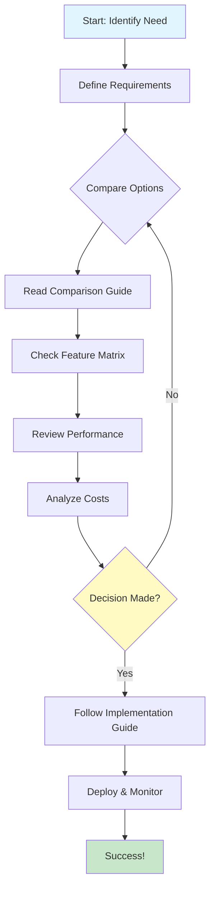
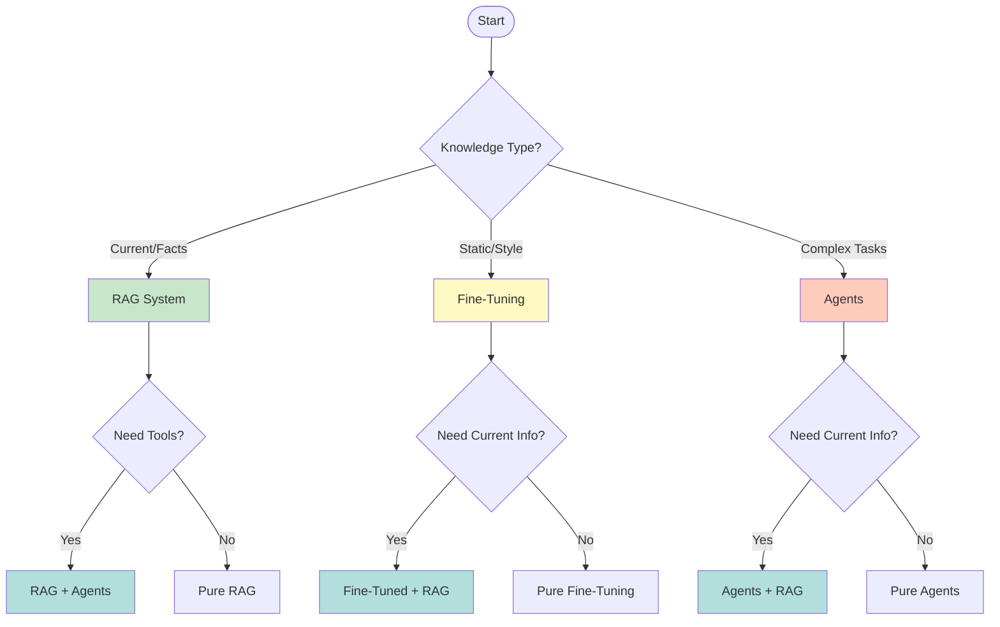

# Technology Comparisons

This directory contains comprehensive comparison guides to help you choose the right AI technologies for your use case.

---

## Table of Contents

- [Overview](#overview)
- [Decision Framework](#decision-framework)
- [Quick Comparison Matrix](#quick-comparison-matrix)
- [Available Comparisons](#available-comparisons)
- [Decision Flowcharts](#decision-flowcharts)
- [Related Documentation](#related-documentation)

---

## Overview

### Why Comparison Guides Matter

Choosing the right AI technology is critical for project success. These comparison guides provide:

```text
┌─────────────────────────────────────────────────────────────────┐
│                  Informed Technology Decisions                   │
├─────────────────────────────────────────────────────────────────┤
│                                                                  │
│  ✅ Feature Comparison     - What each technology offers        │
│  ✅ Performance Data       - Real-world benchmarks               │
│  ✅ Cost Analysis          - Total cost of ownership             │
│  ✅ Implementation Guide   - How to get started                 │
│  ✅ Project Recommendations - When to use what                   │
│                                                                  │
└─────────────────────────────────────────────────────────────────┘
```

---

## Decision Framework

### Step-by-Step Process



### Key Decision Factors

```python
decision_factors = {
    "functional": [
        "Core capabilities",
        "Feature completeness",
        "Integration options",
        "Scalability potential"
    ],
    "non_functional": [
        "Performance metrics",
        "Resource requirements",
        "Reliability track record",
        "Security & compliance"
    ],
    "operational": [
        "Setup complexity",
        "Maintenance overhead",
        "Community support",
        "Documentation quality"
    ],
    "economic": [
        "Initial investment",
        "Operating costs",
        "Scaling costs",
        "Migration expenses"
    ]
}
```

---

## Quick Comparison Matrix

### AI Approach Selection

| Approach | Best For | Complexity | Cost | Time to Value |
|----------|----------|------------|------|---------------|
| **RAG** | Dynamic knowledge, facts | Medium | Low | Days |
| **Fine-Tuning** | Style, format, domain language | High | High | Weeks |
| **Agents** | Complex tasks, tool use | Very High | Medium | Weeks |
| **CAG** | Long documents, books | Low | Low | Hours |
| **Hybrid** | Production systems | Very High | High | Months |

### Vector Database Selection

| Database | Best For | Scale | Complexity | Cost |
|----------|----------|-------|------------|------|
| **Qdrant** | Production, hybrid | Unlimited | Medium | Free/$ |
| **Pinecone** | Quick start, managed | 5M+ | Low | Paid |
| **Chroma** | Local, development | Small | Very Low | Free |
| **Weaviate** | Multi-modal, GraphQL | Unlimited | Medium | Free/$ |
| **Milvus** | Maximum scale, GPU | Unlimited | High | Free |

### Model Selection

| Model | Size | Use Case | Hardware | Cost |
|-------|------|----------|----------|------|
| **Llama-2-7B** | 7B | General purpose | RTX 3060 | Free |
| **Mistral-7B** | 7B | Balanced quality | RTX 3060 | Free |
| **Mixtral-8x7B** | 47B | High quality | 2x RTX 3090 | Free |
| **GPT-4** | Unknown | Best quality | API | $$ |
| **Claude-3** | Unknown | Long context | API | $$ |

---

## Available Comparisons

### [CP-001: RAG vs Fine-Tuning vs Agents](./CP-001-RAG-vs-FineTuning-vs-Agents.md)

Complete decision guide for choosing between RAG, Fine-Tuning, and AI Agents.

**Quick Decision Guide:**
```text
┌─────────────────────────────────────────────────────────────────┐
│                     Choose RAG when:                            │
├─────────────────────────────────────────────────────────────────┤
│ ✅ Need current information (news, data)                        │
│ ✅ Have private documents to query                              │
│ ✅ Want to reduce hallucinations                                │
│ ✅ Need source citations                                        │
│ ✅ Fast time to value required                                  │
└─────────────────────────────────────────────────────────────────┘

┌─────────────────────────────────────────────────────────────────┐
│                   Choose Fine-Tuning when:                       │
├─────────────────────────────────────────────────────────────────┤
│ ✅ Need specific writing style                                   │
│ ✅ Domain-specific language/jargon                              │
│ ✅ Specific output format required                              │
│ ✅ Static knowledge (doesn't change)                            │
│ ✅ Have training data available                                 │
└─────────────────────────────────────────────────────────────────┘

┌─────────────────────────────────────────────────────────────────┐
│                    Choose Agents when:                           │
├─────────────────────────────────────────────────────────────────┤
│ ✅ Complex multi-step tasks                                     │
│ ✅ Need tool/API integration                                    │
│ ✅ Autonomous decision making                                   │
│ ✅ Dynamic workflow required                                    │
│ ✅ Can tolerate higher complexity                               │
└─────────────────────────────────────────────────────────────────┘
```

**What's Inside:**
- ✅ Detailed decision matrix with scoring system
- ✅ Cost-benefit analysis (training vs inference)
- ✅ Implementation timeline comparison
- ✅ Combining approaches (RAG + Agents, Fine-Tuning + RAG)
- ✅ Quick reference code examples
- ✅ Project recommendations based on use case

**Quick Stats:**
- RAG Setup: 1-3 days, $0-$100/month
- Fine-Tuning: 1-2 weeks, $100-$1000 training
- Agents: 2-4 weeks, $50-$500/month

---

### [CP-002: Vector Database Comparison](./CP-002-Vector-Database-Comparison.md)

Compare Qdrant, Weaviate, Pinecone, Chroma, Milvus, and pgvector.

**Feature Comparison Preview:**

| Feature | Qdrant | Pinecone | Chroma | Weaviate | Milvus |
|---------|--------|----------|--------|----------|--------|
| **Open Source** | ✅ | ❌ | ✅ | ✅ | ✅ |
| **Self-Hosted** | ✅ | ❌ | ✅ | ✅ | ✅ |
| **Managed Cloud** | ✅ | ✅ | ❌ | ✅ | ❌ |
| **Hybrid Search** | ✅ | ❌ | ⚠️ | ✅ | ✅ |
| **Filtering** | ✅ | ✅ | ⚠️ | ✅ | ✅ |
| **GPU Support** | ✅ | ❌ | ❌ | ⚠️ | ✅ |
| **Distributed** | ✅ | ✅ | ❌ | ⚠️ | ✅ |

**Performance Preview:**

| Database | QPS (1M vectors) | Recall@10 | Index Time (1M) | Memory |
|----------|------------------|-----------|-----------------|--------|
| **Qdrant** | 10,000 | 97% | 5 min | 1.2 GB |
| **Pinecone** | 8,000 | 96% | N/A (managed) | 1.5 GB |
| **Chroma** | 4,000 | 94% | 3 min | 2.0 GB |
| **Weaviate** | 6,000 | 95% | 7 min | 1.8 GB |
| **Milvus** | 12,000 | 98% | 4 min | 1.1 GB |

**What's Inside:**
- ✅ Complete feature comparison matrix
- ✅ Detailed performance benchmarks
- ✅ Cost analysis (self-hosted vs cloud)
- ✅ Resource requirements by scale
- ✅ PROJECT-OMEGA recommendations
- ✅ Migration guides between databases
- ✅ Deployment configurations
- ✅ Query optimization tips

**Quick Recommendations:**
- **Start/Prototype:** Chroma (simplest)
- **Production:** Qdrant (balanced features + performance)
- **Maximum Scale:** Milvus (GPU support, distributed)
- **No Operations:** Pinecone (fully managed)

---

## Decision Flowcharts

### Choosing Your AI Approach



### Choosing a Vector Database

```mermaid
graph TD
    Start([Start]) → Q1{Deployment?}

    Q1 →|Cloud Managed| Pine{Budget?}
    Q1 →|Self-Hosted| Q2{Scale?}

    Pine →|Paid OK| Pinecone[Pinecone]
    Pine →|Free Only| Q2

    Q2 →|<100K vectors| Simple{Complexity?}
    Q2 →|100K-10M| Perf{Priority?}
    Q2 →|10M+| Scale{Need GPU?}

    Simple →|Keep Simple| Chroma[Chroma]
    Simple →|Need Features| Qdrant1[Qdrant]

    Perf →|Performance| Milvus[Milvus]
    Perf →|Balanced| Qdrant2[Qdrant]

    Scale →|Yes GPU| Milvus2[Milvus]
    Scale →|No GPU| Qdrant3[Qdrant]

    style Pinecone fill:#ffe0b2
    style Chroma fill:#c8e6c9
    style Qdrant1 fill:#b2dfdb
    style Qdrant2 fill:#b2dfdb
    style Qdrant3 fill:#b2dfdb
    style Milvus fill:#ce93d8
    style Milvus2 fill:#ce93d8
```

---

## Related Documentation

- [Use Cases](../use-cases/) - Real-world applications and examples
- [Industry Applications](../industry/) - Sector-specific guidance (healthcare, finance, manufacturing)
- [Solutions](../enterprise-solutions/) - Complete end-to-end implementations
- [Volume 6: Data Nexus](../volumes/VOLUME-6-Data-Nexus.md) - RAG and GraphRAG implementation
- [Volume 5: Model Adaptation](../volumes/VOLUME-5-Model-Adaptation.md) - Fine-tuning techniques
- [Volume 7: Production Mastery](../volumes/VOLUME-7-Production-Mastery.md) - Production deployment

---

## How to Use These Documents

### Decision-Making Process

1. **Define Your Requirements**
   ```python
   requirements = {
       "use_case": "Customer support chatbot",
       "data_size": "100K documents",
       "traffic": "1000 queries/hour",
       "budget": "$500/month",
       "timeline": "2 weeks",
       "team_size": "2 engineers"
   }
   ```

2. **Review Comparison Guides**
   - Read relevant comparison document (CP-001, CP-002)
   - Check feature matrix for your requirements
   - Review performance benchmarks
   - Analyze cost implications

3. **Make Decision**
   - Use decision flowchart
   - Score options based on your criteria
   - Choose top 2 candidates

4. **Prototype**
   - Follow implementation template
   - Build minimal prototype
   - Test with real data
   - Measure performance

5. **Validate & Scale**
   - Compare against requirements
   - Adjust configuration if needed
   - Plan for production deployment

---

## Quick Reference

### Technology Selection Cheat Sheet

```text
┌─────────────────────────────────────────────────────────────────┐
│                    Quick Technology Selection                    │
├─────────────────────────────────────────────────────────────────┤
│                                                                  │
│  Need: Add current information to LLM                            │
│  → RAG with Qdrant                                               │
│                                                                  │
│  Need: LLM writes in specific style                              │
│  → Fine-tune with domain data                                    │
│                                                                  │
│  Need: LLM uses external tools/APIs                              │
│  → ReAct Agent with tool system                                  │
│                                                                  │
│  Need: Search 1M+ vectors                                         │
│  → Milvus with GPU support                                       │
│                                                                  │
│  Need: Quick prototype, no setup                                 │
│  → Chroma or Pinecone                                            │
│                                                                  │
│  Need: Production RAG system                                     │
│  → Qdrant + vLLM + Nginx                                         │
│                                                                  │
│  Need: Multi-step reasoning                                      │
│  → GraphRAG (Qdrant + Neo4j)                                    │
│                                                                  │
└─────────────────────────────────────────────────────────────────┘
```

---

**Total Comparisons:** 2 documents

**Need a comparison?** Request one in the PROJECT-OMEGA issues!
