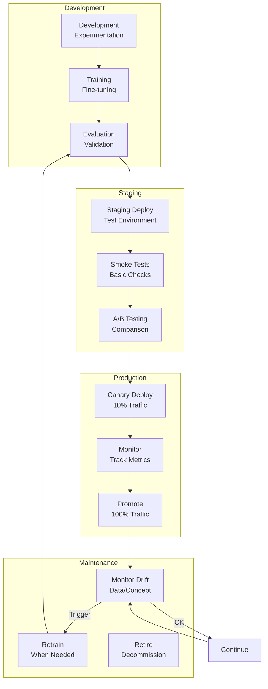
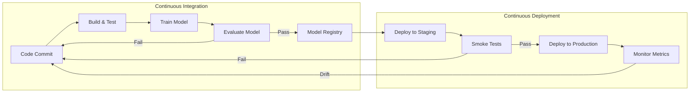
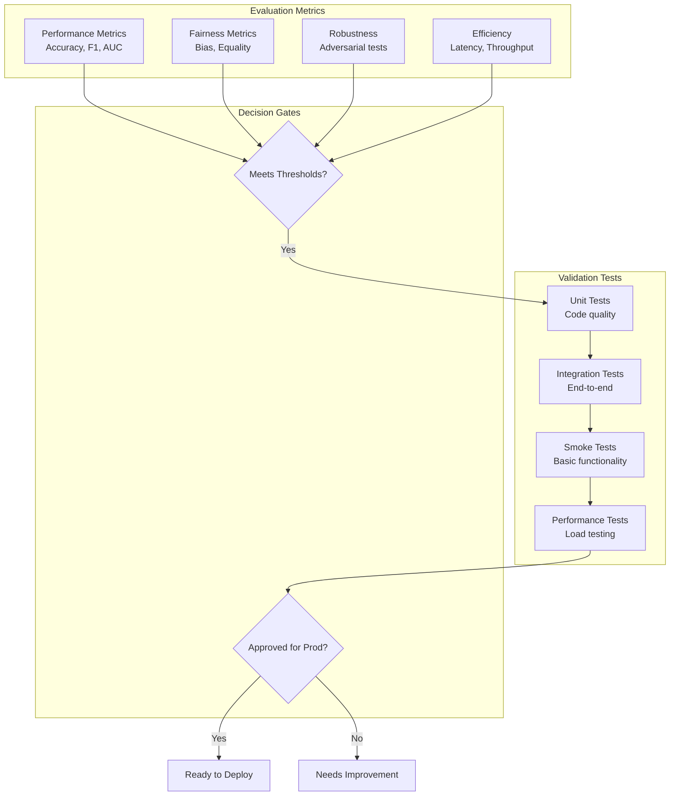
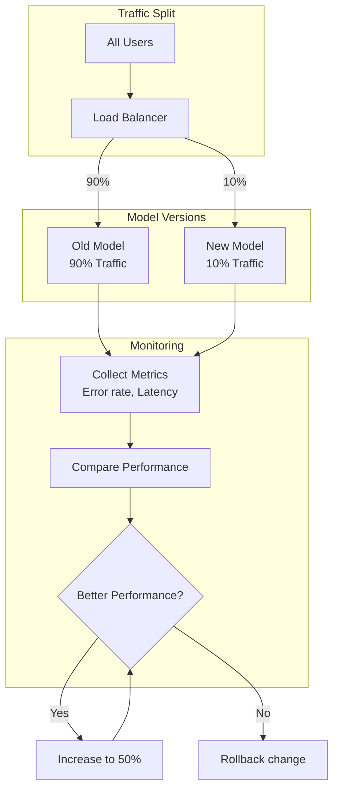
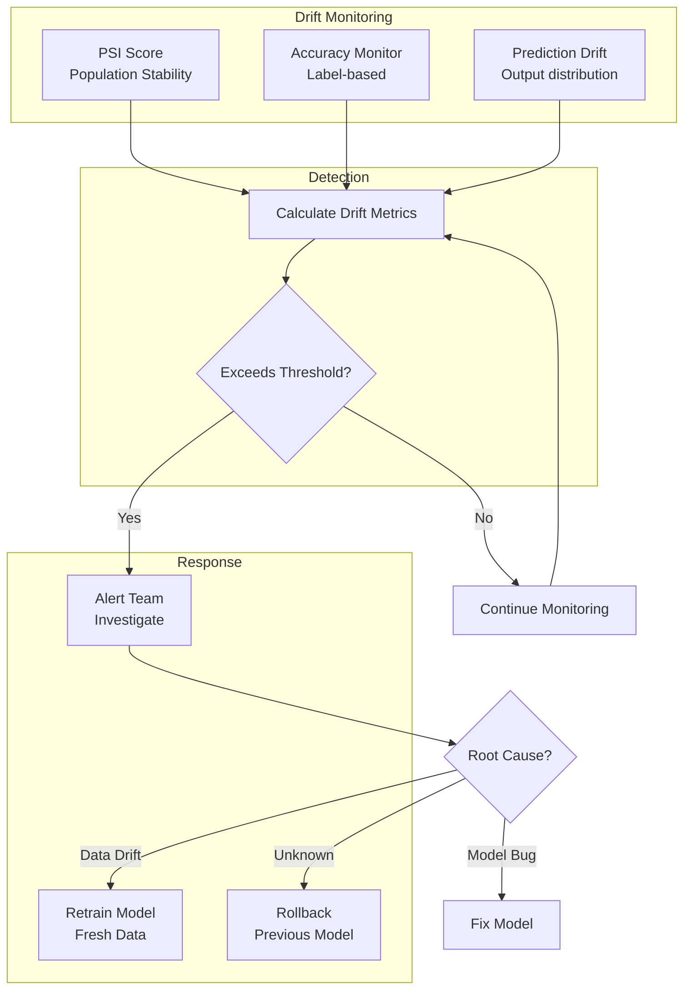
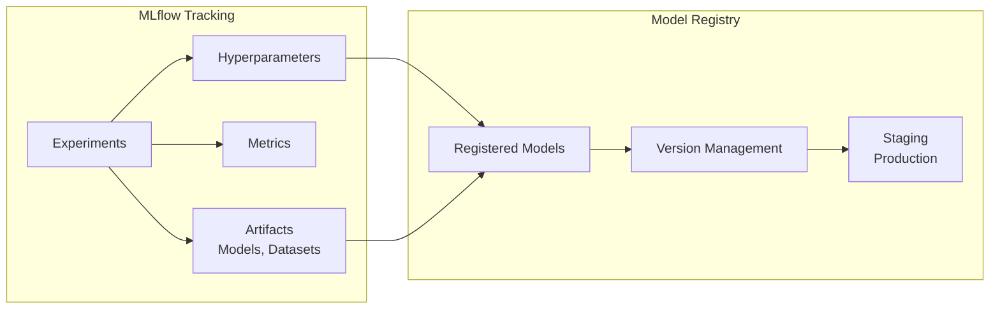
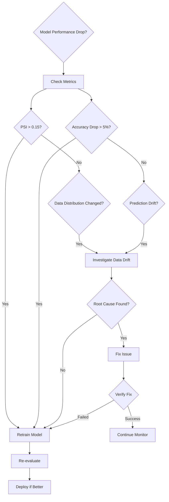

# ML Lifecycle: From Development to Production

**Complete Machine Learning Model Lifecycle**

---

## ML Lifecycle Stages

---

## CI/CD Pipeline for ML

---

## Model Evaluation Framework

---

## Canary Deployment Strategy

---

## Model Drift Detection

---

## Experiment Tracking

---

## Decision Framework: Retrain or Not

---

## Related Documents

- [6501-ML-Lifecycle-Management.md](../phases/phase6-rag/6500-mlops-pipelines/6501-ML-Lifecycle-Management.md)
