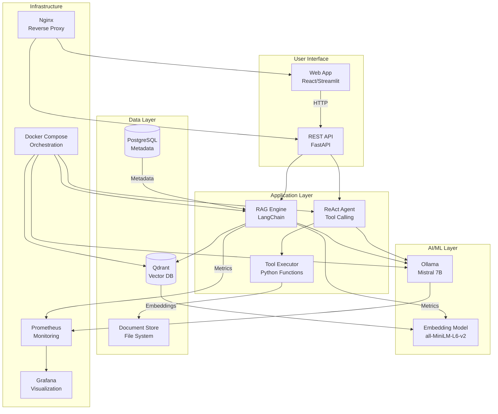
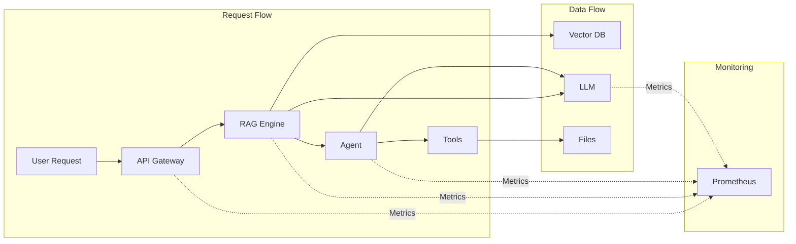

# PROJECT-001: Architecture Diagram

**Complete AI Assistant System Architecture**

---

## System Architecture

```mermaid
graph TB
    subgraph "User Interface"
        WEB[Web App<br/>React/Streamlit]
        API[REST API<br/>FastAPI]
    end

    subgraph "Application Layer"
        RAG[RAG Engine<br/>LangChain]
        AGENT[ReAct Agent<br/>Tool Calling]
        TOOL[Tool Executor<br/>Python Functions]
    end

    subgraph "AI/ML Layer"
        LLM[Ollama<br/>Mistral 7B]
        EMB[Embedding Model<br/>all-MiniLM-L6-v2]
    end

    subgraph "Data Layer"
        QDRANT[(Qdrant<br/>Vector DB)]
        POSTGRES[(PostgreSQL<br/>Metadata)]
        FILES[Document Store<br/>File System]
    end

    subgraph "Infrastructure"
        DOCKER[Docker Compose<br/>Orchestration]
        NGINX[Nginx<br/>Reverse Proxy]
        PROM[Prometheus<br/>Monitoring]
        GRAF[Grafana<br/>Visualization]
    end

    WEB -->|HTTP| API
    API --> RAG
    API --> AGENT

    RAG --> EMB
    RAG --> QDRANT
    RAG --> LLM

    AGENT --> TOOL
    AGENT --> LLM

    TOOL --> FILES

    QDRANT -->|Embeddings| EMB
    POSTGRES -->|Metadata| RAG

    DOCKER --> RAG
    DOCKER --> AGENT
    DOCKER --> LLM
    DOCKER --> QDRANT

    NGINX --> WEB
    NGINX --> API

    LLM -->|Metrics| PROM
    RAG -->|Metrics| PROM

    PROM --> GRAF
```

---

## Component Interactions

```mermaid
graph LR
    subgraph "Request Flow"
        A[User Request] --> B[API Gateway]
        B --> C[RAG Engine]
        C --> D[Agent]
        D --> E[Tools]
    end

    subgraph "Data Flow"
        C --> F[Vector DB]
        C --> G[LLM]
        D --> G
        E --> H[Files]
    end

    subgraph "Monitoring"
        B -.->|Metrics| I[Prometheus]
        C -.->|Metrics| I
        D -.->|Metrics| I
        G -.->|Metrics| I
    end
```

