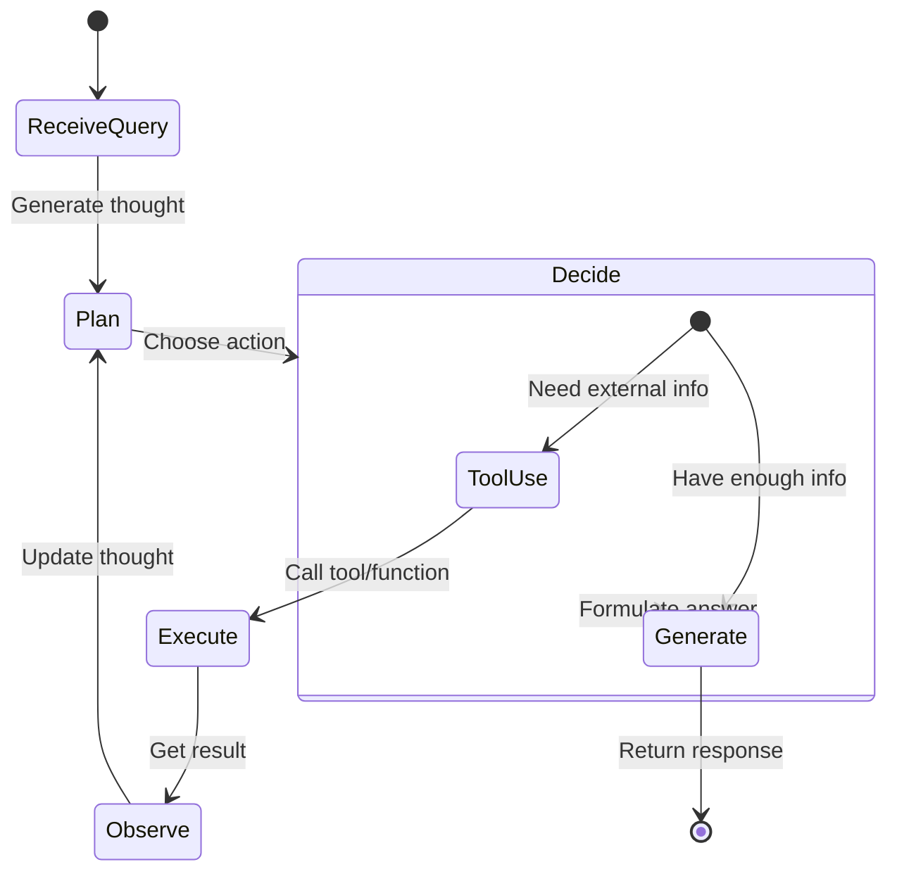
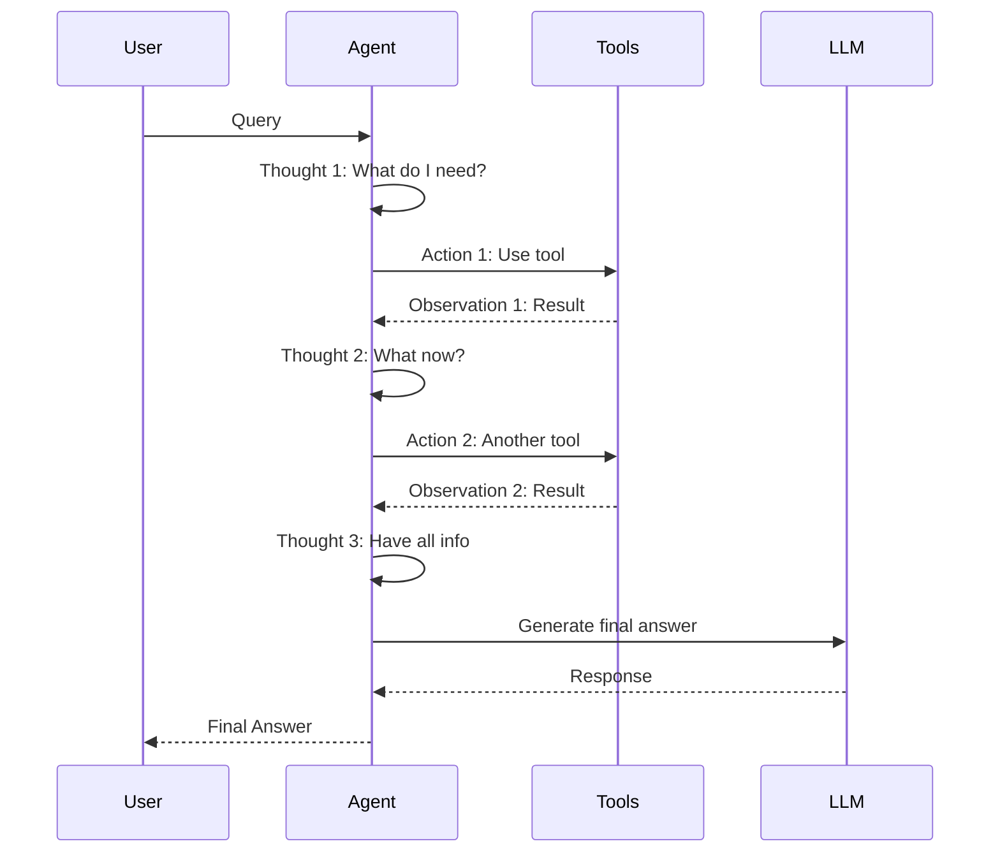
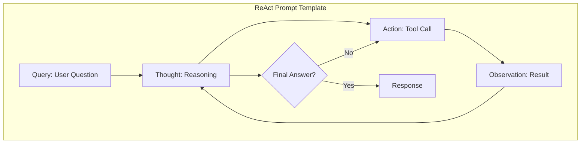
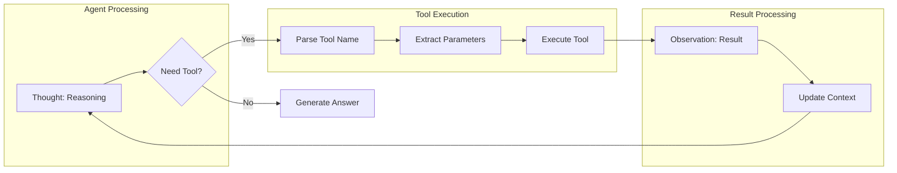
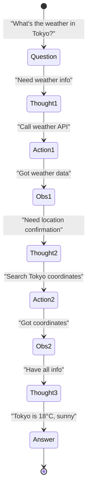
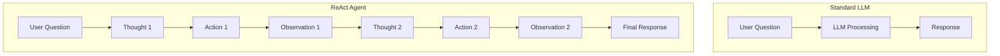
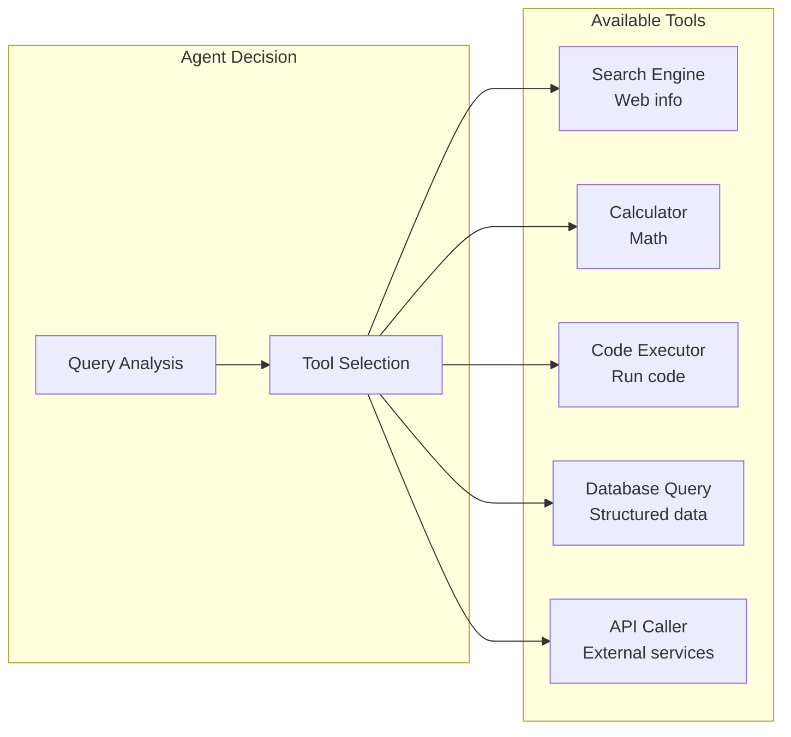

# ReAct Loop: Agent Reasoning Flow

**How AI Agents Plan, Act, and Observe**

---

## ReAct Loop Architecture



---

## Detailed ReAct Sequence



---

## ReAct Prompt Structure



---

## Tool Calling Flow



---

## Multi-Step Reasoning Example



---

## ReAct vs Standard LLM



---

## Tool Types in ReAct



---

## Error Handling in ReAct

```mermaid
stateDiagram-v2
    [*] --> Execute
    Execute --> Success{Tool Success?}

    Success -->|Yes| Observe
    Success -->|No| Recover

    Recover --> Thought{Can Recover?}
    Thought -->|Yes| Alternative[Try alternative tool]
    Thought -->|No| Error[Return error]

    Alternative --> Execute
    Observe --> Next{More Info?}

    Next -->|Yes| Plan
    Next -->|No| Final[Generate answer]

    Final --> [*]
    Error --> [*]
```

---

**Last Updated:** 2026-02-04
**Related:** [7101-ReAct-Loop-System.md](../phases/phase7-agentic/7100-architecture/7101-ReAct-Loop-System.md)
