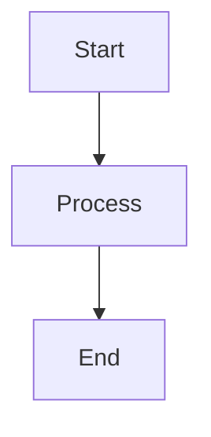
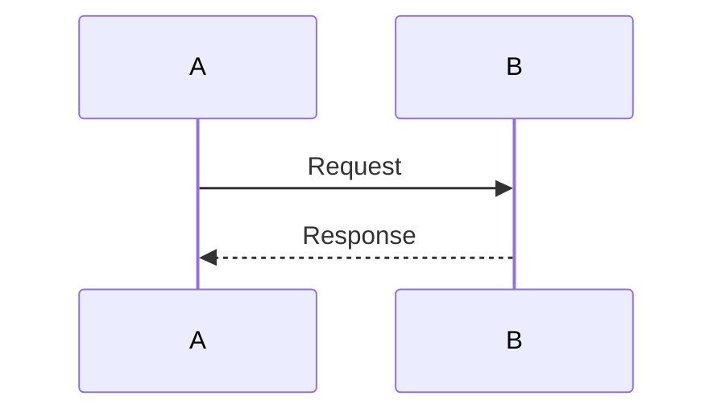

# PROJECT-OMEGA Architecture Diagrams

**Visual documentation for key AI/ML concepts and system architectures**

---

## Overview

This directory contains Mermaid diagrams that illustrate complex concepts from the PROJECT-OMEGA curriculum. These diagrams complement the technical documentation and provide visual learning aids.

---

## Available Diagrams

### 📊 ML Lifecycle Diagrams
**File:** [ML-LIFECYCLE.md](ML-LIFECYCLE.md)

**Related Documentation:** [6501: ML Lifecycle Management](../phases/phase6-rag/6500-mlops-pipelines/6501-ML-Lifecycle-Management.md)

**Diagrams Include:**
- ML Lifecycle Stages (Development → Staging → Production → Maintenance)
- CI/CD Pipeline for ML
- Model Evaluation Framework
- Canary Deployment Strategy
- Model Drift Detection
- Experiment Tracking (MLflow)
- Retrain Decision Framework

**Best viewed with:** Volume 7, Phase 6 (MLOps)

---

### 🤖 ReAct Loop Diagrams
**File:** [REACT-LOOP.md](REACT-LOOP.md)

**Related Documentation:** [7101: ReAct Loop System](../phases/phase7-agentic/7100-architecture/7101-ReAct-Loop-System.md)

**Diagrams Include:**
- ReAct Loop Architecture (State Diagram)
- Detailed ReAct Sequence (Sequence Diagram)
- ReAct Prompt Structure
- Tool Calling Flow
- Multi-Step Reasoning Example
- ReAct vs Standard LLM
- Tool Types in ReAct
- Error Handling in ReAct

**Best viewed with:** Volume 7, Phase 7 (Agentic Systems)

---

### 🏗️ Project Architecture Diagrams
**File:** [PROJECT-001-ARCHITECTURE.md](PROJECT-001-ARCHITECTURE.md)

**Related Documentation:** [PROJECT-001: AI Assistant](../learning-resources/projects/PROJECT-001-AI-Assistant.md)

**Diagrams Include:**
- Complete AI Assistant System Architecture
- RAG Service Integration
- ReAct Agent Flow
- Tool Executor
- Web Frontend
- Component Interactions

**Best viewed with:** Volume 7, Capstone Projects

---

## Diagram Usage

### Viewing Diagrams

These diagrams use **Mermaid** syntax and can be viewed:

1. **GitHub/GitLab:** Native rendering in markdown files
2. **VS Code:** Install "Markdown Preview Mermaid Support" extension
3. **Online:** [Mermaid Live Editor](https://mermaid.live)
4. **Documentation Tools:** MkDocs, Docusaurus, etc. (with Mermaid plugins)

### Using Diagrams in Your Work

```markdown
# Reference a diagram in your documentation

For more details on the ReAct loop, see the [ReAct Diagram](../diagrams/REACT-LOOP.md).

The ML lifecycle follows these stages:

```

---

## Diagrams by Phase

| Phase | Topic | Diagram File |
|-------|-------|--------------|
| Phase 6 | MLOps Pipeline | [ML-LIFECYCLE.md](ML-LIFECYCLE.md) |
| Phase 7 | Agent Architecture | [REACT-LOOP.md](REACT-LOOP.md) |
| Projects | AI Assistant | [PROJECT-001-ARCHITECTURE.md](PROJECT-001-ARCHITECTURE.md) |

---

## Creating New Diagrams

When creating new diagrams:

1. **Name files descriptively** - Use kebab-case (e.g., `rag-pipeline.md`)
2. **Add related documentation links** - At the bottom of each diagram
3. **Use consistent styling** - Follow existing diagram patterns
4. **Include multiple views** - State diagrams, sequence diagrams, flowcharts
5. **Test rendering** - Verify diagrams render correctly

### Mermaid Template

````markdown
# Diagram Title

**Brief description**

---

## Diagram Name 1



---

## Diagram Name 2



---

**Last Updated:** YYYY-MM-DD
**Related:** [Path to related doc](../path/to/doc.md)
````

---

## Integration with Phase Documentation

Diagrams are integrated into phase README files:

- **Phase 6 (RAG):** Includes RAG pipeline and GraphRAG diagrams
- **Phase 3 (Transformers):** Includes architecture and attention diagrams
- **Phase 7 (Agents):** Includes ReAct loop and multi-agent diagrams

See individual phase README files for embedded diagrams.

---

## Troubleshooting

### Diagrams Not Rendering

**GitHub/GitLab:**
- Ensure file extension is `.md`
- Check Mermaid syntax is correct
- Try opening in a new tab

**VS Code:**
- Install Mermaid extension
- Open command palette: `Markdown: Open Preview`
- Check extension settings

**Local Preview:**
- Use Mermaid Live Editor: https://mermaid.live
- Copy-paste diagram code

---

## Contributing

To add new diagrams:

1. Create diagram file in this directory
2. Add entry to this README
3. Link from relevant phase/module documentation
4. Update related documentation references

---

**Last Updated:** 2026-02-05
**Total Diagrams:** 3 files, 20+ individual diagrams
