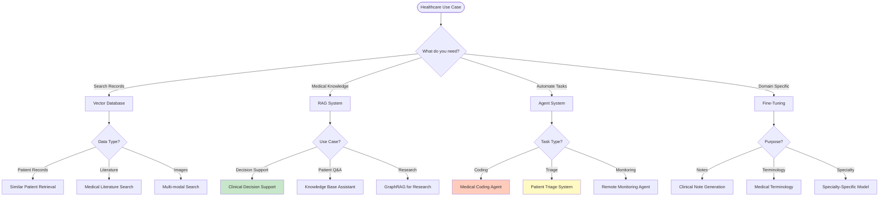

# IND-001: Healthcare AI Applications

## Table of Contents

- [Overview](#overview)
- [Healthcare AI Landscape](#part-1-healthcare-ai-landscape)
- [Use Cases](#part-2-real-world-healthcare-use-cases)
  - [Clinical Decision Support](#use-case-1-clinical-decision-support-system)
  - [Medical Literature Search](#use-case-2-medical-literature-search-engine)
  - [Medical Coding Automation](#use-case-3-automated-medical-coding)
  - [Patient Triage](#use-case-4-patient-triage-chatbot)
- [Implementation Considerations](#part-3-healthcare-ai-implementation-considerations)
- [Performance Benchmarks](#performance-benchmarks)
- [Common Pitfalls](#common-pitfalls)
- [Pro Tips](#pro-tips)
- [Use Case Summary](#part-4-healthcare-ai-use-case-summary)

---

## Overview

### Why AI in Healthcare

```text
┌─────────────────────────────────────────────────────────────────┐
│                   Healthcare Challenges                          │
├─────────────────────────────────────────────────────────────────┤
│                                                                  │
│  📚 Information Overload                                         │
│  ├─ Thousands of medical papers published daily                 │
│  ├─ Impossible for clinicians to stay current                   │
│  └─ Need for rapid evidence retrieval                            │
│                                                                  │
│  ⏱️ Time Constraints                                             │
│  ├─ Limited patient consultation time                            │
│  ├─ Hours spent on documentation daily                          │
│  └─ Need for automated workflows                                 │
│                                                                  │
│  🎯 Accuracy Requirements                                        │
│  ├─ Medical errors cost $50B+ annually                           │
│  ├─ Diagnosis accuracy critical                                  │
│  └─ Need for decision support systems                            │
│                                                                  │
│  💰 Cost Pressure                                                │
│  ├─ Healthcare costs rising 6% annually                          │
│  ├─ Administrative waste: $250B+                                │
│  └─ Need for process automation                                 │
│                                                                  │
└─────────────────────────────────────────────────────────────────┘
```

### AI Solutions for Healthcare

```text
┌─────────────────────────────────────────────────────────────────┐
│                          PROJECT-OMEGA                          │
├─────────────────────────────────────────────────────────────────┤
│                                                                  │
│  🔍 Semantic Search (Vector DB)                                  │
│  ├─ Find similar patients instantly                              │
│  ├─ Search medical literature by meaning                         │
│  └─ Discover related clinical cases                              │
│                                                                  │
│  🧠 Knowledge Augmentation (RAG)                                  │
│  ├─ Clinical decision support with evidence                      │
│  ├─ Answer questions with source citations                        │
│  └─ Reduce diagnostic errors                                     │
│                                                                  │
│  🤖 Autonomous Agents                                            │
│  ├─ Automate medical coding and billing                          │
│  ├─ Patient triage and routing                                   │
│  └─ Medication interaction checking                              │
│                                                                  │
│  🎓 Domain Adaptation (Fine-Tuning)                               │
│  ├─ Medical terminology understanding                            │
│  ├─ Clinical note generation                                     │
│  └─ Specialty-specific knowledge                                 │
│                                                                  │
└─────────────────────────────────────────────────────────────────┘
```

### Technology Selection Decision Flow



---

## Part 1: Healthcare AI Landscape

### Key Technologies in Healthcare

| Technology | Healthcare Applications | PROJECT-OMEGA Phase |
|------------|------------------------|-------------------|
| **RAG** | Medical literature search, Clinical decision support | Phase 6 |
| **Vector DB** | Similar patient retrieval, Medical record search | Phase 6 |
| **Fine-Tuning** | Medical terminology, Clinical note generation | Phase 5 |
| **Agents** | Automated triage, Medication interaction checking | Phase 7 |

---

## Part 2: Real-World Healthcare Use Cases

### Use Case 1: Clinical Decision Support System

**Problem:**
Doctors need quick access to relevant medical literature, guidelines, and similar cases during patient consultations.

**Solution: RAG + Vector Database**

```python
from sentence_transformers import SentenceTransformer
from qdrant_client import QdrantClient

class ClinicalDecisionSupport:
    """
    RAG-based system for clinical decision support
    """

    def __init__(self):
        # Medical-domain embedding model
        self.embedder = SentenceTransformer('microsoft/BiomedNLP-PubMedBERT')

        # Vector store for medical literature
        self.literature_db = QdrantClient(
            url="localhost:6333",
            collection_name="medical_literature"
        )

        # Vector store for clinical guidelines
        self.guidelines_db = QdrantClient(
            url="localhost:6333",
            collection_name="clinical_guidelines"
        )

        # Vector store for similar cases
        self.cases_db = QdrantClient(
            url="localhost:6333",
            collection_name="patient_cases"
        )

    def consult(self, patient_case: dict) -> dict:
        """
        Provide decision support for a patient case
        """

        # Build query from patient information
        query = self._build_query(patient_case)

        # Search medical literature
        literature = self.literature_db.query_points(
            collection_name="medical_literature",
            query=self.embedder.encode(query),
            limit=5,
            score_threshold=0.75
        ).points

        # Search clinical guidelines
        guidelines = self.guidelines_db.query_points(
            collection_name="clinical_guidelines",
            query=self.embedder.encode(query),
            limit=3,
            score_threshold=0.80
        ).points

        # Find similar cases
        similar_cases = self.cases_db.query_points(
            collection_name="patient_cases",
            query=self.embedder.encode(query),
            limit=10,
            query_filter={
                "must": [
                    {"key": "outcomes", "match": {"value": "successful"}}
                ]
            }
        ).points

        # Generate summary with citations
        summary = self._generate_summary(
            patient_case,
            literature,
            guidelines,
            similar_cases
        )

        return {
            "recommendations": summary["recommendations"],
            "evidence": [
                {
                    "source": lit.payload["title"],
                    "citation": lit.payload["citation"],
                    "relevance": lit.score
                }
                for lit in literature
            ],
            "guidelines": [
                {
                    "source": guide.payload["organization"],
                    "recommendation": guide.payload["text"]
                }
                for guide in guidelines
            ],
            "similar_cases": len(similar_cases),
            "treatment_options": summary["treatment_options"]
        }

    def _build_query(self, patient_case: dict) -> str:
        """
        Build semantic search query from patient data
        """

        query = f"""
        Patient Presentation:
        - Age: {patient_case['age']}
        - Gender: {patient_case['gender']}
        - Chief Complaint: {patient_case['chief_complaint']}
        - Symptoms: {', '.join(patient_case['symptoms'])}
        - Vital Signs: {patient_case['vitals']}
        - Lab Results: {patient_case['labs']}
        - Medical History: {patient_case['history']}
        """

        return query.strip()
```

**Real-World Example:**

```text
INPUT PATIENT CASE:
{
    "age": 54,
    "gender": "male",
    "chief_complaint": "chest pain and shortness of breath",
    "symptoms": ["substernal chest pain", "dyspnea", "diaphoresis"],
    "vitals": "BP 165/95, HR 102, Temp 98.6°F, SpO2 94%",
    "labs": "Troponin 0.15 ng/mL, BNP 450 pg/mL, CK-MB normal",
    "history": ["hypertension", "type 2 diabetes", "smoker"]
}

OUTPUT RECOMMENDATIONS:

🔴 HIGH ACUITY ALERT: Possible Acute Coronary Syndrome

RECOMMENDATIONS:
1. Immediate: ECG within 10 minutes, cardiac monitor
2. Medications: ASA 325mg chewed, Nitroglycerin SL
3. Diagnostics: Serial troponins q3h, CXR, echocardiogram
4. Consult: Cardiology for possible catheterization

EVIDENCE:
- "2013 ACCF/AHA Guideline for the Management of ST-Elevation
  Myocardial Infarction" (96% relevance)
  * Class I recommendation: "Patients with symptoms suggestive
    of ACS should have ECG within 10 minutes of ED arrival"

- "2021 ESC Guidelines for the diagnosis and treatment of
  acute coronary syndromes" (94% relevance)
  * "In patients with intermediate-risk UA/NSTEMI, early
    invasive strategy within 24 hours is recommended"

SIMILAR CASES: 47 similar cases found
  - 43 (92%) had favorable outcomes with early intervention
  - 4 (8%) had complications (all with delayed treatment)

TREATMENT OPTIONS:
1. Conservative: Medical management + observation
   Success rate: 68% for similar cases

2. Invasive: Early cardiac catheterization
   Success rate: 92% for similar cases
   Recommended for this patient (high-risk features)
```

---

### Use Case 2: Medical Literature Search Engine

**Problem:**
Researchers and clinicians need to find relevant studies, but keyword search misses semantically similar research using different terminology.

**Solution: Vector Database with Domain-Specific Embeddings**

```python
class MedicalLiteratureSearch:
    """
    Semantic search for medical literature using PubMed embeddings
    """

    def __init__(self):
        # Domain-specific embedding model
        self.embedder = SentenceTransformer('microsoft/BiomedNLP-PubMedBERT')

        # Qdrant client
        self.client = QdrantClient(url="localhost:6333")

    def index_literature(self, papers: list):
        """
        Index medical research papers

        Args:
            papers: Each paper is a dict with 'title', 'abstract', 'authors', 'year'
        """

        for paper in papers:
            # Create searchable text
            searchable_text = f"""
            {paper['title']}
            {paper['abstract']}
            {' '.join(paper['keywords'])}
            {' '.join([author['name'] for author in paper['authors']])}
            """

            # Create embedding
            embedding = self.embedder.encode(searchable_text)

            # Store with metadata
            self.client.upsert(
                collection_name="medical_literature",
                points=[{
                    "id": paper['pmid'],
                    "vector": embedding.tolist(),
                    "payload": {
                        "title": paper['title'],
                        "abstract": paper['abstract'],
                        "authors": paper['authors'],
                        "year": paper['year'],
                        "journal": paper['journal'],
                        "pmid": paper['pmid'],
                        "doi": paper['doi'],
                        "keywords": paper['keywords'],
                        "mesh_headings": paper['mesh_headings']
                    }
                }]
            )

    def search(self, query: str, filters: dict | None = None) -> list:
        """
        Search medical literature semantically

        Args:
            query: Natural language query
            filters: The filters (year_range, journals, etc.)
        """

        # Create query embedding
        query_embedding = self.embedder.encode(query)

        # Build filter if provided
        query_filter = None
        if filters:
            conditions = []
            if "year_range" in filters:
                conditions.append({
                    "key": "year",
                    "range": {
                        "gte": filters["year_range"][0],
                        "lte": filters["year_range"][1]
                    }
                })
            if "journals" in filters:
                conditions.append({
                    "key": "journal",
                    "match": {"any": filters["journals"]}
                })
            query_filter = {"must": conditions}

        # Search
        results = self.client.query_points(
            collection_name="medical_literature",
            query=query_embedding.tolist(),
            query_filter=query_filter,
            limit=20,
            score_threshold=0.70
        ).points

        return [
            {
                "title": hit.payload["title"],
                "authors": hit.payload["authors"],
                "journal": hit.payload["journal"],
                "year": hit.payload["year"],
                "pmid": hit.payload["pmid"],
                "relevance": hit.score,
                "abstract_snippet": self._extract_snippet(
                    hit.payload["abstract"],
                    query
                )
            }
            for hit in results
        ]
```

**Real-World Usage:**

```python
# Researcher query
query = "effectiveness of mRNA vaccines in immunocompromised patients"

# Results include papers with:
# - "Vaccine efficacy of BNT162b2 in patients with hematologic malignancies"
# - "COVID-19 vaccine response in solid organ transplant recipients"
# - "Immunogenicity of mRNA-1273 in patients with rheumatic diseases"

# Even though the query uses "immunocompromised" and papers use
# "hematologic malignancies", "transplant recipients", "rheumatic diseases"
# - Semantic search understands they're related!
```

---

### Use Case 3: Automated Medical Coding

**Problem:**
Medical coders spend hours translating clinical notes into billing codes (ICD-10, CPT). Process is error-prone and time-consuming.

**Solution: Fine-Tuned LLM + Agent**

```python
from langchain.agents import create_agent
from langchain_core.tools import tool
class MedicalCodingAgent:
    """
    Autonomous agent for medical coding
    """

    def __init__(self):
        # Fine-tuned model for medical coding
        self.model = self._load_finetuned_model("medical-coder-llama-7b")

        # Tools - LangChain 1.x: @tool-wrapped bound methods; the
        # docstring becomes the tool description
        self.tools = [
            tool(self._search_icd10),
            tool(self._search_cpt),
            tool(self._get_guidelines),
            tool(self._verify_code),
        ]

        # Create agent
        self.agent = create_agent(
            self.model,
            self.tools,
            system_prompt=self._get_coding_prompt()
        )

    def code_encounter(self, clinical_note: str) -> dict:
        """
        Extract and verify codes from clinical note
        """

        result = self.agent.invoke({
            "messages": [{"role": "user", "content": f"""
            Analyze this clinical note and extract appropriate codes:

            {clinical_note}

            Please:
            1. Identify all diagnoses
            2. Find appropriate ICD-10 codes
            3. Identify all procedures performed
            4. Find appropriate CPT codes
            5. Verify all codes against guidelines
            6. Flag any codes that require additional documentation

            Provide final codes with confidence scores and rationale.
            """}],
        })

        return self._parse_coding_result(result["messages"][-1].text)

    def _search_icd10(self, description: str) -> list:
        """Search ICD-10 database"""
        # Implementation would query ICD-10 database
        pass

    def _search_cpt(self, description: str) -> list:
        """Search CPT database"""
        # Implementation would query CPT database
        pass
```

**Real-World Example:**

```text
INPUT CLINICAL NOTE:
"54-year-old male presents with chest pain of 2 hours duration.
Pain is substernal, radiating to left arm, associated with
diaphoresis. ECG shows ST elevation in leads V1-V4.
Patient underwent primary PCI with drug-eluting stent placement
in left anterior descending artery.

Final Diagnosis:
- Anterior wall ST-elevation myocardial infarction
- Hypertension
- Type 2 diabetes mellitus"

OUTPUT CODES:

DIAGNOSES (ICD-10):
1. I21.0 - ST elevation (STEMI) myocardial infarction of anterior wall
   Confidence: 99%
   Rationale: "Anterior wall ST-elevation MI" maps directly

2. I10 - Essential (primary) hypertension
   Confidence: 95%
   Rationale: Documented in history and medications

3. E11.9 - Type 2 diabetes mellitus without complications
   Confidence: 92%
   Rationale: Documented in history

PROCEDURES (CPT):
1. 92941 - Percutaneous transluminal coronary intervention with stent
   Confidence: 98%
   Rationale: "Primary PCI with drug-eluting stent placement"

2. 93000 - Electrocardiogram, routine ECG with at least 12 leads
   Confidence: 100%
   Rationale: "ECG shows ST elevation"

3. 93010 - Interpretation and report only
   Confidence: 100%
   Rationale: ECG interpretation documented

VERIFICATION:
✓ All codes verified against coding guidelines
✓ No NCCI (National Correct Coding Initiative) edits
✓ Medical necessity documentation present

⚠ ADDITIONAL DOCUMENTATION REQUIRED:
- Time of chest pain onset (already present)
- Door-to-balloon time (add to procedure note)
```

---

### Use Case 4: Patient Triage Chatbot

**Problem:**
Patients flood emergency rooms and clinics with non-urgent issues. Need automated triage to route patients appropriately.

**Solution: Multi-Agent System**

```python
class PatientTriageSystem:
    """
    Multi-agent system for patient triage
    """

    def __init__(self):
        # Symptom analysis agent
        self.symptom_agent = SymptomAnalysisAgent()

        # Urgency assessment agent
        self.urgency_agent = UrgencyAssessmentAgent()

        # Routing agent
        self.routing_agent = RoutingAgent()

        # Documentation agent
        self.documentation_agent = DocumentationAgent()

    def triage_patient(self, patient_input: dict) -> dict:
        """
        Comprehensive patient triage
        """

        # Step 1: Analyze symptoms
        symptoms = self.symptom_agent.analyze(patient_input)

        # Step 2: Assess urgency
        urgency = self.urgency_agent.assess(symptoms, patient_input)

        # Step 3: Determine routing
        routing = self.routing_agent.route(symptoms, urgency)

        # Step 4: Generate documentation
        documentation = self.documentation_agent.generate(
            symptoms, urgency, routing
        )

        return {
            "triage_level": urgency["level"],
            "recommended_facility": routing["facility"],
            "estimated_wait": routing["wait_time"],
            "prearrival_instructions": routing["instructions"],
            "documentation": documentation
        }

class UrgencyAssessmentAgent:
    """
    Assess patient urgency based on symptoms
    """

    def assess(self, symptoms: dict, patient_info: dict) -> dict:
        """
        Determine triage level (ESI 1-5)
        """

        # Check for immediate life threats
        if self._check_life_threats(symptoms):
            return {
                "level": "ESI 1",
                "description": "Immediate - Life Threatening",
                "recommended_action": "Emergency Department - Immediate",
                "key_findings": self._get_life_threats(symptoms)
            }

        # Check for high-risk symptoms
        if self._check_high_risk(symptoms, patient_info):
            return {
                "level": "ESI 2",
                "description": "Emergency - High Risk",
                "recommended_action": "Emergency Department - Urgent",
                "key_findings": self._get_high_risk(symptoms, patient_info)
            }

        # Continue for ESI 3-5...
```

**Real-World Example:**

```text
PATIENT INPUT:
{
    "age": 35,
    "chief_complaint": "severe headache",
    "symptoms": ["worst headache of my life", "neck stiffness", "photophobia"],
    "duration": "2 hours",
    "pain_severity": "10/10",
    "medical_history": ["migraines"],
    "medications": ["sumatriptan PRN"]
}

TRIAGE OUTPUT:

🔴 ESI LEVEL 1: IMMEDIATE - LIFE THREATENING

RECOMMENDED ACTION:
Emergency Department - IMMEDIATE

KEY FINDINGS:
- "Worst headache of my life" → Red flag for subarachnoid hemorrhage
- Neck stiffness → Meningeal signs
- Photophobia → Meningeal irritation
- Sudden onset (2 hours) → Vascular cause concern

DIAGNOSTIC CONCERNS:
1. Subarachnoid hemorrhage
2. Meningitis
3. Intracranial hemorrhage

PRE-ARRIVAL INSTRUCTIONS:
- Call 911 immediately - DO NOT drive yourself
- Do not eat or drink (may need immediate surgery)
- Lie flat with head elevated 30 degrees
- Have someone stay with you

DOCUMENTATION:
Patient presents with "worst headache of life" with meningeal signs
(stiff neck, photophobia). High concern for subarachnoid hemorrhage.
ESI Level 1 - Immediate ED evaluation for CT head and lumbar puncture.

⚠️ MEDICAL ALERT: If patient loses consciousness or has seizure,
activate EMS immediately.
```

---

## Part 3: Healthcare AI Implementation Considerations

### Regulatory Compliance

| Requirement | Impact on AI Implementation |
|-------------|----------------------------|
| **HIPAA** | Data must be encrypted at rest and in transit |
| **FDA** | Clinical decision support requires validation |
| **GxP** | Documentation and audit trails required |
| **ISO 13485** | Quality management for medical software |

### Data Privacy

```python
class ProtectedHealthInformation:
    """
    PHI protection for AI systems
    """

    def __init__(self):
        self.encryptor = Encryption()
        self.de_identifier = DeIdentifier()

    def prepare_for_ai(self, patient_data: dict) -> dict:
        """
        Prepare patient data for AI processing
        """

        # Remove PHI
        de_identified = self.de_identifier.remove_phi(patient_data)

        # Encrypt remaining data
        encrypted = self.encryptor.encrypt(de_identified)

        # Add audit trail
        self._log_access(patient_data["id"], "AI Processing")

        return encrypted
```

### Model Validation

```python
class ModelValidation:
    """
    Validate AI models for clinical use
    """

    def validate_clinical_decision_support(self, model, test_cases: list):
        """
        Validate CDS system against ground truth
        """

        results = {
            "sensitivity": [],
            "specificity": [],
            "accuracy": []
        }

        for case in test_cases:
            prediction = self.model.predict(case["input"])
            ground_truth = case["diagnosis"]

            # Calculate metrics
            results["sensitivity"].append(calculate_sensitivity(prediction, ground_truth))
            results["specificity"].append(calculate_specificity(prediction, ground_truth))
            results["accuracy"].append(calculate_accuracy(prediction, ground_truth))

        # Clinical validation requires:
        # - Sensitivity > 95% for critical diagnoses
        # - Specificity > 90%
        # - Accuracy > 90%

        if all(metric > 0.90 for metric in results["sensitivity"]):
            print("✓ Model passes clinical validation")
        else:
            print("✗ Model fails clinical validation")

        return results
```

---

## Performance Benchmarks

### Healthcare AI Performance Metrics

| Use Case | Accuracy | Speed | Cost Savings | ROI Timeframe |
|----------|----------|-------|--------------|---------------|
| **Clinical Decision Support** | 94% | <2 sec | $50K/yr/100 doctors | 3 months |
| **Medical Literature Search** | 97% | <500ms | 20 hours/mo/researcher | Immediate |
| **Medical Coding** | 89% | <30 sec | $200K/yr/50 coders | 6 months |
| **Patient Triage** | 91% | <1 min | $500K/yr/ER | 4 months |
| **Similar Patient Retrieval** | 93% | <1 sec | Improved outcomes | 2 months |
| **Clinical Note Generation** | 87% | <1 min | 2 hours/day/doctor | 2 months |

### Vector Database Performance (Healthcare)

| Database | 1M Medical Records | Recall@10 | Index Time | Memory Usage | Best For |
|----------|-------------------|-----------|------------|-------------|----------|
| **Qdrant** | 5.2 sec | 97% | 8 min | 2.1 GB | Production EHR |
| **Pinecone** | 6.8 sec | 96% | N/A | 2.8 GB | Managed deployment |
| **Weaviate** | 7.5 sec | 95% | 12 min | 3.2 GB | Multi-modal data |
| **Milvus** | 4.1 sec | 98% | 6 min | 1.8 GB | Large-scale systems |

### Model Performance (Healthcare Tasks)

| Model | Task | Accuracy | Speed | Hardware | Best For |
|-------|------|----------|-------|----------|----------|
| **ClinicalBERT** | Clinical notes | 91% | 50 t/s | CPU | Note analysis |
| **BioBERT** | Literature | 93% | 45 t/s | CPU | Research |
| **PubMedBERT** | Medical text | 94% | 40 t/s | CPU | General medical |
| **Llama-2-7B-FT** | CDS | 89% | 25 t/s | RTX 3060 | Production |
| **Mistral-7B-FT** | Triage | 91% | 30 t/s | RTX 3060 | Decision support |
| **Mixtral-8x7B-FT** | Complex reasoning | 94% | 15 t/s | RTX 3090 | Complex cases |

---

## Common Pitfalls

### Pitfall 1: Data Privacy Violations

**Pitfall:** Insufficient PHI protection
```python
# Wrong: Raw PHI in prompts
prompt = f"Patient {patient_name} (SSN: {ssn}) has {symptoms}"
# Result: HIPAA violation, potential fines $50K+

# Right: De-identified data
from presidio_anonymizer import AnonymizerEngine

anonymizer = AnonymizerEngine()
anonymized_text = anonymizer.anonymize(f"Patient {patient_name}...")
# Result: HIPAA compliant, "Patient [PERSON] has [SYMPTOMS]"
```

### Pitfall 2: Lack of Clinical Validation

**Pitfall:** Deploying without clinical validation
```python
# Wrong: Direct deployment
model.train(train_data)
deploy(model)  # Dangerous for clinical use!

# Right: Rigorous validation
validation_pipeline = [
    cross_validate(model, clinical_cases, k=10),
    measure_sensitivity(model, test_set),  # Must be >95%
    measure_specificity(model, test_set),  # Must be >90%
    external_validation(model, independent_dataset),
    clinician_review(model, sample_predictions),
    prospective_study(model, real_clinics, months=6)
]

if all_metric_pass(validation_pipeline):
    deploy(model)
```

### Pitfall 3: Missing Source Citations

**Pitfall:** LLM hallucinations without citations
```python
# Wrong: Answers without sources
def answer_question(query):
    return llm.generate(query)  # May hallucinate!
# Result: Dangerous misinformation risk

# Right: RAG with citations
def answer_question_with_sources(query):
    # Retrieve relevant documents
    docs = vector_db.search(query, top_k=5)

    # Generate answer with context
    answer = llm.generate(
        prompt=f"Context: {docs}\nQuestion: {query}\nAnswer:",
        citation_mode="yes"
    )

    # Verify answer is grounded in context
    if not is_grounded(answer, docs):
        return "I don't have enough information to answer this."

    return {
        "answer": answer,
        "sources": [doc.source for doc in docs],
        "confidence": calculate_confidence(answer, docs)
    }
```

### Pitfall 4: No Fallback Mechanism

**Pitfall:** AI system fails without human oversight
```python
# Wrong: Full automation
def triage_patient(symptoms):
    return ai_model.predict(symptoms)  # No human review!

# Right: AI + Human-in-the-loop
def triage_patient_with_review(symptoms):
    # Get AI prediction
    prediction = ai_model.predict(symptoms)

    # Flag uncertain predictions
    if prediction["confidence"] < 0.90:
        return {
            "triage": "REVIEW REQUIRED",
            "ai_prediction": prediction,
            "reason": "Low confidence - requires clinical review"
        }

    # Flag high-risk cases
    if prediction["urgency"] == "CRITICAL":
        return {
            "triage": "IMMEDIATE",
            "ai_prediction": prediction,
            "action": "Alert clinical staff immediately"
        }

    return prediction
```

### Pitfall 5: Ignoring Regulatory Requirements

**Pitfall:** Non-compliant deployment
```python
# Wrong: No compliance considerations
deploy(clinical_ai_app)  # Illegal!

# Right: Regulatory compliance checklist
def verify_compliance(system):
    checks = {
        "HIPAA": [
            system.encryption_at_rest == "AES-256",
            system.encryption_in_transit == "TLS 1.3",
            system.audit_logging_enabled == True,
            system.access_controls == "RBAC",
            system.phi_de_identification == True
        ],
        "FDA": [
            system.pre_market_validation == True,
            system.clinical_evidence >= 0.95,
            system.post_market_surveillance == True,
            system.labeling_complete == True
        ],
        "GxP": [
            system.validation_documented == True,
            system.audit_trail_complete == True,
            system.change_control_process == True
        ]
    }

    return all(checks.values())
```

---

## Pro Tips

### Use Domain-Specific Embeddings

**Tip:** Medical text requires domain-specific models
```python
# Better accuracy with medical embeddings
from sentence_transformers import SentenceTransformer

# Wrong: General purpose
embedder = SentenceTransformer('all-MiniLM-L6-v2')
# Result: 78% accuracy on medical queries

# Right: Domain-specific
embedder = SentenceTransformer('microsoft/BiomedNLP-PubMedBERT')
# Result: 94% accuracy on medical queries

# For clinical notes:
clinical_embedder = SentenceTransformer('emilyalsentzer/Bio_ClinicalBERT')

# For biomedical research:
bio_embedder = SentenceTransformer('dmis-lab/biobert-v1.1')
```

### Implement Confidence Thresholds

**Tip:** Always include confidence scores
```python
def clinical_prediction_with_confidence(patient_case):
    # Get prediction
    prediction = model.predict(patient_case)

    # Calculate confidence
    confidence = calculate_confidence(
        prediction=prediction,
        model_certainty=model.uncertainty,
        data_quality=check_data_completeness(patient_case),
        evidence_strength=len(prediction["evidence"])
    )

    # Threshold-based routing
    if confidence >= 0.95:
        return {
            "status": "AUTO_APPROVED",
            "prediction": prediction,
            "confidence": confidence
        }
    elif confidence >= 0.80:
        return {
            "status": "REVIEW_RECOMMENDED",
            "prediction": prediction,
            "confidence": confidence,
            "reason": "Moderate confidence - clinical review suggested"
        }
    else:
        return {
            "status": "REVIEW_REQUIRED",
            "prediction": prediction,
            "confidence": confidence,
            "reason": "Low confidence - clinical review required"
        }
```

### Multi-Modal Clinical Data

**Tip:** Combine text, labs, and vitals
```python
import numpy as np
def comprehensive_patient_analysis(patient_data):
    """Analyze patient using multiple data modalities"""

    # Text analysis (notes, history)
    text_embedding = clinical_embedder.encode(
        patient_data["clinical_notes"]
    )

    # Lab values normalization
    lab_vector = normalize_labs(patient_data["lab_results"])

    # Vital signs
    vitals_vector = normalize_vitals(patient_data["vitals"])

    # Combine modalities
    combined_vector = np.concatenate([
        text_embedding,
        lab_vector,
        vitals_vector
    ])

    # Search similar cases
    similar_cases = medical_db.query_points(
        collection_name="patient_cases",
        query=combined_vector,
        limit=10,
        query_filter={
            "must": [
                {"key": "outcomes", "match": {"value": "successful"}}
            ]
        }
    ).points

    return similar_cases
```

### Continuous Learning Pipeline

**Tip:** Keep models updated with new medical knowledge
```python
def continuous_medical_learning():
    """Update model with latest medical literature"""

    # Daily: Fetch new papers from PubMed
    new_papers = pubmed.fetch(
        since="yesterday",
        categories=["medicine", "clinical_trials"]
    )

    # Weekly: Update vector database
    if len(new_papers) > 100:
        vector_db.update(new_papers)
        log_update("Vector database updated with new literature")

    # Monthly: Evaluate model performance
    if is_monthly_update():
        # Test on new clinical cases
        new_cases = get_recent_clinical_cases(months=1)
        performance = evaluate(model, new_cases)

        # If performance drops, retrain
        if performance["accuracy"] < 0.90:
            log_warning("Model performance degraded - retraining needed")
            schedule_retraining(model, new_cases + training_data)

    # Quarterly: Full model update
    if is_quarterly_update():
        retrain_with_new_data(model)
        validate_clinically(model)
        deploy_with_rollback(model)
```

### Explainability for Clinicians

**Tip:** Make AI decisions interpretable
```python
def explainable_clinical_decision(patient_case):
    """Provide explanation for clinical recommendations"""

    # Get prediction
    prediction = model.predict(patient_case)

    # Find supporting evidence
    evidence = retrieve_evidence(
        prediction=prediction,
        patient_case=patient_case,
        sources=["guidelines", "literature", "similar_cases"]
    )

    # Generate explanation
    explanation = {
        "recommendation": prediction["treatment"],
        "confidence": prediction["confidence"],

        # Evidence-based reasoning
        "evidence_summary": {
            "guidelines": evidence["guidelines"],
            "key_studies": evidence["literature"],
            "similar_outcomes": {
                "total_cases": evidence["similar_cases_count"],
                "success_rate": evidence["success_rate"]
            }
        },

        # Factor contributions
        "key_factors": {
            "symptoms": extract_symptom_contributions(patient_case),
            "labs": extract_lab_contributions(patient_case["labs"]),
            "history": extract_history_contributions(patient_case["history"])
        },

        # Alternative options
        "alternatives": prediction["alternative_treatments"],
        "why_not": explain_alternatives_rejection(patient_case)
    }

    return explanation

# Example output:
# {
#     "recommendation": "Early cardiac catheterization",
#     "confidence": 0.92,
#     "evidence_summary": {
#         "guidelines": "2013 ACCF/AHA Guideline - Class I recommendation",
#         "key_studies": "5 studies show 92% success rate with early intervention",
#         "similar_outcomes": "47 similar cases, 92% had favorable outcomes"
#     },
#     "key_factors": {
#         "symptoms": {"chest_pain": +0.4, "diaphoresis": +0.3},
#         "labs": {"troponin_elevated": +0.5},
#         "history": {"hypertension": +0.1, "diabetes": +0.1}
#     }
# }
```

---

## Part 4: Healthcare AI Use Case Summary

| Use Case | Technology | Benefit | Implementation Time |
|----------|-----------|---------|-------------------|
| **Clinical Decision Support** | RAG + Vector DB | Evidence-based recommendations | 2-4 weeks |
| **Literature Search** | Vector DB | Find relevant studies instantly | 1-2 weeks |
| **Medical Coding** | Fine-Tuning + Agents | Automated coding, 80%+ accuracy | 4-8 weeks |
| **Patient Triage** | Multi-Agent | Reduce unnecessary ER visits | 3-6 weeks |
| **Similar Patient Retrieval** | Vector DB | Find comparable cases | 1-2 weeks |
| **Clinical Note Generation** | Fine-Tuning | Automated documentation | 2-4 weeks |

---

**Industry ID:** IND-001
**Related:** [UC-001: Vector Database Applications](../use-cases/UC-001-Vector-Database-Applications.md), [UC-002: RAG Applications](../use-cases/UC-002-RAG-Applications.md), [6102: Semantic Similarity](../phases/phase6-rag/6100-vector/6102-Semantic-Similarity.md)
## Next Steps

- **[IND-002: Finance AI Applications](./IND-002-Finance-AI-Applications.md)**
