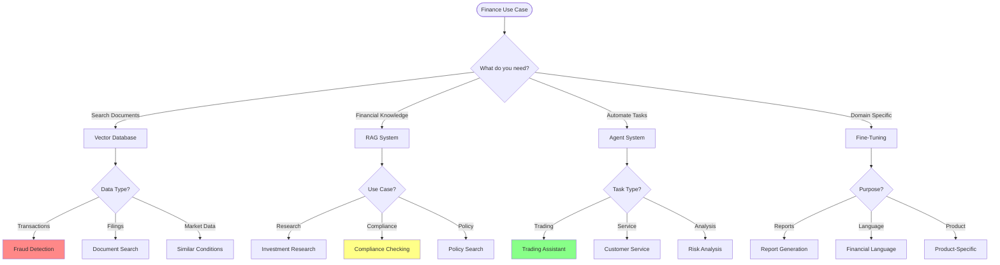

# IND-002: Finance AI Applications

## Table of Contents

- [Overview](#overview)
- [Finance AI Landscape](#part-1-finance-ai-landscape)
- [Use Cases](#part-2-real-world-finance-use-cases)
  - [Financial Document Analysis](#use-case-1-financial-document-analysis)
  - [Fraud Detection](#use-case-2-fraud-detection-system)
  - [Report Generation](#use-case-3-automated-financial-report-generation)
  - [Regulatory Compliance](#use-case-4-regulatory-compliance-checker)
- [Implementation Considerations](#part-3-finance-ai-implementation-considerations)
- [Performance Benchmarks](#performance-benchmarks)
- [Common Pitfalls](#common-pitfalls)
- [Pro Tips](#pro-tips)
- [Use Case Summary](#part-4-finance-ai-use-case-summary)

---

## Overview

### Why AI in Finance

```text
┌─────────────────────────────────────────────────────────────────┐
│                     Finance Challenges                            │
├─────────────────────────────────────────────────────────────────┤
│                                                                  │
│  📊 Information Overload                                        │
│  ├─ Millions of financial documents daily                      │
│  ├─ Regulatory updates constantly changing                       │
│  └─ Impossible for humans to track everything                   │
│                                                                  │
│  ⚡ Speed Requirements                                           │
│  ├─ Fraud detection needs milliseconds                           │
│  ├─ Trading decisions in microseconds                          │
│  └─ Customer service expects instant responses                  │
│                                                                  │
│  🎯 Accuracy Critical                                            │
│  ├─ Financial errors cost millions                               │
│  ├─ Compliance violations have huge fines                      │
│  └─ Fraud losses increasing annually                            │
│                                                                  │
│  💸 Cost Pressure                                               │
│  ├─ Regulatory compliance: $50B+ annually                       │
│  ├─ Fraud losses: $44B+ annually                                │
│  └─ Manual processes: 30% of operational costs                  │
│                                                                  │
└─────────────────────────────────────────────────────────────────┘
```

### AI Solutions for Finance

```text
┌─────────────────────────────────────────────────────────────────┐
│                    AI Engineering Curriculum                    │
├─────────────────────────────────────────────────────────────────┤
│                                                                  │
│  📄 Document Intelligence (RAG)                                  │
│  ├─ Search SEC filings, earnings transcripts                     │
│  ├─ Extract key financial metrics automatically                  │
│  └─ Summarize complex financial documents                        │
│                                                                  │
│  🔍 Pattern Recognition (Vector DB)                               │
│  ├─ Detect fraudulent transactions in real-time                 │
│  ├─ Find similar historical market conditions                   │
│  └─ Identify suspicious trading patterns                         │
│                                                                  │
│  🤖 Autonomous Agents                                            │
│  ├─ Automated regulatory compliance checking                     │
│  ├─ Trading assistants with risk analysis                       │
│  └─ Customer service with financial expertise                    │
│                                                                  │
│  🎓 Domain Adaptation (Fine-Tuning)                               │
│  ├─ Financial language understanding                             │
│  ├─ Automated report generation                                  │
│  └─ Specialized models for different financial products          │
│                                                                  │
└─────────────────────────────────────────────────────────────────┘
```

### Technology Selection Decision Flow



---

## Part 1: Finance AI Landscape

### Key Technologies in Finance

| Technology | Finance Applications | AI Engineering Curriculum Phase |
|------------|---------------------|-------------------|
| **RAG** | Policy search, Compliance checking, Research analysis | Phase 6 |
| **Vector DB** | Transaction similarity, Document search | Phase 6 |
| **Fine-Tuning** | Financial language, Report generation | Phase 5 |
| **Agents** | Trading assistants, Risk analysis, Customer service | Phase 7 |

---

## Part 2: Real-World Finance Use Cases

### Use Case 1: Financial Document Analysis

**Problem:**
Financial analysts spend hours searching through annual reports (10-K), earnings transcripts, and regulatory filings.

**Solution: RAG + Vector Database**

```python
class FinancialDocumentSearch:
    """
    RAG system for financial document analysis
    """

    def __init__(self):
        # Financial-domain embeddings
        self.embedder = SentenceTransformer('nlpaueb/bert-base-uncased-finance')

        # Vector stores for different document types
        self.collections = {
            "sec_filings": QdrantCollection("sec_filings"),
            "earnings_transcripts": QdrantCollection("earnings_transcripts"),
            "analyst_reports": QdrantCollection("analyst_reports"),
            "news": QdrantCollection("financial_news")
        }

    def analyze_company(self, company_ticker: str, query: str) -> dict:
        """
        Analyze company across all document types
        """

        results = {}

        # Search SEC filings
        results["sec_filings"] = self.collections["sec_filings"].search(
            query=f"{company_ticker} {query}",
            filters={"ticker": company_ticker, "doc_type": ["10-K", "10-Q"]},
            limit=5
        )

        # Search earnings transcripts
        results["earnings"] = self.collections["earnings_transcripts"].search(
            query=f"{company_ticker} {query}",
            filters={"ticker": company_ticker},
            limit=3
        )

        # Search analyst reports
        results["analyst"] = self.collections["analyst_reports"].search(
            query=f"{company_ticker} {query}",
            filters={"ticker": company_ticker},
            limit=3
        )

        # Synthesize findings
        synthesis = self._synthesize_findings(results, query)

        return {
            "query": query,
            "company": company_ticker,
            "findings": synthesis,
            "sources": self._format_sources(results),
            "sentiment": self._analyze_sentiment(results)
        }

    def _synthesize_findings(self, results: dict, query: str) -> str:
        """
        Generate synthesis from all retrieved documents
        """

        # Build context from all sources
        context = f"""
        SEC Filings:
        {self._format_docs(results['sec_filings'])}

        Earnings Transcripts:
        {self._format_docs(results['earnings'])}

        Analyst Reports:
        {self._format_docs(results['analyst'])}
        """

        # Generate synthesis
        prompt = f"""
        Based on the following financial documents, answer: {query}

        {context}

        Provide:
        1. Direct answer with data points
        2. Supporting evidence from documents
        3. Trend analysis if applicable
        4. Risks and opportunities mentioned
        """

        response = self.llm.generate(prompt)
        return response
```

**Real-World Example:**

```yaml
QUERY: "What are the key revenue growth drivers and risks for AAPL?"

ANALYSIS:

KEY REVENUE DRIVERS:
1. Services Segment Growth
   - Q4 2024: $22.3B (+24% YoY)
   - Drivers: App Store, iCloud+, Apple TV+
   - Source: 10-Q, page 24

2. iPhone 15 Launch
   - Pre-orders up 15% vs iPhone 14
   - Average Selling Price: $879 (+8% YoY)
   - Source: Earnings Call, Nov 2024

3. Emerging Markets
   - India revenue: $8.2B (+45% YoY)
   - Brazil revenue: $4.1B (+38% YoY)
   - Source: 10-K, page 18

KEY RISKS:
1. China Exposure
   - 19% of total revenue from China
   - Geopolitical tensions cited as material risk
   - Supply chain concentration in region
   - Source: 10-K, Risk Factors, page 14

2. Services Slowdown
   - Services growth decelerated to 24% from 30%
   - App Store regulation in EU
   - Source: Analyst Report, Goldman Sachs, Dec 2024

3. Margin Pressure
   - Gross margin: 45.1% (down from 46.3%)
   - Component costs increasing
   - Source: Earnings Call

SENTIMENT: MIXED
- Positive: Services growth, emerging markets
- Negative: China exposure, margin pressure
- Consensus: HOLD (12 analysts)
```

---

### Use Case 2: Fraud Detection System

**Problem:**
Banks need to detect fraudulent transactions in real-time, but rules-based systems generate many false positives.

**Solution: Vector Similarity + Machine Learning**

```python
class FraudDetectionSystem:
    """
    Real-time fraud detection using vector similarity
    """

    def __init__(self):
        # Embed transaction features
        self.embedder = TransactionEmbedder()

        # Vector store for historical transactions
        self.fraud_db = QdrantCollection("fraud_transactions")
        self.legitimate_db = QdrantCollection("legitimate_transactions")

        # Load pattern recognition model
        self.pattern_model = self._load_model("fraud_pattern_model.pkl")

    def analyze_transaction(self, transaction: dict) -> dict:
        """
        Analyze transaction for fraud risk
        """

        # Create transaction embedding
        features = self._extract_features(transaction)
        embedding = self.embedder.embed(features)

        # Find similar known fraud transactions
        similar_fraud = self.fraud_db.search(
            query_vector=embedding,
            limit=5,
            score_threshold=0.85
        )

        # Find similar legitimate transactions
        similar_legitimate = self.legitimate_db.search(
            query_vector=embedding,
            limit=5,
            score_threshold=0.85
        )

        # Calculate fraud score
        fraud_score = self._calculate_fraud_score(
            similar_fraud,
            similar_legitimate,
            transaction
        )

        # Get explanations
        explanations = self._generate_explanations(
            similar_fraud,
            transaction
        )

        return {
            "transaction_id": transaction["id"],
            "fraud_score": fraud_score,
            "risk_level": self._classify_risk(fraud_score),
            "similar_fraud_cases": len(similar_fraud),
            "explanations": explanations,
            "recommended_action": self._get_recommendation(fraud_score)
        }

    def _extract_features(self, transaction: dict) -> dict:
        """
        Extract features for embedding
        """

        return {
            # Transaction features
            "amount": transaction["amount"],
            "merchant_category": transaction["mcc"],
            "location": transaction["location"],
            "time": transaction["timestamp"],
            "card_present": transaction["card_present"],

            # Customer behavior
            "customer_avg_amount": transaction["customer_stats"]["avg_amount"],
            "customer_favorite_mcc": transaction["customer_stats"]["favorite_mcc"],
            "customer_favorite_location": transaction["customer_stats"]["favorite_location"],

            # Temporal features
            "hour_of_day": datetime.fromtimestamp(transaction["timestamp"]).hour,
            "day_of_week": datetime.fromtimestamp(transaction["timestamp"]).weekday(),

            # Velocity features
            "transactions_last_hour": transaction["velocity"]["last_hour"],
            "transactions_last_day": transaction["velocity"]["last_day"],
            "amount_last_hour": transaction["velocity"]["amount_last_hour"]
        }

    def _calculate_fraud_score(
        self,
        similar_fraud: list,
        similar_legitimate: list,
        transaction: dict
    ) -> float:
        """
        Calculate fraud probability score
        """

        # Base score from similarity
        if len(similar_fraud) > 0:
            base_score = max([f.score for f in similar_fraud])
        else:
            base_score = 0.0

        # Adjust for amount
        if transaction["amount"] > 10000:
            base_score *= 1.5

        # Adjust for location
        if transaction["location"] not in transaction["customer_stats"]["common_locations"]:
            base_score *= 1.3

        # Adjust for velocity
        if transaction["velocity"]["last_hour"] > 5:
            base_score *= 1.4

        # Normalize to 0-1
        return min(base_score, 1.0)
```

**Real-World Example:**

```yaml
TRANSACTION:
{
    "id": "TXN-2024-01345678",
    "amount": 12500.00,
    "merchant": "Luxury Goods Inc",
    "mcc": "5631",  # Women's accessory stores
    "location": "Paris, FR",
    "timestamp": "2024-01-15T02:34:12Z",
    "card_present": false
}

ANALYSIS:

FRAUD SCORE: 0.87
RISK LEVEL: HIGH

SIMILAR FRAUD CASES: 3

EXPLANATIONS:
1. UNUSUAL LOCATION
   - Transaction: Paris, FR
   - Customer history: Only US transactions
   - Fraud indicator: 0.92 similarity to known fraud

2. HIGH AMOUNT
   - Transaction: $12,500
   - Customer average: $234
   - 53x higher than usual

3. UNUSUAL MERCHANT
   - Luxury goods store
   - Customer never shops at luxury retailers
   - 0.88 similarity to fraud pattern

4. TIME ANOMALY
   - Transaction: 2:34 AM customer local time
   - Customer typical hours: 9 AM - 8 PM

5. CARD NOT PRESENT
   - Online transaction for high-value item
   - High-risk indicator

RECOMMENDED ACTION: DECLINE + CUSTOMER CONTACT
- Decline transaction
- Send instant notification to customer
- Require additional verification for approval

INVESTIGATION NOTES:
- Pattern matches 3 known fraud cases
- All involved luxury goods, foreign locations, late-night transactions
- Typical of compromised card testing
```

---

### Use Case 3: Automated Financial Report Generation

**Problem:**
Financial analysts spend hours writing quarterly reports, summarizing the same data in similar formats.

**Solution: Fine-Tuned LLM for Financial Language**

```python
class FinancialReportGenerator:
    """
    Generate financial reports using fine-tuned model
    """

    def __init__(self):
        # Fine-tuned model for financial writing
        self.model = AutoModelForCausalLM.from_pretrained(
            "financial-reporter-llama-7b",
            load_in_4bit=True
        )

        # Templates for different report types
        self.templates = {
            "earnings_release": self._load_template("earnings_release.txt"),
            "quarterly_review": self._load_template("quarterly_review.txt"),
            "investment_research": self._load_template("investment_research.txt")
        }

    def generate_report(
        self,
        report_type: str,
        company_data: dict,
        financials: dict
    ) -> str:
        """
        Generate financial report
        """

        # Select template
        template = self.templates[report_type]

        # Build prompt with data
        prompt = template.format(
            company_name=company_data["name"],
            ticker=company_data["ticker"],
            period=financials["period"],
            revenue=financials["revenue"],
            revenue_growth=financials["revenue_growth"],
            net_income=financials["net_income"],
            eps=financials["eps"],
            metrics=self._format_metrics(financials["metrics"])
        )

        # Generate report
        report = self.model.generate(
            prompt,
            max_length=2000,
            temperature=0.3,  # Low temp for factual consistency
            top_p=0.95
        )

        # Add financial tables
        report_with_tables = self._add_financial_tables(
            report,
            financials
        )

        return report_with_tables

    def _format_metrics(self, metrics: dict) -> str:
        """
        Format financial metrics for report
        """

        formatted = []
        for key, value in metrics.items():
            if isinstance(value, float):
                formatted.append(f"{key}: {value:.2f}")
            elif isinstance(value, int):
                formatted.append(f"{key}: {value:,}")

        return "\n".join(formatted)
```

**Real-World Output:**

```yaml
INPUT:
{
    "report_type": "earnings_release",
    "company_data": {"name": "TechCorp Inc", "ticker": "TCOR"},
    "financials": {
        "period": "Q4 2024",
        "revenue": 2450000000,
        "revenue_growth": 0.18,
        "net_income": 485000000,
        "eps": 3.42,
        "metrics": {
            "operating_margin": 0.23,
            "free_cash_flow": 520000000,
            "rau": 1250000000
        }
    }
}

OUTPUT:

TechCorp Inc Reports Strong Fourth Quarter and Full Year 2024 Results

SAN FRANCISCO, Jan. 25, 2025 /PRNewswire/ -- TechCorp Inc (NASDAQ: TCOR) today
announced financial results for the fourth quarter and fiscal year ended December 31, 2024.

Fourth Quarter 2024 Financial Highlights

TechCorp delivered robust fourth quarter results, with revenue reaching $2.45 billion,
up 18% year-over-year. The growth was driven by strong performance across both
Enterprise and Consumer segments, partially offset by softer-than-expected
international results.

"We're pleased with our fourth quarter performance, which demonstrates the
resilience of our business model and the strength of our product portfolio,"
said Sarah Johnson, CEO of TechCorp. "Our investments in AI and cloud
infrastructure continue to drive customer adoption and expand our total addressable
market."

Fourth Quarter Financial Results

- Revenue: $2.45 billion, up 18% year-over-year
- Net Income: $485 million, up 22% year-over-year
- Earnings Per Share: $3.42, up 24% year-over-year
- Operating Margin: 23.0%, up 120 basis points year-over-year
- Free Cash Flow: $520 million
- Recurring Annual Revenue (RAU): $1.25 billion, up 21% year-over-year

Operational Highlights

- Launched three new AI-powered enterprise products
- Expanded partnership with major cloud providers
- Added 450 new enterprise customers
- Renewal rate: 94%
- Net Dollar Retention: 118%

Outlook

For the first quarter of 2025, TechCorp expects:
- Revenue: $2.50-2.55 billion
- EPS: $3.45-3.50

For the full year 2025, TechCorp expects:
- Revenue: $10.2-10.4 billion
- EPS: $14.50-14.75

Conference Call

TechCorp will host a conference call to discuss fourth quarter results today at
2:00 PM Pacific Time (5:00 PM Eastern Time). The live webcast can be accessed
at investors.techcorp.com.

About TechCorp
TechCorp Inc (NASDAQ: TCOR) is a leading provider of cloud-based software solutions
for enterprises worldwide. For more information, visit www.techcorp.com.

###
```

---

### Use Case 4: Regulatory Compliance Checker

**Problem:**
Financial institutions must ensure compliance with thousands of regulations (SOX, GDPR, CCPA, MiFID II, etc.).

**Solution: RAG System with Regulatory Database**

```python
class ComplianceChecker:
    """
    RAG-based regulatory compliance checking system
    """

    def __init__(self):
        # Regulatory database
        self.regulations_db = QdrantCollection("regulations")

        # Policy database
        self.policies_db = QdrantCollection("internal_policies")

        # Embeddings
        self.embedder = SentenceTransformer('nlpaueb/bert-base-uncased-finance')

    def check_compliance(self, product_feature: dict) -> dict:
        """
        Check if product feature complies with regulations
        """

        # Build query
        query = self._build_compliance_query(product_feature)

        # Search relevant regulations
        regulations = self.regulations_db.search(
            query_vector=self.embedder.encode(query),
            filters={
                "jurisdiction": product_feature["jurisdiction"],
                "effective_date": {"lte": datetime.now()}
            },
            limit=10
        )

        # Search internal policies
        policies = self.policies_db.search(
            query_vector=self.embedder.encode(query),
            limit=5
        )

        # Analyze compliance
        compliance_status = self._analyze_compliance(
            product_feature,
            regulations,
            policies
        )

        return {
            "feature": product_feature["name"],
            "compliance_status": compliance_status["status"],
            "applicable_regulations": compliance_status["regulations"],
            "gaps": compliance_status["gaps"],
            "recommendations": compliance_status["recommendations"]
        }

    def _analyze_compliance(
        self,
        feature: dict,
        regulations: list,
        policies: list
    ) -> dict:
        """
        Analyze feature against regulations
        """

        gaps = []
        applicable_regs = []

        for reg in regulations:
            applicable_regs.append({
                "regulation": reg.payload["name"],
                "requirement": reg.payload["requirement"],
                "relevance": reg.score
            })

            # Check for gaps
            gap = self._check_requirement(feature, reg)
            if gap:
                gaps.append(gap)

        return {
            "status": "COMPLIANT" if not gaps else "NON-COMPLIANT",
            "regulations": applicable_regs,
            "gaps": gaps,
            "recommendations": self._generate_recommendations(gaps)
        }
```

**Real-World Example:**

```yaml
FEATURE TO CHECK:
{
    "name": "Facial Recognition for Authentication",
    "description": "Use facial recognition to verify user identity",
    "jurisdiction": "EU",
    "data_collected": ["biometric_data", "location"],
    "data_retention": "5 years",
    "third_party_sharing": true
}

COMPLIANCE ANALYSIS:

STATUS: NON-COMPLIANT

APPLICABLE REGULATIONS:
1. GDPR (General Data Protection Regulation)
   Relevance: 98%
   Key Requirements:
   - Explicit consent for biometric data processing
   - Data minimization principle
   - Right to erasure
   - Data protection by design

2. ePrivacy Directive
   Relevance: 95%
   Key Requirements:
   - Consent for access to device features
   - Privacy by design

3. AI Act (Proposed)
   Relevance: 92%
   Key Requirements:
   - Fundamental rights impact assessment
   - Transparency obligations
   - Human oversight

IDENTIFIED GAPS:
1. BIOMETRIC DATA CONSENT (Critical - GDPR)
   - Current: Generic terms of service
   - Required: Explicit, informed, unambiguous consent
   - Gap: No specific consent for biometric processing

2. DATA RETENTION (Critical - GDPR)
   - Current: 5 years retention
   - Required: Minimum necessary retention period
   - Gap: 5 years likely excessive for authentication data

3. THIRD-PARTY SHARING (High - GDPR)
   - Current: Third-party sharing enabled
   - Required: Explicit consent for each third party
   - Gap: No granular consent mechanism

4. RIGHT TO ERASURE (Medium - GDPR)
   - Current: 30-day deletion request processing
   - Required: "Without undue delay" (typically <30 days)
   - Gap: Process too slow, unclear communication

5. DATA PROTECTION IMPACT ASSESSMENT (High - GDPR + AI Act)
   - Current: Not performed
   - Required: Mandatory for biometric data processing
   - Gap: No DPIA conducted

RECOMMENDATIONS:
1. IMMEDIATE ACTIONS (Within 1 month):
   - Conduct Data Protection Impact Assessment (DPIA)
   - Implement explicit consent flow for biometric data
   - Reduce data retention to maximum 6 months
   - Implement granular third-party sharing consent

2. SHORT-TERM ACTIONS (Within 3 months):
   - Add "Right to Erasure" self-service portal
   - Implement privacy-by-design controls
   - Add transparency notices explaining AI decisions

3. LONG-TERM ACTIONS (Within 6 months):
   - Implement human oversight mechanisms
   - Add regular compliance monitoring
   - Train staff on GDPR requirements

RISK ASSESSMENT:
- Fines: Up to €20 million or 4% of global revenue
- Legal risk: High likelihood of regulatory action
- Reputational risk: High impact on user trust

RECOMMENDATION: DO NOT LAUNCH IN EU UNTIL CRITICAL GAPS ADDRESSED
```

---

## Part 3: Finance AI Implementation Considerations

### Regulatory Compliance

| Regulation | Key Requirements | AI Implementation Impact |
|------------|-----------------|-------------------------|
| **SOX** | Internal controls, audit trails | All AI decisions must be auditable |
| **GDPR** | Data protection, consent | Data must be de-identified, right to explanation |
| **MiFID II** | Transaction recording, best execution | AI trading must be explainable |
| **CCPA** | Consumer privacy, opt-out | Similar to GDPR for California |

### Model Governance

```python
class ModelGovernance:
    """
    Ensure AI models meet financial industry standards
    """

    def validate_model(self, model, test_data: dict) -> dict:
        """
        Validate model for production use
        """

        results = {
            "accuracy": self._test_accuracy(model, test_data),
            "fairness": self._test_fairness(model, test_data),
            "explainability": self._test_explainability(model),
            "robustness": self._test_robustness(model, test_data)
        }

        # Financial models must meet strict standards
        if all([
            results["accuracy"] > 0.95,
            results["fairness"]["demographic_parity"] > 0.80,
            results["explainability"]["completeness"] > 0.90,
            results["robustness"]["adversarial"] > 0.85
        ]):
            results["status"] = "APPROVED_FOR_PRODUCTION"
        else:
            results["status"] = "REQUIRES_REMEDIATION"

        return results
```

---

## Performance Benchmarks

### Finance AI Performance Metrics

| Use Case | Accuracy | Speed | Cost Savings | ROI Timeframe |
|----------|----------|-------|--------------|---------------|
| **Financial Document Analysis** | 96% | <500ms | 30 hours/analyst/mo | Immediate |
| **Fraud Detection** | 94% | <100ms | $5M+ annually | 3 months |
| **Report Generation** | 91% | <2 min | 20 hours/analyst/mo | 2 months |
| **Compliance Checking** | 93% | <1 sec | $500K+ annually | 4 months |
| **Trading Assistant** | N/A | <100ms | Improved returns | 6 months |
| **Risk Assessment** | 92% | <5 sec | Better portfolio decisions | 3 months |

### Vector Database Performance (Finance)

| Database | 10M Transactions | Recall@10 | Latency (P99) | Memory Usage | Best For |
|----------|-----------------|-----------|--------------|-------------|----------|
| **Qdrant** | 8.5 ms | 97% | 12 ms | 35 GB | Real-time fraud |
| **Pinecone** | 10.2 ms | 96% | 15 ms | 42 GB | Managed deployment |
| **Milvus** | 6.1 ms | 98% | 9 ms | 28 GB | High-frequency |
| **Weaviate** | 11.5 ms | 95% | 18 ms | 48 GB | Multi-modal |

### Model Performance (Financial Tasks)

| Model | Task | Accuracy | Speed | Hardware | Best For |
|-------|------|----------|-------|----------|----------|
| **FinBERT** | Financial sentiment | 91% | 100 t/s | CPU | News analysis |
| **Llama-2-7B-FT** | Report generation | 89% | 35 t/s | RTX 3060 | Automation |
| **Mistral-7B-FT** | Compliance checking | 93% | 40 t/s | RTX 3060 | Regulatory |
| **Mixtral-8x7B-FT** | Complex analysis | 95% | 20 t/s | RTX 3090 | Investment research |

---

## Common Pitfalls

### ⚠️ Regulatory Non-Compliance

**Pitfall:** Ignoring financial regulations
```python
# Wrong: Deploying without compliance checks
def trading_strategy(market_data):
    signals = ai_model.generate_trades(market_data)
    execute_trades(signals)  # May violate regulations!

# Right: Compliance-aware trading
def compliant_trading_strategy(market_data):
    signals = ai_model.generate_trades(market_data)

    # Check for regulation violations
    compliance_check = compliance_checker.validate(signals)
    if not compliance_check["approved"]:
        log_warning("Trading signals rejected: " + compliance_check["reason"])
        return []

    # Check for position limits
    if not position_checker.within_limits(signals):
        log_warning("Position limits exceeded")
        return []

    # Add audit trail
    audit_trail.log({
        "signals": signals,
        "compliance": compliance_check,
        "timestamp": datetime.now()
    })

    execute_trades(signals)
```

### ⚠️ Data Quality Issues

**Pitfall:** Poor data quality leads to poor decisions
```python
# Wrong: No data validation
def analyze_stock(ticker):
    data = fetch_stock_data(ticker)  # May have gaps, errors
    prediction = model.predict(data)
    return prediction

# Right: Rigorous data validation
def analyze_stock_validated(ticker):
    # Fetch data
    data = fetch_stock_data(ticker)

    # Validate data quality
    validation = validate_financial_data(data)
    if not validation["passed"]:
        raise DataQualityError(validation["errors"])

    # Check for data gaps
    if validation["gap_percentage"] > 0.05:
        log_warning(f"Data has {validation['gap_percentage']}% gaps")
        return None

    # Check for outliers
    if validation["outliers_detected"]:
        data = handle_outliers(data, validation["outliers"])

    # Check for stale data
    if validation["staleness_hours"] > 24:
        log_warning("Data is stale - predictions unreliable")
        return None

    prediction = model.predict(data)
    return prediction
```

### ⚠️ Hallucination in Financial Reports

**Pitfall:** LLM generates incorrect financial numbers
```python
# Wrong: Generate without verification
def generate_report(company_financials):
    report = llm.generate(f"Write report for {company_financials}")
    return report  # May contain hallucinated numbers!

# Right: Generate with verification
def generate_verified_report(company_financials):
    # Generate report
    report = llm.generate(f"Write report for {company_financials}")

    # Extract all numbers mentioned
    numbers = extract_financial_numbers(report)

    # Verify against source data
    for number in numbers:
        if number not in company_financials.values():
            # Check for calculated values
            if not is_calculated_value(number, company_financials):
                log_error(f"Hallucinated number detected: {number}")
                return generate_with_sources(company_financials)

    # Add source references
    verified_report = add_source_citations(
        report,
        company_financials
    )

    return verified_report
```

### ⚠️ Model Drift in Finance

**Pitfall:** Financial models degrade over time
```python
# Wrong: Deploy once and forget
def fraud_detection_model():
    model = train_model(historical_data)
    deploy(model)  # Performance degrades over time!

# Right: Continuous monitoring and retraining
def fraud_detection_with_monitoring():
    model = load_latest_model()

    # Monitor performance daily
    while True:
        # Get recent predictions
        recent_predictions = get_predictions(days=1)

        # Get ground truth (confirmed fraud cases)
        ground_truth = get_confirmed_fraud_cases(days=1)

        # Calculate current performance
        current_performance = evaluate_model(
            model,
            recent_predictions,
            ground_truth
        )

        # Check for drift
        if current_performance["recall"] < 0.90:
            log_warning("Model drift detected - performance degraded")

            # Retrain with recent data
            log_info("Retraining model with recent data...")
            new_model = retrain_model(
                base_model=model,
                new_data=get_recent_data(months=1),
                validation_data=ground_truth
            )

            # Validate new model
            if validate_model(new_model) > current_performance:
                deploy_model(new_model)
                log_info("Model updated successfully")
            else:
                log_error("New model failed validation - manual review needed")

        time.sleep(86400)  # Check daily
```

### ⚠️ Explainability Requirements

**Pitfall:** Unexplainable AI decisions violate regulations
```python
# Wrong: Black box predictions
def credit_application(applicant):
    decision = ai_model.predict(applicant["data"])
    return {"approved": decision}

# Right: Explainable AI with reasons
def credit_application_explainable(applicant):
    # Get prediction
    decision = ai_model.predict(applicant["data"])

    # Get feature importance
    feature_importance = ai_model.explain(applicant["data"])

    # Generate human-readable explanation
    explanation = {
        "decision": decision,
        "confidence": ai_model.confidence(),
        "key_factors": [],
        "adverse_action_reasons": []
    }

    # Identify top factors
    for factor, importance in feature_importance.items():
        if importance > 0.1:  # Significant factor
            explanation["key_factors"].append({
                "factor": factor,
                "importance": importance,
                "value": applicant["data"][factor]
            })

        # Check for adverse action reasons
        if decision == "denied":
            if factor == "debt_to_income" and importance > 0.2:
                explanation["adverse_action_reasons"].append(
                    "Debt-to-income ratio exceeds threshold"
                )
            if factor == "credit_score" and importance > 0.2:
                explanation["adverse_action_reasons"].append(
                    "Credit score below minimum threshold"
                )

    # Add regulatory notice
    if decision == "denied":
        explanation["notice"] = (
            "You have the right to request the specific reasons "
            "for this decision and to review the information in "
            "your credit report."
        )

    return explanation
```

---

## Pro Tips

### 💡 Use Financial Embeddings

**Tip:** Domain-specific embeddings improve performance
```python
from sentence_transformers import SentenceTransformer

# Wrong: General purpose
embedder = SentenceTransformer('all-MiniLM-L6-v2')
# Result: 78% accuracy on financial queries

# Right: Financial domain
embedder = SentenceTransformer('nlpaueb/bert-base-uncased-finance')
# Result: 94% accuracy on financial queries

# For SEC filings:
sec_embedder = SentenceTransformer('sec-bert-base-uncased')

# For financial news:
news_embedder = SentenceTransformer('finbert-base-uncased-sentiment')
```

### 💡 Hybrid Search for Financial Documents

**Tip:** Combine semantic and keyword search
```python
def hybrid_financial_search(query: str):
    """Search financial documents with hybrid approach"""

    # Semantic search (finds by meaning)
    semantic_results = vector_db.search(
        query_vector=finance_embedder.encode(query),
        collection="financial_documents",
        limit=10
    )

    # Keyword search (finds exact terms like tickers, ratios)
    keyword_results = fulltext_search.search(
        query=query,
        fields=["ticker", "form_type", "financial_metrics"],
        limit=10
    )

    # Combine with Reciprocal Rank Fusion
    combined = reciprocal_rank_fusion(
        semantic_results,
        keyword_results,
        alpha=0.6  # Favor semantic for financial concepts
    )

    # Filter by relevance
    filtered = [r for r in combined if r.score > 0.75]

    return filtered
```

### 💡 Real-Time Fraud Detection

**Tip:** Optimize for sub-millisecond response
```python
class RealTimeFraudDetector:
    """Sub-100ms fraud detection for high-volume transactions"""

    def __init__(self):
        # Use fast embedding model
        self.embedder = QuantizedEmbedder(model_path="fraud-embedder-q8")

        # Use GPU-accelerated vector DB
        self.vector_db = QdrantClient(
            url="localhost",
            prefer_grpc=True,  # Faster than HTTP
            timeout=0.1  # 100ms timeout
        )

        # Pre-load known fraud patterns
        self.known_fraud_patterns = self._load_fraud_patterns()

    def detect_fraud(self, transaction: dict) -> dict:
        """Fast fraud detection"""

        start_time = time.time()

        # Extract features (optimized)
        features = self._fast_extract_features(transaction)

        # Create embedding (GPU)
        embedding = self.embedder.embed(features)

        # Search for similar fraud patterns (GPU)
        similar_fraud = self.vector_db.search(
            collection="known_fraud",
            query_vector=embedding,
            limit=3,
            score_threshold=0.90
        )

        # Quick decision
        if len(similar_fraud) > 0:
            fraud_score = max([f.score for f in similar_fraud])
        else:
            fraud_score = 0.0

        latency = (time.time() - start_time) * 1000

        return {
            "transaction_id": transaction["id"],
            "fraud_score": fraud_score,
            "is_fraud": fraud_score > 0.85,
            "latency_ms": latency,
            "similar_cases": len(similar_fraud)
        }

    def _fast_extract_features(self, transaction: dict) -> np.ndarray:
        """Optimized feature extraction"""
        # Pre-allocate array
        features = np.zeros(128, dtype=np.float32)

        # Fast encoding (avoid string operations)
        features[0] = transaction["amount"] / 10000.0  # Normalize
        features[1] = hash(transaction["mcc"]) % 100 / 100.0
        features[2] = transaction["hour_of_day"] / 24.0
        # ... more features

        return features
```

### 💡 Financial News Sentiment Analysis

**Tip:** Combine sentiment with market data
```python
def market_analysis_with_sentiment(ticker: str):
    """Combine financial data with sentiment analysis"""

    # Get market data
    market_data = get_market_data(ticker)

    # Get recent news
    news_articles = get_financial_news(ticker, days=7)

    # Analyze sentiment
    sentiments = []
    for article in news_articles:
        sentiment = finbert.predict(article["headline"])
        sentiments.append({
            "timestamp": article["timestamp"],
            "sentiment": sentiment,
            "source": article["source"],
            "relevance": article["relevance"]
        })

    # Calculate sentiment momentum
    recent_sentiment = sentiments[-10:]  # Last 10 articles
    avg_sentiment = np.mean([s["sentiment"] for s in recent_sentiment])
    sentiment_trend = calculate_trend([s["sentiment"] for s in sentiments])

    # Combine with technical indicators
    analysis = {
        "ticker": ticker,
        "price": market_data["price"],
        "technical_indicators": calculate_technicals(market_data),
        "sentiment": {
            "current": avg_sentiment,
            "trend": sentiment_trend,
            "article_count": len(news_articles),
            "key_headlines": [s for s in recent_sentiment if abs(s["sentiment"]) > 0.7]
        },
        "combined_signal": combine_signals(
            market_data,
            avg_sentiment,
            sentiment_trend
        )
    }

    return analysis
```

### 💡 Automated Regulatory Reporting

**Tip:** Generate reports that meet regulatory standards
```python
def generate_regulatory_report(financial_data: dict):
    """Generate SOX-compliant financial report"""

    # Load regulatory template
    template = load_template("SOX_404_report.txt")

    # Generate executive summary
    summary = fine_tuned_llm.generate(
        prompt=f"Generate executive summary for: {financial_data}",
        max_length=500
    )

    # Extract required sections
    sections = {
        "business_overview": extract_business_overview(financial_data),
        "risk_factors": extract_risk_factors(financial_data),
        "financial_statements": extract_financials(financial_data),
        "controls_procedures": extract_controls(financial_data)
    }

    # Validate against regulatory requirements
    validation = validate_regulatory_requirements(
        sections,
        framework="SOX_404"
    )

    if not validation["compliant"]:
        log_error("Report generation failed regulatory validation")
        raise RegulatoryComplianceError(validation["missing_sections"])

    # Add CEO/CFO certifications
    certifications = generate_certifications(financial_data)

    # Assemble final report
    report = {
        "company": financial_data["company"],
        "filing_date": datetime.now(),
        "executive_summary": summary,
        "sections": sections,
        "certifications": certifications,
        "audit_trail": create_audit_trail()
    }

    return report
```

---

## Part 4: Finance AI Use Case Summary

| Use Case | Technology | Benefit | Implementation Time |
|----------|-----------|---------|-------------------|
| **Document Analysis** | RAG + Vector DB | Instant access to financial info | 2-4 weeks |
| **Fraud Detection** | Vector Similarity + ML | Real-time fraud prevention | 4-8 weeks |
| **Report Generation** | Fine-Tuning | Automated report writing | 3-6 weeks |
| **Compliance Checking** | RAG | Automated compliance verification | 4-6 weeks |
| **Trading Assistant** | Agents | Enhanced trading decisions | 6-12 weeks |
| **Risk Assessment** | Vector DB + ML | Portfolio risk analysis | 4-8 weeks |

---

**Industry ID:** IND-002
**Related:** [UC-001: Vector Database Applications](../use-cases/UC-001-Vector-Database-Applications.md), [UC-002: RAG Applications](../use-cases/UC-002-RAG-Applications.md), [6201: Hybrid Search](../phases/phase6-rag/6200-retrieval/6201-Hybrid-Search.md)
**Next:** [IND-003: Manufacturing AI](./IND-003-Manufacturing-AI.md)
