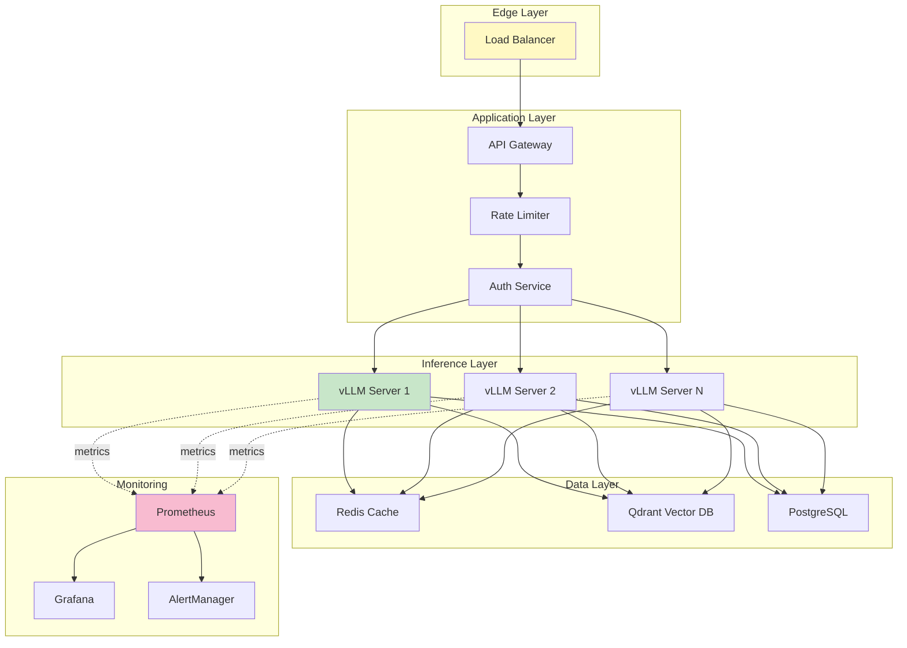

# TUTORIAL-012: Production LLMOps

## Table of Contents

- [Learning Objectives](#learning-objectives)
- [Abstract](#abstract)
- [Part 1: Production Architecture](#part-1-production-architecture)
- [Part 2: Load Balancing](#part-2-load-balancing)
- [Part 3: Monitoring and Observability](#part-3-monitoring-and-observability)
- [Part 4: Model Management](#part-4-model-management)
- [Part 5: Cost Optimization](#part-5-cost-optimization)
- [Exercises](#exercises)
- [Completion Checklist](#completion-checklist)
- [References](#references)
- [Next Steps](#next-steps)

---

## Abstract

This tutorial covers production-grade LLMOps including deployment, scaling, monitoring, and maintenance of LLM systems.

**Duration:** 5 hours

**Difficulty:** ⭐⭐⭐ Advanced

**Prerequisites:**

- **Required:** TUTORIAL-005 (Production Deployment), TUTORIAL-004 (Monitoring), LAB-009 (Production Deployment)
- **Strongly Recommended:** Docker expertise (TUTORIAL-002), Kubernetes basics (1301-K3s-Master-Worker-Arch.md)
- **Helpful:** vLLM knowledge (1402-vLLM-and-TGI.md), Monitoring stack (1501-Monitoring-and-Observability.md)
- **Skills Needed:** Load balancing, autoscaling, alerting, log aggregation

**This is an advanced tutorial. Ensure you have production deployment experience before starting.**

---

## Learning Objectives

After this tutorial, you will:

- Design production LLM architectures
- Implement load balancing and autoscaling
- Set up comprehensive monitoring
- Handle model updates and rollbacks
- Manage cost and performance

---

## Part 1: Production Architecture

### Installation

```bash
uv pip install prometheus-client httpx numpy
```

Part 3 needs prometheus-client (the metrics library) and httpx (the
async HTTP client), Parts 4-5 numpy. Parts 1-2 are pure configuration
(Docker Compose, nginx, Kubernetes) - nothing to install beyond the
Docker toolchain itself.

### Reference Architecture



### Deployment Configuration

```yaml
# docker-compose.yml for production

services:
  # vLLM inference server
  # deploy.replicas is a Swarm-only field - plain compose ignores it,
  # and a fixed container_name could not name 3 replicas anyway.
  # Scale instead with `docker compose up --scale vllm=3` (no fixed
  # host port: replicas would all try to bind 8000 on the host, and
  # nginx reaches them over the compose network)
  vllm:
    image: vllm/vllm-openai:latest
    deploy:
      resources:
        reservations:
          devices:
            - driver: nvidia
              count: 1
              capabilities: [gpu]
    # the vLLM server takes its configuration as CLI arguments - it
    # reads none of the MODEL_NAME-style env vars, so pass them here.
    # The repo must be the AWQ-quantized checkpoint: --quantization
    # awq on the fp16 repo fails at load time
    command: >
      --model Qwen/Qwen2.5-7B-Instruct-AWQ
      --quantization awq
      --max-model-len 4096
      --gpu-memory-utilization 0.9
    expose:
      - "8000"
    volumes:
      - ./models:/root/.cache/huggingface  # persist the HF download cache
    healthcheck:
      test: ["CMD", "curl", "-f", "http://localhost:8000/health"]
      interval: 30s
      timeout: 10s
      retries: 3
    restart: unless-stopped

  # Qdrant vector database
  qdrant:
    image: qdrant/qdrant:latest
    container_name: qdrant
    ports:
      - "6333:6333"
    volumes:
      - ./qdrant/storage:/qdrant/storage
    restart: unless-stopped

  # Redis cache
  redis:
    image: redis:8-alpine
    container_name: redis
    ports:
      - "6379:6379"
    volumes:
      - ./redis/data:/data
    command: redis-server --appendonly yes
    restart: unless-stopped

  # API gateway
  api-gateway:
    image: nginx:alpine
    container_name: api-gateway
    ports:
      - "80:80"
      - "443:443"
    volumes:
      - ./nginx/nginx.conf:/etc/nginx/nginx.conf
      - ./nginx/ssl:/etc/nginx/ssl
    depends_on:
      - vllm
    restart: unless-stopped

  # Monitoring
  prometheus:
    image: prom/prometheus:latest
    container_name: prometheus
    ports:
      - "9090:9090"
    volumes:
      - ./prometheus/prometheus.yml:/etc/prometheus/prometheus.yml
      - ./prometheus/data:/prometheus
    command:
      - '--config.file=/etc/prometheus/prometheus.yml'
      - '--storage.tsdb.path=/prometheus'
    restart: unless-stopped

  grafana:
    image: grafana/grafana:latest
    container_name: grafana
    ports:
      - "3000:3000"
    volumes:
      - ./grafana/data:/var/lib/grafana
      - ./grafana/dashboards:/etc/grafana/provisioning/dashboards
    environment:
      - GF_SECURITY_ADMIN_PASSWORD=${GRAFANA_PASSWORD}
    restart: unless-stopped
```

---

## Part 2: Load Balancing

### NGINX Configuration

```nginx
# nginx.conf
events {
    worker_connections 4096;
}

http {
    upstream vllm_servers {
        # Load balancing methods:
        # least_conn: Send to server with fewest connections
        # ip_hash: Send same client to same server (session)
        # random: Random selection
        least_conn;

        # vllm is the compose service name: Docker's embedded DNS
        # returns one A record per replica and nginx round-robins
        # across every resolved address (least_conn still picks among
        # them; run `nginx -s reload` after scaling so new replicas
        # join). max_fails/fail_timeout below are stock passive
        # health checks - the active `check` directive needs the
        # third-party nginx_upstream_check_module and fails nginx -t
        # on a vanilla build
        server vllm:8000 max_fails=3 fail_timeout=30s;
    }

    # Rate limiting
    limit_req_zone $binary_remote_addr zone=api_limit:10m rate=10r/s;

    server {
        listen 80;
        server_name api.example.com;

        # Redirect to HTTPS
        return 301 https://$server_name$request_uri;
    }

    server {
        listen 443 ssl http2;
        server_name api.example.com;

        ssl_certificate /etc/nginx/ssl/cert.pem;
        ssl_certificate_key /etc/nginx/ssl/key.pem;

        # There is no proxy_queue directive in stock nginx (the old
        # proxy_queue on / proxy_queue_limit lines fail nginx -t) -
        # limit_req's burst below is the request queue

        location /v1/chat/completions {
            # Apply rate limiting
            limit_req zone=api_limit burst=20 nodelay;

            proxy_pass http://vllm_servers;
            proxy_http_version 1.1;

            # Headers
            proxy_set_header Host $host;
            proxy_set_header X-Real-IP $remote_addr;
            proxy_set_header X-Forwarded-For $proxy_add_x_forwarded_for;
            proxy_set_header X-Forwarded-Proto $scheme;

            # Timeouts
            proxy_connect_timeout 60s;
            proxy_send_timeout 300s;
            proxy_read_timeout 300s;

            # Buffering
            proxy_buffering off;
            proxy_request_buffering off;
        }

        location /health {
            proxy_pass http://vllm_servers/health;
            access_log off;
        }
    }
}
```

### Kubernetes Deployment

```yaml
# vllm-deployment.yaml
apiVersion: v1
kind: ConfigMap
metadata:
  name: vllm-config
data:
  # AWQ-quantized checkpoint - --quantization awq on the fp16 repo
  # fails at load time
  MODEL_NAME: "Qwen/Qwen2.5-7B-Instruct-AWQ"
  QUANTIZATION: "awq"
  MAX_MODEL_LEN: "4096"
---
apiVersion: apps/v1
kind: Deployment
metadata:
  name: vllm
spec:
  replicas: 3
  selector:
    matchLabels:
      app: vllm
  template:
    metadata:
      labels:
        app: vllm
    spec:
      containers:
      - name: vllm
        image: vllm/vllm-openai:latest
        ports:
        - containerPort: 8000
        env:
        - name: MODEL_NAME
          valueFrom:
            configMapKeyRef:
              name: vllm-config
              key: MODEL_NAME
        - name: QUANTIZATION
          valueFrom:
            configMapKeyRef:
              name: vllm-config
              key: QUANTIZATION
        - name: MAX_MODEL_LEN
          valueFrom:
            configMapKeyRef:
              name: vllm-config
              key: MAX_MODEL_LEN
        # the vLLM server reads none of these env vars itself - it is
        # configured through CLI arguments, so expand them here
        # ($(VAR) substitution from the container env is native K8s)
        args:
        - --model
        - $(MODEL_NAME)
        - --quantization
        - $(QUANTIZATION)
        - --max-model-len
        - $(MAX_MODEL_LEN)
        - --gpu-memory-utilization
        - "0.9"
        resources:
          requests:
            nvidia.com/gpu: 1
            memory: "16Gi"
            cpu: "4"
          limits:
            nvidia.com/gpu: 1
            memory: "24Gi"
            cpu: "8"
        livenessProbe:
          httpGet:
            path: /health
            port: 8000
          initialDelaySeconds: 60
          periodSeconds: 30
        readinessProbe:
          httpGet:
            path: /health
            port: 8000
          initialDelaySeconds: 30
          periodSeconds: 10
---
apiVersion: v1
kind: Service
metadata:
  name: vllm-service
spec:
  selector:
    app: vllm
  ports:
  - port: 8000
    targetPort: 8000
  type: LoadBalancer
---
apiVersion: autoscaling/v2
kind: HorizontalPodAutoscaler
metadata:
  name: vllm-hpa
spec:
  scaleTargetRef:
    apiVersion: apps/v1
    kind: Deployment
    name: vllm
  minReplicas: 3
  maxReplicas: 10
  metrics:
  - type: Resource
    resource:
      name: cpu
      target:
        type: Utilization
        averageUtilization: 70
  - type: Resource
    resource:
      name: memory
      target:
        type: Utilization
        averageUtilization: 80
  behavior:
    scaleDown:
      stabilizationWindowSeconds: 300
      policies:
      - type: Percent
        value: 50
        periodSeconds: 60
    scaleUp:
      stabilizationWindowSeconds: 60
      policies:
      - type: Percent
        value: 100
        periodSeconds: 30
      - type: Pods
        value: 2
        periodSeconds: 60
```

---

## Part 3: Monitoring and Observability

### Custom Prometheus Metrics

```python
from prometheus_client import Counter, Histogram, Gauge, start_http_server
import httpx
import time

# Define metrics
request_counter = Counter(
    'llm_requests_total',
    'Total number of LLM requests',
    ['model', 'status']
)

request_duration = Histogram(
    'llm_request_duration_seconds',
    'LLM request duration',
    ['model', 'endpoint']
)

active_requests = Gauge(
    'llm_active_requests',
    'Number of active LLM requests',
    ['model']
)

tokens_processed = Counter(
    'llm_tokens_processed_total',
    'Total number of tokens processed',
    ['model', 'type']  # type: input/output
)

gpu_memory_usage = Gauge(
    'llm_gpu_memory_bytes',
    'GPU memory usage in bytes',
    ['model', 'gpu_id']
)

class MonitoredLLMClient:
    """LLM client with Prometheus monitoring"""

    def __init__(self, base_url: str, model: str):
        self.base_url = base_url
        self.model = model
        self.client = httpx.AsyncClient(timeout=300.0)

    async def generate(self, prompt: str, **kwargs):
        """Generate with monitoring"""
        active_requests.labels(model=self.model).inc()

        start_time = time.time()
        status = "success"

        try:
            response = await self.client.post(
                f"{self.base_url}/v1/chat/completions",
                json={
                    "model": self.model,
                    "messages": [{"role": "user", "content": prompt}],
                    **kwargs
                }
            )

            if response.status_code == 200:
                result = response.json()

                # Track tokens
                usage = result.get("usage", {})
                tokens_processed.labels(
                    model=self.model,
                    type="input"
                ).inc(usage.get("prompt_tokens", 0))

                tokens_processed.labels(
                    model=self.model,
                    type="output"
                ).inc(usage.get("completion_tokens", 0))

                return result
            else:
                status = "error"
                response.raise_for_status()

        except Exception:
            status = "error"
            raise
        finally:
            # Record metrics
            duration = time.time() - start_time
            request_duration.labels(
                model=self.model,
                endpoint="chat"
            ).observe(duration)

            request_counter.labels(
                model=self.model,
                status=status
            ).inc()

            active_requests.labels(model=self.model).dec()

# Start the metrics server on 9100 - port 8000 is already the vLLM
# servers' port in this stack, and binding it a second time fails
# with EADDRINUSE
start_http_server(9100)
```

### Custom Grafana Dashboard

The dashboard below is plain JSON (JSON has no comment syntax, so the
notes live here). Watch the P95/P99 expressions: they wrap
`histogram_quantile` in `rate()` over the `_bucket` series - a raw
histogram metric is a running cumulative count, not a distribution,
and quantiles computed over it directly are meaningless.

```json
{
  "dashboard": {
    "title": "LLM Production Dashboard",
    "panels": [
      {
        "title": "Request Rate",
        "type": "graph",
        "targets": [
          {
            "expr": "rate(llm_requests_total[5m])",
            "legendFormat": "{{model}} - {{status}}"
          }
        ]
      },
      {
        "title": "Request Duration (P95, P99)",
        "type": "graph",
        "targets": [
          {
            "expr": "histogram_quantile(0.95, rate(llm_request_duration_seconds_bucket[5m]))",
            "legendFormat": "P95 - {{model}}"
          },
          {
            "expr": "histogram_quantile(0.99, rate(llm_request_duration_seconds_bucket[5m]))",
            "legendFormat": "P99 - {{model}}"
          }
        ]
      },
      {
        "title": "Tokens/sec Throughput",
        "type": "graph",
        "targets": [
          {
            "expr": "rate(llm_tokens_processed_total[1m])",
            "legendFormat": "{{model}} - {{type}}"
          }
        ]
      },
      {
        "title": "GPU Memory Usage",
        "type": "graph",
        "targets": [
          {
            "expr": "llm_gpu_memory_bytes / 1024^3",
            "legendFormat": "{{model}} - GPU {{gpu_id}}"
          }
        ]
      },
      {
        "title": "Active Requests",
        "type": "graph",
        "targets": [
          {
            "expr": "llm_active_requests",
            "legendFormat": "{{model}}"
          }
        ]
      },
      {
        "title": "Error Rate",
        "type": "graph",
        "targets": [
          {
            "expr": "rate(llm_requests_total{status=\"error\"}[5m]) / rate(llm_requests_total[5m])",
            "legendFormat": "{{model}}"
          }
        ]
      }
    ]
  }
}
```

---

## Part 4: Model Management

### Model Rollout Strategy

```python
from enum import Enum

import hashlib
import time
import numpy as np

class RolloutStrategy(Enum):
    ALL_AT_ONCE = "all_at_once"
    GRADUAL = "gradual"
    CANARY = "canary"
    AB_TEST = "ab_test"

class ModelManager:
    """Manage model deployment and rollouts"""

    def __init__(self):
        self.models = {}
        self.traffic_split = {}

    def register_model(
        self,
        name: str,
        version: str,
        endpoint: str,
        metadata: dict | None = None
    ):
        """Register a new model version"""
        key = f"{name}:{version}"
        self.models[key] = {
            "endpoint": endpoint,
            "metadata": metadata or {},
            "status": "active"
        }

    def set_traffic_split(
        self,
        splits: dict[str, float]
    ):
        """
        Set traffic split between models

        splits: {"model:version": percentage}
        """
        assert abs(sum(splits.values()) - 1.0) < 0.01, "Splits must sum to 1.0"

        self.traffic_split = splits

    def route_request(
        self,
        user_id: str | None = None
    ) -> str:
        """Route request to appropriate model"""
        # Deterministic routing based on user_id
        if user_id:
            hash_val = int(hashlib.md5(user_id.encode()).hexdigest(), 16)
            rand_val = (hash_val % 100) / 100.0
        else:
            rand_val = np.random.random()

        cumulative = 0.0
        for model, percentage in self.traffic_split.items():
            cumulative += percentage
            if rand_val <= cumulative:
                return self.models[model]["endpoint"]

        # Fallback to first model
        first_model = list(self.traffic_split.keys())[0]
        return self.models[first_model]["endpoint"]

    def gradual_rollout(
        self,
        new_model: str,
        old_model: str,
        steps: int = 10,
        duration_hours: int = 24
    ):
        """Gradually roll out new model"""
        step_duration = duration_hours * 3600 / steps

        for i in range(steps + 1):
            new_percentage = i / steps
            old_percentage = 1 - new_percentage

            self.set_traffic_split({
                new_model: new_percentage,
                old_model: old_percentage
            })

            print(f"Step {i}: {new_model} at {new_percentage:.1%}")

            if i < steps:
                time.sleep(step_duration)

# Usage (duration_hours=0 makes the steps print instantly instead of
# sleeping duration/steps between them)
manager = ModelManager()
manager.register_model("mistral", "v1", "http://vllm:8000")
manager.register_model("mistral", "v2", "http://vllm-v2:8000")

manager.gradual_rollout("mistral:v2", "mistral:v1", steps=3, duration_hours=0)

# Expected Output:
# Step 0: mistral:v2 at 0.0%
# Step 1: mistral:v2 at 33.3%
# Step 2: mistral:v2 at 66.7%
# Step 3: mistral:v2 at 100.0%
```

### A/B Testing Framework

```python
# time/numpy/Dict come from the Model Rollout header above (this
# tutorial's blocks run top-down)

class ABTestFramework:
    """A/B test different model versions"""

    def __init__(self):
        self.experiments = {}
        self.metrics = {}

    def create_experiment(
        self,
        name: str,
        models: list,
        split = "even"  # "even" or a {model: fraction} dict
    ):
        """Create A/B test experiment"""
        if split == "even":
            traffic = {m: 1.0/len(models) for m in models}
        else:
            traffic = split

        self.experiments[name] = {
            "models": models,
            "traffic": traffic,
            "status": "running"
        }

        self.metrics[name] = {m: [] for m in models}

    def record_metric(
        self,
        experiment: str,
        model: str,
        metric_name: str,
        value: float
    ):
        """Record metric for model in experiment"""
        self.metrics[experiment][model].append({
            "metric": metric_name,
            "value": value,
            "timestamp": time.time()
        })

    def get_results(self, experiment: str) -> dict:
        """Get A/B test results

        Averages every recorded metric - pick_winner can then rank
        by any of them, not just latency.
        """
        exp_metrics = self.metrics[experiment]

        results = {}
        for model, metrics in exp_metrics.items():
            by_metric = {}
            for record in metrics:
                by_metric.setdefault(record["metric"], []).append(record["value"])

            results[model] = {
                f"avg_{name}": float(np.mean(values)) if values else 0.0
                for name, values in by_metric.items()
            }
            results[model]["sample_count"] = len(metrics)

        return results

    def pick_winner(
        self,
        experiment: str,
        metric: str = "latency",
        lower_is_better: bool = True
    ) -> str:
        """Pick winning model based on metric"""
        results = self.get_results(experiment)

        if lower_is_better:
            winner = min(results.items(), key=lambda x: x[1][f"avg_{metric}"])
        else:
            winner = max(results.items(), key=lambda x: x[1][f"avg_{metric}"])

        return winner[0]

# Usage
ab = ABTestFramework()
ab.create_experiment("latency-test", ["mistral-7b-v1", "mistral-7b-v2"])

ab.record_metric("latency-test", "mistral-7b-v1", "latency", 1.0)
ab.record_metric("latency-test", "mistral-7b-v1", "latency", 1.5)
ab.record_metric("latency-test", "mistral-7b-v2", "latency", 0.5)
ab.record_metric("latency-test", "mistral-7b-v2", "latency", 1.0)

print(ab.get_results("latency-test"))
print(f"Winner: {ab.pick_winner('latency-test')}")

# Expected Output:
# {'mistral-7b-v1': {'avg_latency': 1.25, 'sample_count': 2}, 'mistral-7b-v2': {'avg_latency': 0.75, 'sample_count': 2}}
# Winner: mistral-7b-v2
```

---

## Part 5: Cost Optimization

### Token Budget Management

```python
# Dict comes from Part 4's import header (this tutorial's blocks run
# top-down)

class TokenBudget:
    """Manage token usage and costs"""

    # Pricing (per 1M tokens as of 2026)
    PRICING = {
        "gpt-5": {"input": 1.25, "output": 10.0},
        "gpt-5-mini": {"input": 0.25, "output": 2.0},
        "claude-opus-5-5": {"input": 4.0, "output": 20.0},
        # Self-hosted - amortized infra cost per 1M tokens, not API pricing
        "mistral-7b": {"input": 0.1, "output": 0.1},
    }

    def __init__(self, monthly_budget: float):
        self.monthly_budget = monthly_budget
        self.usage = {}
        self.alerts = []

    def track_usage(
        self,
        model: str,
        input_tokens: int,
        output_tokens: int
    ):
        """Track token usage"""
        if model not in self.usage:
            self.usage[model] = {
                "input_tokens": 0,
                "output_tokens": 0,
                "cost": 0.0
            }

        # fail loudly instead of silently pricing unknown models at
        # mistral-7b's rate and under/over-reporting real spend
        if model not in self.PRICING:
            raise KeyError(f"No pricing entry for {model!r} - add it to TokenBudget.PRICING")
        pricing = self.PRICING[model]

        input_cost = (input_tokens / 1e6) * pricing["input"]
        output_cost = (output_tokens / 1e6) * pricing["output"]
        total_cost = input_cost + output_cost

        self.usage[model]["input_tokens"] += input_tokens
        self.usage[model]["output_tokens"] += output_tokens
        self.usage[model]["cost"] += total_cost

        # Check budget
        total_spent = sum(m["cost"] for m in self.usage.values())
        if total_spent > self.monthly_budget:
            self.alerts.append({
                "type": "budget_exceeded",
                "spent": total_spent,
                "budget": self.monthly_budget
            })

        return total_cost

    def get_usage_report(self) -> dict:
        """Generate usage report"""
        total_cost = sum(m["cost"] for m in self.usage.values())
        total_tokens = sum(
            m["input_tokens"] + m["output_tokens"]
            for m in self.usage.values()
        )

        return {
            "total_cost": total_cost,
            "total_tokens": total_tokens,
            "budget_remaining": self.monthly_budget - total_cost,
            "by_model": self.usage
        }

# Usage
budget = TokenBudget(monthly_budget=50.0)

budget.track_usage("gpt-5", input_tokens=100_000, output_tokens=20_000)
budget.track_usage("gpt-5-mini", input_tokens=500_000, output_tokens=100_000)

report = budget.get_usage_report()
print(f"Total cost: ${report['total_cost']:.2f}")
print(f"Budget remaining: ${report['budget_remaining']:.2f}")

# Expected Output:
# Total cost: $0.65
# Budget remaining: $49.35
```

---

## Exercises

1. **Deploy production stack** with Docker Compose
2. **Set up load balancing** with NGINX
3. **Create monitoring dashboard** in Grafana
4. **Implement gradual rollout** strategy
5. **Build cost tracking** system

---

## Completion Checklist

- [ ] Production architecture designed
- [ ] Load balancing configured
- [ ] Monitoring deployed
- [ ] Model management system built
- [ ] Cost tracking implemented

---

## References

### Related Minder Academy Documents

- [TUTORIAL-004: Monitoring](TUTORIAL-004-Monitoring.md)
- [TUTORIAL-005: Production Deployment](TUTORIAL-005-Production-Deployment.md)
- [LAB-009: Production Deployment](../labs/LAB-009-Production-Deployment.md)
- [1402: vLLM and TGI](../../phases/phase1-infra/1400-llmops/1402-vLLM-and-TGI.md)
- [1501: Monitoring and Observability](../../phases/phase1-infra/1500-monitoring/1501-Monitoring-and-Observability.md)

---

## Next Steps

- Hands-on: **[1403: vLLM Production Deployment](../../phases/phase1-infra/1400-llmops/guides/1403-vLLM-Production-Deployment.md)**
- Practice: **[LAB-009: Production Deployment](../labs/LAB-009-Production-Deployment.md)**
