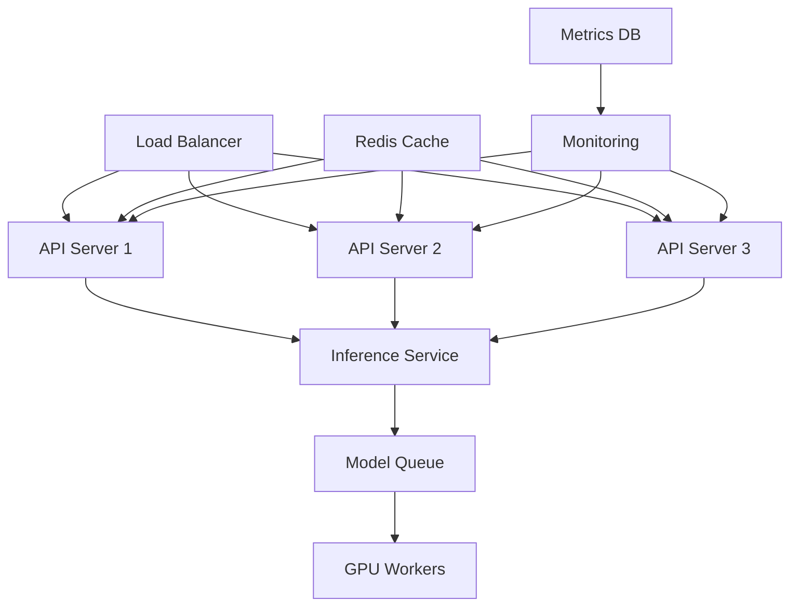

# TUTORIAL-014: Production LLM Systems

## Overview

Deploying LLM applications to production with proper monitoring, scaling, and reliability.

**Duration:** 4 hours
**Difficulty:** Advanced

**Prerequisites:**
- **Required:** TUTORIAL-005 (Production Deployment), TUTORIAL-007 (LoRA Basics), LAB-009 (Production Deployment)
- **Strongly Recommended:** Docker expertise (TUTORIAL-002), Kubernetes basics (1301-K3s-Master-Worker-Arch.md)
- **Helpful:** Monitoring knowledge (1501-Monitoring-and-Observability.md), CI/CD understanding (6502-CI-CD-for-ML.md)
- **Skills Needed:** SSL/TLS setup, nginx configuration, production security basics

**If you're missing prerequisites, complete TUTORIAL-005 and gain Docker expertise first.**

---

## Learning Objectives

After this tutorial, you will:
- :white_check_mark: Deploy LLM APIs with load balancing
- :white_check_mark: Implement monitoring and alerting
- :white_check_mark: Set up CI/CD pipelines for ML models
- :white_check_mark: Handle A/B testing for model updates
- :white_check_mark: Implement rate limiting and caching

---

## Part 1: Production API Architecture

### Architecture Overview



### FastAPI Production Server

```python
# main.py
from fastapi import FastAPI, HTTPException
from fastapi.middleware.cors import CORSMiddleware
from fastapi.middleware.gzip import GZipMiddleware
import torch
import logging

app = FastAPI(
    title="Production LLM API",
    version="1.0.0",
    docs_url="/docs"
)

# Middleware
app.add_middleware(
    CORSMiddleware,
    allow_origins=["https://yourdomain.com"],
    allow_methods=["*"],
    allow_headers=["*"],
)
app.add_middleware(GZipMiddleware, minimum_size=1000)

# Logging
logging.basicConfig(level=logging.INFO)
logger = logging.getLogger(__name__)

# Load model
model = None
tokenizer = None

@app.on_event("startup")
async def startup():
    global model, tokenizer
    logger.info("Loading model...")
    from transformers import AutoModelForCausalLM, AutoTokenizer
    model = AutoModelForCausalLM.from_pretrained("models/mistral-7b")
    tokenizer = AutoTokenizer.from_pretrained("models/mistral-7b")
    logger.info("Model loaded")

@app.get("/health")
async def health():
    return {"status": "healthy", "model": "loaded"}

@app.post("/v1/completions")
async def completions(request: CompletionRequest):
    try:
        # Validate input
        if not request.prompt or len(request.prompt) > 4096:
            raise HTTPException(status_code=400, detail="Invalid prompt")

        # Generate
        inputs = tokenizer(request.prompt, return_tensors="pt")
        with torch.no_grad():
            outputs = model.generate(
                **inputs,
                max_new_tokens=request.max_tokens,
                temperature=request.temperature,
                top_p=request.top_p,
                do_sample=True
            )

        response = tokenizer.decode(outputs[0], skip_special_tokens=True)

        return {
            "text": response,
            "model": "mistral-7b",
            "tokens": len(outputs[0])
        }

    except Exception as e:
        logger.error(f"Error: {e}")
        raise HTTPException(status_code=500, detail=str(e))
```

---

## Part 2: Docker Compose Production Setup

### docker-compose.yml

```yaml
version: '3.8'

services:
  api:
    build: .
    ports:
      - "8000:8000"
    environment:
      - MODEL_PATH=/models
      - REDIS_URL=redis://redis:6379
      - WORKERS=4
    deploy:
      replicas: 3
      resources:
        limits:
          cpus: '2'
          memory: 4G
    volumes:
      - ./models:/models
    depends_on:
      - redis
      - prometheus
    restart: unless-stopped

  nginx:
    image: nginx:alpine
    ports:
      - "80:80"
      - "443:443"
    volumes:
      - ./nginx.conf:/etc/nginx/nginx.conf
      - ./ssl:/etc/nginx/ssl
    depends_on:
      - api
    restart: unless-stopped

  redis:
    image: redis:alpine
    ports:
      - "6379:6379"
    volumes:
      - redis_data:/data
    restart: unless-stopped

  prometheus:
    image: prom/prometheus
    ports:
      - "9090:9090"
    volumes:
      - ./prometheus.yml:/etc/prometheus/prometheus.yml
      - prometheus_data:/prometheus
    restart: unless-stopped

  grafana:
    image: grafana/grafana
    ports:
      - "3000:3000"
    environment:
      - GF_SECURITY_ADMIN_PASSWORD=admin
    volumes:
      - grafana_data:/var/lib/grafana
    restart: unless-stopped

volumes:
  redis_data:
  prometheus_data:
  grafana_data:
```

### nginx.conf

```nginx
upstream api_backend {
    least_conn;
    server api:8000 max_fails=3 fail_timeout=30s;
}

server {
    listen 80;
    server_name api.example.com;
    return 301 https://$server_name$request_uri;
}

server {
    listen 443 ssl http2;
    server_name api.example.com;

    ssl_certificate /etc/nginx/ssl/cert.pem;
    ssl_certificate_key /etc/nginx/ssl/key.pem;

    # Rate limiting
    limit_req_zone $binary_remote_addr zone=api:10m rate=10r/s;
    limit_req zone=api burst=20;

    location /v1/completions {
        proxy_pass http://api_backend;
        proxy_set_header Host $host;
        proxy_set_header X-Real-IP $remote_addr;
        proxy_set_header X-Forwarded-For $proxy_add_x_forwarded_for;
        proxy_connect_timeout 60s;
        proxy_send_timeout 60s;
        proxy_read_timeout 60s;
    }

    location /health {
        proxy_pass http://api_backend;
        access_log off;
    }
}
```

---

## Part 3: Monitoring and Alerting

### Prometheus Metrics

```python
from prometheus_client import Counter, Histogram, Gauge, generate_latest

# Metrics
request_count = Counter(
    'api_requests_total',
    'Total requests',
    ['endpoint', 'status']
)

request_duration = Histogram(
    'api_request_duration_seconds',
    'Request duration',
    ['endpoint']
)

active_requests = Gauge(
    'api_active_requests',
    'Active requests'
)

gpu_memory_used = Gauge(
    'gpu_memory_mb',
    'GPU memory used'
)

@app.middleware("http")
async def metrics_middleware(request, call_next):
    active_requests.inc()
    start = time.time()

    response = await call_next(request)

    duration = time.time() - start
    request_count.labels(
        endpoint=request.url.path,
        status=response.status_code
    ).inc()
    request_duration.labels(
        endpoint=request.url.path
    ).observe(duration)

    active_requests.dec()
    return response

@app.get("/metrics")
async def metrics():
    return Response(
        content=generate_latest(),
        media_type="text/plain"
    )
```

### Alerting Rules

```yaml
# alerting_rules.yml
groups:
  - name: api_alerts
    interval: 30s
    rules:
      - alert: HighErrorRate
        expr: rate(api_requests_total{status="5xx"}[5m]) > 0.05
        for: 5m
        labels:
          severity: critical
        annotations:
          summary: "High error rate detected"

      - alert: HighLatency
        expr: histogram_quantile(0.95, api_request_duration_seconds) > 5
        for: 10m
        labels:
          severity: warning
        annotations:
          summary: "95th percentile latency too high"

      - alert: LowGPUUtilization
        expr: gpu_utilization < 0.3
        for: 15m
        labels:
          severity: info
        annotations:
          summary: "GPU underutilized"
```

---

## Part 4: CI/CD Pipeline

### GitHub Actions Workflow

```yaml
# .github/workflows/deploy.yml
name: Deploy LLM API

on:
  push:
    branches: [main]

jobs:
  test:
    runs-on: ubuntu-latest
    steps:
      - uses: actions/checkout@v3

      - name: Set up Python
        uses: actions/setup-python@v4
        with:
          python-version: '3.10'

      - name: Install dependencies
        run: |
          pip install -r requirements.txt
          pip install pytest pytest-cov

      - name: Run tests
        run: pytest --cov=app tests/

      - name: Upload coverage
        uses: codecov/codecov-action@v3

  build:
    needs: test
    runs-on: ubuntu-latest
    steps:
      - uses: actions/checkout@v3

      - name: Build Docker image
        run: |
          docker build -t llm-api:${{ github.sha }} .
          docker tag llm-api:${{ github.sha }} llm-api:latest

      - name: Push to registry
        run: |
          echo ${{ secrets.DOCKER_PASSWORD }} | docker login -u ${{ secrets.DOCKER_USERNAME }} --password-stdin
          docker push llm-api:${{ github.sha }}
          docker push llm-api:latest

  deploy:
    needs: build
    runs-on: ubuntu-latest
    steps:
      - name: Deploy to production
        run: |
          kubectl set image deployment/llm-api \
            api=llm-api:${{ github.sha }} \
            --namespace=production

      - name: Verify deployment
        run: |
          kubectl rollout status deployment/llm-api --namespace=production

      - name: Run smoke tests
        run: |
          curl -f https://api.example.com/health || exit 1
```

---

## Part 5: A/B Testing Model Updates

### A/B Testing Framework

```python
class ABTestRouter:
    def __init__(self, model_a_path, model_b_path, traffic_split=0.5):
        self.model_a = self.load_model(model_a_path)
        self.model_b = self.load_model(model_b_path)
        self.traffic_split = traffic_split

        # Metrics
        self.metrics = {
            'model_a': {'requests': 0, 'errors': 0, 'latency': []},
            'model_b': {'requests': 0, 'errors': 0, 'latency': []}
        }

    def route_request(self, prompt: str, user_id: str):
        # Consistent hashing for user
        import hashlib
        hash_val = int(hashlib.md5(user_id.encode()).hexdigest(), 16)
        use_model_a = (hash_val % 100) < (self.traffic_split * 100)

        model = self.model_a if use_model_a else self.model_b
        model_name = 'model_a' if use_model_a else 'model_b'

        start = time.time()
        try:
            response = self.generate(model, prompt)
            latency = time.time() - start

            self.metrics[model_name]['requests'] += 1
            self.metrics[model_name]['latency'].append(latency)

            return {
                'text': response,
                'model': model_name,
                'ab_test': True
            }
        except Exception as e:
            self.metrics[model_name]['errors'] += 1
            raise

    def get_metrics(self):
        return {
            'model_a': {
                'requests': self.metrics['model_a']['requests'],
                'error_rate': self.metrics['model_a']['errors'] / max(self.metrics['model_a']['requests'], 1),
                'avg_latency': np.mean(self.metrics['model_a']['latency']) if self.metrics['model_a']['latency'] else 0
            },
            'model_b': {
                'requests': self.metrics['model_b']['requests'],
                'error_rate': self.metrics['model_b']['errors'] / max(self.metrics['model_b']['requests'], 1),
                'avg_latency': np.mean(self.metrics['model_b']['latency']) if self.metrics['model_b']['latency'] else 0
            }
        }
```

---

## Part 6: Caching Strategy

### Redis Cache Implementation

```python
import redis
import hashlib
import json

class CacheManager:
    def __init__(self, redis_url='redis://localhost:6379'):
        self.redis = redis.from_url(redis_url)
        self.default_ttl = 3600  # 1 hour

    def cache_key(self, prompt: str, params: dict) -> str:
        """Generate cache key from prompt and params."""
        key_data = f"{prompt}:{json.dumps(params, sort_keys=True)}"
        return f"llm:{hashlib.md5(key_data.encode()).hexdigest()}"

    def get(self, prompt: str, params: dict) -> str:
        """Get cached response if available."""
        key = self.cache_key(prompt, params)
        cached = self.redis.get(key)
        if cached:
            return json.loads(cached)
        return None

    def set(self, prompt: str, params: dict, response: str, ttl=None):
        """Cache response."""
        key = self.cache_key(prompt, params)
        ttl = ttl or self.default_ttl
        self.redis.setex(key, ttl, json.dumps(response))

    def invalidate_pattern(self, pattern: str):
        """Invalidate cache entries matching pattern."""
        for key in self.redis.scan_iter(match=f"llm:*{pattern}*"):
            self.redis.delete(key)
```

---

## Exercises

### Exercise 1: Deployment

Deploy the API to production:
- [ ] Set up Docker Compose environment
- [ ] Configure SSL with Let's Encrypt
- [ ] Set up Nginx load balancer
- [ ] Verify health endpoint

### Exercise 2: Monitoring

Set up monitoring:
- [ ] Configure Prometheus metrics
- [ ] Create Grafana dashboard
- [ ] Set up alerting rules
- [ ] Test alert triggers

### Exercise 3: CI/CD

Create deployment pipeline:
- [ ] Set up GitHub Actions workflow
- [ ] Configure automated testing
- [ ] Set up Docker registry
- [ ] Configure Kubernetes deployment

---

## Completion Checklist

- [x] Part 1: Production API Architecture
- [x] Part 2: Docker Compose Setup
- [x] Part 3: Monitoring and Alerting
- [x] Part 4: CI/CD Pipeline
- [x] Part 5: A/B Testing
- [x] Part 6: Caching Strategy

---

## Next Steps

After completing this tutorial:

1. **Deploy Your API:** Use LAB-009 for hands-on practice
2. **Monitor Performance:** Set up dashboards and alerts
3. **Scale Up:** Add more GPU workers as needed
4. **Optimize:** Implement caching and batching

**Related:** [LAB-009: Production Deployment](../labs/LAB-009-Production-Deployment.md)

---

**Last Updated:** 2026-02-05
**Difficulty:** :star::star::star::star::star:
**Estimated Time:** 4 hours
