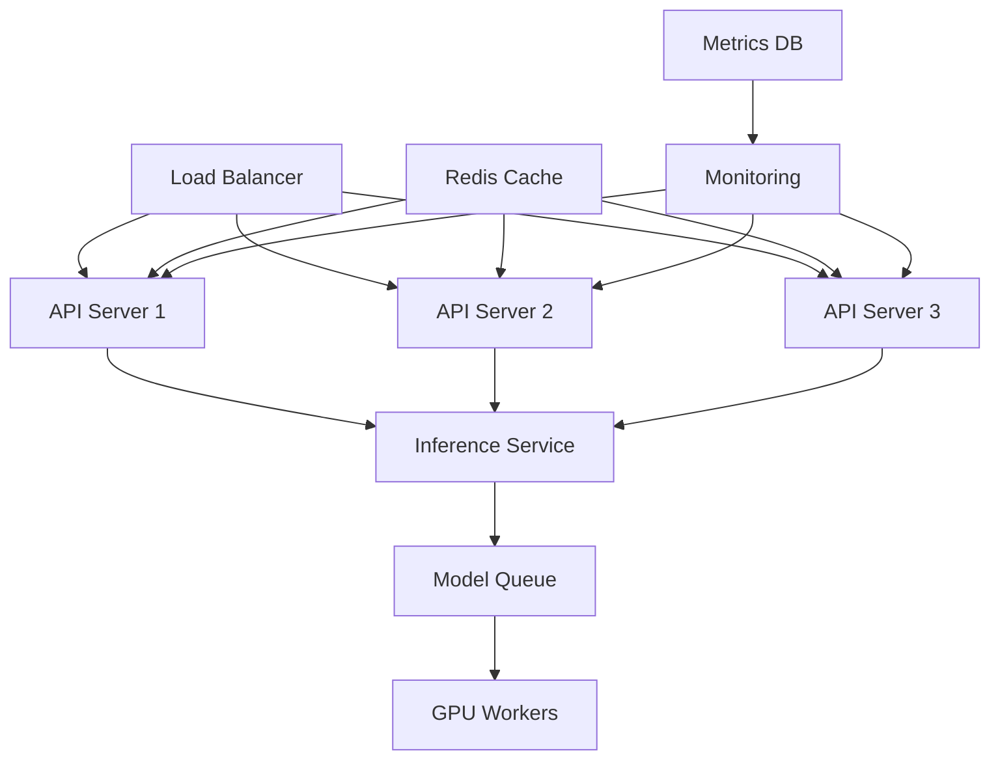

# TUTORIAL-014: Production LLM Systems

## Table of Contents

- [Learning Objectives](#learning-objectives)
- [Abstract](#abstract)
- [Part 1: Production API Architecture](#part-1-production-api-architecture)
- [Part 2: Docker Compose Production Setup](#part-2-docker-compose-production-setup)
- [Part 3: Monitoring and Alerting](#part-3-monitoring-and-alerting)
- [Part 4: CI/CD Pipeline](#part-4-cicd-pipeline)
- [Part 5: A/B Testing Model Updates](#part-5-ab-testing-model-updates)
- [Part 6: Caching Strategy](#part-6-caching-strategy)
- [Exercises](#exercises)
- [Completion Checklist](#completion-checklist)
- [References](#references)

---

## Learning Objectives

After completing this tutorial, you will be able to:

- Serve a model through FastAPI with a lifespan handler for weight loading, pydantic-validated requests, and an endpoint that never blocks the event loop
- Assemble the docker compose production stack — nginx with TLS and rate limiting in front, Redis, Prometheus, and Grafana behind — and know which compose keys docker silently ignores
- Export Prometheus metrics and write alert rules that actually fire: numeric status labels, `histogram_quantile` over `rate()` of `_bucket` series, GPU metrics from dcgm-exporter rather than a gauge nothing sets
- Ship through GitHub Actions: test, build, push, `kubectl rollout` with verification and a rollback path
- Add the two features every LLM service grows immediately: consistent-hashing A/B routing and content-addressed response caching

---

## Abstract

Serving an LLM is easy; keeping it serving under real traffic is the actual job. This tutorial walks a model endpoint from a single script to a production topology: FastAPI behind nginx with TLS and rate limiting, a docker compose stack wiring in Redis, Prometheus, and Grafana, alert rules that fire when something is actually wrong, a CI/CD pipeline that tests, builds, ships, and verifies each deployment, and the two product features every LLM service grows immediately — A/B testing for safe model rollouts and response caching. Along the way it fixes the classic mistakes each layer invites: blocking calls inside async handlers, config files the orchestrator silently ignores, and PromQL selectors that can never match. Deployment basics are assumed from [TUTORIAL-005: Production Deployment](./TUTORIAL-005-Production-Deployment.md); the guided hands-on version of this stack is [LAB-009: Production Deployment](../labs/LAB-009-Production-Deployment.md).

**Prerequisites:**

- **Required:** [TUTORIAL-005: Production Deployment](./TUTORIAL-005-Production-Deployment.md), [LAB-009: Production Deployment](../labs/LAB-009-Production-Deployment.md)
- **Strongly Recommended:** Docker fluency ([TUTORIAL-002: Docker Essentials](./TUTORIAL-002-Docker-Essentials.md)), Kubernetes basics ([1301: K3s Master-Worker Architecture](../../phases/phase1-infra/1300-kubernetes/1301-K3s-Master-Worker-Arch.md))
- **Helpful:** Monitoring theory ([1501: Monitoring and Observability](../../phases/phase1-infra/1500-monitoring/1501-Monitoring-and-Observability.md)), CI/CD concepts ([6502: CI/CD for ML](../../phases/phase6-rag/6500-mlops-pipelines/6502-CI-CD-for-ML.md))

**If you're missing prerequisites, complete TUTORIAL-005 and gain Docker expertise first.**

---

## Part 1: Production API Architecture

### Architecture Overview



### FastAPI Production Server

```python
# main.py
import logging
import os
from contextlib import asynccontextmanager

import torch
from fastapi import FastAPI, HTTPException
from fastapi.middleware.cors import CORSMiddleware
from fastapi.middleware.gzip import GZipMiddleware
from pydantic import BaseModel, Field

logging.basicConfig(level=logging.INFO)
logger = logging.getLogger(__name__)

MODEL_PATH = os.getenv("MODEL_PATH", "mistralai/Mistral-7B-Instruct-v0.2")

state = {}  # model/tokenizer live here instead of bare globals


@asynccontextmanager
async def lifespan(app: FastAPI):
    # startup: load weights ONCE, before the app accepts traffic
    from transformers import AutoModelForCausalLM, AutoTokenizer

    logger.info("Loading model from %s ...", MODEL_PATH)
    state["tokenizer"] = AutoTokenizer.from_pretrained(MODEL_PATH)
    state["model"] = AutoModelForCausalLM.from_pretrained(
        MODEL_PATH,
        torch_dtype=torch.bfloat16,
        device_map="auto",
    )
    logger.info("Model loaded")
    yield
    # shutdown: free GPU memory before the process exits
    state.clear()
    if torch.cuda.is_available():
        torch.cuda.empty_cache()


app = FastAPI(
    title="Production LLM API",
    version="1.0.0",
    docs_url="/docs",
    lifespan=lifespan,
)

# Middleware
app.add_middleware(
    CORSMiddleware,
    allow_origins=["https://yourdomain.com"],
    allow_methods=["*"],
    allow_headers=["*"],
)
app.add_middleware(GZipMiddleware, minimum_size=1000)


class CompletionRequest(BaseModel):
    # declarative validation: malformed requests get a 422
    # before any GPU time is spent on them
    prompt: str = Field(..., min_length=1, max_length=4096)
    max_tokens: int = Field(default=256, ge=1, le=2048)
    temperature: float = Field(default=0.7, gt=0.0, le=2.0)
    top_p: float = Field(default=0.9, gt=0.0, le=1.0)


@app.get("/health")
def health():
    if "model" not in state:
        # 503 while loading, so nginx/k8s probes can tell
        # "starting" apart from "broken"
        raise HTTPException(status_code=503, detail="model still loading")
    return {"status": "healthy", "model": MODEL_PATH}


@app.post("/v1/completions")
def completions(request: CompletionRequest):
    # def, NOT async def: generate() blocks for seconds. In an
    # async def endpoint it would run ON the event loop and stall
    # EVERY request; FastAPI runs sync endpoints in a threadpool.
    tokenizer, model = state["tokenizer"], state["model"]
    try:
        inputs = tokenizer(request.prompt, return_tensors="pt").to(model.device)
        with torch.no_grad():
            outputs = model.generate(
                **inputs,
                max_new_tokens=request.max_tokens,
                temperature=request.temperature,
                top_p=request.top_p,
                do_sample=True,  # required for temperature/top_p
            )
    except Exception:
        logger.exception("generation failed")
        # generic detail to the client - str(e) leaks internals
        raise HTTPException(status_code=500, detail="generation error")

    generated = outputs[0][inputs["input_ids"].shape[1]:]
    text = tokenizer.decode(generated, skip_special_tokens=True)
    return {
        "text": text,
        "model": MODEL_PATH,
        "generated_tokens": int(generated.shape[0]),
    }
```

```text
What changed from the naive version, and why
- @app.on_event("startup") -> lifespan: on_event is deprecated;
  lifespan is one async context manager covering startup AND
  shutdown.
- CompletionRequest is now DEFINED. The original referenced a
  type that never existed - a NameError on the first request.
  pydantic Field constraints replace the manual length check.
- /health returns 503 until weights are loaded, so upstream
  probes distinguish "starting" from "broken" instead of
  declaring an empty-process app healthy.
- token count reports GENERATED tokens; len(outputs[0]) counted
  prompt + completion together.
- the error path logs the traceback but returns a generic
  detail - putting str(e) in the response hands stack traces
  and file paths to clients.
```

One honest caveat about this shape: it is a fine reference service, but a single uvicorn process holding a 7B model in bf16 is not how mature systems serve traffic. Part 4's deployment targets a dedicated inference server ([1405: TGI Deployment Guide](../../phases/phase1-infra/1400-llmops/guides/1405-TGI-Deployment-Guide.md) covers the heavy-serving side); what this tutorial adds around any server — load balancing, metrics, alerts, CI/CD, A/B routing, caching — is the part you own either way.

---

## Part 2: Docker Compose Production Setup

### docker-compose.yml

```yaml
services:
  api:
    build: .
    environment:
      - MODEL_PATH=/models
      - REDIS_URL=redis://redis:6379
    deploy:
      resources:
        limits:
          cpus: '2'
          memory: 4G
    volumes:
      - ./models:/models
    depends_on:
      - redis
    restart: unless-stopped
    # no "ports:" on purpose - nginx is the only public entry
    # point. Add "8000:8000" temporarily if you need to hit the
    # API directly while debugging.

  nginx:
    image: nginx:alpine
    ports:
      - "80:80"
      - "443:443"
    volumes:
      - ./nginx.conf:/etc/nginx/nginx.conf
      - ./ssl:/etc/nginx/ssl
    depends_on:
      - api
    restart: unless-stopped

  redis:
    image: redis:alpine
    ports:
      - "6379:6379"
    volumes:
      - redis_data:/data
    restart: unless-stopped

  prometheus:
    image: prom/prometheus
    ports:
      - "9090:9090"
    volumes:
      - ./prometheus.yml:/etc/prometheus/prometheus.yml
      - ./alerting_rules.yml:/etc/prometheus/alerting_rules.yml
      - prometheus_data:/prometheus
    restart: unless-stopped

  grafana:
    image: grafana/grafana
    ports:
      - "3000:3000"
    environment:
      - GF_SECURITY_ADMIN_PASSWORD=admin
    volumes:
      - grafana_data:/var/lib/grafana
    restart: unless-stopped

volumes:
  redis_data:
  prometheus_data:
  grafana_data:
```

```text
Three changes from the naive compose file, all real gaps
- deploy.replicas deleted: docker compose SILENTLY IGNORES the
  deploy key's replication settings (that is Swarm-mode config).
  Nothing was scaling - one container ran, and the architecture
  diagram's three API servers were fiction. To actually scale:
  `docker compose up --scale api=3` (and drop fixed host ports -
  replicas cannot all bind 8000), or do it properly on
  Kubernetes, which is exactly what Part 4 does.
- version: '3.8' deleted: obsolete in the Compose Spec; the CLI
  warns on every up.
- prometheus now mounts alerting_rules.yml - Part 3 defines
  rules; without the mount they would never load.

What docker compose DOES honor in deploy: resources.limits
(cpus/memory) - the limits above are real, the replicas were
not.

Also: the api Dockerfile CMD is
    uvicorn main:app --host 0.0.0.0 --port 8000
and each api container loads its OWN copy of the model - every
replica multiplies VRAM. One more reason Part 4 moves serving
to Kubernetes with a shared inference server.
```

### nginx.conf

The compose file mounts this at `/etc/nginx/nginx.conf` — the **main** config, not an include. So it must be a complete config, `events{}` and `http{}` wrappers included, or nginx refuses to start:

```nginx
events {
    worker_connections 1024;
}

http {
    upstream api_backend {
        least_conn;
        server api:8000 max_fails=3 fail_timeout=30s;
    }

    # limit_req_zone is only valid in http context - placing it
    # inside a server block is a config error (`nginx -t` fails)
    limit_req_zone $binary_remote_addr zone=api:10m rate=10r/s;

    server {
        listen 80;
        server_name api.example.com;
        return 301 https://$server_name$request_uri;
    }

    server {
        listen 443 ssl;
        http2 on;  # nginx >= 1.25 syntax; replaces "listen ... http2"
        server_name api.example.com;

        ssl_certificate     /etc/nginx/ssl/cert.pem;
        ssl_certificate_key /etc/nginx/ssl/key.pem;

        limit_req zone=api burst=20;

        location /v1/ {
            proxy_pass http://api_backend;
            proxy_set_header Host $host;
            proxy_set_header X-Real-IP $remote_addr;
            proxy_set_header X-Forwarded-For $proxy_add_x_forwarded_for;
            proxy_connect_timeout 60s;
            proxy_send_timeout 60s;
            proxy_read_timeout 60s;
        }

        location /health {
            proxy_pass http://api_backend;
            access_log off;
        }

        # /metrics is deliberately NOT proxied: Prometheus
        # scrapes api:8000 inside the docker network, so the
        # raw metrics never leave it. Do not publish them.
    }
}
```

```text
Why the wrapper matters: docker compose maps
  ./nginx.conf -> /etc/nginx/nginx.conf
which replaces the MAIN config wholesale. A file containing
only upstream/server blocks is a fragment - `nginx -t` fails
with "events" or "http" directive errors and the container
crash-loops. Same class of bug: limit_req_zone declared inside
server{} reads like it scopes the limit to that server, but it
is simply invalid there.

The 10r/s rate limit is per client IP ($binary_remote_addr);
burst=20 absorbs short spikes. Generation requests are slow,
so also note the 60s proxy timeouts - a burst of queued
generations will hit them, which is correct: fail fast rather
than pile up.
```

---

## Part 3: Monitoring and Alerting

### Prometheus Metrics

```python
# main.py, continued
import time

from fastapi import Response
from prometheus_client import (CONTENT_TYPE_LATEST, Counter,
                               Gauge, Histogram, generate_latest)

request_count = Counter(
    "api_requests_total",
    "Total requests",
    ["endpoint", "status"],
)

request_duration = Histogram(
    "api_request_duration_seconds",
    "Request duration",
    ["endpoint"],
)

active_requests = Gauge(
    "api_active_requests",
    "Active requests",
)

gpu_memory_used = Gauge(
    "gpu_memory_mb",
    "GPU memory used",
)


@app.middleware("http")
async def metrics_middleware(request, call_next):
    active_requests.inc()
    start = time.perf_counter()
    try:
        response = await call_next(request)
    except Exception:
        # without this branch, exceptions never reach
        # api_requests_total - the HighErrorRate alert below
        # would silently never fire, because unhandled errors
        # bypass this middleware entirely on their way out
        request_count.labels(endpoint=request.url.path, status="500").inc()
        raise
    finally:
        active_requests.dec()  # even a raising endpoint must not leak the gauge
    request_count.labels(
        endpoint=request.url.path,
        status=response.status_code,
    ).inc()
    request_duration.labels(
        endpoint=request.url.path,
    ).observe(time.perf_counter() - start)
    return response


@app.get("/metrics")
def metrics():
    # keep the GPU gauge honest: set it right before export
    if torch.cuda.is_available():
        gpu_memory_used.set(torch.cuda.memory_allocated() / 1e6)
    return Response(
        content=generate_latest(),
        media_type=CONTENT_TYPE_LATEST,
    )
```

The `status` label carries the **numeric code** (`"200"`, `"500"`) — this matters twice: once for the middleware above, and again in the alert rules below, where the naive version selects on a value that never exists.

### Wiring Prometheus

The compose stack mounts two config files; both must exist and agree:

```yaml
# prometheus.yml
global:
  scrape_interval: 15s

rule_files:
  - /etc/prometheus/alerting_rules.yml

scrape_configs:
  - job_name: llm-api
    static_configs:
      - targets: ['api:8000']   # service DNS inside the compose network
```

### Alerting Rules

```yaml
# alerting_rules.yml
groups:
  - name: api_alerts
    interval: 30s
    rules:
      - alert: HighErrorRate
        # error RATE = fraction of traffic, so compare 5xx
        # throughput against total throughput
        expr: |
          sum(rate(api_requests_total{status=~"5.."}[5m]))
            /
          sum(rate(api_requests_total[5m])) > 0.05
        for: 5m
        labels:
          severity: critical
        annotations:
          summary: "High error rate detected"

      - alert: HighLatency
        # histogram_quantile needs rate() over the _bucket
        # series - the raw histogram holds cumulative counts,
        # not a latency distribution
        expr: |
          histogram_quantile(0.95,
            sum by (le) (rate(api_request_duration_seconds_bucket[5m]))
          ) > 5
        for: 10m
        labels:
          severity: warning
        annotations:
          summary: "95th percentile latency too high"

      - alert: LowGPUUtilization
        # GPU utilization (percent) comes from dcgm-exporter,
        # NOT from this app - the app's own metrics have no
        # such gauge, so this alert is only meaningful once
        # dcgm-exporter is scraped too
        expr: DCGM_FI_DEV_GPU_UTIL < 30
        for: 15m
        labels:
          severity: info
        annotations:
          summary: "GPU underutilized"
```

```text
Three silent bugs in the naive rules
- status="5xx" could never match: the label value is the
  numeric code ("200", "500"). PromQL label matching is exact
  string equality - use a regex, status=~"5..".
- histogram_quantile over the raw histogram compares
  cumulative bucket counts, not a quantile of latencies. The
  canonical form is histogram_quantile(q, rate(..._bucket[t])).
- gpu_utilization did not exist anywhere: the app never
  exported it (and its one GPU gauge measures memory, not
  utilization). GPU metrics belong to dcgm-exporter, whose
  metric is DCGM_FI_DEV_GPU_UTIL on a 0-100 percent scale -
  hence < 30, not < 0.3.
```

---

## Part 4: CI/CD Pipeline

### GitHub Actions Workflow

```yaml
# .github/workflows/deploy.yml
name: Deploy LLM API

on:
  push:
    branches: [main]

permissions:
  contents: read

jobs:
  test:
    runs-on: ubuntu-latest
    steps:
      - uses: actions/checkout@v4

      - uses: actions/setup-python@v5
        with:
          python-version: '3.11'

      - name: Install dependencies
        run: |
          pip install uv
          uv pip install --system -r requirements.txt
          uv pip install --system pytest pytest-cov

      - name: Run tests
        run: pytest --cov=app tests/

  build:
    needs: test
    runs-on: ubuntu-latest
    steps:
      - uses: actions/checkout@v4

      - name: Build Docker image
        run: |
          docker build -t llm-api:${{ github.sha }} .
          docker tag llm-api:${{ github.sha }} llm-api:latest

      - name: Push to registry
        run: |
          echo "${{ secrets.DOCKER_PASSWORD }}" | \
            docker login -u "${{ secrets.DOCKER_USERNAME }}" --password-stdin
          docker push llm-api:${{ github.sha }}
          docker push llm-api:latest

  deploy:
    needs: build
    runs-on: ubuntu-latest
    environment: production   # optional approval gate via GitHub Environments
    steps:
      - name: Deploy to production
        run: |
          kubectl set image deployment/llm-api \
            api=llm-api:${{ github.sha }} \
            --namespace=production

      - name: Verify rollout
        run: |
          kubectl rollout status deployment/llm-api \
            --namespace=production --timeout=120s

      - name: Run smoke tests
        run: curl -f https://api.example.com/health
```

```text
Upgrade notes over the naive workflow
- checkout@v4 / setup-python@v5: the older majors run on a
  deprecated Node runtime and warn on every job.
- permissions: contents: read - jobs get only what they need;
  write tokens are the default you want to turn OFF.
- environment: production turns the deploy job into an approval
  gate when the repo configures a protected environment - for a
  model rollout, that review slot is where you eyeball eval
  numbers before they reach users.
- rollout status --timeout: fail the pipeline instead of
  hanging forever on a stuck rollout; the manual rollback is
  `kubectl rollout undo deployment/llm-api -n production`.
- the deploy job needs cluster credentials (kubeconfig via repo
  secrets) - noted here, configured per-cluster.
```

---

## Part 5: A/B Testing Model Updates

```python
import hashlib
import time

import numpy as np
import torch


class ABTestRouter:
    """Route users to model A or B with a consistent split, and
    track per-arm error rate and latency."""

    def __init__(self, model_a_path, model_b_path, traffic_split=0.5):
        self.model_a = self.load_model(model_a_path)
        self.model_b = self.load_model(model_b_path)
        self.traffic_split = traffic_split

        self.metrics = {
            "model_a": {"requests": 0, "errors": 0, "latency": []},
            "model_b": {"requests": 0, "errors": 0, "latency": []},
        }

    @staticmethod
    def load_model(path):
        from transformers import AutoModelForCausalLM

        return AutoModelForCausalLM.from_pretrained(
            path, torch_dtype=torch.bfloat16, device_map="auto"
        )

    def route_request(self, prompt: str, user_id: str):
        # md5 here is BUCKETING, not security: it exists to map
        # the same user to the same arm on every request
        hash_val = int(hashlib.md5(user_id.encode()).hexdigest(), 16)
        use_model_a = (hash_val % 100) < (self.traffic_split * 100)

        model = self.model_a if use_model_a else self.model_b
        model_name = "model_a" if use_model_a else "model_b"

        start = time.perf_counter()
        try:
            response = self.generate(model, prompt)
            latency = time.perf_counter() - start

            self.metrics[model_name]["requests"] += 1
            self.metrics[model_name]["latency"].append(latency)

            return {"text": response, "model": model_name, "ab_test": True}
        except Exception:
            self.metrics[model_name]["errors"] += 1
            raise

    @staticmethod
    def generate(model, prompt: str) -> str:
        from transformers import AutoTokenizer

        tokenizer = AutoTokenizer.from_pretrained(model.config._name_or_path)
        inputs = tokenizer(prompt, return_tensors="pt").to(model.device)
        out = model.generate(**inputs, max_new_tokens=256, do_sample=True)
        return tokenizer.decode(out[0][inputs["input_ids"].shape[1]:],
                                skip_special_tokens=True)

    def get_metrics(self):
        def arm_stats(name):
            m = self.metrics[name]
            n = max(m["requests"], 1)
            return {
                "requests": m["requests"],
                "error_rate": m["errors"] / n,
                "avg_latency": float(np.mean(m["latency"])) if m["latency"] else 0.0,
            }

        return {"model_a": arm_stats("model_a"), "model_b": arm_stats("model_b")}
```

```text
What makes this a real A/B test, not a coin flip per request
- consistent hashing: md5(user_id) % 100 assigns a user to an
  arm ONCE - the same user gets the same model on every
  request. Randomizing per request would compare noise, since
  a single user's experience would mix arms.
- the split is a knob: traffic_split=0.05 for a canary, 0.5
  for a head-to-head.
- get_metrics() is the decision surface: declare a winner on
  error_rate and latency (and, in a real system, offline eval
  or online quality signals - never latency alone).
- this in-process router is the teaching version; at scale the
  same consistent-hash split lives in the gateway/nginx layer
  or a feature-flag service, pointing at separately deployed
  model servers.
```

---

## Part 6: Caching Strategy

```python
import hashlib
import json

import redis


class CacheManager:
    """Cache LLM responses by (prompt, params) - content-addressed."""

    def __init__(self, redis_url="redis://localhost:6379"):
        self.redis = redis.from_url(redis_url)
        self.default_ttl = 3600  # 1 hour

    def cache_key(self, prompt: str, params: dict) -> str:
        """Hash the prompt AND sampling params together."""
        key_data = f"{prompt}:{json.dumps(params, sort_keys=True)}"
        return f"llm:{hashlib.md5(key_data.encode()).hexdigest()}"

    def get(self, prompt: str, params: dict):
        key = self.cache_key(prompt, params)
        cached = self.redis.get(key)
        if cached:
            return json.loads(cached)
        return None

    def set(self, prompt: str, params: dict, response: str, ttl=None):
        key = self.cache_key(prompt, params)
        ttl = ttl or self.default_ttl
        self.redis.setex(key, ttl, json.dumps(response))

    def invalidate_pattern(self, pattern: str):
        """Delete entries matching a pattern (maintenance use)."""
        for key in self.redis.scan_iter(match=f"llm:*{pattern}*"):
            self.redis.delete(key)
```

```text
Two design notes
- params belong in the key: temperature=0.7 and temperature=1.0
  produce different text for the same prompt. json.dumps with
  sort_keys=True makes the dict serialize deterministically, so
  {"a": 1, "b": 2} and {"b": 2, "a": 1} hash identically.
- scan_iter walks the whole keyspace in the worst case - fine
  for maintenance scripts, wrong for a request path. The
  content-addressed design mostly avoids needing invalidation
  at all: when you ship a new model, bump a key prefix
  (llm:v2:...) and old entries simply expire via TTL.
```

---

## Exercises

### Exercise 1: Deployment

Deploy the stack end to end:

- [ ] Start the compose environment and confirm `nginx -t` passes inside the container
- [ ] Configure SSL (Let's Encrypt / certbot or self-signed for the lab)
- [ ] Verify `/health` returns 503 during model load and 200 after
- [ ] Confirm the rate limit: 21 rapid requests → the 21st gets a 503/429 from nginx

### Exercise 2: Monitoring

Wire observability and prove the alerts fire:

- [ ] Reach `http://localhost:9090/targets` and confirm the `llm-api` scrape is UP
- [ ] Create a Grafana dashboard from `api_requests_total` and `api_request_duration_seconds`
- [ ] Force `HighErrorRate`: point a load generator at a route that 500s, watch the alert go pending → firing
- [ ] Explain (then observe) why removing the `except` branch in the metrics middleware stops 500s from being counted at all

### Exercise 3: CI/CD

Create the deployment pipeline:

- [ ] Set up the GitHub Actions workflow and protect `main`
- [ ] Configure registry credentials and cluster access via repo secrets
- [ ] Add a protected `production` environment as an approval gate
- [ ] Break the health endpoint deliberately, watch `rollout status` fail the pipeline, then roll back with `kubectl rollout undo`

---

## Completion Checklist

- [x] Part 1: Production API Architecture
- [x] Part 2: Docker Compose Setup
- [x] Part 3: Monitoring and Alerting
- [x] Part 4: CI/CD Pipeline
- [x] Part 5: A/B Testing
- [x] Part 6: Caching Strategy

---

## References

### Related PROJECT-OMEGA Documents

- [TUTORIAL-005: Production Deployment](./TUTORIAL-005-Production-Deployment.md)
- [TUTORIAL-002: Docker Essentials](./TUTORIAL-002-Docker-Essentials.md)
- [LAB-009: Production Deployment](../labs/LAB-009-Production-Deployment.md)
- [1301: K3s Master-Worker Architecture](../../phases/phase1-infra/1300-kubernetes/1301-K3s-Master-Worker-Arch.md)
- [1405: TGI Deployment Guide](../../phases/phase1-infra/1400-llmops/guides/1405-TGI-Deployment-Guide.md)
- [1501: Monitoring and Observability](../../phases/phase1-infra/1500-monitoring/1501-Monitoring-and-Observability.md)
- [6502: CI/CD for ML](../../phases/phase6-rag/6500-mlops-pipelines/6502-CI-CD-for-ML.md)

### External

- [FastAPI: Lifespan Events](https://fastapi.tiangolo.com/advanced/events/)
- [nginx: ngx_http_limit_req_module](https://nginx.org/en/docs/http/ngx_http_limit_req_module.html)
- [Prometheus: histogram_quantile](https://prometheus.io/docs/prometheus/latest/querying/functions/#histogram_quantile)
- [Compose Spec: deploy](https://docs.docker.com/reference/compose-file/deploy/)
- [dcgm-exporter](https://github.com/NVIDIA/dcgm-exporter)

---

## Next Steps

- Hands-on deployment of this stack: **[LAB-009: Production Deployment](../labs/LAB-009-Production-Deployment.md)**
- Monitoring deep dive: **[1501: Monitoring and Observability](../../phases/phase1-infra/1500-monitoring/1501-Monitoring-and-Observability.md)**
- Scale beyond one host: **[1301: K3s Master-Worker Architecture](../../phases/phase1-infra/1300-kubernetes/1301-K3s-Master-Worker-Arch.md)**
- Dedicated inference serving: **[1405: TGI Deployment Guide](../../phases/phase1-infra/1400-llmops/guides/1405-TGI-Deployment-Guide.md)**
- Pipeline automation theory: **[6502: CI/CD for ML](../../phases/phase6-rag/6500-mlops-pipelines/6502-CI-CD-for-ML.md)**
