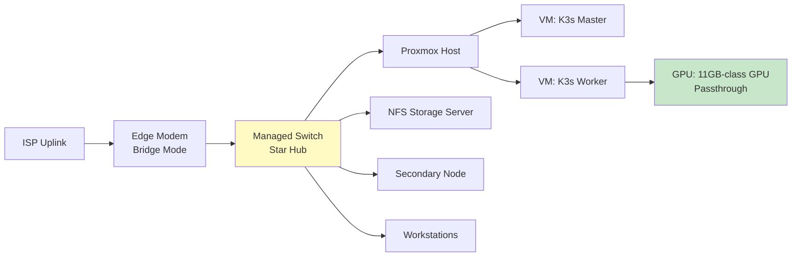
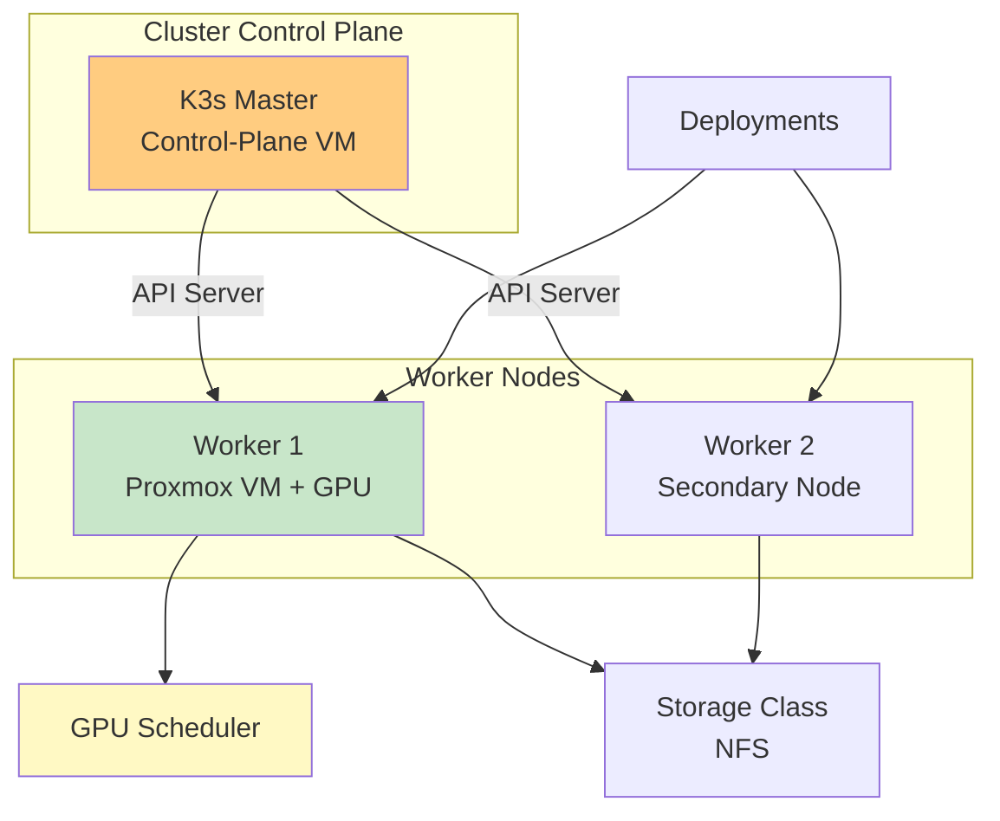
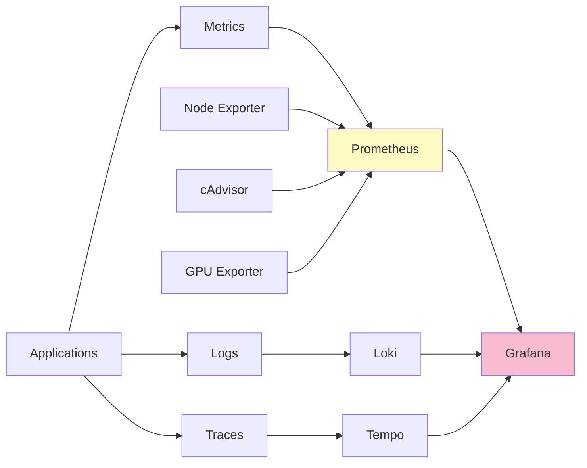
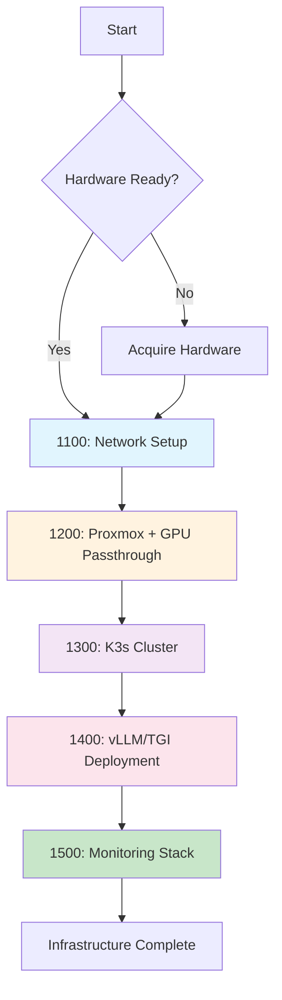

# Phase 1: Infrastructure Fabric [1000]

## Table of Contents

- [Overview](#overview)
- [Why Infrastructure Matters](#why-infrastructure-matters)
- [Network Architecture](#network-architecture)
- [Virtualization Stack](#virtualization-stack)
- [Kubernetes Cluster](#kubernetes-cluster)
- [LLMOps Infrastructure](#llmops-infrastructure)
- [Monitoring Stack](#monitoring-stack)
- [Hardware Requirements](#hardware-requirements)
- [Module Structure](#module-structure)
- [Learning Path](#learning-path)
- [Key Takeaways](#key-takeaways)
- [Common Pitfalls](#common-pitfalls)
- [Pro Tips](#pro-tips)
- [Performance Benchmarks](#performance-benchmarks)
- [Related Experiments](#related-experiments)
- [Assessment](#assessment)
- [Related Topics](#related-topics)

---

## Overview

**Converting hardware into a programmable, scalable, high-throughput AI factory.**

This phase covers the foundational infrastructure needed to run enterprise-grade AI systems on commodity hardware - a dedicated desktop, a mini PC, a repurposed server, or a cloud VM - enabling you to:
- Build a high-throughput star topology network
- Configure GPU passthrough for VM access
- Deploy multi-node K3s Kubernetes cluster
- Run vLLM/TGI for high-throughput inference
- Set up comprehensive monitoring with Prometheus

---

## Why Infrastructure Matters

### The Foundation Problem

```text
┌─────────────────────────────────────────────────────────┐
│               Poor Infrastructure                       │
├─────────────────────────────────────────────────────────┤
│ - Network bottlenecks (1Gbps limits throughput)         │
│ - GPU trapped in host OS (can't be used by VMs)         │
│ - Manual deployments (no orchestration)                 │
│ - No monitoring (blind to failures)                     │
│ - Single points of failure                              │
└─────────────────────────────────────────────────────────┘

With Proper Infrastructure:
┌─────────────────────────────────────────────────────────┐
│               Well-Designed Lab                         │
├─────────────────────────────────────────────────────────┤
│ + High LAN throughput (faster model loading)            │
│ + GPU passthrough (VMs access GPU directly)             │
│ + K8s orchestration (auto-scaling, self-healing)        │
│ + Full observability (metrics, logs, traces)            │
│ + Production-ready deployment                           │
└─────────────────────────────────────────────────────────┘
```

### Infrastructure Value

| Component | Without | With | Impact |
|-----------|---------|------|--------|
| **Network** | 1Gbps | Multi-gigabit + Jumbo Frames | Faster model loading |
| **GPU Passthrough** | Host only | VM access | Full isolation and flexibility |
| **Kubernetes** | Manual | K3s cluster | Auto-deployment, scaling |
| **Monitoring** | None | Prometheus + Grafana | Proactive issue detection |

---

## Network Architecture



### Star Topology

```text
┌──────────────────────────────────────────────────────────────────────┐
│                    Star Topology Benefits                            │
├──────────────────────────────────────────────────────────────────────┤
│ Component               │ Benefit                                    │
├─────────────────────────┼────────────────────────────────────────────┤
│ Central Switch          │ Single point of management, fast backplane │
│ Jumbo Frames (MTU 9000) │ ~90% fewer packets per transfer            │
│ Direct Connections      │ Minimal latency (<1ms)                     │
│ Redundant Paths         │ No single point of failure                 │
└──────────────────────────────────────────────────────────────────────┘
```

---

## Virtualization Stack

### Proxmox + GPU Passthrough

```text
Host: Proxmox VE
├── VM 101: K3s Master (4 vCPU, 8GB RAM)
├── VM 102: K3s Worker + GPU (8 vCPU, 16GB RAM, 11GB-class GPU)
├── VM 103: Database (2 vCPU, 4GB RAM)
└── VM 104: Monitoring (2 vCPU, 4GB RAM)

GPU: 11GB-class GPU (11GB VRAM)
└── Passthrough to VM 102 (K3s Worker)
    ├── IOMMU enabled
    ├── VFIO drivers loaded
    └── Direct device access
```

### Virtualization Benefits

| Feature | Description |
|---------|-------------|
| **Resource Isolation** | Each VM gets dedicated CPU/RAM |
| **GPU Passthrough** | VM accesses GPU directly (near-native performance) |
| **Snapshot/Restore** | Easy backup and recovery |
| **Live Migration** | Move VMs without downtime |

---

## Kubernetes Cluster

### K3s Multi-Node Architecture



### K3s Benefits

- **Lightweight**: Single binary, minimal dependencies
- **GPU Support**: Nvidia device plugin for GPU scheduling
- **Storage**: Dynamic NFS provisioning
- **Networking**: Flannel CNI overlay network

---

## LLMOps Infrastructure

### vLLM and TGI

```text
┌───────────────────────────────────────────────────────────┐
│                  Inference Engine Comparison              │
├───────────────────────────────────────────────────────────┤
│ Feature            │ Ollama   │ vLLM       │ TGI          │
├────────────────────┼──────────┼────────────┼──────────────┤
│ Concurrency        │ Low      │ Very High  │ High         │
│ Throughput (tok/s) │ 30-50    │ 200-500    │ 150-300      │
│ Memory Efficiency  │ Medium   │ Best       │ High         │
│ PagedAttention     │ N        │ Y          │ Y            │
│ Quantization       │ GGUF     │ AWQ/GPTQ   │ AWQ/GPTQ/BNB │
│ Use Case           │ Dev/Test │ Production │ Production   │
└───────────────────────────────────────────────────────────┘
```

### Engine Selection

| Scenario | Recommended Engine | Why |
|----------|-------------------|-----|
| **Development** | Ollama | Easy setup, local testing |
| **High Throughput** | vLLM | PagedAttention, best concurrency |
| **Production** | vLLM | The serving default; TGI is maintenance-mode since its March 2026 archive (see 1403) |
| **Low Memory** | vLLM + AWQ | Best memory efficiency |

---

## Monitoring Stack

### Observability Architecture



### Monitoring Components

| Component | Purpose | Data Collected |
|-----------|---------|----------------|
| **Prometheus** | Metrics collection | CPU, RAM, GPU, network |
| **Grafana** | Visualization | Dashboards, alerts |
| **Loki** | Log aggregation | Application logs |
| **Tempo** | Distributed tracing | Request flows |
| **Node Exporter** | Host metrics | System-level stats |
| **cAdvisor** | Container metrics | Docker/K8s stats |
| **GPU Exporter** | GPU metrics | Utilization, memory, temp |

---

## Hardware Requirements

### Minimum Specifications

| Component | Minimum | Recommended | Purpose |
|-----------|---------|-------------|---------|
| **Host CPU** | 6 cores | 12+ cores | Proxmox + VMs |
| **Host RAM** | 32GB | 64GB+ | VM memory allocation |
| **GPU** | Any NVIDIA, 8GB+ VRAM | 24GB+ (RTX 3090/4090 class) | Model inference |
| **GPU VRAM** | 8GB | 16GB+ | Larger models |
| **Network** | 1Gbps switch | Multi-gigabit (10Gbps) | Fast data transfer |
| **Storage** | 500GB NVMe | 1TB+ NVMe | Fast I/O for models |
| **Storage server** | Any NFS-capable NAS or Linux box | RAID-capable NAS | Central storage |

### Cost Analysis (Estimated)

| Component | Cost (USD) |
|-----------|------------|
| Hypervisor host (mini PC, desktop, or DIY server) | $600-1000 |
| GPU with 8GB+ VRAM (used market) | $400-500 |
| Managed switch | $50-100 |
| NAS or Linux storage server (optional) | $400-500 |
| **Total** | **~$1,050-1,600** (plus optional storage server) |

---

## Module Structure

### [1100] Network Topology & Traffic Management

| Document | Description | Time | Difficulty |
|----------|-------------|------|------------|
| [1101: Internet Uplink & Modem Configuration](./1100-network/1101-Fiber-GPON-Modem.md) | WAN uplink types, bridge mode | 2h | Beginner |
| [1102: Network Topology Design](./1100-network/1102-Star-Topology-Core.md) | Star topology, VLANs, switch setup | 3h | Intermediate |
| [1103: Jumbo Frames and MTU](./1100-network/1103-Jumbo-Frames-and-MTU.md) | MTU 9000 optimization | 2h | Intermediate |
| [1104: The Protocol Stack - OSI Layers, TCP, and DNS](./1100-network/1104-Protocol-Stack-TCP-and-DNS.md) | OSI layers, TCP vs UDP, DNS, ports and TLS handshakes | 2h | Beginner |

**What You'll Learn:**
- WAN uplink and bridge mode configuration
- Star topology with a managed switch
- Jumbo frames (MTU 9000) for throughput optimization
- The protocol stack: OSI layers, TCP vs UDP, DNS resolution, and ports
- Network latency optimization

**Hands-On Practice:**
- Configure the modem in bridge mode
- Set up star topology network
- Enable jumbo frames end-to-end
- Trace one HTTPS inference call through the seven layers
- Benchmark network throughput

### [1200] Host Virtualization & PCIE Passthrough

| Document | Description | Time | Difficulty |
|----------|-------------|------|------------|
| [1201: Proxmox Hypervisor SOP](./1200-virtualization/1201-Proxmox-Hypervisor-SOP.md) | Core pinning, RAM balloons | 3h | Intermediate |
| [1202: GPU Passthrough (IOMMU/VFIO)](./1200-virtualization/1202-TB3-UT3G-Passthrough.md) | IOMMU groups, VFIO binding, qm passthrough | 4h | Advanced |
| [1203: Nvidia Kernel Module](./1200-virtualization/1203-Nvidia-Kernel-Module.md) | DKMS, driver stability | 2h | Intermediate |
| [1204: Multi-GPU Setup](./1200-virtualization/1204-Multi-GPU-Setup.md) | Multiple GPU configuration | 3h | Advanced |

**What You'll Learn:**
- Proxmox VE installation and configuration
- CPU pinning and memory ballooning
- GPU passthrough via IOMMU/VFIO
- Nvidia driver management in VMs

**Hands-On Practice:**
- Install Proxmox VE on bare metal
- Configure VM with GPU passthrough
- Verify GPU access in VM with nvidia-smi
- Set up multi-GPU configuration

### [1300] Kubernetes (K3s) & Container Orchestration

| Document | Description | Time | Difficulty |
|----------|-------------|------|------------|
| [1301: K3s Architecture](./1300-kubernetes/1301-K3s-Master-Worker-Arch.md) | Multi-node cluster setup | 4h | Intermediate |
| [1302: GPU Scheduler](./1300-kubernetes/1302-GPU-Scheduler.md) | Nvidia device plugin | 3h | Advanced |
| [1303: Storage Classes](./1300-kubernetes/1303-Storage-Classes.md) | Dynamic NFS provisioning | 2h | Intermediate |

**What You'll Learn:**
- K3s multi-node cluster deployment
- GPU scheduling with Nvidia device plugin
- Dynamic storage provisioning with NFS
- Pod deployment and scaling

**Hands-On Practice:**
- Deploy K3s master and worker nodes
- Configure GPU scheduler
- Create storage class for dynamic provisioning
- Deploy sample GPU workload

### [1400] LLMOps Infrastructure

| Document | Description | Time | Difficulty |
|----------|-------------|------|------------|
| [1401: Ollama Enterprise](./1400-llmops/1401-Ollama-Enterprise.md) | Local model APIs | 2h | Beginner |
| [1402: vLLM and TGI](./1400-llmops/1402-vLLM-and-TGI.md) | High-concurrency engines | 4h | Intermediate |
| [1405: SGLang](./1400-llmops/1405-SGLang.md) | RadixAttention serving | 4h | Advanced |
| [1403: vLLM Production](./1400-llmops/guides/1403-vLLM-Production-Deployment.md) | Production deployment | 3h | Advanced |
| [1404: TGI Deployment](./1400-llmops/guides/1404-TGI-Deployment-Guide.md) | TGI setup guide | 3h | Advanced |

**What You'll Learn:**
- Ollama for local model serving
- vLLM PagedAttention mechanism
- TGI deployment (maintenance-mode reference; vLLM is the production default)
- Model quantization (AWQ, GPTQ)

**Hands-On Practice:**
- Deploy Ollama on K3s
- Configure vLLM with quantized model
- Set up vLLM for production (1404's TGI guide kept as a maintenance-mode reference)
- Deploy SGLang when shared prompt prefixes dominate (RadixAttention serving)
- Benchmark inference throughput

### [1500] Monitoring & Observability

| Document | Description | Time | Difficulty |
|----------|-------------|------|------------|
| [1501: Monitoring Stack](./1500-monitoring/1501-Monitoring-and-Observability.md) | Prometheus + Grafana + Loki | 4h | Intermediate |

**What You'll Learn:**
- Prometheus metrics collection
- Grafana dashboard creation
- Loki log aggregation
- Tempo distributed tracing
- Alert configuration

**Hands-On Practice:**
- Deploy Prometheus on K3s
- Create Grafana dashboards
- Set up Loki for log aggregation
- Configure alerts

---

## Learning Path

### Recommended Flow



### Time Estimates

| Module | Reading | Practice | Total |
|--------|---------|----------|-------|
| 1100: Network | 9h | 5h | 14h |
| 1200: Virtualization | 12h | 8h | 20h |
| 1300: K3s | 9h | 6h | 15h |
| 1400: LLMOps | 16h | 8h | 24h |
| 1500: Monitoring | 4h | 4h | 8h |
| **Total** | **50h** | **31h** | **81h** |

---

## Key Takeaways

### You Will Learn

After completing this phase, you will be able to:

1. **Build High-Speed Network**
   - Design a star topology network
   - Enable jumbo frames (MTU 9000)
   - Optimize network latency
   - Benchmark throughput performance

2. **Configure GPU Passthrough**
   - Set up IOMMU in Proxmox
   - Configure VFIO drivers
   - Passthrough GPU to VM
   - Verify with nvidia-smi

3. **Deploy K3s Cluster**
   - Install K3s master and workers
   - Configure GPU scheduler
   - Set up dynamic storage
   - Deploy GPU workloads

4. **Run Production Inference**
   - Deploy vLLM with PagedAttention
   - Configure the OpenAI-compatible endpoint for production
   - Use quantized models (AWQ/GPTQ)
   - Optimize throughput and latency

5. **Monitor Everything**
   - Set up Prometheus metrics
   - Create Grafana dashboards
   - Aggregate logs with Loki
   - Configure alerts

---

## Common Pitfalls

### Pitfall 1: MTU Mismatch

**Pitfall:** Different MTU settings causing packet fragmentation
```bash
# Wrong: MTU mismatch between devices
ip link show eth0  # MTU 1500
ip link show docker0  # MTU 1500
# Result: Packet loss, poor performance

# Right: Consistent MTU 9000 end-to-end
ip link set eth0 mtu 9000
ip link set docker0 mtu 9000
# Verify with ping test
ping -M do -s 8972 192.168.1.1
```

### Pitfall 2: GPU Passthrough Fails

**Pitfall:** IOMMU not properly configured
```bash
# Wrong: GPU not in isolated IOMMU group
lspci -nnk -d ::1a
# Shows GPU shared with other devices

# Right: Isolated IOMMU group
# Add to /etc/default/grub:
# GRUB_CMDLINE_LINUX_DEFAULT="intel_iommu=on iommu=pt"
sudo update-grub && sudo reboot

# Verify with:
dmesg | grep -e DMAR -e IOMMU
```

### Pitfall 3: K3s GPU Not Available

**Pitfall:** Nvidia device plugin not installed
```bash
# Wrong: GPU not visible to K8s
kubectl get nodes
# Shows no GPU resources

# Right: Install Nvidia device plugin
kubectl apply -f https://raw.githubusercontent.com/NVIDIA/k8s-device-plugin/v0.20.1/nvidia-device-plugin.yml

# Verify GPU is available
kubectl describe node | grep nvidia.com/gpu
```

### Pitfall 4: vLLM Out of Memory

**Pitfall:** Loading full model without quantization
```bash
# Wrong: Load full model (11GB+)
vllm serve Qwen/Qwen2.5-7B-Instruct
# Error: CUDA out of memory

# Right: Use quantized model
vllm serve Qwen/Qwen2.5-7B-Instruct \
  --quantization awq \
  --max-model-len 4096 \
  --gpu-memory-utilization 0.9
```

### Pitfall 5: Monitoring Data Loss

**Pitfall:** Prometheus not persisting metrics
```yaml
# Wrong: Default ephemeral storage
# Data lost on pod restart

# Right: Persistent volume claim
apiVersion: v1
kind: PersistentVolumeClaim
metadata:
  name: prometheus-data
spec:
  accessModes: [ReadWriteOnce]
  resources:
    requests:
      storage: 50Gi
```

---

## Pro Tips

### Network Optimization

**Tip:** Test throughput before deploying
```bash
# Test with iperf3
iperf3 -s  # Server
iperf3 -c 192.168.1.1 -t 30  # Client

# Expected: near line rate (>900 Mbps on gigabit, >2 Gbps on multi-gig)
# If well below: Check cables (Cat6+ required)
```

### Proxmox Performance

**Tip:** Pin CPU cores for GPU VM
```bash
# Edit VM config
vim /etc/pve/qemu-server/102.conf

# Add CPU pinning
cores: 4
cpuunits: 1024
vcpus: 0
hostpci0: 0000:03:00.0,pcie=1
# Pin VM to physical cores 4-7
args: -set device.hostpci0.host=03:00.0 -set device.hostpci0 rombar=0
```

### K3s Quick Deploy

**Tip:** Use installation script with tokens
```bash
# Master
curl -sfL https://get.k3s.io | sh -
TOKEN=$(sudo cat /var/lib/rancher/k3s/server/node-token)

# Worker
curl -sfL https://get.k3s.io | \
  K3S_URL=https://192.168.1.100:6443 \
  K3S_TOKEN=$TOKEN sh -
```

### vLLM Performance

**Tip:** Tune block size for throughput
```bash
vllm serve model \
  --block-size 16 \
  --max-num-seqs 256 \
  --max-num-batched-tokens 8192
# block-size 16 suits most workloads; raise max-num-seqs for high
# concurrency and max-num-batched-tokens for faster generation.
```

### Prometheus Retention

**Tip:** Adjust retention for storage
```yaml
# prometheus.yml
global:
  scrape_interval: 15s
  evaluation_interval: 15s

# Reduce retention if storage limited
# storage.tsdb.retention.time: 15d  # Default 15d
# storage.tsdb.retention.size: 10GB  # Alternative
```

---

## Performance Benchmarks

### Network Performance

| Configuration | Throughput | Latency |
|---------------|------------|---------|
| 1Gbps + MTU 1500 | 950 Mbps | 1-2ms |
| 2.5Gbps + MTU 1500 | 2.3 Gbps | 1ms |
| 2.5Gbps + MTU 9000 | 2.4 Gbps | <1ms |

### GPU Passthrough Overhead

| Configuration | Inference (tok/s) | Overhead |
|---------------|-------------------|----------|
| Native GPU | 120 | 0% |
| Passthrough (VM) | 118 | ~2% |
| No Passthrough (software) | N/A | N/A |

### Inference Engine Throughput

| Engine | Model | Quantization | Throughput (req/s) |
|--------|-------|--------------|-------------------|
| Ollama | Mistral-7B | Q4_0 | 5-10 |
| vLLM | Mistral-7B | AWQ | 50-100 |
| TGI | Mistral-7B | AWQ | 40-80 |
| vLLM | Llama-3-8B | FP16 | 30-60 |

### Memory Usage

| Model | Precision | VRAM Required |
|-------|-----------|---------------|
| Mistral-7B | FP16 | 14 GB |
| Mistral-7B | 4-bit (AWQ) | 5 GB |
| Llama-3-8B | FP16 | 16 GB |
| Llama-3-8B | 4-bit (AWQ) | 6 GB |

---

## Related Experiments

### Hands-on Practice

1. **[EXP_1101: WAN Uplink](../../../experiments/EXP_1101_GPON.md)** (case study)
   - Configure the uplink modem in bridge mode
   - Verify ISP handoff and internet connectivity

2. **[EXP_1102: Star Topology](../../../experiments/EXP_1102_STAR_TOPOLOGY.md)** (case study)
   - Build a star topology network
   - Enable jumbo frames
   - Benchmark network performance

---

## Assessment

Validate your knowledge with:

- **[Phase 1 Checkpoint](./CHECKPOINT.md)** - Module-by-module phase-exit review
- **[Phase 1 Quiz](../../00-META/assessment/phase1-quiz.md)** - Test your understanding (15 questions, 80% to pass)
- **[Phase 1 Practice](../../00-META/assessment/phase1-practice.md)** - Hands-on infrastructure exercises

---

## Related Topics

- **Phase 2:** AI/ML Foundations
- **Phase 4:** Model Quantization
- **Phase 5:** Fine-Tuning
- **SOL-001:** Complete Enterprise Solution

---

## Next Steps

After completing this phase:

1. **Deploy Your Infrastructure**
   - Set up network and virtualization
   - Deploy K3s cluster
   - Configure monitoring

2. **Continue Learning**
   - **Phase 2:** Learn AI/ML foundations
   - **Phase 4:** Quantize models for efficiency
   - **Phase 6:** Build RAG systems

---

**Module Duration:** 75 hours (44 reading + 31 practice)
**Difficulty:** ⭐⭐⭐ Advanced

**Ready to build your infrastructure?** Start with [1101: Internet Uplink & Modem Configuration](./1100-network/1101-Fiber-GPON-Modem.md) or [1102: Network Topology Design](./1100-network/1102-Star-Topology-Core.md)
