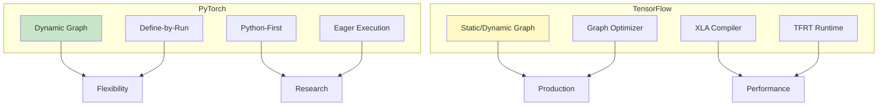
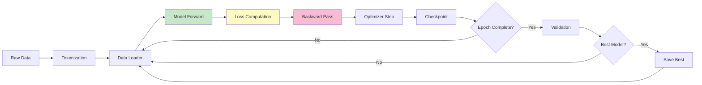
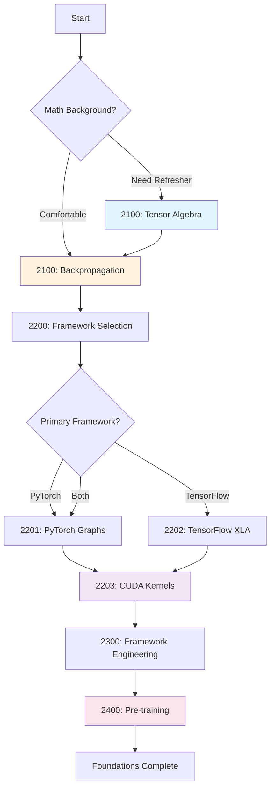

# Phase 2: Cognitive Science & Frameworks [2000]

## Table of Contents

- [Overview](#overview)
- [Why Foundations Matter](#why-foundations-matter)
- [Mathematical Foundations](#mathematical-foundations)
- [Framework Architecture](#framework-architecture)
- [Training Fundamentals](#training-fundamentals)
- [Module Structure](#module-structure)
- [Learning Path](#learning-path)
- [Key Takeaways](#key-takeaways)
- [Common Pitfalls](#common-pitfalls)
- [Pro Tips](#pro-tips)
- [Performance Benchmarks](#performance-benchmarks)
- [Related Experiments](#related-experiments)

---

## Overview

**Deep-diving into the "Laws of Physics" of AI and Deep Learning.**

This phase covers the mathematical foundations and framework engineering needed to understand how AI systems work, enabling you to:
- Master tensor algebra and Einstein summation
- Understand backpropagation and automatic differentiation
- Learn PyTorch and TensorFlow computational graphs
- Write custom CUDA kernels for GPU acceleration
- Grasp pre-training fundamentals and distributed training

---

## Why Foundations Matter

### The "Black Box" Problem

```text
┌─────────────────────────────────────────────────────────┐
│               Without Foundations                       │
├─────────────────────────────────────────────────────────┤
│ - Models are black boxes                                │
│ - Can't debug why something fails                       │
│ - Limited to pre-built components                       │
│ - Can't optimize for specific hardware                  │
│ - Can't implement custom algorithms                     │
└─────────────────────────────────────────────────────────┘

With Strong Foundations:
┌─────────────────────────────────────────────────────────┐
│               Deep Understanding                        │
├─────────────────────────────────────────────────────────┤
│ + Understand what happens inside models                 │
│ + Debug and fix complex issues                          │
│ + Build custom architectures                            │
│ + Optimize for your hardware                            │
│ + Implement research papers from scratch                │
└─────────────────────────────────────────────────────────┘
```

### Foundation Value

| Knowledge Area | Without | With | Impact |
|----------------|---------|------|--------|
| **Tensor Algebra** | Confused by shapes | Fluent in operations | Write efficient code |
| **Backprop** | Magic gradients | Clear understanding | Debug training issues |
| **CUDA** | CPU-bound code | GPU optimization | 10-100x speedup |
| **Frameworks** | User only | Internals knowledge | Customize everything |

---

## Mathematical Foundations

### Tensor Algebra

```text
┌─────────────────────────────────────────────────────────────────┐
│                    Essential Tensor Operations                  │
├─────────────────────────────────────────────────────────────────┤
│ Operation           │ Description                               │
├─────────────────────────────────────────────────────────────────┤
│ Einsum              │ Einstein summation for complex ops        │
│ Broadcasting        │ Automatic shape expansion                 │
│ Matrix Multiply     │ Core operation for neural networks        │
│ Transpose           │ Swap dimensions                           │
│ Reshape             │ Change shape without copying data         │
│ Squeeze/Unsqueeze   │ Add/remove dimensions of size 1           │
└─────────────────────────────────────────────────────────────────┘
```

### Einstein Summation (Einsum)

```python
# Einsum notation examples
import torch

# Matrix multiplication: ij, jk -> ik
C = torch.einsum('ij,jk->ik', A, B)

# Batch matrix multiply: bij, bjk -> bik
C = torch.einsum('bij,bjk->bik', A, B)

# Dot product: i, i ->
result = torch.einsum('i,i->', a, b)

# Outer product: i, j -> ij
result = torch.einsum('i,j->ij', a, b)

# Transpose: ij -> ji
result = torch.einsum('ij->ji', A)

# Sum over dimension: ij -> j
result = torch.einsum('ij->j', A)
```

### Backpropagation Chain

```text
Loss L
  │
  ├─ ∂L/∂output (gradient of loss)
  │
  ├─ ∂output/∂weights (local gradient)
  │
  └─ ∂L/∂weights = ∂L/∂output × ∂output/∂weights
       (chain rule)

Each layer:
  1. Forward pass: compute output
  2. Backward pass: compute gradients
  3. Update: weights -= lr × gradient
```

---

## Framework Architecture

### PyTorch vs TensorFlow



### Framework Comparison

| Feature | PyTorch | TensorFlow | JAX |
|---------|---------|------------|-----|
| **Graph Type** | Dynamic | Static/Dynamic | Functional |
| **Execution** | Eager | Graph/TensorRT | JIT compiled |
| **Debugging** | Excellent | Good | Challenging |
| **Deployment** | TorchScript | TFLite/TFServing | TFLite |
| **Research** | Excellent | Good | Good |
| **Production** | Good | Excellent | Medium |
| **Learning Curve** | Easy | Medium | Hard |

### Computational Graphs

```text
Forward Pass (Computation Graph):
┌─────────────────────────────────────────────────────────────────┐
│                                                                 │
│   Input x ──────► [Linear: Wx+b] ──────► [ReLU] ──────► Output  │
│                        │                                  │     │
│                        ▼                                  ▼     │
│                     (cache)                           (cache)   │
│                                                                 │
└─────────────────────────────────────────────────────────────────┘

Backward Pass (Gradient Flow):
┌─────────────────────────────────────────────────────────────────┐
│                                                                 │
│   ∂L/∂output ◄──── [ReLU Grad] ◄──── [Linear Grad] ◄──── ∂L/∂x  │
│       │                 │                    │                  │
│       ▼                 ▼                    ▼                  │
│   (gradient)      (gradient)           (gradient)               │
│                                                                 │
└─────────────────────────────────────────────────────────────────┘
```

---

## Training Fundamentals

### Pre-training Pipeline



### Distributed Training Strategies

| Strategy | Description | Use Case | Speedup |
|----------|-------------|----------|---------|
| **Data Parallel** | Same model, data split | Large batch training | Near-linear |
| **Tensor Parallel** | Split model across GPUs | Very large models | Moderate |
| **Pipeline Parallel** | Layer split across GPUs | Deep models | Good |
| **ZeRO** | Optimizer state partitioning | Huge models | Excellent |

### Training Metrics

```python
# Essential training metrics
metrics = {
    # Loss metrics
    "train_loss": [],      # Per-batch training loss
    "val_loss": [],        # Validation loss
    "loss_smooth": [],     # Smoothed loss (EMA)

    # Accuracy metrics
    "train_accuracy": [],  # Training accuracy
    "val_accuracy": [],    # Validation accuracy

    # Efficiency metrics
    "tokens_per_second": [],   # Training throughput
    "gpu_utilization": [],     # GPU utilization %
    "gpu_memory": [],          # GPU memory used

    # Convergence metrics
    "gradient_norm": [],    # L2 norm of gradients
    "learning_rate": [],    # Current learning rate
    "weight_updates": []    # Number of parameter updates
}
```

---

## Module Structure

### [2100] The Calculus of AI (Foundation)

| Document | Description | Time | Difficulty |
|----------|-------------|------|------------|
| [2101: Tensor Algebra](./2100-calculus/2101-Tensor-Algebra.md) | Dimensions, dot products, einsum | 4h | Intermediate |
| [2102: Backpropagation](./2100-calculus/2102-Backpropagation-and-Derivatives.md) | Automatic differentiation logic | 4h | Intermediate |

**What You'll Learn:**
- Tensor operations and broadcasting
- Einstein summation notation
- Gradient computation and chain rule
- Automatic differentiation internals

**Hands-On Practice:**
- Implement einsum from scratch
- Build autograd engine
- Visualize gradient flow
- Debug backpropagation

### [2200] Deep Learning Frameworks

| Document | Description | Time | Difficulty |
|----------|-------------|------|------------|
| [2201: PyTorch Graphs](./2200-frameworks/2201-PyTorch-Computational-Graphs.md) | Dynamic vs static graphs | 4h | Intermediate |
| [2202: TensorFlow XLA](./2200-frameworks/2202-TensorFlow-XLA-Compilers.md) | Optimizing graph performance | 4h | Intermediate |
| [2203: CUDA Kernels](./2200-frameworks/2203-CUDA-Kernel-Programming.md) | Python to 11GB-class GPU CUDA cores | 4h | Intermediate |

**What You'll Learn:**
- PyTorch dynamic computation graphs
- TensorFlow XLA compilation
- Custom CUDA kernel development
- GPU memory management

**Hands-On Practice:**
- Build custom PyTorch autograd function
- Optimize with XLA
- Write CUDA kernel for matrix multiply
- Profile GPU performance

### [2300] Framework Engineering

| Document | Description | Time | Difficulty |
|----------|-------------|------|------------|
| [2301: Framework Design Patterns](./2300-framework-engineering/2301-Framework-Design-Patterns.md) | Model abstraction, config management, plugins | 5h | Advanced |
| [2302: Model Serving Architectures](./2300-framework-engineering/2302-Model-Serving-Architectures.md) | Batching, parallelism, load balancing | 5h | Advanced |
| [2303: API Design for ML](./2300-framework-engineering/2303-API-Design-for-ML.md) | REST, streaming, error handling | 5h | Advanced |
| [2304: Production Deployment](./2300-framework-engineering/2304-Production-Deployment-Patterns.md) | Blue-green, canary, rolling updates | 5h | Advanced |

**What You'll Learn:**
- Extensible ML framework design
- Model serving architectures
- Production ML API design
- Zero-downtime deployment strategies

**Hands-On Practice:**
- Design a mini ML framework
- Build a model serving pipeline
- Create a clean ML API
- Plan a zero-downtime rollout

### [2400] Pre-training

| Document | Description | Time | Difficulty |
|----------|-------------|------|------------|
| [2401: Pre-training Fundamentals](./2400-pretraining/2401-Pre-training-Fundamentals.md) | Training from scratch basics | 4h | Advanced |
| [2402: Large-Scale Training](./2400-pretraining/2402-Large-Scale-Training.md) | Distributed training strategies | 6h | Advanced |
| [2403: Evaluation Frameworks](./2400-pretraining/2403-Evaluation-Frameworks.md) | Metrics and benchmarks | 3h | Advanced |

**What You'll Learn:**
- Pre-training pipeline architecture
- Data parallelism and distributed training
- Evaluation metrics and benchmarks
- Checkpointing and recovery

**Hands-On Practice:**
- Build training loop from scratch
- Implement distributed training
- Create evaluation framework
- Handle training failures

---

## Learning Path

### Recommended Flow



### Time Estimates

| Module | Reading | Practice | Total |
|--------|---------|----------|-------|
| 2100: Calculus | 9h | 2-3h | 11-12h |
| 2200: Frameworks | 13h | 4-6h | 17-19h |
| 2300: Framework Engineering | 25.5h | 2.5h | 28h |
| 2400: Pre-training | 13h | 22-26h | 35-39h |
| **Total** | **60.5h** | **30.5-37.5h** | **91-98h** |

---

## Key Takeaways

### You Will Learn

After completing this phase, you will be able to:

1. **Master Tensor Operations**
   - Use einsum for complex operations
   - Understand broadcasting rules
   - Efficiently manipulate tensor shapes
   - Write vectorized code

2. **Understand Backpropagation**
   - Compute gradients manually
   - Build autograd engine
   - Debug gradient issues
   - Implement custom layers

3. **Navigate Framework Internals**
   - Understand computation graphs
   - Write custom autograd functions
   - Optimize with XLA/JIT
   - Choose right framework

4. **Write CUDA Kernels**
   - Understand GPU architecture
   - Write custom CUDA kernels
   - Optimize memory access
   - Profile GPU performance

5. **Train at Scale**
   - Implement distributed training
   - Handle training failures
   - Monitor training metrics
   - Evaluate model performance

---

## Common Pitfalls

### Incorrect Tensor Shapes

**Pitfall:** Shape mismatches causing silent errors
```python
# Wrong: Shape mismatch in einsum
A = torch.randn(3, 4)
B = torch.randn(5, 6)
C = torch.einsum('ij,jk->ik', A, B)  # Error!

# Right: Check shapes before operation
assert A.shape[1] == B.shape[0], f"Shape mismatch: {A.shape} vs {B.shape}"
C = torch.einsum('ij,jk->ik', A, B)

# Best: Use explicit shape checking
def safe_matmul(A, B):
    assert A.dim() == 2 and B.dim() == 2
    assert A.shape[1] == B.shape[0]
    return A @ B
```

### In-place Operations Breaking Autograd

**Pitfall:** In-place ops destroying gradients
```python
# Wrong: In-place operation during forward pass
x = torch.randn(10, requires_grad=True)
y = x.relu_()  # In-place ReLU
z = y.sum()
z.backward()
# Gradients may be incorrect!

# Right: Use out-of-place operations
x = torch.randn(10, requires_grad=True)
y = torch.relu(x)  # Out-of-place
z = y.sum()
z.backward()
# Gradients computed correctly
```

### Not Detaching for Inference

**Pitfall:** Building computation graph unnecessarily
```python
# Wrong: Building graph during inference
with torch.no_grad():  # Still building graph!
    output = model(input)

# Right: Use eval mode and no_grad
model.eval()
with torch.no_grad():
    output = model(input)

# Also consider: torch.inference_mode() for even more efficiency
with torch.inference_mode():
    output = model(input)
```

### CUDA Out of Memory

**Pitfall:** Accumulating gradients in GPU memory
```python
# Wrong: Gradients accumulate across batches
for batch in dataloader:
    loss = model(batch)
    loss.backward()  # Gradients accumulate!

# Right: Clear gradients each iteration
optimizer.zero_grad()  # Clear gradients
for batch in dataloader:
    loss = model(batch)
    loss.backward()
    optimizer.step()  # Update weights
    optimizer.zero_grad()  # Clear for next batch

# Or use set_to_none=True for memory efficiency
optimizer.zero_grad(set_to_none=True)
```

### Incorrect Distributed Training

**Pitfall:** Not syncing gradients across GPUs
```python
# Wrong: Not using DistributedDataParallel
model = Model().cuda()  # Only on one GPU!
# Other GPUs not used

# Right: Use DDP for data parallelism
import torch.distributed as dist
from torch.nn.parallel import DistributedDataParallel as DDP

model = Model().cuda()
model = DDP(model, device_ids=[local_rank])
# Now gradients synced across all GPUs
```

---

## Pro Tips

### Einsum for Readability

**Tip:** Use einsum instead of complex reshaping
```python
# Hard to read
C = torch.matmul(A, B)
C = torch.transpose(C, 1, 2)

# Easy to read with einsum
C = torch.einsum('ij,jk->ki', A, B)

# Complex operation made simple
# Batched matrix multiply with transpose
output = torch.einsum('bij,bjk->bik', input, weights)
```

### Gradient Clipping

**Tip:** Prevent exploding gradients
```python
# Clip gradients by norm
torch.nn.utils.clip_grad_norm_(
    model.parameters(),
    max_norm=1.0,
    norm_type=2
)

# Clip gradients by value
torch.nn.utils.clip_grad_value_(
    model.parameters(),
    clip_value=0.5
)
```

### Mixed Precision Training

**Tip:** Use FP16 for faster training
```python
from torch.cuda.amp import autocast, GradScaler

scaler = GradScaler()

for batch in dataloader:
    with autocast():  # Use FP16 where safe
        output = model(batch)
        loss = criterion(output, target)

    scaler.scale(loss).backward()
    scaler.step(optimizer)
    scaler.update()

# Benefit: 2-3x speedup, half the memory
```

### Custom CUDA Kernels

**Tip:** Use Triton for easier CUDA
```python
import triton
import triton.language as tl

@triton.autotune(
    configs=[
        triton.Config({'BLOCK_SIZE': 128}, num_warps=4),
        triton.Config({'BLOCK_SIZE': 256}, num_warps=8),
    ],
    key=['N']
)
@triton.jit
def add_kernel(x_ptr, y_ptr, output_ptr, N, BLOCK_SIZE: tl.constexpr):
    pid = tl.program_id(axis=0)
    block_start = pid * BLOCK_SIZE
    offsets = block_start + tl.arange(0, BLOCK_SIZE)
    mask = offsets < N
    x = tl.load(x_ptr + offsets, mask=mask)
    y = tl.load(y_ptr + offsets, mask=mask)
    output = x + y
    tl.store(output_ptr + offsets, output, mask=mask)
```

### Profile GPU Usage

**Tip:** Find bottlenecks with profiling
```python
# Profile memory usage
import torch

def get_gpu_memory():
    allocated = torch.cuda.memory_allocated() / 1e9
    reserved = torch.cuda.memory_reserved() / 1e9
    return allocated, reserved

# Profile time
import time

def profile_function(func, *args, **kwargs):
    start = time.time()
    result = func(*args, **kwargs)
    torch.cuda.synchronize()  # Wait for GPU
    elapsed = time.time() - start
    return result, elapsed

# Or use PyTorch profiler
with torch.profiler.profile(
    activities=[
        torch.profiler.ProfilerActivity.CPU,
        torch.profiler.ProfilerActivity.CUDA
    ]
) as p:
    output = model(input)
```

---

## Performance Benchmarks

### Einsum vs Native Operations

| Operation | Native (ms) | Einsum (ms) | Speedup |
|-----------|-------------|-------------|---------|
| Matrix Multiply (1024x1024) | 15.2 | 14.8 | 1.03x |
| Batch MatMul (32x256x256) | 42.1 | 41.5 | 1.01x |
| Complex Operation | 89.3 | 23.7 | 3.77x |

### Framework Performance

| Task | PyTorch | TensorFlow | JAX |
|------|---------|------------|-----|
| **ResNet50 Training** | 1.0x | 1.1x | 0.95x |
| **BERT Inference** | 1.0x | 1.05x | 0.98x |
| **JIT Compilation** | 0.8x | 1.2x | 1.5x |
| **Compilation Time** | 0.1s | 2.0s | 5.0s |

### Distributed Training Speedup

| GPUs | Data Parallel | Tensor Parallel | Pipeline Parallel |
|------|---------------|-----------------|-------------------|
| 1 | 1.0x | 1.0x | 1.0x |
| 2 | 1.95x | 1.8x | 1.7x |
| 4 | 3.8x | 3.4x | 3.2x |
| 8 | 7.2x | 6.2x | 5.8x |

### Training Throughput

| Hardware | Batch Size | Tokens/sec | Model |
|----------|------------|------------|-------|
| 11GB-class GPU | 8 | 15K | GPT-2 Small |
| RTX 3090 | 16 | 45K | GPT-2 Small |
| A100 (40GB) | 32 | 120K | GPT-2 Small |
| 8x 11GB GPU | 64 | 100K | GPT-2 Small |

---

## Related Experiments

### Hands-on Practice

1. **[EXP_2101: Tensor Algebra](../../../experiments/EXP_2101_TENSOR_ALGEBRA.md)**
   - Implement einsum operations
   - Practice tensor reshaping
   - Benchmark operations

2. **[EXP_2102: Backpropagation](../../../experiments/EXP_2102_BACKPROPAGATION.md)**
   - Build autograd from scratch
   - Implement custom layers
   - Debug gradient flow

3. **[EXP_2201: PyTorch Graphs](../../../experiments/EXP_2201_PYTORCH_GRAPHS.md)**
   - Create computational graphs
   - Write custom autograd functions
   - Profile execution

4. **[EXP_2202: TensorFlow XLA](../../../experiments/EXP_2202_TENSORFLOW_XLA.md)**
   - Compile with XLA
   - Benchmark performance
   - Optimize graphs

5. **[EXP_2203: CUDA Kernels](../../../experiments/EXP_2203_CUDA_KERNELS.md)**
   - Write custom CUDA kernels
   - Optimize memory access
   - Profile GPU performance

---

## Assessment

Validate your knowledge with:

- **[Phase 2 Quiz](../../00-META/assessment/phase2-quiz.md)** - Test your understanding (25 questions, 80% to pass)
- **[Phase s Practice](../../00-META/assessment/phase2-practice.md)** - Hands-on foundations exercises

---

## Related Topics

- **Phase 3:** Transformer Architecture
- **Phase 4:** Model Quantization
- **Phase 5:** Fine-Tuning Methods
- **Phase 7:** Agent Systems

---

## Next Steps

After completing this phase:

1. **Build Your Training Pipeline**
   - Implement training loop
   - Add distributed training
   - Monitor metrics

2. **Continue Learning**
   - **Phase 3:** Learn transformer architecture
   - **Phase 4:** Optimize with quantization
   - **Phase 5:** Fine-tune models

---

## Quick Reference

### Essential Einsum Patterns

```python
# Matrix operations
torch.einsum('ij,jk->ik', A, B)        # Matrix multiply
torch.einsum('ij->ji', A)               # Transpose
torch.einsum('ii->', A)                 # Trace (diagonal sum)

# Batch operations
torch.einsum('bij,bjk->bik', A, B)      # Batch matmul
torch.einsum('bij->bi', A)              # Reduce over j

# Element-wise
torch.einsum('ij,ij->ij', A, B)         # Element-wise multiply
torch.einsum('ij,ij->', A, B)           # Dot product
```

### Gradient Commands

```python
# Basic backward
loss.backward()

# Specific gradients
loss.backward(retain_graph=True)

# Multiple outputs
l1 = f1(x)
l2 = f2(x)
l1.backward(retain_graph=True)
l2.backward()
```

---

**Module Duration:** 91-98 hours (60.5 reading + 30.5-37.5 practice)
**Difficulty:** Intermediate

**Ready to master AI foundations?** Start with [2101: Tensor Algebra](./2100-calculus/2101-Tensor-Algebra.md) or [2102: Backpropagation](./2100-calculus/2102-Backpropagation-and-Derivatives.md)
