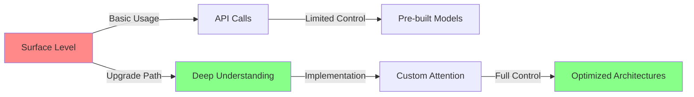
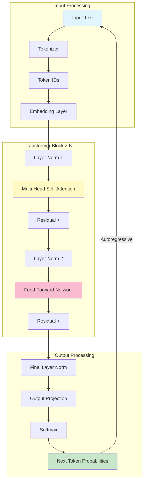
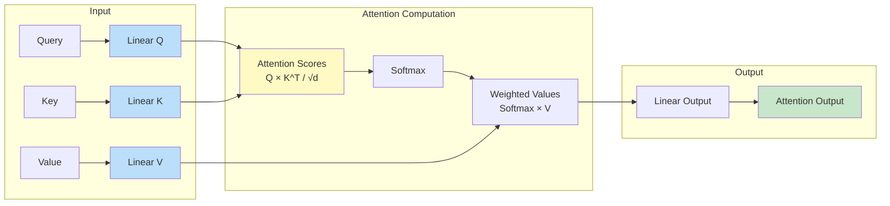
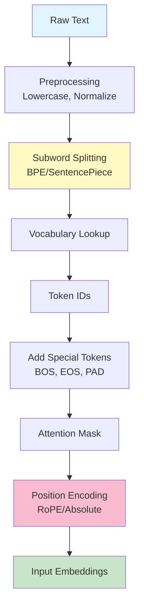
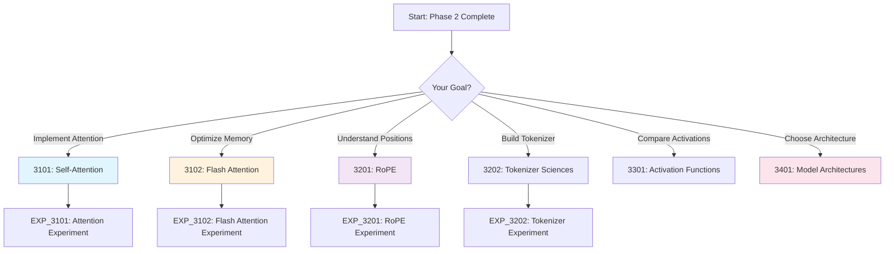

# Phase 3: Transformer Physics & LLM Internals [3000]

## Table of Contents

- [Overview](#overview)
- [Why Transformer Internals Matter](#why-transformer-internals-matter)
- [Module Structure](#module-structure)
- [Learning Path](#learning-path)
- [Key Takeaways](#key-takeaways)
- [Common Pitfalls](#common-pitfalls)
- [Pro Tips](#pro-tips)
- [Related Experiments](#related-experiments)

---

## Overview

**Dismantling the Generative Pre-trained Transformer architecture.**

This phase covers the internal mechanics of transformer models, from attention mechanisms to decoding strategies, enabling you to:
- Understand the self-attention mechanism that powers modern LLMs
- Implement attention from scratch for deeper understanding
- Learn Flash Attention optimization for memory efficiency
- Master positional embeddings (RoPE) for sequence understanding
- Compare tokenization strategies (BPE, SentencePiece, TikToken)
- Analyze activation functions and normalization layers
- Choose between decoder-only and encoder-decoder architectures

---

## Why Transformer Internals Matter

### The Knowledge Gap

```
Without Understanding Internals:
┌─────────────────────────────────────────────────────────┐
│ ❌ Black-box approach to LLMs                           │
│ ❌ Cannot debug model behavior                           │
│ ❌ Limited optimization capabilities                    │
│ ❌ Cannot choose right architecture for task            │
│ ❌ Struggle with long context windows                   │
│ ❌ Cannot implement custom modifications                 │
└─────────────────────────────────────────────────────────┘

With Deep Understanding:
┌─────────────────────────────────────────────────────────┐
│ ✅ Understand every component of transformer            │
│ ✅ Implement attention mechanisms from scratch          │
│ ✅ Optimize for memory and speed                        │
│ ✅ Choose right model for your use case                 │
│ ✅ Extend context windows efficiently                   │
│ ✅ Build custom model architectures                     │
└─────────────────────────────────────────────────────────┘
```

### Performance vs Understanding



---

## Decoder-Only Transformer Architecture



---

## Self-Attention Mechanism



---

## Tokenization Pipeline



---

## Module Structure

### [3100] Attention Architectures

| Document | Description | Time | Difficulty |
|----------|-------------|------|------------|
| [3101: Self-Attention](./3100-attention/3101-Self-Attention-DeepDive.md) | Multi-head, Masked, Scaled Dot-Product | 3-4h | Intermediate |
| [3102: Flash Attention](./3100-attention/3102-Flash-Attention.md) | Memory-efficient attention (IO-aware) | 2-3h | Advanced |

**What You'll Learn:**
- Scaled dot-product attention mechanism
- Multi-head attention and its benefits
- Causal masking for autoregressive generation
- KV cache optimization for faster inference
- Flash Attention tiling strategy
- IO-aware algorithm design
- Memory optimization techniques

**Hands-On Practice:**
- Implement self-attention from scratch
- Visualize attention patterns
- Compare standard vs Flash Attention
- Profile memory usage
- Benchmark inference speed
- Test on long sequences

### [3200] Embedding Latent Spaces

| Document | Description | Time | Difficulty |
|----------|-------------|------|------------|
| [3201: RoPE](./3200-embeddings/3201-Rotary-Positional-Embeddings-RoPE.md) | Absolute vs Relative positions | 2-3h | Intermediate |
| [3202: Tokenizer Sciences](./3200-embeddings/3202-Tokenizer-Sciences.md) | BPE, SentencePiece, Tiktoken | 2-3h | Intermediate |

**What You'll Learn:**
- Rotary Position Embeddings (RoPE)
- Absolute vs relative position encoding
- Sinusoidal embeddings
- Learned positional embeddings
- ALiBi (Attention with Linear Biases)
- Byte Pair Encoding (BPE)
- SentencePiece (Unigram LM)
- TikToken algorithm
- Tokenizer comparison and trade-offs

**Hands-On Practice:**
- Implement RoPE from scratch
- Compare absolute vs relative encoding
- Visualize rotation matrices
- Compare BPE vs SentencePiece
- Analyze token distributions
- Test on different languages
- Measure compression ratio

### [3300] The Decoding Block

| Document | Description | Time | Difficulty |
|----------|-------------|------|------------|
| [3301: Activation Functions](./3300-decoding/3301-Activation-Functions.md) | GELU, SwiGLU vs RELU | 2h | Intermediate |
| [3302: Normalization Layers](./3300-decoding/3302-Normalization-Layers.md) | BatchNorm vs LayerNorm vs RMSNorm | 1-2h | Intermediate |
| [3303: Activation Comparison](./3300-decoding/guides/3303-Activation-Function-Comparison.md) | Comparative analysis | 1h | Beginner |

**What You'll Learn:**
- ReLU and its limitations
- GELU (Gaussian Error Linear Unit)
- SwiGLU (Swish-Gated Linear Unit)
- GeLU vs SwiGLU comparison
- BatchNorm vs LayerNorm vs RMSNorm
- Pre-Norm vs Post-Norm placement
- Stability in deep networks

**Hands-On Practice:**
- Compare activation performance
- Analyze gradient flow
- Benchmark training speed
- Implement custom activations
- Test normalization strategies

### [3400] Model Architectures

| Document | Description | Time | Difficulty |
|----------|-------------|------|------------|
| [3401: Encoder-Decoder](./3400-architectures/3401-Encoder-Decoder-Architectures.md) | T5, BART architectures | 2h | Intermediate |
| [3402: Decoder-Only](./3400-architectures/3402-Decoder-Only-Models.md) | GPT, LLaMA architectures | 2h | Intermediate |
| [3403: Architecture Comparison](./3400-architectures/guides/3403-Model-Architecture-Comparison.md) | Comparative guide | 2h | Beginner |

**What You'll Learn:**
- Decoder-only (GPT, LLaMA, Mistral)
- Encoder-decoder (T5, BART)
- Encoder-only (BERT)
- Mixture of Experts (MoE)
- Cross-attention mechanisms
- Bidirectional vs unirectional attention
- When to use each architecture

**Hands-On Practice:**
- Load and analyze different architectures
- Compare parameter counts
- Benchmark inference speed
- Analyze attention patterns
- Choose architecture for specific tasks

---

## Learning Path

### Recommended Flow



### Time Estimates

| Module | Reading | Practice | Total |
|--------|---------|----------|-------|
| 3100: Attention Architectures | 6h | 4-6h | 10-12h |
| 3200: Embedding Latent Spaces | 5h | 4h | 9h |
| 3300: The Decoding Block | 4h | 3h | 7h |
| 3400: Model Architectures | 6h | 4h | 10h |
| **Total** | **21h** | **15-17h** | **36-38h** |

---

## Key Takeaways

### ✅ You Will Learn

After completing this phase, you will be able to:

1. **Implement Self-Attention from Scratch**
   - Understand scaled dot-product attention
   - Build multi-head attention mechanisms
   - Apply causal masking for generation
   - Optimize with KV cache

2. **Optimize Memory Usage**
   - Implement Flash Attention
   - Use tiling strategies
   - Apply IO-aware algorithms
   - Reduce memory from O(N²) to O(N)

3. **Master Positional Embeddings**
   - Implement RoPE (state-of-the-art)
   - Compare absolute vs relative encoding
   - Apply ALiBi for extrapolation
   - Extend context windows

4. **Choose Right Tokenization**
   - Compare BPE, SentencePiece, TikToken
   - Analyze vocabulary efficiency
   - Optimize for specific domains
   - Handle multilingual text

5. **Select Architecture for Task**
   - Decoder-only for generation
   - Encoder-decoder for translation
   - Encoder-only for understanding
   - Mixture of Experts for scale

---

## Common Pitfalls

### ⚠️ Attention Implementation

**Pitfall:** Incorrect attention mask leading to information leakage
```python
# Wrong: No causal mask
def attention(Q, K, V):
    scores = Q @ K.T / sqrt(d)
    weights = softmax(scores, dim=-1)
    return weights @ V
# Problem: Model sees future tokens!

# Right: Apply causal mask
def attention(Q, K, V, mask=None):
    scores = Q @ K.T / sqrt(d)
    if mask is not None:
        scores = scores.masked_fill(mask == 0, -1e9)
    weights = softmax(scores, dim=-1)
    return weights @ V

# Create causal mask
causal_mask = torch.tril(torch.ones(seq_len, seq_len))
```

### ⚠️ Memory Management

**Pitfall:** Computing full attention matrix causing OOM
```python
# Wrong: Full attention computation
attention_weights = torch.softmax(
    Q @ K.T / sqrt(d),  # O(N²) memory!
    dim=-1
)

# Right: Use Flash Attention or chunking
from flash_attn import flash_attn_func
output = flash_attn_func(Q, K, V)  # O(N) memory

# Or chunk manually
def chunked_attention(Q, K, V, chunk_size=512):
    outputs = []
    for i in range(0, Q.size(1), chunk_size):
        Q_chunk = Q[:, i:i+chunk_size]
        scores = Q_chunk @ K.T / sqrt(d)
        weights = torch.softmax(scores, dim=-1)
        outputs.append(weights @ V)
    return torch.cat(outputs, dim=1)
```

### ⚠️ Position Encoding

**Pitfall:** Using absolute positional encoding that doesn't extrapolate
```python
# Wrong: Learned absolute positions (poor extrapolation)
class LearnedPositionalEmbedding(nn.Module):
    def __init__(self, max_seq_len, d_model):
        self.embeddings = nn.Parameter(torch.randn(max_seq_len, d_model))

# Right: RoPE for better extrapolation
def rotate_position(x, seq_len, dim):
    theta = torch.arange(dim // 2) / (dim // 2)
    theta = 1.0 / (10000 ** theta)
    freqs = torch.outer(torch.arange(seq_len), theta)
    emb = torch.polar(torch.ones_like(freqs), freqs)
    return apply_rotary_emb(x, emb)
```

### ⚠️ Tokenizer Choice

**Pitfall:** Using wrong tokenizer for your domain
```python
# Wrong: Using GPT-2 tokenizer for code
from transformers import GPT2Tokenizer
tokenizer = GPT2Tokenizer.from_pretrained('gpt2')
# Problem: Poor tokenization for code syntax

# Right: Use domain-specific tokenizer
from transformers import CodeLlamaTokenizer
tokenizer = CodeLlamaTokenizer.from_pretrained('codellama/CodeLlama-7b')
# Better: Fine-tune tokenizer on your domain
```

### ⚠️ Activation Function

**Pitfall:** Using ReLU in transformer (dead neurons)
```python
# Wrong: ReLU causes dead neurons
activation = nn.ReLU()

# Right: Use GELU or SwiGLU
activation = nn.GELU()  # Better gradients

# Or SwiGLU (state-of-the-art for LLMs)
class SwiGLU(nn.Module):
    def __init__(self, dim, hidden_dim):
        self.w = nn.Linear(dim, hidden_dim)
        self.v = nn.Linear(dim, hidden_dim)
        self.w2 = nn.Linear(hidden_dim, dim)

    def forward(self, x):
        return self.w2(F.silu(self.w(x)) * self.v(x))
```

### ⚠️ Normalization Placement

**Pitfall:** Post-Norm in deep networks (training instability)
```python
# Wrong: Post-Norm (instability in deep networks)
class TransformerBlock(nn.Module):
    def forward(self, x):
        x = x + self.attention(self.norm1(x))  # Post-Norm
        x = x + self.ffn(self.norm2(x))
        return x

# Right: Pre-Norm (stable for deep networks)
class TransformerBlock(nn.Module):
    def forward(self, x):
        x = x + self.attention(self.norm1(x))  # Pre-Norm
        x = x + self.ffn(self.norm2(x))
        return x
```

### ⚠️ Architecture Selection

**Pitfall:** Using wrong architecture for task
```python
# Wrong: Using BERT for text generation
from transformers import BertForMaskedLM
model = BertForMaskedLM.from_pretrained('bert-base-uncased')
# Problem: BERT is encoder-only, not designed for generation

# Right: Use decoder-only for generation
from transformers import AutoModelForCausalLM
model = AutoModelForCausalLM.from_pretrained('gpt2')
# Or encoder-decoder for translation
from transformers import AutoModelForSeq2SeqLM
model = AutoModelForSeq2SeqLM.from_pretrained('t5-base')
```

---

## Pro Tips

### 💡 Attention Optimization

**Tip:** Use KV cache for faster autoregressive generation
```python
# Standard generation: Recompute attention each token (slow)
def generate_slow(model, input_ids, max_length=100):
    for _ in range(max_length):
        outputs = model(input_ids)  # Recomputes all attention
        next_token = torch.argmax(outputs.logits[:, -1, :])
        input_ids = torch.cat([input_ids, next_token.unsqueeze(0)], dim=1)
    return input_ids

# Optimized: Use KV cache
def generate_fast(model, input_ids, max_length=100):
    past_key_values = None
    for _ in range(max_length):
        outputs = model(
            input_ids,
            past_key_values=past_key_values,  # Cache KV pairs
            use_cache=True
        )
        past_key_values = outputs.past_key_values
        next_token = torch.argmax(outputs.logits[:, -1, :])
        input_ids = next_token.unsqueeze(0)
    return input_ids

# Result: 2-3x speedup!
```

### 💡 Memory Reduction

**Tip:** Combine gradient checkpointing with Flash Attention
```python
from torch.utils.checkpoint import checkpoint

def forward_with_checkpointing(x):
    # Enable larger batch sizes with limited VRAM
    x = checkpoint(self.attention, x)  # Checkpoint attention
    x = checkpoint(self.ffn, x)         # Checkpoint FFN
    return x

# Benefits:
# - Reduces memory by 2-3x
# - Enables training larger models
# - Trade-off: ~20% slower (recompute on backward)
```

### 💡 Tokenizer Efficiency

**Tip:** Analyze token distribution before choosing tokenizer
```python
def analyze_tokenizer_efficiency(text, tokenizer):
    tokens = tokenizer.encode(text)
    stats = {
        'total_tokens': len(tokens),
        'unique_tokens': len(set(tokens)),
        'compression_ratio': len(text.split()) / len(tokens),
        'avg_token_length': np.mean([len(tokenizer.decode([t])) for t in tokens])
    }
    return stats

# Compare tokenizers:
text = "Your domain-specific text here..."
for name in ['gpt2', 'codellama', 'sentencepiece']:
    tokenizer = AutoTokenizer.from_pretrained(name)
    stats = analyze_tokenizer_efficiency(text, tokenizer)
    print(f"{name}: {stats}")
```

### 💡 Architecture Debugging

**Tip:** Visualize attention patterns to understand model
```python
import matplotlib.pyplot as plt

def visualize_attention(model, text, layer=0, head=0):
    inputs = model.tokenizer(text, return_tensors='pt')
    outputs = model(**inputs, output_attentions=True)
    attention = outputs.attentions[layer][0, head].detach().numpy()

    tokens = model.tokenizer.convert_ids_to_tokens(inputs['input_ids'][0])

    plt.figure(figsize=(10, 8))
    plt.imshow(attention, cmap='viridis')
    plt.xticks(range(len(tokens)), tokens, rotation=90)
    plt.yticks(range(len(tokens)), tokens)
    plt.colorbar()
    plt.title(f'Attention Patterns - Layer {layer}, Head {head}')
    plt.show()

# Reveals what tokens attend to what!
```

### 💡 Performance Benchmarking

**Tip:** Profile different components to find bottlenecks
```python
import torch.profiler as profiler

def profile_model(model, input_ids):
    with profiler.profile(
        activities=[profiler.ProfilerActivity.CPU, profiler.ProfilerActivity.CUDA],
        record_shapes=True
    ) as prof:
        _ = model(input_ids)

    print(prof.key_averages().table(sort_by="cuda_time_total"))
    # Shows which operations take the most time!

# Common findings:
# - Attention: Usually 40-60% of time
# - FFN: 30-40% of time
# - Embedding lookup: 5-10% of time
# - Use this to prioritize optimization efforts
```

---

## Performance Benchmarks

### Attention Mechanisms

| Method | Memory (seq=2048) | Speed | Accuracy | Best For |
|--------|-------------------|-------|----------|----------|
| **Standard Attention** | O(N²) = 67 MB | 1.0x | 100% | Short sequences |
| **Flash Attention** | O(N) = 2 MB | 2.5x | 100% | Long sequences |
| **Memory Efficient** | O(N√N) = 8 MB | 1.8x | 99.9% | Medium sequences |
| **Sparse Attention** | O(N log N) | 3.0x | 98% | Very long sequences |

### Tokenizer Comparison

| Tokenizer | Vocab Size | Compression | Multilingual | Code Support |
|-----------|-----------|-------------|--------------|--------------|
| **GPT-2 BPE** | 50k | 1.2x | ❌ | Poor |
| **GPT-4 TikToken** | 100k | 1.5x | ✅ | Good |
| **SentencePiece** | 32k-250k | 1.4x | ✅ | Medium |
| **CodeLlama** | 32k | 1.3x | ❌ | Excellent |

### Activation Functions

| Activation | Speed | Gradient Quality | Dead Neurons | Used In |
|------------|-------|------------------|--------------|---------|
| **ReLU** | 1.0x | Medium | Yes | Old models |
| **GELU** | 1.1x | Good | No | BERT, GPT-2 |
| **SwiGLU** | 1.2x | Excellent | No | LLaMA, Mistral |

---

## Related Experiments

### Hands-on Practice

1. **[EXP_3101: Self-Attention](../../../experiments/EXP_3101_SELF_ATTENTION.md)**
   - Implement attention from scratch
   - Visualize attention patterns
   - Benchmark multi-head configurations

2. **[EXP_3102: Flash Attention](../../../experiments/EXP_3102_FLASH_ATTENTION.md)**
   - Compare standard vs flash attention
   - Profile memory usage
   - Benchmark inference speed
   - Test on long sequences

3. **[EXP_3201: RoPE](../../../experiments/EXP_3201_ROPE.md)**
   - Implement RoPE from scratch
   - Compare absolute vs relative
   - Visualize rotation matrices
   - Test position encoding

4. **[EXP_3202: Tokenizer](../../../experiments/EXP_3202_TOKENIZER.md)**
   - Compare BPE vs SentencePiece
   - Analyze token distributions
   - Test on different languages
   - Measure compression ratio

5. **[EXP_3401: Encoder-Decoder](../../../experiments/EXP_3401_ENCODER_DECODER.md)**
   - Compare architecture types
   - Benchmark performance
   - Analyze use cases

---

## Prerequisites

Before starting this phase, ensure you understand:

- **PyTorch Basics** (from 2200: Frameworks)
- **Tensor Operations** (from 2100: Calculus)
- **Backpropagation** (from 2100: Calculus)
- **Neural Networks** (from 2300: Deep Learning)

See [PREREQUISITES](./0000-PREREQUISITES.md) for details.

---

## Assessment

Validate your knowledge with:

- **[Phase s Quiz](../../00-META/assessment/phase3-quiz.md)** - Test your understanding (25 questions, 80% to pass)
- **[Phase s Practice](../../00-META/assessment/phase3-practice.md)** - Hands-on exercises

---

## Related Topics

- **3100: Attention** - Self-attention and Flash Attention
- **3200: Embeddings** - Position encoding and tokenization
- **3300: Decoding** - Activation functions and normalization
- **3400: Architectures** - Model types and comparison

---

## Next Steps

After completing this phase:

1. **Apply to Your Projects**
   - Implement custom attention mechanisms
   - Optimize memory usage with Flash Attention
   - Choose right tokenizer for your domain
   - Select appropriate architecture

2. **Continue Learning**
   - **Phase 4:** Quantize models for deployment
   - **Phase 5:** Fine-tune models for your tasks
   - **Phase 6:** Build RAG systems
   - **Phase 7:** Create agentic AI systems

---

**Status:** ✅ Complete & Enriched
**Module Duration:** 36-38 hours (21 reading + 15-17 practice)
**Difficulty:** Intermediate to Advanced
**Last Updated:** 2026-02-05

**Ready to understand transformers?** Start with [3101: Self-Attention Deep Dive](./3100-attention/3101-Self-Attention-DeepDive.md) or [3102: Flash Attention](./3100-attention/3102-Flash-Attention.md)
