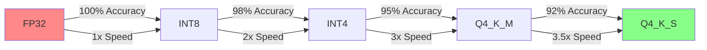
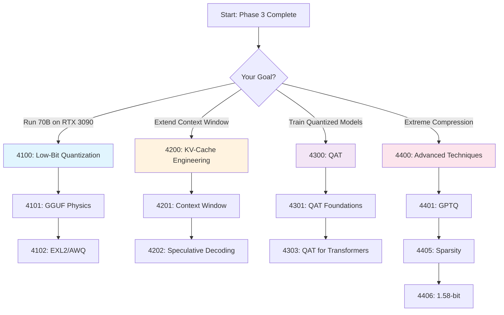
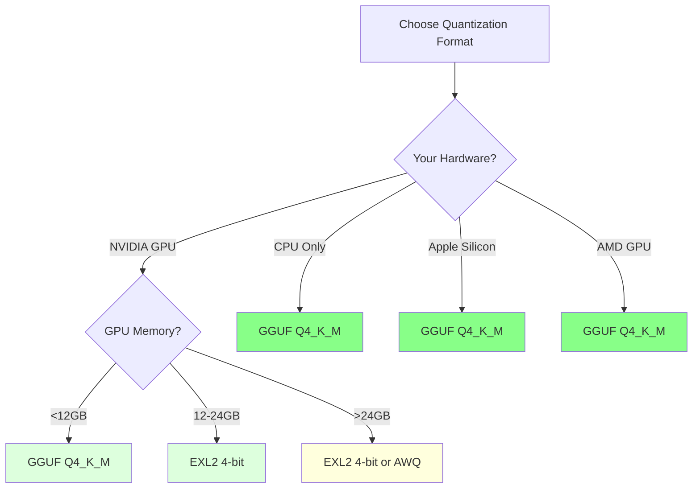

# Phase 4: Quantization & Compression [4000]

## Table of Contents

- [Overview](#overview)
- [Why Quantization Matters](#why-quantization-matters)
- [Module Structure](#module-structure)
- [Learning Path](#learning-path)
- [Key Takeaways](#key-takeaways)
- [Common Pitfalls](#common-pitfalls)
- [Pro Tips](#pro-tips)
- [Performance Benchmarks](#performance-benchmarks)
- [Related Experiments](#related-experiments)
- [Assessment](#assessment)
- [Related Topics](#related-topics)
- [Prerequisites](#prerequisites)

---

## Overview

**Maximizing constrained VRAM for 8B-70B model execution.**

This phase covers quantization techniques to run larger models on limited hardware, enabling you to:
- Run 70B parameter models on consumer GPUs (RTX 3090/4090)
- Reduce memory footprint by 4-8x while maintaining accuracy
- Achieve faster inference through optimized formats
- Deploy models on CPU-only systems

---

## Why Quantization Matters

### The Memory Challenge

```text
Model Size Comparison (FP16):
┌──────────────────────────────────────────────────────┐
│ Model         │ Parameters │ FP16 Size │ Typical GPU │
├───────────────┼────────────┼───────────┼─────────────┤
│ Llama-2-7B    │ 6.7B       │ 13.4 GB   │ RTX 3060    │
│ Llama-2-13B   │ 13B        │ 26 GB     │ RTX 3090    │
│ Llama-2-70B   │ 70B        │ 140 GB    │ A100 40GB   │
│ CodeLlama-34B │ 34B        │ 68 GB     │ A100 80GB   │
│ Mixtral-8x7B  │ 46.7B      │ 93.4 GB   │ 2xA100      │
└──────────────────────────────────────────────────────┘

After 4-bit Quantization:
┌──────────────────────────────────────────────────┐
│ Model         │ Q4 Size │ Reduction │ Can Run On │
├───────────────┼─────────┼───────────┼────────────┤
│ Llama-2-7B    │ 4.2 GB  │ 3.2x      │ RTX 3060   │
│ Llama-2-13B   │ 8.5 GB  │ 3.1x      │ RTX 3090   │
│ Llama-2-70B   │ 42 GB   │ 3.3x      │ RTX 4090   │
│ CodeLlama-34B │ 21 GB   │ 3.2x      │ RTX 4090   │
│ Mixtral-8x7B  │ 29 GB   │ 3.2x      │ RTX 6000   │
└──────────────────────────────────────────────────┘
```

### Performance vs Accuracy Trade-offs



---

## Module Structure

### [4100] Low-Bit Quantization

| Document | Description | Time | Difficulty |
|----------|-------------|------|------------|
| [4101: GGUF Physics](./4100-low-bit/4101-GGUF-Physics.md) | CPU/GPU hybrid inference | 2h | Intermediate |
| [4102: EXL2 and AWQ](./4100-low-bit/4102-EXL2-and-AWQ.md) | Extreme quantization for VRAM-only | 2h | Advanced |
| [4103: Double Quantization](./4100-low-bit/4103-Double-Quantization.md) | BitsAndBytes 4-bit loading | 1h | Intermediate |

**What You'll Learn:**
- GGUF format internals and optimization strategies
- EXL2 quantile-based quantization for maximum accuracy
- AWQ activation-aware weight quantization
- Double quantization for memory efficiency

**Hands-On Practice:**
- Convert models to GGUF format
- Optimize EXL2 calibration datasets
- Implement AWQ quantization pipelines
- Apply double quantization to large models

### [4200] KV-Cache Engineering

| Document | Description | Time | Difficulty |
|----------|-------------|------|------------|
| [4201: Context Window Physics](./4200-kv-cache/4201-Context-Window-Physics.md) | OOM errors in long sequences | 3h | Advanced |
| [4202: Speculative Decoding](./4200-kv-cache/4202-Speculative-Decoding.md) | Accelerating with draft models | 2h | Advanced |
| [4203: Context Optimization](./4200-kv-cache/guides/4203-Context-Window-Optimization.md) | KV cache optimization | 2h | Intermediate |

**What You'll Learn:**
- KV cache memory management strategies
- Speculative decoding for 2-3x speedup
- Context window extension techniques
- PagedAttention for long sequences

**Hands-On Practice:**
- Implement KV cache quantization
- Set up speculative decoding pipelines
- Extend context windows beyond 32k
- Optimize memory for long conversations

### [4300] Quantization Aware Training (QAT)

| Document | Description | Time | Difficulty |
|----------|-------------|------|------------|
| [4301: QAT Foundations](./4300-quantization-aware-training/4301-QAT-Foundations.md) | Fake quantization & calibration | 3h | Advanced |
| [4302: Fake Quantization](./4300-quantization-aware-training/4302-Fake-Quantization.md) | Simulated quantization during training | 2h | Advanced |
| [4303: QAT for Transformers](./4300-quantization-aware-training/4303-QAT-for-Transformers.md) | Layer-wise quantization strategies | 3h | Advanced |
| [4304: Low-bit QAT](./4300-quantization-aware-training/4304-Low-bit-QAT.md) | Training with 4-bit weights | 3h | Advanced |
| [4305: Quantization Configuration](./4300-quantization-aware-training/4305-Quantization-Configuration.md) | AutoGPTQ, GPTQ, AWQ configs | 2h | Intermediate |

**What You'll Learn:**
- Quantization-aware training workflows
- Fake quantization for seamless deployment
- Layer-wise quantization strategies
- Low-bit training (2-bit, 3-bit, 4-bit)

**Hands-On Practice:**
- Implement QAT pipelines for transformers
- Apply layer-wise quantization
- Train with fake quantization
- Deploy QAT models to production

### [4400] Advanced Quantization Techniques

| Document | Description | Time | Difficulty |
|----------|-------------|------|------------|
| [4401: GPTQ](./4400-advanced-techniques/4401-GPTQ.md) | Accurate post-training quantization | 3h | Advanced |
| [4402: AWQ](./4400-advanced-techniques/4402-AWQ.md) | Activation-aware quantization | 3h | Advanced |
| [4403: GGUF Format](./4400-advanced-techniques/4403-GGUF-Format.md) | llama.cpp file format and ecosystem | 2h | Intermediate |
| [4404: EXL2 Format](./4400-advanced-techniques/4404-EXL2-Format.md) | ExLlamaV2 format for GPU inference | 2h | Intermediate |
| [4405: Sparsity + Quantization](./4400-advanced-techniques/4405-Sparsity-Quantization.md) | Combining pruning with quantization | 4h | Advanced |
| [4406: 1.58-bit Quantization](./4400-advanced-techniques/4406-1.58-bit-Quantization.md) | The frontier of extreme quantization | 3h | Advanced |
| [4407: Ternary & Binary Networks](./4400-advanced-techniques/4407-Ternary-Binary.md) | {-1, 0, +1} weights | 4h | Advanced |
| [4408: Quantizing for Production](./4400-advanced-techniques/guides/4408-Quantizing-for-Production.md) | End-to-end quantization workflow | 3h | Advanced |
| [4409: Hardware-Specific Optimization](./4400-advanced-techniques/guides/4409-Hardware-Specific-Optimization.md) | CPU, GPU, NPU, mobile | 3h | Advanced |

**What You'll Learn:**
- GPTQ for accurate post-training quantization
- AWQ activation-aware quantization
- GGUF and EXL2 ecosystem internals
- Extreme quantization (1.58-bit, ternary, binary)
- Hardware-specific optimizations

**Hands-On Practice:**
- Apply GPTQ to large language models
- Implement AWQ quantization pipelines
- Convert models to GGUF and EXL2
- Apply sparsity + quantization for 10x compression
- Optimize for specific hardware (NVIDIA, AMD, Apple Silicon)

---

## Learning Path

### Recommended Flow



### Time Estimates

| Module | Reading | Practice | Total |
|--------|---------|----------|-------|
| 4100: Low-Bit Quantization | 5h | 4h | 9h |
| 4200: KV-Cache Engineering | 8h | 6h | 14h |
| 4300: QAT | 12h | 8h | 20h |
| 4400: Advanced Techniques | 18h | 12h | 30h |
| **Total** | **43h** | **30h** | **73h** |

---

## Key Takeaways

### You Will Learn

After completing this phase, you will be able to:

1. **Run Large Models on Consumer Hardware**
   - Deploy 70B+ parameter models on RTX 3090/4090
   - Reduce memory footprint by 4-8x
   - Maintain 92-98% of original accuracy

2. **Choose the Right Quantization Format**
   - GGUF for CPU/GPU hybrid systems
   - EXL2 for maximum GPU performance
   - AWQ for balanced accuracy and speed

3. **Extend Context Windows**
   - Apply KV cache quantization
   - Implement speculative decoding
   - Use PagedAttention for long sequences

4. **Train Quantized Models**
   - Implement quantization-aware training
   - Apply layer-wise quantization
   - Deploy QAT models to production

5. **Push to Extreme Quantization**
   - Apply sparsity + quantization for 10x compression
   - Experiment with 1.58-bit quantization
   - Explore ternary and binary networks

---

## Common Pitfalls

### Memory Issues

**Pitfall:** Underestimating VRAM requirements for quantization
```bash
# Wrong: Not enough VRAM for calibration
python quantize.py --model meta-llama/Llama-2-70b --calibration
# Error: CUDA out of memory

# Right: Reserve adequate VRAM for calibration
python quantize.py \
  --model meta-llama/Llama-2-70b \
  --calibration \
  --max-batch-size 1 \
  --max-vram 20GB
```

### Accuracy Loss

**Pitfall:** Using too aggressive quantization without validation
```python
# Wrong: Direct 4-bit quantization without calibration
model = quantize(model, bits=4)
# Result: Significant accuracy drop

# Right: Calibrate with representative data
model = quantize(
    model,
    bits=4,
    calibration_data=representative_dataset,
    calibration_steps=256
)
```

### Format Compatibility

**Pitfall:** Choosing incompatible format for your hardware
```text
- EXL2 → Requires CUDA (NVIDIA only)
- GGUF Q4_K → Requires AVX2 (x86_64 only)
- AWQ → Requires GPU with tensor cores

+ GGUF → Most versatile (CPU + GPU + ARM)
+ EXL2 → Best for NVIDIA GPUs
+ AWQ → Balanced choice
```

### Calibration Data Quality

**Pitfall:** Using poor calibration data
```python
# Wrong: Random data for calibration
calibration_data = random_tokens(n=256)

# Right: Representative samples from target domain
calibration_data = load_target_domain_samples(n=256, diversity=True)
# Ensures quantization captures important activation patterns
```

---

## Pro Tips

### VRAM Optimization

**Tip:** Use gradient checkpointing during quantization calibration
```python
import torch
from torch.utils.checkpoint import checkpoint

def calibrate_with_checkpointing(model, data, batch_size=32):
    # Enables larger batch sizes with limited VRAM
    for i in range(0, len(data), batch_size):
        batch = data[i:i+batch_size]
        with torch.amp.autocast("cuda"):
            _ = model(batch)  # Forward with checkpointing
        torch.cuda.empty_cache()  # Clear cache between batches
```

### Accuracy Recovery

**Tip:** Apply layer-wise quantization for better accuracy
```python
# Quantize attention layers less aggressively
quant_config = {
    'attention': {'bits': 8},      # Higher precision
    'ffn': {'bits': 4},            # Lower precision
    'output': {'bits': 8},         # Higher precision
}
```

### Speed Optimization

**Tip:** Combine quantization with speculative decoding
```python
# 2-3x speedup with minimal accuracy loss
quantized_model = quantize(model, bits=4)
draft_model = load_model('draft-256m')  # Small draft model

# Use speculative decoder
output = speculative_decode(
    model=quantized_model,
    draft_model=draft_model,
    max_length=2048
)
```

### Format Selection Guide



### Production Deployment

**Tip:** Use multiple quantization levels for different use cases
```yaml
# Production configuration
models:
  realtime:
    format: GGUF Q4_K_M
    bits: 4
    use_case: "Low-latency inference"

  batch:
    format: EXL2
    bits: 4
    use_case: "High-throughput batch"

  edge:
    format: GGUF Q3_K_M
    bits: 3
    use_case: "Edge deployment"
```

---

## Performance Benchmarks

### Quantization Format Comparison

| Format | Model Size | VRAM Required | Speed | Accuracy | Best For |
|--------|-----------|---------------|-------|----------|----------|
| **FP16** | 140 GB | 140 GB | 1.0x | 100% | Training |
| **INT8** | 70 GB | 70 GB | 1.8x | 99% | Production |
| **GGUF Q4_K_M** | 42 GB | 42 GB | 2.5x | 96% | CPU/GPU hybrid |
| **EXL2 4-bit** | 38 GB | 38 GB | 3.2x | 97% | NVIDIA GPU |
| **AWQ 4-bit** | 40 GB | 40 GB | 3.0x | 98% | Balanced |
| **GPTQ 4-bit** | 39 GB | 39 GB | 3.1x | 98% | Post-training |

### Hardware-Specific Performance

| Hardware | Best Format | Max Model (4-bit) | Speed |
|----------|-------------|-------------------|-------|
| **RTX 3060** (12GB) | GGUF Q4_K_M | Llama-2-13B | 20 t/s |
| **RTX 3090** (24GB) | EXL2 4-bit | Llama-2-70B | 35 t/s |
| **RTX 4090** (24GB) | EXL2 4-bit | Llama-2-70B | 45 t/s |
| **A100 40GB** | EXL2 4-bit | Llama-2-70B | 80 t/s |
| **A100 80GB** | AWQ 4-bit | Llama-2-70B | 120 t/s |
| **Apple M2** | GGUF Q4_K_M | Llama-2-13B | 15 t/s |

---

## Related Experiments

### Hands-on Practice

1. **[EXP_4101: GGUF](../../../experiments/EXP_4101_GGUF.md)**
   - Convert Llama-2 to GGUF format
   - Benchmark GGUF vs FP16
   - Optimize GGUF settings

2. **[EXP_4102: EXL2/AWQ](../../../experiments/EXP_4102_EXL2_AWQ.md)**
   - Apply EXL2 quantization
   - Compare EXL2 vs AWQ accuracy
   - Optimize calibration datasets

3. **[EXP_4201: Context Window](../../../experiments/EXP_4201_CONTEXT_WINDOW.md)**
   - Extend context to 128k
   - Implement KV cache quantization
   - Benchmark memory usage

4. **[EXP_4202: Speculative Decoding](../../../experiments/EXP_4202_SPECULATIVE_DECODING.md)**
   - Implement speculative decoding
   - Benchmark speed improvements
   - Tune draft model quality

---

## Prerequisites

Before starting this phase, ensure you understand:

- **PyTorch Basics** (from 2200: Frameworks)
- **Transformer Architecture** (from 3400: Architectures)
- **Model Training Loops** (from 2400: Pre-training)
- **Basic Linear Algebra** (from 2100: Calculus)

See [PREREQUISITES](../../00-META/ENVIRONMENT-SETUP.md) for details.

---

## Assessment

Validate your knowledge with:

- **[Phase 4 Checkpoint](./CHECKPOINT.md)** - Module-by-module phase-exit review
- **[Phase 4 Quiz](../../00-META/assessment/phase4-quiz.md)** - Test your understanding (20 questions, 80% to pass)
- **[Phase n Practice](../../00-META/assessment/phase4-practice.md)** - Hands-on exercises

---

## Related Topics

- **4100: Low-bit Quantization** - GGUF, EXL2, AWQ basics
- **4200: KV Cache** - Quantizing attention cache
- **4300: QAT** - Quantization aware training
- **2300: Framework Engineering** - Building quantization into frameworks

---

## Next Steps

After completing this phase:

1. **Apply to Your Projects**
   - Quantize your fine-tuned models
   - Deploy to production with optimized formats
   - Monitor accuracy and performance

2. **Continue Learning**
   - **Phase 5:** Fine-tune quantized models
   - **Phase 6:** Build RAG systems
   - **Phase 7:** Create agentic AI systems

---

**Module Duration:** 73 hours (43 reading + 30 practice)
**Difficulty:** Advanced

**Ready to maximize your VRAM?** Start with [4101: GGUF Physics](./4100-low-bit/4101-GGUF-Physics.md) or [4102: EXL2 and AWQ](./4100-low-bit/4102-EXL2-and-AWQ.md)
