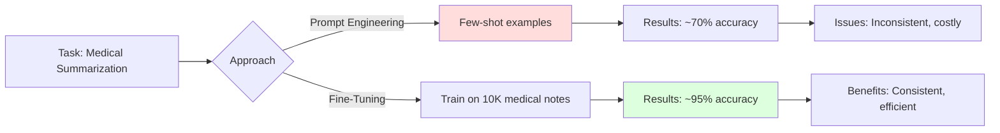
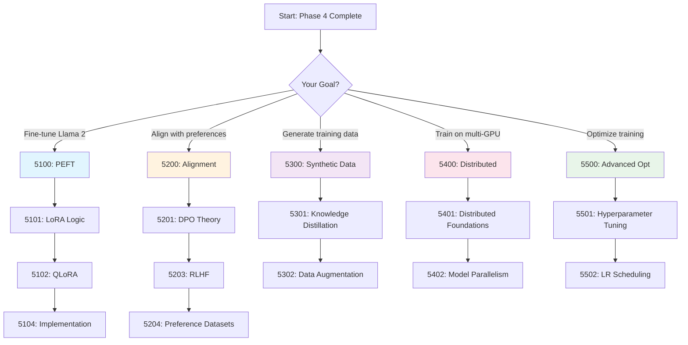

# Phase 5: Fine-Tuning & Alignment [5000]

## Table of Contents

- [Overview](#overview)
- [Why Fine-Tuning Matters](#why-fine-tuning-matters)
- [Fine-Tuning Methods Comparison](#fine-tuning-methods-comparison)
- [Module Structure](#module-structure)
- [Learning Path](#learning-path)
- [Key Takeaways](#key-takeaways)
- [Common Pitfalls](#common-pitfalls)
- [Pro Tips](#pro-tips)
- [Hardware Requirements](#hardware-requirements)
- [Related Experiments](#related-experiments)
- [Assessment](#assessment)
- [Related Topics](#related-topics)
- [Prerequisites](#prerequisites)

---

## Overview

**Adapting pre-trained models to your specific domain and tasks.**

This phase covers fine-tuning and alignment techniques to transform general-purpose LLMs into specialized, domain-expert models, enabling you to:
- Fine-tune models on consumer hardware (RTX 3090/4090)
- Use parameter-efficient methods (LoRA, QLoRA, PEFT)
- Align models with human preferences (DPO, RLHF)
- Generate synthetic training data
- Train across multiple GPUs efficiently

---

## Why Fine-Tuning Matters

### The Generalization Problem

```text
Pre-trained LLMs are generalists:
┌─────────────────────────────────────────────────────────┐
│ Base Model (e.g., Llama-2-70B)                          │
├─────────────────────────────────────────────────────────┤
│ + General knowledge (Wikipedia, books, web)             │
│ + Common reasoning patterns                             │
│ + Broad language understanding                          │
│ - Domain-specific terminology                           │
│ - Company-specific knowledge                            │
│ - Task-specific formatting                              │
│ - Aligned with your preferences                         │
└─────────────────────────────────────────────────────────┘

After Fine-Tuning:
┌─────────────────────────────────────────────────────────┐
│ Specialized Model                                       │
├─────────────────────────────────────────────────────────┤
│ + All base model capabilities                           │
│ + Domain-specific expertise (medical, legal, code)      │
│ + Task-specific behavior (summarization, extraction)    │
│ + Custom formatting and structure                       │
│ + Aligned with your requirements                        │
└─────────────────────────────────────────────────────────┘
```

### Fine-Tuning vs Prompt Engineering



---

## Fine-Tuning Methods Comparison

### Method Selection Matrix

| Method | VRAM Required | Training Speed | Quality | Best For |
|--------|--------------|----------------|---------|----------|
| **Full Fine-Tuning** | 140 GB (70B) | 1x | Excellent | Maximum adaptation |
| **LoRA** | 24 GB (70B) | 0.8x | Good | Most use cases |
| **QLoRA** | 12 GB (70B) | 0.6x | Good | Limited VRAM |
| **AdaLoRA** | 20 GB (70B) | 0.7x | Good | Dynamic adaptation |
| **Prefix Tuning** | 16 GB (70B) | 0.9x | Medium | Lightweight tasks |
| **Prompt Tuning** | 14 GB (70B) | 0.95x | Medium | Very simple tasks |
| **DPO** | 24 GB (70B) | 0.7x | Excellent | Alignment |

### VRAM Requirements by Model Size

```text
┌──────────────────────────────────────────────────────────────────┐
│                    VRAM Requirements (Training)                  │
├──────────────────────────────────────────────────────────────────┤
│ Model Size     │ Full FT │ LoRA  │ QLoRA │ DPO   │ Multi-GPU     │
├──────────────────────────────────────────────────────────────────┤
│ 1B (TinyLlama) │ 8 GB    │ 4 GB  │ 2 GB  │ 6 GB  │ Not needed    │
│ 7B (Llama-2)   │ 56 GB   │ 16 GB │ 8 GB  │ 18 GB │ 2× RTX 3090   │
│ 13B (Llama-2)  │ 104 GB  │ 24 GB │ 12 GB │ 28 GB │ 2× RTX 4090   │
│ 34B (CodeLlama)│ 272 GB  │ 48 GB │ 24 GB │ 52 GB │ 4× A100 40GB  │
│ 70B (Llama-2)  │ 560 GB  │ 80 GB │ 40 GB │ 96 GB │ 8× A100 80GB  │
└──────────────────────────────────────────────────────────────────┘

Recommended Hardware:
┌──────────────────────────────────────────────────────────┐
│ Hardware        │ Max Model (LoRA) │ Max Model (QLoRA)   │
├─────────────────┼──────────────────┼─────────────────────┤
│ RTX 3060 (12GB) │ 7B               │ 13B                 │
│ RTX 3090 (24GB) │ 13B              │ 34B                 │
│ RTX 4090 (24GB) │ 13B              │ 34B                 │
│ A100 40GB       │ 34B              │ 70B                 │
│ A100 80GB       │ 70B              │ 70B (with headroom) │
│ 2× RTX 3090     │ 34B              │ 70B                 │
└──────────────────────────────────────────────────────────┘
```

---

## Module Structure

### [5100] Parameter Efficient Fine-Tuning (PEFT)

| Document | Description | Time | Difficulty |
|----------|-------------|------|------------|
| [5101: LoRA Logic](./5100-peft/5101-LoRA-Logic.md) | Modifying without retraining 7B params | 3h | Intermediate |
| [5102: QLoRA Pipelines](./5100-peft/5102-QLoRA-Pipelines.md) | 4-bit fine-tuning on 11GB-class GPU | 3h | Intermediate |
| [5103: Adapters](./5100-peft/5103-Adapters.md) | Adapter layers and bottleneck | 2h | Intermediate |
| [5104: LoRA Implementation](./5100-peft/guides/5104-LoRA-Implementation-Guide.md) | Complete implementation guide | 3h | Advanced |
| [5105: Model Merging](./5100-peft/5105-Model-Merging.md) | Task vectors, TIES, DARE, soups | 3h | Advanced |

**What You'll Learn:**
- LoRA (Low-Rank Adaptation) theory and implementation
- QLoRA for 4-bit quantized fine-tuning
- Adapter layers and bottleneck architectures
- PEFT methods comparison and selection
- Model merging: task vectors, TIES sign election, DARE, checkpoint soups

**Hands-On Practice:**
- Implement LoRA from scratch
- Fine-tune Llama 2 with QLoRA on RTX 3090
- Compare LoRA vs full fine-tuning quality
- Optimize hyperparameters for your dataset
- Merge two fine-tunes with task arithmetic and TIES and compare the outcomes

### [5200] Supervised Fine-Tuning & Preference

| Document | Description | Time | Difficulty |
|----------|-------------|------|------------|
| [5201: DPO Theory](./5200-alignment/5201-DPO-Theory.md) | Direct Preference Optimization | 4h | Advanced |
| [5202: Alignment Orchestration](./5200-alignment/5202-Alignment-Orchestration.md) | Reward vs DPO | 3h | Advanced |
| [5203: RLHF](./5200-alignment/5203-RLHF.md) | Reinforcement Learning from Human Feedback | 4h | Advanced |
| [5204: Preference Dataset Creation](./5200-alignment/5204-Preference-Dataset-Creation.md) | Building preference pairs | 2h | Intermediate |
| [5205: GRPO and RLVR](./5200-alignment/5205-GRPO-RLVR.md) | Group-relative policy optimization with verifiable rewards | 4h | Advanced |
| [5206: Best-of-N and Rejection Sampling](./5200-alignment/5206-Best-of-N-and-Rejection-Sampling.md) | Inference-time reranking, overoptimization, and RSFT | 4h | Advanced |

**What You'll Learn:**
- Direct Preference Optimization (DPO) theory
- RLHF vs DPO comparison and trade-offs
- Reward model training and evaluation
- Preference dataset collection and curation
- Alignment orchestration strategies
- GRPO and verifiable-reward RL for reasoning models
- Best-of-N reranking, the overoptimization curve, and rejection-sampling fine-tuning

**Hands-On Practice:**
- Implement DPO from scratch
- Train reward models for RLHF
- Build preference datasets
- Align models with human values
- Run a GRPO stage with rule-based rewards
- Locate the BoN peak N and run the RSFT climb in the same world

### [5300] Synthetic Data Generation

| Document | Description | Time | Difficulty |
|----------|-------------|------|------------|
| [5301: Knowledge Distillation](./5300-synthetic/5301-Knowledge-Distillation.md) | Small models from big model outputs | 3h | Advanced |
| [5302: Distributed Training](./5300-synthetic/5302-Distributed-Training.md) | Distributed data generation | 3h | Advanced |
| [5303: Federated Learning](./5300-synthetic/5303-Federated-Learning.md) | Privacy-preserving training | 3h | Advanced |
| [5304: Self-Instruct and Model Collapse](./5300-synthetic/5304-Self-Instruct-and-Model-Collapse.md) | Instruction bootstrap and the recursion's collapse tax | 4h | Advanced |

**What You'll Learn:**
- Knowledge distillation from large to small models
- Synthetic data generation techniques
- Data augmentation strategies for LLMs
- Quality assessment for synthetic data
- Self-instruct and instruction tuning
- Model collapse: the recursion tax, the ten-percent anchor, the downstream proof

**Hands-On Practice:**
- Distill 70B model to 7B
- Generate synthetic training data
- Augment small datasets
- Evaluate synthetic data quality
- Train on synthetic mixes and read the downstream split

### [5400] Distributed Training

| Document | Description | Time | Difficulty |
|----------|-------------|------|------------|
| [5401: Data Parallelism](./5400-distributed-training/5401-Data-Parallelism.md) | Multi-GPU training basics | 3h | Intermediate |
| [5402: Model Parallelism](./5400-distributed-training/5402-Model-Parallelism.md) | Pipeline and tensor parallelism | 4h | Advanced |
| [5403: Mixed Precision](./5400-distributed-training/5403-Mixed-Precision.md) | FP16/BF16 training strategies | 2h | Intermediate |
| [5404: Distributed Optimization](./5400-distributed-training/5404-Distributed-Optimization.md) | Gradient sync and all-reduce | 3h | Advanced |
| [5405: FSDP2 and torchao](./5400-distributed-training/5405-FSDP2-and-torchao.md) | Composable sharding and quantized training | 4h | Advanced |

**What You'll Learn:**
- Distributed training fundamentals (DDP, FSDP)
- Data parallelism vs model parallelism
- Pipeline parallelism for large models
- Tensor parallelism implementation
- Mixed precision training (FP16, BF16)
- Gradient compression and communication optimization
- FSDP2 per-parameter sharding and torchao float8/QAT training

**Hands-On Practice:**
- Set up multi-GPU training with DDP
- Implement pipeline parallelism
- Apply mixed precision training
- Optimize communication overhead

### [5500] Advanced Optimization

| Document | Description | Time | Difficulty |
|----------|-------------|------|------------|
| [5501: Optimizer Variants](./5500-advanced-optimization/5501-Optimizer-Variants.md) | Adam, AdamW, Sophia, Lion | 3h | Intermediate |
| [5502: Learning Rate Scheduling](./5500-advanced-optimization/5502-Learning-Rate-Scheduling.md) | Warmup, cosine decay, cyclic | 3h | Intermediate |
| [5503: Advanced Techniques](./5500-advanced-optimization/5503-Advanced-Techniques.md) | Gradient clipping, SAM, regularization | 4h | Advanced |

**What You'll Learn:**
- Hyperparameter optimization strategies
- Learning rate scheduling (warmup, cosine, cyclic)
- Advanced optimization techniques (SAM, AdEM)
- Gradient clipping and stabilization
- Regularization methods for LLMs
- Multi-task and curriculum learning

**Hands-On Practice:**
- Perform hyperparameter sweeps
- Implement custom learning rate schedulers
- Apply advanced optimization techniques
- Train models on multiple tasks

---

## Learning Path

### Recommended Flow



### Time Estimates

| Module | Reading | Practice | Total |
|--------|---------|----------|-------|
| 5100: PEFT | 14h | 8h | 22h |
| 5200: Alignment | 21h | 10h | 31h |
| 5300: Synthetic Data | 11h | 6h | 17h |
| 5400: Distributed Training | 16h | 8h | 24h |
| 5500: Advanced Optimization | 13h | 8h | 21h |
| **Total** | **75h** | **40h** | **115h** |

---

## Key Takeaways

### You Will Learn

After completing this phase, you will be able to:

1. **Fine-Tune on Consumer Hardware**
   - Apply LoRA and QLoRA for efficient training
   - Fine-tune 70B models on RTX 3090/4090
   - Reduce VRAM requirements by 4-8x

2. **Choose the Right Fine-Tuning Method**
   - LoRA for most use cases
   - QLoRA for limited VRAM
   - Full fine-tuning for maximum adaptation
   - DPO for alignment

3. **Align Models with Human Preferences**
   - Implement DPO and RLHF
   - Create preference datasets
   - Evaluate alignment quality
   - Balance helpfulness and safety

4. **Generate Synthetic Training Data**
   - Distill knowledge from large models
   - Augment small datasets
   - Create instruction-tuning datasets
   - Evaluate synthetic data quality

5. **Train Across Multiple GPUs**
   - Apply data and model parallelism
   - Use mixed precision training
   - Optimize communication overhead
   - Scale to 70B+ parameter models

6. **Optimize Training Performance**
   - Tune hyperparameters effectively
   - Apply learning rate scheduling
   - Use advanced optimization techniques
   - Train on multiple tasks

---

## Common Pitfalls

### Pitfall 1: Overfitting to Small Datasets

**Pitfall:** Fine-tuning on insufficient data
```python
# Wrong: Fine-tuning on 100 examples
model = train(model, dataset=small_dataset, epochs=10)
# Result: Model memorizes training data, poor generalization

# Right: Use adequate data or strong regularization
model = train(
    model,
    dataset=large_dataset,  # 10K+ examples
    epochs=3,
    regularization={
        'weight_decay': 0.01,
        'dropout': 0.1,
        'early_stopping': True
    }
)
```

### Pitfall 2: Catastrophic Forgetting

**Pitfall:** Losing pre-trained knowledge during fine-tuning
```python
# Wrong: High learning rate destroys pre-trained weights
optimizer = Adam(model.parameters(), lr=1e-3)
# Result: Model forgets general knowledge

# Right: Conservative learning rates for pre-trained weights
optimizer = Adam([
    {'params': pretrained_params, 'lr': 1e-6},
    {'params': lora_params, 'lr': 1e-4}
])
```

### Pitfall 3: Improper Evaluation

**Pitfall:** Not validating on held-out data
```python
# Wrong: Only evaluating on training set
train_loss = train(model, train_data)
# Result: No indication of overfitting

# Right: Proper train/validation/test split
train_loss, val_loss = train(
    model,
    train_data,
    validation_data=val_data
)
test_metrics = evaluate(model, test_data)
```

### Pitfall 4: VRAM Exhaustion

**Pitfall:** Underestimating memory requirements
```python
from transformers import AutoModelForCausalLM
import torch
# Wrong: Loading full model on single GPU
model = AutoModelForCausalLM.from_pretrained("meta-llama/Llama-2-70b")
# Error: CUDA out of memory

# Right: Use quantization + gradient checkpointing
model = AutoModelForCausalLM.from_pretrained(
    "meta-llama/Llama-2-70b",
    load_in_4bit=True,
    device_map="auto",
    dtype=torch.float16
)
model.gradient_checkpointing_enable()
```

### Pitfall 5: Poor Hyperparameter Choices

**Pitfall:** Using default hyperparameters
```python
# Wrong: Default learning rate may be too high
trainer = Trainer(model, args=TrainingArguments(
    learning_rate=5e-5  # Default, often too high for PEFT
))

# Right: Tune hyperparameters for your task
trainer = Trainer(model, args=TrainingArguments(
    learning_rate=2e-4,  # Higher for LoRA adapters
    warmup_ratio=0.03,
    weight_decay=0.01,
    lr_scheduler_type="cosine"
))
```

---

## Pro Tips

### Efficient LoRA Configuration

**Tip:** Optimal LoRA rank and alpha
```python
# Rule of thumb: alpha = 2 * rank
lora_config = {
    'r': 16,           # Rank (higher = more capacity)
    'lora_alpha': 32,  # Scaling factor (2 * rank)
    'lora_dropout': 0.1,
    'target_modules': ['q_proj', 'v_proj'],  # Attention only
}

# For more complex tasks:
lora_config = {
    'r': 64,
    'lora_alpha': 128,
    'target_modules': ['q_proj', 'k_proj', 'v_proj', 'o_proj',
                       'gate_proj', 'up_proj', 'down_proj']
}
```

### QLoRA Memory Optimization

**Tip:** Maximum memory efficiency with QLoRA
```python
from transformers import AutoModelForCausalLM
import torch
from transformers import BitsAndBytesConfig

bnb_config = BitsAndBytesConfig(
    load_in_4bit=True,
    bnb_4bit_use_double_quant=True,  # Double quantization
    bnb_4bit_quant_type="nf4",       # Normal Float 4
    bnb_4bit_compute_dtype=torch.bfloat16
)

model_name = "meta-llama/Llama-3.1-8B-Instruct"

model = AutoModelForCausalLM.from_pretrained(
    model_name,
    quantization_config=bnb_config,
    gradient_checkpointing=True,
    device_map="auto"
)
```

### DPO Dataset Construction

**Tip:** Create high-quality preference pairs
```python
# Good preference pair characteristics:
# 1. Same prompt, two different responses
# 2. Clear quality difference
# 3. No ambiguity in which is better
# 4. Diverse prompts across distribution

preference_pair = {
    'prompt': "Explain quantum computing",
    'chosen': "Quantum computing uses quantum bits...",
    'rejected': "Quantum is like computers but faster"  # Too vague
}

# Avoid:
# - Chosen and rejected are similar quality
# - Rejected is actually good
# - Prompt-specific formatting only
```

### Multi-GPU Training Strategy

**Tip:** Choose the right parallelism strategy
```python
# Data Parallelism: Best for small models, multiple GPUs
# Use when: Model fits on 1 GPU, want faster training

# Model Parallelism: Best for large models
# Use when: Model doesn't fit on 1 GPU

# Pipeline Parallelism: Best for sequential layers
# Use when: Want to minimize idle time

# Hybrid: Best for 70B+ models
model_parallel_size = 4
data_parallel_size = 2
world_size = model_parallel_size * data_parallel_size  # 8 GPUs
```

### Learning Rate Scheduling

**Tip:** Cosine decay with warmup for LLMs
```python
from transformers import get_cosine_with_min_lr_schedule_with_warmup

# 3% warmup, then cosine decay to 10% of initial LR
num_training_steps = len(train_dataset) // batch_size * epochs
warmup_steps = int(num_training_steps * 0.03)

scheduler = get_cosine_with_min_lr_schedule_with_warmup(
    optimizer,
    num_warmup_steps=warmup_steps,
    num_training_steps=num_training_steps,
    num_cycles=0.5,  # Half cosine cycle
    min_lr_ratio=0.1  # Decay to 10%
)
```

---

## Hardware Requirements

### Minimum Configuration

```text
┌───────────────────────────────────────────────────┐
│              Minimum Requirements (QLoRA)         │
├───────────────────────────────────────────────────┤
│ Model Size │ GPU           │ System RAM │ Storage │
├────────────┼───────────────┼────────────┼─────────┤
│ 7B         │ RTX 3060 12GB │ 32 GB      │ 50 GB   │
│ 13B        │ RTX 3090 24GB │ 64 GB      │ 100 GB  │
│ 34B        │ 2× RTX 3090   │ 128 GB     │ 200 GB  │
│ 70B        │ 4× A100 40GB  │ 256 GB     │ 400 GB  │
└───────────────────────────────────────────────────┘
```

### Recommended Configuration

```text
┌───────────────────────────────────────────────────┐
│            Recommended Requirements (LoRA)        │
├───────────────────────────────────────────────────┤
│ Model Size │ GPU           │ System RAM │ Storage │
├────────────┼───────────────┼────────────┼─────────┤
│ 7B         │ RTX 4090 24GB │ 32 GB      │ 50 GB   │
│ 13B        │ 2× RTX 3090   │ 64 GB      │ 100 GB  │
│ 34B        │ 4× A100 40GB  │ 128 GB     │ 200 GB  │
│ 70B        │ 8× A100 80GB  │ 512 GB     │ 500 GB  │
└───────────────────────────────────────────────────┘
```

### Training Performance Benchmarks

| Hardware | Model | Method | Tokens/sec | Time/epoch (1M tokens) |
|----------|-------|--------|------------|------------------------|
| RTX 3060 | 7B | QLoRA | 1,200 | 13.9 min |
| RTX 3090 | 7B | LoRA | 3,500 | 4.8 min |
| RTX 4090 | 13B | QLoRA | 2,800 | 6.0 min |
| 2× A100 40GB | 34B | LoRA | 8,500 | 2.0 min |
| 8× A100 80GB | 70B | QLoRA | 15,000 | 1.1 min |

---

## Related Experiments

### Hands-on Practice

1. **[EXP_5101: LoRA](../../../experiments/EXP_5101_LORA.md)**
   - Implement LoRA from scratch
   - Fine-tune Llama 2 on custom dataset
   - Compare rank configurations

2. **[EXP_5102: QLoRA](../../../experiments/EXP_5102_QLORA.md)**
   - Apply QLoRA to 70B model
   - Benchmark memory efficiency
   - Compare quality vs full fine-tuning

3. **[EXP_5201: DPO](../../../experiments/EXP_5201_DPO.md)**
   - Implement DPO from scratch
   - Create preference dataset
   - Align model with preferences

4. **[EXP_5301: Knowledge Distillation](../../../experiments/EXP_5301_DISTILLATION.md)**
   - Distill 70B to 7B
   - Compare teacher vs student
   - Optimize distillation loss

   - Set up multi-GPU training
   - Benchmark scaling efficiency
   - Optimize communication

---

## Prerequisites

Before starting this phase, ensure you understand:

- **PyTorch Training Loops** (from 2400: Pre-training)
- **Transformer Architecture** (from 3400: Architectures)
- **Gradient Descent** (from 2300: Optimization)
- **Basic Linear Algebra** (from 2100: Calculus)

See [PREREQUISITES](../../00-META/ENVIRONMENT-SETUP.md) for details.

---

## Assessment

Validate your knowledge with:

- **[Phase 5 Checkpoint](./CHECKPOINT.md)** - Module-by-module phase-exit review
- **[Phase 5 Quiz](../../00-META/assessment/phase5-quiz.md)** - Test your understanding (30 questions, 80% to pass)
- **[Phase 5 Practice](../../00-META/assessment/phase5-practice.md)** - Hands-on exercises

---

## Related Topics

- **4100: Quantization** - QLoRA requires quantization knowledge
- **4300: QAT** - Quantization-aware training
- **6100: RAG** - Combine fine-tuning with retrieval
- **7100: Agents** - Deploy fine-tuned models in agents

---

## Next Steps

After completing this phase:

1. **Apply to Your Projects**
   - Fine-tune models for your domain
   - Create specialized AI assistants
   - Optimize training for your hardware

2. **Continue Learning**
   - **Phase 6:** Build RAG systems
   - **Phase 7:** Create agentic AI systems
   - **Industry Guides:** Domain-specific applications

---

**Module Duration:** 96 hours (56 reading + 40 practice)
**Difficulty:** ⭐⭐⭐ Advanced

**Ready to fine-tune LLMs?** Start with [5101: LoRA Logic](./5100-peft/5101-LoRA-Logic.md) or [5102: QLoRA Pipelines](./5100-peft/5102-QLoRA-Pipelines.md)
