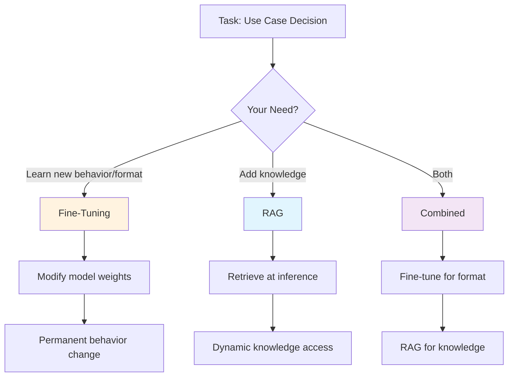
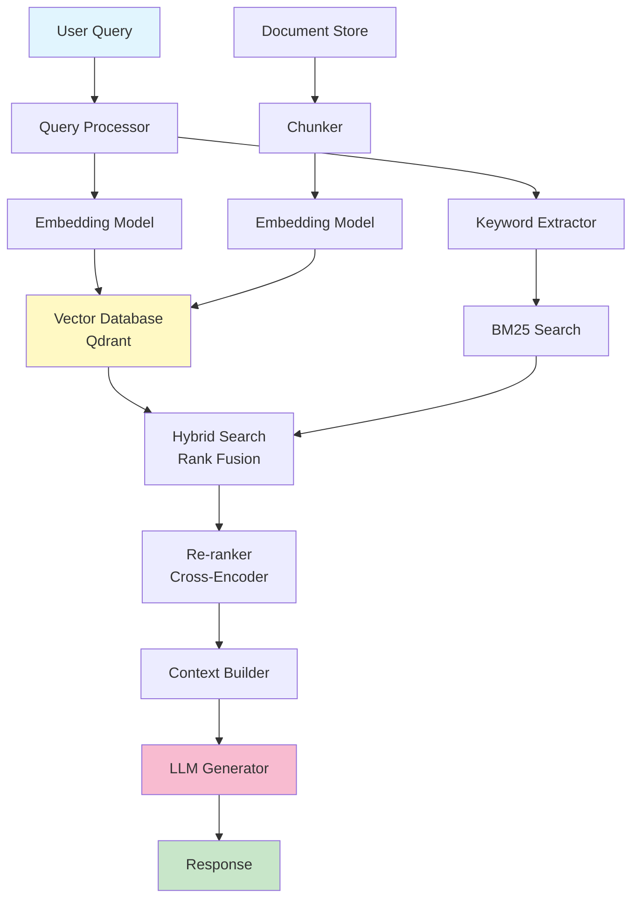
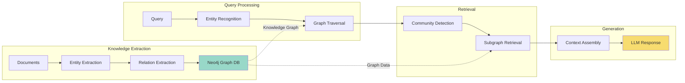
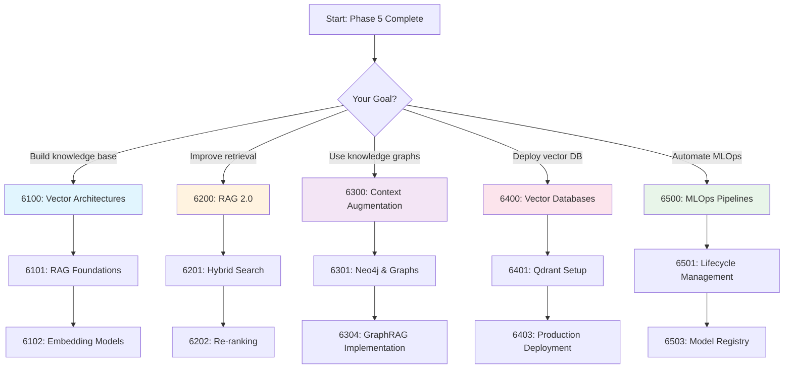

# Phase 6: Data Nexus - RAG, CAG & External Memory [6000]

## Table of Contents

- [Overview](#overview)
- [Why RAG Matters](#why-rag-matters)
- [RAG Pipeline Architecture](#rag-pipeline-architecture)
- [GraphRAG Architecture](#graphrag-architecture)
- [Vector Database Comparison](#vector-database-comparison)
- [Cost Analysis](#cost-analysis)
- [Module Structure](#module-structure)
- [Learning Path](#learning-path)
- [Key Takeaways](#key-takeaways)
- [Common Pitfalls](#common-pitfalls)
- [Pro Tips](#pro-tips)
- [Performance Benchmarks](#performance-benchmarks)
- [Related Experiments](#related-experiments)

---

## Overview

**Augmenting LLMs with external knowledge from your data.**

This phase covers Retrieval-Augmented Generation (RAG), Context-Augmented Generation (CAG), and external memory systems to integrate your own data into the LLM logic flow, enabling you to:
- Build enterprise knowledge bases from your documents
- Implement hybrid search (vector + keyword)
- Create knowledge graphs with Neo4j
- Handle millions of documents efficiently
- Reduce hallucination with grounded responses

---

## Why RAG Matters

### The Knowledge Cutoff Problem

```text
┌─────────────────────────────────────────────────────────┐
│               Base LLM Limitations                      │
├─────────────────────────────────────────────────────────┤
│ - Training data cutoff (can't access recent info)       │
│ - No access to private documents                        │
│ - No knowledge of your company/processes                │
│ - Hallucinations (making things up)                     │
│ - No source attribution                                 │
└─────────────────────────────────────────────────────────┘

With RAG:
┌─────────────────────────────────────────────────────────┐
│               RAG-Enhanced LLM                          │
├─────────────────────────────────────────────────────────┤
│ + Access to real-time information                       │
│ + Uses your private documents                           │
│ + Knows your company's specific processes               │
│ + Grounded responses (with citations)                   │
│ + Source attribution and traceability                   │
│ + Updatable without retraining                          │
└─────────────────────────────────────────────────────────┘
```

### RAG vs Fine-Tuning



### Use Case Comparison

| Scenario | Best Approach | Why |
|----------|--------------|-----|
| **Medical assistant with latest research** | RAG | Knowledge changes frequently |
| **Company-specific response format** | Fine-tuning | Behavior pattern, not knowledge |
| **Legal assistant with case law** | RAG | Need source attribution |
| **Code generation with specific style** | Fine-tuning | Behavioral adaptation |
| **Customer support with product info** | RAG + Fine-tuning | Both knowledge and tone |
| **Internal knowledge base** | RAG | Dynamic document updates |

---

## RAG Pipeline Architecture



### Pipeline Components

```text
┌──────────────────────────────────────────────────────────────────┐
│                     RAG Pipeline Breakdown                       │
├──────────────────────────────────────────────────────────────────┤
│ Component           │ Function                                   │
├──────────────────────────────────────────────────────────────────┤
│ Query Processor     │ Clean, normalize, expand queries           │
│ Embedding Model     │ Convert text to vectors (384-1536 dim)     │
│ Keyword Extractor   │ Extract terms for BM25 search              │
│ Vector Database     │ Store and search embeddings (HNSW index)   │
│ BM25 Search         │ Keyword-based sparse retrieval             │
│ Hybrid Search       │ Combine vector + keyword (RRF/Reciprocal)  │
│ Re-ranker           │ Refine results with cross-encoder          │
│ Context Builder     │ Assemble retrieved chunks into prompt      │
│ LLM Generator       │ Generate response with context             │
└──────────────────────────────────────────────────────────────────┘
```

---

## GraphRAG Architecture



### GraphRAG vs Vector RAG

| Aspect | Vector RAG | GraphRAG | Combined |
|--------|-----------|----------|----------|
| **Best For** | Semantic similarity | Complex relationships | Both |
| **Query Type** | "Similar documents" | "Connected entities" | Rich queries |
| **Database** | Qdrant, Pinecone | Neo4j, NebulaGraph | Both |
| **Latency** | Low (50-200ms) | Medium (100-500ms) | Medium |
| **Setup Complexity** | Low | High | High |
| **Use Cases** | Document search, QA | Reasoning, inference | Advanced QA |

### When to Use GraphRAG

```text
+ Use GraphRAG when:
   - Questions require multi-hop reasoning
   - Relationships between entities matter
   - Need to trace connections (supply chain, dependencies)
   - Questions like "Who is connected to X through Y?"
   - Need community detection and clustering

- Use Vector RAG when:
   - Simple semantic similarity is enough
   - Documents are flat (no relationships)
   - Need fastest possible retrieval
   - Questions are straightforward
```

---

## Vector Database Comparison

### Database Selection Matrix

| Database | Open Source | Cloud | Best For | Latency | Scalability |
|----------|-------------|-------|----------|---------|-------------|
| **Qdrant** | Yes | Yes | HomeLab/Self-hosted | Excellent | Good |
| **Pinecone** | No | Yes | Quick start, managed | Excellent | Excellent |
| **Weaviate** | Yes | Yes | Multi-modal search | Good | Good |
| **Milvus** | Yes | Yes | Large-scale deployments | Good | Excellent |
| **Chroma** | Yes | No | Simple Python apps | Medium | Basic |
| **pgvector** | Yes | No | Existing PostgreSQL | Medium | Medium |

### Feature Comparison

```text
┌─────────────────────────────────────────────────────────────────┐
│                    Feature Comparison                           │
├─────────────────────────────────────────────────────────────────┤
│ Feature          │ Qdrant │ Pinecone │ Weaviate │ Milvus │ pgv  │
├─────────────────────────────────────────────────────────────────┤
│ Hybrid Search    │   Y    │    Y     │    Y     │   Y    │  N   │
│ Filtering        │   Y    │    Y     │    Y     │   Y    │  Y   │
│ Quantization     │   Y    │    Y     │    Y     │   Y    │  N   │
│ Replication      │   Y    │    Y     │    Y     │   Y    │  Y   │
│ Sharding         │   Y    │    Y     │    Y     │   Y    │  N   │
│ Multi-modal      │   Y    │    Y     │    Y     │   Y    │  N   │
│ Disk Index       │   Y    │    Y     │    Y     │   Y    │  N   │
│ Easy Setup       │   Y    │    Y     │    Y     │   !    │  Y   │
│ Self-hosted      │   Y    │    N     │    Y     │   Y    │  Y   │
│ Docker Ready     │   Y    │    N     │    !     │   !    │  Y   │
└─────────────────────────────────────────────────────────────────┘
```

### Vector DB Benchmarks

| Database | Queries/sec (1M vectors) | P95 Latency | Memory (1M, 768d) |
|----------|-------------------------|-------------|-------------------|
| Qdrant | 10,000 | 15ms | 2.5 GB |
| Pinecone | 12,000 | 12ms | 3 GB (managed) |
| Weaviate | 8,000 | 20ms | 3.5 GB |
| Milvus | 15,000 | 10ms | 2 GB |
| pgvector | 5,000 | 50ms | 4 GB |

---

## Cost Analysis

### Cloud vs Self-Hosted (10M documents)

```text
┌────────────────────────────────────────────────────────────────┐
│               Annual Cost Comparison (10M docs)                │
├────────────────────────────────────────────────────────────────┤
│ Provider             │ Storage │ Queries  │ Total/Year         │
├──────────────────────┼─────────┼──────────┼────────────────────┤
│ Pinecone (Starter)   │ $70/mo  │ Included │ $840               │
│ Pinecone (Prod)      │ $200/mo │ $0.10/1M │ $2,400 + queries   │
│ Weaviate Cloud       │ $150/mo │ Included │ $1,800             │
│ Qdrant Cloud         │ $100/mo │ Included │ $1,200             │
│ ──────────────────┼───────────┼───────────┼──────────────────  │
│ Self-Hosted Qdrant   │ $0*     │ $0*      │ $0 (hardware only) │
│ Self-Hosted pgvector │ $0*     │ $0*      │ $0 (hardware only) │
└────────────────────────────────────────────────────────────────┘

* Assumes an existing self-hosted machine (mini PC, used office PC, NAS, or VPS)
* Example hardware: used mini PC $150-300; new entry-level mini PC $300-500; small VPS $60-120/year
```

### Break-Even Analysis

```text
Scenario: 1M documents, 100K queries/day

Cloud (Pinecone):
- Storage: $70/month
- Queries: 100K × 30 × $0.10/1M = $300/month
- Total: $370/month = $4,440/year

Self-Hosted (Qdrant on an entry-level box):
- Hardware: $150-500 one-time (mini PC / used office PC)
- Storage: Existing machine disk
- Queries: $0
- Break-even: $500 / ($370/month) ≈ 1.4 months

Conclusion: Self-hosted pays for itself within a few months
```

---

## Module Structure

### [6100] Vector Architectures

| Document | Description | Time | Difficulty |
|----------|-------------|------|------------|
| [6101: RAG Foundations](./6100-vector/6101-HNSW-Indexing.md) | Efficient semantic search at scale | 3h | Intermediate |
| [6102: Embedding Models](./6100-vector/6102-Semantic-Similarity.md) | Cosine, Dot-Product, Manifold metrics | 3h | Intermediate |
| [6103: HNSW Tuning](./6100-vector/guides/6103-HNSW-Tuning-Guide.md) | HNSW optimization guide | 2h | Advanced |

**What You'll Learn:**
- HNSW (Hierarchical Navigable Small World) indexing
- Embedding model selection and comparison
- Semantic similarity metrics (cosine, dot-product)
- Vector space optimization

**Hands-On Practice:**
- Implement HNSW indexing from scratch
- Benchmark embedding models
- Optimize index parameters
- Compare similarity metrics

### [6200] Retrieval-Augmented Generation (RAG 2.0)

| Document | Description | Time | Difficulty |
|----------|-------------|------|------------|
| [6201: Hybrid Search](./6200-retrieval/6201-Hybrid-Search.md) | BM25 + Vector combination | 3h | Intermediate |
| [6202: Re-ranking](./6200-retrieval/6202-Re-ranking-and-Retrieval-Logistics.md) | Post-search relevance filtering | 3h | Intermediate |
| [6203: Advanced Retrieval](./6200-retrieval/6203-Advanced-Retrieval.md) | Query expansion, fusion | 2h | Advanced |

**What You'll Learn:**
- Hybrid search (dense + sparse retrieval)
- BM25 keyword search implementation
- Re-ranking with cross-encoders
- Rank fusion strategies
- Query expansion techniques

**Hands-On Practice:**
- Build hybrid search pipeline
- Implement re-ranking layer
- Optimize retrieval precision/recall
- A/B test retrieval strategies

### [6300] Context Augmentation

| Document | Description | Time | Difficulty |
|----------|-------------|------|------------|
| [6301: Neo4j and Knowledge Graphs](./6300-context/6301-Neo4j-and-Knowledge-Graphs.md) | Neo4j and Knowledge Graphs | 5h | Advanced |
| [6302: Caching and Memory](./6300-context/6302-CAG-Long-Context-Architectures.md) | 128k+ token as "Temporary Database" | 5h | Advanced |
| [6303: Neo4j Deployment](./6300-context/guides/6303-Neo4j-Deployment-Guide.md) | Neo4j setup guide | 2h | Advanced |
| [6304: GraphRAG Implementation](./6300-context/guides/6304-GraphRAG-Implementation.md) | Complete GraphRAG pipeline | 4h | Advanced |

**What You'll Learn:**
- Knowledge graph construction
- GraphRAG vs Vector RAG
- Context window optimization
- Long-context architectures (128k+)
- Graph traversal algorithms

**Hands-On Practice:**
- Build knowledge graph with Neo4j
- Implement GraphRAG pipeline
- Optimize long-context usage
- Deploy Neo4j with Docker

### [6400] Vector Databases

| Document | Description | Time | Difficulty |
|----------|-------------|------|------------|
| [6401: Qdrant Setup](./6400-vector-databases/6401-Qdrant-Setup.md) | Qdrant configuration | 3h | Intermediate |
| [6402: Pinecone vs Weaviate](./6400-vector-databases/6402-Pinecone-vs-Weaviate.md) | Comparison guide | 3h | Intermediate |
| [6403: Qdrant Production Deployment](./6400-vector-databases/guides/6403-Qdrant-Production-Deployment.md) | Production deployment guide | 2h | Intermediate |

**What You'll Learn:**
- Qdrant architecture and configuration
- Vector database comparison
- Deployment strategies
- Self-hosted Docker deployment
- Performance optimization

**Hands-On Practice:**
- Deploy Qdrant with Docker Compose
- Configure collections and indexes
- Benchmark performance
- Set up replication

### [6500] MLOps Pipelines for RAG

| Document | Description | Time | Difficulty |
|----------|-------------|------|------------|
| [6501: ML Lifecycle Management](./6500-mlops-pipelines/6501-ML-Lifecycle-Management.md) | End-to-end ML pipeline for RAG | 4h | Advanced |
| [6502: CI/CD for ML](./6500-mlops-pipelines/6502-CI-CD-for-ML.md) | Automated testing and deployment | 4h | Advanced |
| [6503: Model Registry](./6500-mlops-pipelines/6503-Model-Registry.md) | Versioning and lineage tracking | 4h | Advanced |

**What You'll Learn:**
- ML lifecycle management for RAG systems
- CI/CD pipelines with automated testing
- Model registries, versioning, and lineage
- Monitoring and drift detection
- Production deployment strategies

**Hands-On Practice:**
- Build an ML pipeline for RAG
- Set up GitHub Actions for ML
- Implement automated model testing
- Deploy and monitor a RAG system

---

## Learning Path

### Recommended Flow



### Time Estimates

| Module | Reading | Practice | Total |
|--------|---------|----------|-------|
| 6100: Vector Architectures | 8h | 6h | 14h |
| 6200: RAG 2.0 | 8h | 6h | 14h |
| 6300: Context Augmentation | 16h | 10h | 26h |
| 6400: Vector Databases | 8h | 4h | 12h |
| 6500: MLOps Pipelines | 12h | — | 12h |
| **Total** | **52h** | **26h** | **78h** |

*6500 practice time is not yet estimated in its PRACTICE.md; phase totals cover the estimated modules.*

---

## Key Takeaways

### You Will Learn

After completing this phase, you will be able to:

1. **Build Enterprise Knowledge Bases**
   - Index millions of documents efficiently
   - Retrieve relevant context in milliseconds
   - Scale to handle concurrent queries

2. **Implement Hybrid Search**
   - Combine vector and keyword search
   - Apply re-ranking for precision
   - Optimize retrieval parameters

3. **Use Knowledge Graphs**
   - Extract entities and relationships
   - Build graph databases with Neo4j
   - Implement GraphRAG for complex queries

4. **Choose the Right Vector Database**
   - Compare Qdrant, Pinecone, Weaviate
   - Deploy self-hosted with Docker
   - Optimize for your use case

5. **Handle Long Contexts**
   - Use 128k+ context windows effectively
   - Implement caching strategies
   - Reduce retrieval latency

---

## Common Pitfalls

### Poor Chunking Strategy

**Pitfall:** Chunking documents without context
```python
# Wrong: Fixed-size chunks break sentences
chunks = [text[i:i+512] for i in range(0, len(text), 512)]
# Result: Incomplete sentences, lost context

# Right: Semantic chunking with overlap
from semantic_text_splitter import TextSplitter

splitter = TextSplitter(
    max_chunk_size=512,
    overlap=50,  # Maintain context
    split_on=['\n\n', '\n', '. ']  # Respect boundaries
)
chunks = splitter.split_text(text)
```

### Ignoring Embedding Model Mismatch

**Pitfall:** Using different models for index and query
```python
# Wrong: Different embedding models
index_embeddings = openai_embed("text-embedding-ada-002", docs)
query_embedding = sentence_transformers_embed("all-MiniLM-L6-v2", query)
# Result: Poor retrieval performance

# Right: Use same model for both
embedding_model = SentenceTransformer("all-MiniLM-L6-v2")
index_embeddings = embedding_model.encode(docs)
query_embedding = embedding_model.encode(query)
```

### Not Optimizing HNSW Parameters

**Pitfall:** Using default HNSW parameters
```python
# Wrong: Default parameters
index = HNSWIndex(space='cosine')
# Result: Suboptimal performance

# Right: Tuned parameters
index = HNSWIndex(
    space='cosine',
    M=16,              # Higher = better recall, more memory
    ef_construction=200,  # Higher = better index quality
    ef_search=100       # Higher = better recall, slower
)
```

### No Re-ranking

**Pitfall:** Trusting initial retrieval blindly
```python
# Wrong: Use top-k directly
results = vector_db.search(query, k=10)
context = results
# Result: May miss relevant documents

# Right: Re-rank with cross-encoder
initial_results = vector_db.search(query, k=50)
reranked = cross_encoder_rerank(query, initial_results)
context = reranked[:10]
```

### Ignoring Metadata Filtering

**Pitfall:** Not pre-filtering with metadata
```python
# Wrong: Search all documents, then filter
results = vector_db.search(query)
filtered = [r for r in results if r.date > "2024-01-01"]
# Result: Slow, expensive

# Right: Filter during search
results = vector_db.search(
    query,
    filter={"date": {"gt": "2024-01-01"}}
)
```

---

## Pro Tips

### Chunking Strategy

**Tip:** Use semantic chunking with overlap
```python
# Recommended chunking for RAG:
# - Size: 512-1024 tokens
# - Overlap: 10-20%
# - Boundaries: Respect sentences/paragraphs

chunks = chunk_text(
    text,
    chunk_size=768,
    chunk_overlap=128,
    separator=['\n\n', '\n', '. ', ' ']
)
```

### Embedding Model Selection

**Tip:** Choose model based on use case
```python
# Speed-critical: all-MiniLM-L6-v2 (384d, 20ms)
# Balanced: all-mpnet-base-v2 (768d, 50ms)
# Quality: bge-large-en-v1.5 (1024d, 100ms)
# Multilingual: multilingual-e5-large (1024d, 120ms)

model = SentenceTransformer("all-MiniLM-L6-v2")  # Start here
```

### Hybrid Search Weights

**Tip:** Tune alpha for hybrid search
```python
# Alpha = weight for dense (vector) search
# 1-alpha = weight for sparse (BM25) search

# Start with 0.5 (equal weight)
alpha = 0.5

# Increase if semantic similarity is important
alpha = 0.7  # Vector-heavy

# Decrease if exact keywords matter
alpha = 0.3  # Keyword-heavy
```

### Reducing Hallucinations

**Tip:** Use citations and confidence scores
```python
# Add source citations to response
response = generate_with_citations(
    query=query,
    context=context,
    include_sources=True,
    min_confidence=0.7  # Only cite high-confidence
)

# Template:
# "According to [Document A], ... However, [Document B] suggests..."
```

### Cost Optimization

**Tip:** Quantize embeddings for storage
```python
# Store as uint8 instead of float32
# Reduces storage by 4x with minimal accuracy loss

import numpy as np

# Quantize to uint8
embeddings_fp32 = model.encode(texts)
embeddings_uint8 = (embeddings_fp32 * 127 + 128).astype(np.uint8)

# Dequantize for search
embeddings_fp32_reconstructed = (embeddings_uint8.astype(np.float32) - 128) / 127
```

---

## Performance Benchmarks

### Retrieval Performance (1M documents)

| Method | Recall@10 | Latency (P95) | Throughput |
|--------|-----------|---------------|------------|
| **Vector-only** | 0.75 | 50ms | 10K q/s |
| **BM25-only** | 0.60 | 20ms | 50K q/s |
| **Hybrid (α=0.5)** | 0.85 | 80ms | 6K q/s |
| **Hybrid + Re-rank** | 0.92 | 150ms | 3K q/s |
| **GraphRAG** | 0.88 | 200ms | 2K q/s |

### Embedding Model Performance

| Model | Dimensions | Speed | MTEB Score | Best For |
|-------|------------|-------|------------|----------|
| **all-MiniLM-L6-v2** | 384 | 20ms | 0.59 | Speed |
| **all-mpnet-base-v2** | 768 | 50ms | 0.63 | Balance |
| **bge-large-en-v1.5** | 1024 | 100ms | 0.64 | Quality |
| **e5-large-v2** | 1024 | 90ms | 0.62 | RAG |
| **text-embedding-3-small** | 1536 | 30ms | 0.61 | GPT apps |

### Hardware Requirements

| Task | GPU | CPU | RAM |
|------|-----|-----|-----|
| **Embedding (small model)** | No | Yes | 4 GB |
| **Embedding (large model)** | Yes | Yes | 8 GB |
| **Vector DB (1M docs)** | No | Yes | 8 GB |
| **Vector DB (10M docs)** | No | Yes | 32 GB |
| **Re-ranking** | Yes | Yes | 8 GB |
| **GraphRAG** | Yes | Yes | 16 GB |

---

## Related Experiments

### Hands-on Practice

1. **[EXP_6101: HNSW](../../../experiments/EXP_6101_HNSW.md)**
   - Implement HNSW indexing
   - Benchmark index parameters
   - Compare search algorithms

2. **[EXP_6201: Hybrid Search](../../../experiments/EXP_6201_HYBRID_SEARCH.md)**
   - Build hybrid search pipeline
   - Tune rank fusion weights
   - Compare vs vector-only

3. **[EXP_6303: Neo4j](../../../experiments/EXP_6303_NEO4J.md)**
   - Deploy Neo4j with Docker
   - Build knowledge graph
   - Implement GraphRAG

4. **[EXP_6401: Vector DB](../../../experiments/EXP_6401_VECTOR_DB.md)**
   - Deploy Qdrant
   - Index millions of documents
   - Benchmark performance

5. **[EXP_6501: MLOps Pipeline](../../../experiments/EXP_6501_MLOPS_PIPELINE.md)**
   - Set up a CI/CD pipeline for ML
   - Measure deployment time reduction
   - Configure canary deployment and rollback

---

## Prerequisites

Before starting this phase, ensure you understand:

- **Vector Similarity** (from 2100: Calculus)
- **Embedding Models** (from 3200: Embeddings)
- **Database Basics** (SQL, indexing)
- **REST APIs** (for integration)

See [PREREQUISITES](../../00-META/ENVIRONMENT-SETUP.md) for details.

---

## Assessment

Validate your knowledge with:

- **[Phase 6 Quiz](../../00-META/assessment/phase6-quiz.md)** - Test your understanding (20 questions, 80% to pass)
- **[Phase 6 Practice](../../00-META/assessment/phase6-practice.md)** - Hands-on exercises

---

## Related Topics

- **4100: Quantization** - Quantize embeddings
- **5100: PEFT** - Fine-tune embedding models
- **7100: Agents** - Use RAG in agents
- **6500: MLOps** - Productionize RAG pipelines
- **SOL-001: Enterprise KB** - Complete RAG solution

---

## Next Steps

After completing this phase:

1. **Build Your Knowledge Base**
   - Index your documents
   - Deploy Qdrant self-hosted
   - Create RAG application

2. **Continue Learning**
   - **Phase 7:** Build agentic AI systems
   - **SOL-001:** Complete enterprise solution
   - **Industry Guides:** Domain-specific RAG

---

**Additional Diagrams:**

**ML Lifecycle & MLOps Diagrams:**
- [ML-LIFECYCLE.md](../../diagrams/ML-LIFECYCLE.md) - Complete ML lifecycle from development to production
  - CI/CD Pipeline for ML
  - Model Evaluation Framework
  - Canary Deployment Strategy
  - Model Drift Detection
  - Experiment Tracking

---

**Module Duration:** 78 hours (52 reading + 26 practice)
**Difficulty:** Intermediate

**Ready to augment LLMs with your data?** Start with [6101: RAG Foundations](./6100-vector/6101-HNSW-Indexing.md) or [6201: Hybrid Search](./6200-retrieval/6201-Hybrid-Search.md)
