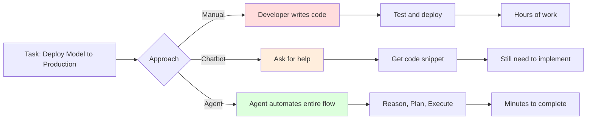
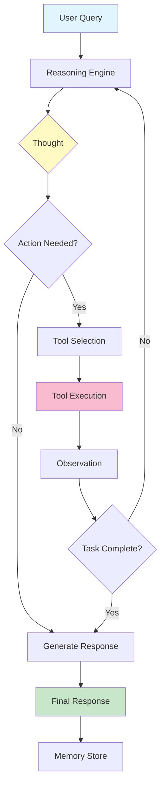
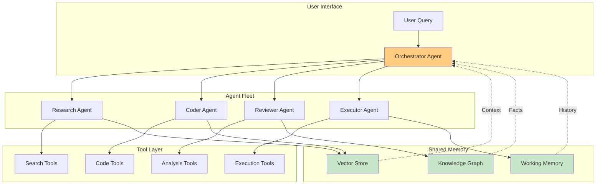
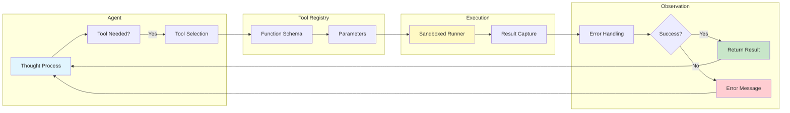
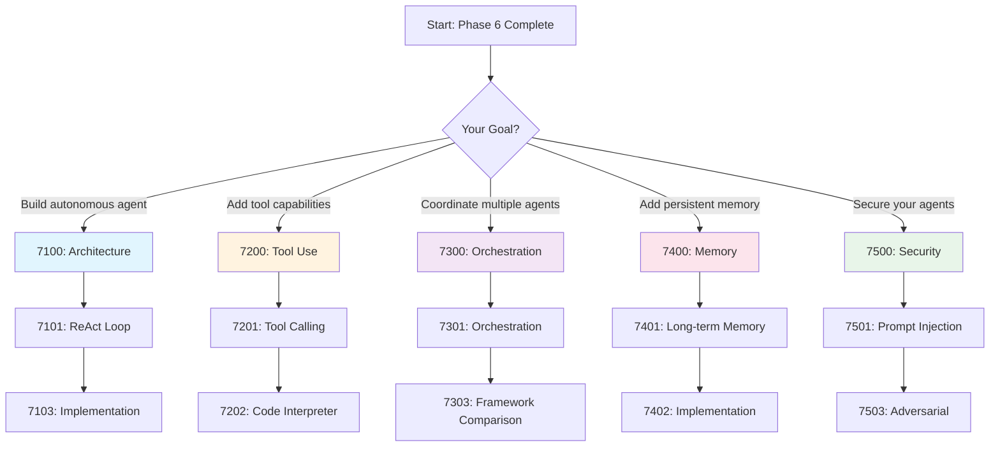

# Phase 7: Agentic Cognition & Autonomy [7000]

## Table of Contents

- [Overview](#overview)
- [Why Agents Matter](#why-agents-matter)
- [ReAct Agent Loop Architecture](#react-agent-loop-architecture)
- [Multi-Agent System Architecture](#multi-agent-system-architecture)
- [Tool Calling Pipeline](#tool-calling-pipeline)
- [Agent Type Comparison](#agent-type-comparison)
- [Framework Comparison](#framework-comparison)
- [Tool Registry](#tool-registry)
- [Module Structure](#module-structure)
- [Learning Path](#learning-path)
- [Key Takeaways](#key-takeaways)
- [Common Pitfalls](#common-pitfalls)
- [Pro Tips](#pro-tips)
- [Performance Benchmarks](#performance-benchmarks)
- [Related Experiments](#related-experiments)
- [Quick Reference](#quick-reference)

---

## Overview

**Creating autonomous AI systems that can reason, plan, and execute complex tasks.**

This phase covers AI agent architectures, tool use, multi-agent orchestration, and memory systems for building autonomous AI systems that can manage your infrastructure and code, enabling you to:
- Build autonomous agents that reason and plan
- Implement tool calling for real-world actions
- Orchestrate multi-agent teams
- Create persistent memory systems
- Deploy production-grade agent systems

---

## Why Agents Matter

### From Chatbots to Agents

```text
┌─────────────────────────────────────────────────────────┐
│                    Chatbot (Passive)                    │
├─────────────────────────────────────────────────────────┤
│ - Single-turn responses                                 │
│ - No memory of past interactions                        │
│ - Cannot take actions                                   │
│ - No reasoning or planning                              │
│ - Limited to text generation                            │
└─────────────────────────────────────────────────────────┘

With Agents:
┌─────────────────────────────────────────────────────────┐
│                    AI Agent (Active)                    │
├─────────────────────────────────────────────────────────┤
│ + Multi-step reasoning and planning                     │
│ + Persistent memory across sessions                     │
│ + Can execute tools and APIs                            │
│ + Autonomous decision making                            │
│ + Interacts with external systems                       │
└─────────────────────────────────────────────────────────┘
```

### The Agentic Advantage



### Real-World Agent Use Cases

| Use Case | Agent Type | Tools Used | Time Saved |
|----------|-----------|------------|------------|
| **DevOps Automation** | ReAct + Tools | K8s API, Git, Docker | 4 hours → 5 minutes |
| **Code Review** | Multi-Agent | Static analysis, LLM | 1 hour → 5 minutes |
| **Data Analysis** | ReAct + Code Interpreter | Pandas, Matplotlib | 2 hours → 10 minutes |
| **Customer Support** | Multi-Agent + RAG | Knowledge base, CRM | 15 minutes → 1 minute |
| **Research Assistant** | ReAct + Search | Web search, Arxiv | 3 hours → 20 minutes |

---

## ReAct Agent Loop Architecture



### ReAct Pattern Breakdown

```text
┌──────────────────────────────────────────────────────────────────┐
│                    ReAct Loop Components                         │
├──────────────────────────────────────────────────────────────────┤
│ Component        │ Function                                      │
├──────────────────────────────────────────────────────────────────┤
│ Thought          │ Reasoning step: "What should I do next?"      │
│ Action           │ Tool/function call with parameters            │
│ Observation      │ Result from tool execution                    │
│ Memory           │ Store/retrieve context from past steps        │
│ Finish           │ Final answer when task is complete            │
└──────────────────────────────────────────────────────────────────┘
```

---

## Multi-Agent System Architecture



### Multi-Agent Patterns

| Pattern | Description | Example |
|---------|-------------|---------|
| **Hierarchical** | Manager coordinates worker agents | Orchestrator delegates to specialists |
| **Sequential** | Pipeline of agents processing data | Research → Write → Review → Publish |
| **Parallel** | Agents work independently on subtasks | Multiple researchers on different sources |
| **Consensus** | Agents vote on decisions | Review panel for code approval |
| **Debate** | Agents critique each other | Devil's advocate for quality |

---

## Tool Calling Pipeline



---

## Agent Type Comparison

### Single Agent vs Multi-Agent

| Aspect | Single Agent | Multi-Agent |
|--------|--------------|-------------|
| **Complexity** | Simple | Complex |
| **Coordination** | None | Required |
| **Parallelization** | Limited | Yes |
| **Specialization** | Generalist | Specialist roles |
| **Cost** | Lower | Higher |
| **Best For** | Simple tasks | Complex workflows |
| **Example** | Code assistant | DevOps automation team |

### Agent Architectures

```text
┌─────────────────────────────────────────────────────────────────┐
│                  Agent Architecture Spectrum                    │
├─────────────────────────────────────────────────────────────────┤
│                                                                 │
│ Simple ──────────────────────────────────────────── Complex     │
│                                                                 │
│ Prompt → LLM                    Multi-Agent System              │
│     ↓                                ↓                          │
│  Response                    ┌─────────────────┐                │
│                              │ Orchestrator    │                │
│                              └───────┬─────────┘                │
│                                      ↓                          │
│                              ┌───────┴───────┐                  │
│                              ↓              ↓                   │
│                          [Agent 1]      [Agent 2]               │
│                              ↓              ↓                   │
│                          [Tools]        [Tools]                 │
│                              ↓              ↓                   │
│                          └─────────────────┘                    │
│                                      ↓                          │
│                              [Shared Memory]                    │
│                                                                 │
└─────────────────────────────────────────────────────────────────┘
```

---

## Framework Comparison

### Agent Framework Selection Matrix

| Framework | Type | Learning Curve | Best For | Ecosystem |
|-----------|------|----------------|----------|-----------|
| **LangGraph** | Multi-Agent | Medium | Complex workflows | Excellent |
| **AutoGen** | Multi-Agent | Medium | Conversational agents | Good |
| **CrewAI** | Multi-Agent | Low | Role-playing agents | Medium |
| **OpenAI Swarm** | Multi-Agent | Low | Simple orchestration | Basic |
| **LangChain** | Single/Multi | High | Production systems | Excellent |
| **LlamaIndex Agents** | Single/Multi | Medium | RAG-enhanced agents | Good |

### Feature Comparison

```text
┌──────────────────────────────────────────────────────────────┐
│                    Framework Feature Comparison              │
├──────────────────────────────────────────────────────────────┤
│ Feature          │ LangGraph │ AutoGen │ CrewAI │ Swarm │ LC │
├──────────────────┼───────────┼─────────┼────────┼───────┼────┤
│ Visual Builder   │    Y      │   N     │   N    │  N    │  N │
│ Type Safety      │    Y      │   !     │   N    │  N    │  N │
│ Persistence      │    Y      │   Y     │   Y    │  N    │  Y │
│ Human-in-Loop    │    Y      │   Y     │   Y    │  Y    │  Y │
│ Memory Systems   │    Y      │   !     │   !    │  N    │  Y │
│ Tool Calling     │    Y      │   Y     │   Y    │  Y    │  Y │
│ Multi-Modal      │    Y      │   Y     │   N    │  Y    │  Y │
│ Streaming        │    Y      │   Y     │   !    │  Y    │  Y │
│ Easy Debug       │    Y      │   Y     │   Y    │  Y    │  ! │
│ Production Ready │    Y      │   Y     │   !    │  !    │  Y │
└──────────────────────────────────────────────────────────────┘
```

### Recommended by Use Case

| Use Case | Recommended Framework | Why |
|----------|----------------------|-----|
| **Complex Workflows** | LangGraph | Visual builder, state management |
| **Chat Between Agents** | AutoGen | Built-in conversational patterns |
| **Role-Based Teams** | CrewAI | Simple role definition |
| **Quick Prototyping** | OpenAI Swarm | Minimal setup, fast iteration |
| **Production Systems** | LangChain | Mature ecosystem, battle-tested |
| **RAG + Agents** | LlamaIndex | Native RAG integration |

---

## Tool Registry

### Essential Agent Tools

```python
# Infrastructure Management Tools
tools_local = {
    # GPU/Compute Management
    "nvidia_smi": {
        "description": "Get GPU utilization and memory stats",
        "parameters": {"gpu_id": "int (optional)"},
        "returns": "GPU utilization, memory, temperature"
    },

    "run_inference": {
        "description": "Run LLM inference on specific model",
        "parameters": {
            "model": "str (model path)",
            "prompt": "str (input prompt)",
            "max_tokens": "int"
        },
        "returns": "Generated text and metadata"
    },

    "quantize_model": {
        "description": "Quantize model to save memory",
        "parameters": {
            "model": "str (source model)",
            "bits": "int (4 or 8)",
            "output": "str (output path)"
        },
        "returns": "Quantized model path"
    },

    # Kubernetes/Docker
    "list_pods": {
        "description": "List Kubernetes pods in namespace",
        "parameters": {"namespace": "str"},
        "returns": "List of pods with status"
    },

    "get_pod_logs": {
        "description": "Get logs from specific pod",
        "parameters": {
            "pod": "str (pod name)",
            "lines": "int"
        },
        "returns": "Recent log lines"
    },

    "restart_pod": {
        "description": "Restart a Kubernetes pod",
        "parameters": {"pod": "str"},
        "returns": "Restart confirmation"
    },

    # File System
    "read_file": {
        "description": "Read contents of a file",
        "parameters": {"path": "str"},
        "returns": "File contents"
    },

    "write_file": {
        "description": "Write content to a file",
        "parameters": {
            "path": "str",
            "content": "str"
        },
        "returns": "Write confirmation"
    },

    "search_files": {
        "description": "Search for files by pattern",
        "parameters": {
            "path": "str",
            "pattern": "str"
        },
        "returns": "Matching file paths"
    },

    # Code Execution
    "run_python": {
        "description": "Execute Python code in sandbox",
        "parameters": {"code": "str"},
        "returns": "Execution result or error"
    },

    "run_bash": {
        "description": "Execute bash command",
        "parameters": {"command": "str"},
        "returns": "Command output"
    },

    # Web/Network
    "web_search": {
        "description": "Search the web",
        "parameters": {
            "query": "str",
            "num_results": "int"
        },
        "returns": "Search results"
    },

    "fetch_url": {
        "description": "Fetch content from URL",
        "parameters": {"url": "str"},
        "returns": "Page content"
    },

    # Database
    "query_vector_db": {
        "description": "Query Qdrant vector database",
        "parameters": {
            "collection": "str",
            "query": "str",
            "limit": "int"
        },
        "returns": "Search results with scores"
    },

    "query_knowledge_graph": {
        "description": "Query Neo4j knowledge graph",
        "parameters": {"cypher": "str"},
        "returns": "Graph query results"
    }
}

# Agent Role Tools
tools_coder = {
    "read_file": tools_local["read_file"],
    "write_file": tools_local["write_file"],
    "run_python": tools_local["run_python"],
    "run_bash": tools_local["run_bash"],
    "search_files": tools_local["search_files"]
}

tools_ops = {
    "nvidia_smi": tools_local["nvidia_smi"],
    "list_pods": tools_local["list_pods"],
    "get_pod_logs": tools_local["get_pod_logs"],
    "restart_pod": tools_local["restart_pod"]
}

tools_researcher = {
    "web_search": tools_local["web_search"],
    "fetch_url": tools_local["fetch_url"],
    "query_vector_db": tools_local["query_vector_db"]
}
```

---

## Module Structure

### [7100] Agent Architecture & Cognitive Systems

| Document | Description | Time | Difficulty |
|----------|-------------|------|------------|
| [7101: Agent Architecture](./7100-architecture/7101-ReAct-Loop-System.md) | Thought, Action, Observation patterns | 4h | Advanced |
| [7102: State Machines](./7100-architecture/7102-Planning-Decomposition.md) | Breaking down complex tasks | 4h | Advanced |
| [7103: ReAct Implementation](./7100-architecture/guides/7103-ReAct-Implementation-Guide.md) | Complete ReAct implementation | 3h | Advanced |

**What You'll Learn:**
- ReAct (Reasoning + Acting) pattern
- Task decomposition and planning
- State machines for agent control
- Cognitive architectures

**Hands-On Practice:**
- Implement ReAct loop from scratch
- Build task planning system
- Create state machine for complex workflows
- Debug agent reasoning chains

### [7200] Tool Use & Function Calling

| Document | Description | Time | Difficulty |
|----------|-------------|------|------------|
| [7201: Tool Calling](./7200-tools/7201-Tool-Calling.md) | OpenAI-style function calling | 3h | Intermediate |
| [7202: Code Interpreter](./7200-tools/guides/7202-Code-Interpreter.md) | Sandboxed code execution | 3h | Advanced |

**What You'll Learn:**
- Function calling with LLMs
- Tool schema definition
- Sandboxed code execution
- Error handling and recovery

**Hands-On Practice:**
- Implement tool calling system
- Build code interpreter
- Create custom tools
- Handle tool failures gracefully

### [7300] Multi-Agent Orchestration

| Document | Description | Time | Difficulty |
|----------|-------------|------|------------|
| [7301: Orchestration](./7300-orchestration/7301-Orchestration.md) | Multi-agent collaboration | 4h | Advanced |
| [7302: Communication Protocols](./7300-orchestration/7302-Communication-Protocols.md) | Agent-to-agent messaging | 2h | Advanced |
| [7303: Framework Comparison](./7300-orchestration/guides/7303-Framework-Comparison.md) | AutoGen vs LangGraph vs others | 2h | Advanced |

**What You'll Learn:**
- Multi-agent patterns (hierarchical, sequential, parallel)
- Agent communication protocols
- Orchestration strategies
- Framework selection and comparison

**Hands-On Practice:**
- Build multi-agent system
- Implement agent communication
- Create specialized agent roles
- Orchestrate complex workflows

### [7400] Agent Memory

| Document | Description | Time | Difficulty |
|----------|-------------|------|------------|
| [7401: Long-term Memory](./7400-memory/7401-Long-term-Memory.md) | Persistent memory systems | 4h | Advanced |
| [7402: Memory Implementation](./7400-memory/guides/7402-Agent-Memory-Implementation.md) | Memory architecture guide | 3h | Advanced |
| [7403: Vector Memory](./7400-memory/7403-Vector-Memory.md) | Embedding-based memory | 2h | Advanced |

**What You'll Learn:**
- Memory architectures (short-term, long-term, episodic)
- Vector-based memory systems
- Memory retrieval and ranking
- Persistent storage strategies

**Hands-On Practice:**
- Implement memory system
- Build vector memory store
- Create memory retrieval mechanisms
- Optimize memory performance

### [7500] AI Agent Security

| Document | Description | Time | Difficulty |
|----------|-------------|------|------------|
| [7501: Prompt Injection Defense](./7500-security/7501-Prompt-Injection-Defense.md) | Injection detection and prevention | 3h | Advanced |
| [7502: PII Redaction](./7500-security/7502-PII-Redaction.md) | Privacy filtering and compliance | 3h | Advanced |
| [7503: Adversarial Attacks](./7500-security/7503-Adversarial-Attacks.md) | Attack types and defense layers | 3h | Advanced |

**What You'll Learn:**
- Prompt injection techniques and defense layers
- PII detection, redaction, and compliance (GDPR, HIPAA)
- Adversarial attack types (jailbreak, DAN, roleplay)
- Input validation and output filtering
- Red teaming agent systems

**Hands-On Practice:**
- Build an injection detector
- Implement a PII redaction system
- Test agents with adversarial prompts
- Design a multi-layer defense pipeline

---

## Learning Path

### Recommended Flow



### Time Estimates

| Module | Reading | Practice | Total |
|--------|---------|----------|-------|
| 7100: Architecture | 11h | 6h | 17h |
| 7200: Tool Use | 6h | 4h | 10h |
| 7300: Orchestration | 8h | 6h | 14h |
| 7400: Memory | 9h | 6h | 15h |
| 7500: Security | 9h | — | 9h |
| **Total** | **43h** | **22h** | **65h** |

*7500 practice time is not yet estimated in its PRACTICE.md; phase totals cover the estimated modules.*

---

## Key Takeaways

### You Will Learn

After completing this phase, you will be able to:

1. **Build Autonomous Agents**
   - Implement ReAct reasoning loops
   - Create planning and task decomposition
   - Build state machines for control flow
   - Debug agent reasoning chains

2. **Implement Tool Calling**
   - Define tool schemas
   - Execute functions safely
   - Build code interpreters
   - Handle errors gracefully

3. **Orchestrate Multi-Agent Systems**
   - Design agent architectures
   - Implement communication protocols
   - Coordinate specialized agents
   - Choose the right framework

4. **Create Memory Systems**
   - Build persistent memory
   - Implement vector-based retrieval
   - Store episodic memories
   - Optimize memory performance

5. **Deploy Production Agents**
   - Secure tool execution
   - Monitor agent behavior
   - Scale multi-agent systems
   - Debug complex workflows

---

## Common Pitfalls

### Infinite Loops

**Pitfall:** Agent gets stuck in reasoning loop
```python
# Wrong: No max iterations
import time
while not task_complete:
    thought = agent.think()
    action = agent.act()
    observation = execute(action)
    # May never converge!

# Right: Add max iterations and timeout
max_iterations = 10
timeout = 60  # seconds

for i in range(max_iterations):
    thought = agent.think()
    action = agent.act()
    observation = execute(action)

    if task_complete or time.time() > timeout:
        break
```

### Unsafe Tool Execution

**Pitfall:** Executing arbitrary code without sandboxing
```python
# Wrong: Direct execution
result = eval(user_code)  # DANGEROUS!
# Can delete files, steal data, etc.

# Right: Sandboxed execution
from restrictedpython import compile_restricted
import subprocess

# Use Docker or restricted Python
result = run_in_sandbox(user_code, timeout=30)
```

### Poor Tool Selection

**Pitfall:** Agent calls wrong tools repeatedly
```python
# Wrong: No tool descriptions
tools = ["search", "read", "write"]
# Agent guesses what each does

# Right: Detailed tool schemas
tools = [
    {
        "name": "search_web",
        "description": "Search the internet for current information",
        "parameters": {
            "query": {"type": "string", "description": "Search query"}
        }
    }
]
```

### Missing Error Handling

**Pitfall:** Agent fails on tool errors
```python
# Wrong: No error handling
result = tool.call(**args)
# Agent crashes on failure

# Right: Graceful error handling
try:
    result = tool.call(**args)
    observation = {"status": "success", "result": result}
except Exception as e:
    observation = {
        "status": "error",
        "message": str(e),
        "recovery": "Try alternative approach"
    }
```

### No Memory Retrieval

**Pitfall:** Agent forgets previous interactions
```python
# Wrong: Stateless agent
response = agent.generate(query)
# Each query is independent

# Right: Memory-enabled agent
memory = agent.memory.retrieve(query, k=5)
response = agent.generate(
    query,
    context=memory,
    history=conversation_history
)
```

---

## Pro Tips

### ReAct Loop Design

**Tip:** Structure thoughts for better reasoning
```python
# Thought template for consistent reasoning
thought_template = """
Current Task: {task}

Previous Actions: {history}

Available Tools: {tools}

What I know:
{context}

What I need to find out:
{missing}

Next step:
{next_step}

Tool to use: {tool}
Tool parameters: {params}
"""

thought = thought_template.format(
    task=task,
    history=action_history,
    tools=available_tools,
    context=current_context,
    missing=missing_info,
    next_step=next_action,
    tool=selected_tool,
    params=tool_params
)
```

### Agent Role Definition

**Tip:** Clear role definitions improve multi-agent systems
```python
agent_roles = {
    "researcher": {
        "goal": "Gather information from external sources",
        "tools": ["web_search", "fetch_url", "read_file"],
        "expertise": "Research and information synthesis",
        "constraints": "Cannot execute code or modify files"
    },

    "coder": {
        "goal": "Write and modify code",
        "tools": ["read_file", "write_file", "run_python"],
        "expertise": "Software development",
        "constraints": "Only access approved directories"
    },

    "reviewer": {
        "goal": "Review and validate work",
        "tools": ["read_file", "static_analysis"],
        "expertise": "Code review and quality assurance",
        "constraints": "Cannot modify files, only report issues"
    }
}
```

### Tool Schema Best Practices

**Tip:** Detailed schemas improve tool selection
```python
# Good tool schema
tool_schema = {
    "name": "query_database",
    "description": """
    Query the PostgreSQL database for customer information.
    Use this when you need to look up customer details, orders, or transactions.
    Returns structured data with customer information.
    """,
    "parameters": {
        "table": {
            "type": "string",
            "description": "Table to query (customers, orders, products)",
            "enum": ["customers", "orders", "products"]
        },
        "filters": {
            "type": "object",
            "description": "Key-value pairs for WHERE clause",
            "examples": [
                {"customer_id": 123},
                {"status": "active"}
            ]
        }
    },
    "returns": {
        "type": "array",
        "description": "List of matching records"
    }
}
```

### Memory Chunking Strategy

**Tip:** Organize memory for efficient retrieval
```python
# Store memories with metadata and timestamps
memory_entry = {
    "content": "User prefers Python over JavaScript",
    "type": "preference",
    "source": "conversation",
    "timestamp": "2024-01-15T10:30:00Z",
    "importance": 0.8,  # 0-1 score
    "entities": ["user", "python", "javascript"],
    "embed": embedding_model.encode(content)
}

# Retrieve with time decay and relevance
retrieved = memory.search(
    query="programming language",
    weight_recent=0.3,  # Prefer recent memories
    weight_relevant=0.7,  # But relevance matters more
    k=5
)
```

### Multi-Agent Communication

**Tip:** Structured message protocols
```python
import time
import uuid


class AgentMessage:
    def __init__(self, sender, receiver, type, content):
        self.sender = sender  # Agent ID
        self.receiver = receiver  # Agent ID
        self.type = type  # "request", "response", "notification"
        self.content = content
        self.timestamp = time.time()
        self.id = str(uuid.uuid4())

    def to_dict(self):
        return {
            "id": self.id,
            "sender": self.sender,
            "receiver": self.receiver,
            "type": self.type,
            "content": self.content,
            "timestamp": self.timestamp
        }

# Usage
message = AgentMessage(
    sender="researcher",
    receiver="writer",
    type="request",
    content={
        "task": "write_summary",
        "topic": "AI agents",
        "sources": ["url1", "url2"]
    }
)
```

---

## Performance Benchmarks

### Agent Performance Comparison

| Agent Type | Response Time | Token Usage | Success Rate | Best For |
|------------|--------------|-------------|--------------|----------|
| **Simple ReAct** | 5-15s | 500-2K | 70% | Quick tasks |
| **ReAct + Tools** | 10-30s | 1K-5K | 85% | Single-agent workflows |
| **Multi-Agent (2-3)** | 20-60s | 2K-10K | 90% | Complex tasks |
| **Multi-Agent (5+)** | 30-120s | 5K-20K | 95% | Complex, specialized tasks |
| **Multi-Agent + Memory** | 15-45s | 2K-8K | 92% | Long-running processes |

### Framework Performance

| Framework | Setup Time | Runtime Overhead | Ease of Debugging |
|-----------|-----------|------------------|------------------|
| **LangGraph** | Medium | Low | Excellent |
| **AutoGen** | Low | Medium | Good |
| **CrewAI** | Low | Medium | Good |
| **Swarm** | Very Low | Low | Medium |
| **LangChain** | High | Medium | Medium |

### Cost Analysis (GPT-4)

| Agent Type | Cost per 100 Turns | Monthly Cost (1K turns) |
|------------|-------------------|----------------------|
| Simple ReAct | ~$2 | ~$20 |
| ReAct + Tools | ~$5 | ~$50 |
| Multi-Agent (3 agents) | ~$12 | ~$120 |
| Multi-Agent + Memory | ~$8 | ~$80 |

---

## Related Experiments

### Hands-on Practice

1. **[EXP_7101: ReAct](../../../experiments/EXP_7101_REACT.md)**
   - Implement ReAct loop from scratch
   - Build task planning system
   - Debug agent reasoning

2. **[EXP_7202: Sandbox](../../../experiments/EXP_7202_SANDBOX.md)**
   - Implement function calling
   - Build code interpreter
   - Create custom tools

3. **[EXP_7301: Collaboration](../../../experiments/EXP_7301_COLLABORATION.md)**
   - Build multi-agent system
   - Implement communication protocols
   - Orchestrate complex workflow

4. **[EXP_7401: Agent Memory](../../../experiments/EXP_7401_AGENT_MEMORY.md)**
   - Implement memory system
   - Build vector memory store
   - Optimize retrieval

5. **[EXP_7501: Prompt Injection](../../../experiments/EXP_7501_PROMPT_INJECTION.md)**
   - Run injection attacks against an agent
   - Measure multi-layer defense effectiveness
   - Detect injections with perplexity

---

## Prerequisites

Before starting this phase, ensure you understand:

- **LLM Fundamentals** (from 2400: Pre-training)
- **Prompt Engineering** (from 2500: Prompt Engineering)
- **RAG Systems** (from 6100: Vector Architectures)
- **API Design** (REST, webhooks)

See [PREREQUISITES](../../00-META/ENVIRONMENT-SETUP.md) for details.

---

## Assessment

Validate your knowledge with:

- **[Phase 7 Checkpoint](./CHECKPOINT.md)** - Module-by-module phase-exit review
- **[Phase 7 Quiz](../../00-META/assessment/phase7-quiz.md)** - Test your understanding (20 questions, 80% to pass)
- **[Phase 7 Practice](../../00-META/assessment/phase7-practice.md)** - Hands-on exercises

---

## Related Topics

- **5100: PEFT** - Fine-tune models for agents
- **6100: RAG** - Add memory to agents
- **7500: Security** - Secure deployed agents
- **SOL-001: Enterprise KB** - RAG + Agent solution
- **Industry Guides:** Domain-specific agents

---

## Next Steps

After completing this phase:

1. **Build Your Agents**
   - Create autonomous code assistant
   - Build DevOps automation agent
   - Deploy multi-agent team

2. **Continue Learning**
   - **Solutions:** End-to-end implementations
   - **Industry Guides:** Domain-specific agents
   - **Projects:** Real-world applications

---

## Quick Reference

### ReAct Pattern

```text
Thought → Action → Observation → Thought → Action → Finish

Example:
1. Thought: User wants to know the weather in Tokyo
2. Action: call_weather(location="Tokyo")
3. Observation: {"temp": 22, "condition": "clear"}
4. Thought: Have the information, can respond
5. Finish: "It's currently 22°C and clear in Tokyo."
```

### Multi-Agent Patterns

| Pattern | Description | Use Case |
|---------|-------------|----------|
| **Hierarchical** | Manager coordinates workers | Complex task breakdown |
| **Sequential** | Pipeline processing | Multi-step workflows |
| **Parallel** | Independent agents | Speed optimization |
| **Consensus** | Voting mechanism | Decision making |

---

**Additional Diagrams:**

**ReAct Agent Diagrams:**
- [REACT-LOOP.md](../../diagrams/REACT-LOOP.md) - Complete ReAct loop visualization
  - ReAct Loop Architecture (State Diagram)
  - Detailed ReAct Sequence
  - Tool Calling Flow
  - Multi-Step Reasoning Example
  - ReAct vs Standard LLM
  - Error Handling in ReAct

**Project Architecture Diagrams:**
- [PROJECT-001-ARCHITECTURE.md](../../diagrams/PROJECT-001-ARCHITECTURE.md) - AI Assistant system architecture

---

**Module Duration:** 65 hours (43 reading + 22 practice)
**Difficulty:** Advanced

**Ready to build autonomous agents?** Start with [7101: Agent Architecture](./7100-architecture/7101-ReAct-Loop-System.md) or [7201: Tool Calling](./7200-tools/7201-Tool-Calling.md)
