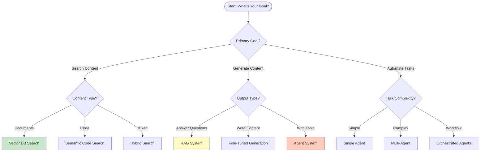
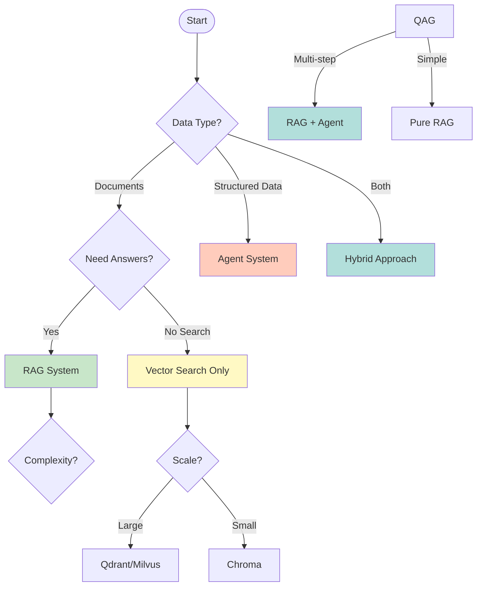

# Use Cases - Real-World AI Applications

This directory contains practical use case documentation showing how to apply AI technologies in real-world scenarios.

---

## Table of Contents

- [Overview](#overview)
- [Use Case Selection Guide](#use-case-selection-guide)
- [Available Use Cases](#available-use-cases)
- [Industry Applications](#industry-applications)
- [Decision Matrices](#decision-matrices)
- [Implementation Patterns](#implementation-patterns)
- [Related Documentation](#related-documentation)
- [How to Use These Documents](#how-to-use-these-documents)

---

## Overview

### Why Use Case Documentation Matters

```text
┌─────────────────────────────────────────────────────────────────┐
│                    From Theory to Practice                       │
├─────────────────────────────────────────────────────────────────┤
│                                                                  │
│  📚 Theory       →  Understand concepts                         │
│  🛠️ Use Cases    →  See real applications                       │
│  💼 Business     →  Measure impact and ROI                       │
│  🚀 Implementation → Deploy production systems                   │
│                                                                  │
└─────────────────────────────────────────────────────────────────┘
```

### What You'll Find

Each use case document provides:

```text
┌─────────────────────────────────────────────────────────────────┐
│                    Complete Use Case Package                     │
├─────────────────────────────────────────────────────────────────┤
│                                                                  │
│  ✅ Problem Statement    - What business problem are we solving?│
│  ✅ Solution Overview    - High-level architecture              │
│  ✅ Decision Matrix      - Why this approach?                    │
│  ✅ Implementation       - Step-by-step guide                    │
│  ✅ Code Examples        - Working Python implementations        │
│  ✅ Business Impact      - Measurable outcomes                  │
│  ✅ Best Practices       - Production guidelines                │
│  ✅ Pitfalls to Avoid    - Common mistakes                      │
│                                                                  │
└─────────────────────────────────────────────────────────────────┘
```

---

## Use Case Selection Guide

### Quick Decision Flowchart



### Technology Selection by Use Case

| Use Case | Technology | Complexity | Time to Value | Example |
|----------|------------|------------|---------------|---------|
| **Document Search** | Vector DB | Low | Days | Legal document search |
| **Product Recommendations** | Vector DB | Medium | Weeks | E-commerce similarity |
| **Knowledge Assistant** | RAG | Medium | Weeks | Enterprise wiki |
| **Customer Support** | RAG + Agent | High | Months | Automated ticket handling |
| **Code Assistant** | RAG + Fine-Tune | High | Months | Code completion |
| **Research Assistant** | GraphRAG | Very High | Months | Literature review |
| **DevOps Automation** | Multi-Agent | Very High | Months | Incident management |

---

## Available Use Cases

### [UC-001: Vector Database Applications](./UC-001-Vector-Database-Applications.md)

Comprehensive guide on when and how to use vector databases with decision matrices and real-world examples.

**Decision Matrix Preview:**

| Use Case | Vector DB Recommended | Reasoning | Alternative |
|----------|----------------------|-----------|-------------|
| **Product Search** | ✅ Yes | Semantic similarity beats keywords | Elasticsearch + vector |
| **Document Search** | ✅ Yes | Find by meaning, not keywords | Full-text + hybrid |
| **Exact Match** | ❌ No | Keywords are faster | Traditional DB |
| **Real-time Search** | ✅ Yes | Sub-second response | Cached vector DB |
| **Small Dataset** | ⚠️ Maybe | Overhead vs benefit | Simple search |
| **Fuzzy Matching** | ✅ Yes | Handles typos, synonyms | Levenshtein distance |

**Topics Covered:**
- ✅ E-Commerce product recommendation (similarity search)
- ✅ Legal document search (semantic + hybrid)
- ✅ Semantic code search (embedding-based)
- ✅ Customer support routing (ticket similarity)
- ✅ Plagiarism detection (document similarity)
- ✅ Industry-specific applications (healthcare, finance, manufacturing)

**Business Impact:**
```text
E-Commerce Recommendation:
- +35% increase in cross-sell
- +20% higher conversion rate
- +15% larger average order value

Document Search:
- 80% faster information retrieval
- 60% reduction in search time
- 45% improvement in relevance
```

**Quick Start Code:**
```python
from qdrant_client import QdrantClient
from sentence_transformers import SentenceTransformer

# Initialize
client = QdrantClient("localhost", port=6333)
encoder = SentenceTransformer('all-MiniLM-L6-v2')

# Index documents
documents = load_documents("products.json")
for doc in documents:
    vector = encoder.encode(doc['description'])
    client.upsert(
        collection_name="products",
        points=[PointStruct(
            id=doc['id'],
            vector=vector,
            payload=doc
        )]
    )

# Search similar products
query = "wireless headphones with noise cancellation"
query_vector = encoder.encode(query)
results = client.query_points(
    collection_name="products",
    query=query_vector,
    limit=5
).points
```

---

### [UC-002: RAG Applications](./UC-002-RAG-Applications.md)

Retrieval-Augmented Generation use cases and implementation patterns.

**When to Use RAG:**

```text
✅ Use RAG When:
├─ You have current/frequently changing information
├─ You need source citations for answers
├─ You want to reduce LLM hallucinations
├─ You have private domain documents
├─ Users ask questions about your data
└─ Quick time-to-value is important

❌ Don't Use RAG When:
├─ Information is static and in training data
├─ You only need general knowledge
├─ No documents to reference
├─ Ultra-low latency required (<100ms)
└─ Simpler approach would work
```

**Topics Covered:**
- ✅ Enterprise knowledge base assistant (internal company wiki)
- ✅ Customer support with context (historical ticket analysis)
- ✅ Technical documentation assistant (API/docs helper)
- ✅ Legal contract analysis (clause extraction, risk analysis)
- ✅ Educational content generation (course material, quizzes)
- ✅ Hybrid approaches (RAG + Fine-Tuning, GraphRAG)

**RAG Architecture Patterns:**

```text
┌─────────────────────────────────────────────────────────────────┐
│                     RAG Architecture Patterns                    │
├─────────────────────────────────────────────────────────────────┤
│                                                                  │
│  1. Basic RAG                                                    │
│     ┌─────────┐    ┌─────────┐    ┌─────────┐                  │
│     │ Query   │───▶│ Vector  │───▶│  LLM    │                  │
│     └─────────┘    │  DB     │    └─────────┘                  │
│                    └─────────┘                                 │
│                                                                  │
│  2. Hybrid RAG (Vector + Keyword)                               │
│     ┌─────────┐    ┌─────────┐    ┌─────────┐                  │
│     │ Query   │───▶│ Fusion  │───▶│  LLM    │                  │
│     └─────────┘    │ Engine  │    └─────────┘                  │
│          │         └────┬────┘                                 │
│          │              │                                       │
│      ┌───┴────┐      ┌──┴───┐                                  │
│      │ Vector │      │ BM25 │                                  │
│      │  DB    │      │Search│                                  │
│      └────────┘      └──────┘                                  │
│                                                                  │
│  3. GraphRAG (Vector + Knowledge Graph)                         │
│     ┌─────────┐    ┌─────────┐    ┌─────────┐                  │
│     │ Query   │───▶│ Graph   │───▶│  LLM    │                  │
│     └─────────┘    │ Reason  │    └─────────┘                  │
│                    └────┬────┘                                 │
│                         │                                       │
│                    ┌────┴─────┐                                  │
│                    │ Vector + │                                  │
│                    │  Graph   │                                  │
│                    └──────────┘                                  │
│                                                                  │
└─────────────────────────────────────────────────────────────────┘
```

**Business Impact:**
```text
Enterprise Knowledge Base:
- 90% reduction in time to find information
- 75% decrease in repetitive questions to IT
- 60% improvement in employee productivity

Customer Support RAG:
- 50% reduction in agent handling time
- 40% increase in first-contact resolution
- 30% improvement in customer satisfaction
```

---

### [UC-003: Agent Applications](./UC-003-Agent-Applications.md)

AI agent and multi-agent system implementations.

**Agent Decision Matrix:**

| Task Type | Recommended Agent | Reasoning | Complexity |
|-----------|------------------|-----------|------------|
| **Single API Call** | Function Calling | Simple, direct | Low |
| **Multi-Step Reasoning** | ReAct Agent | Think-Act-Observe | Medium |
| **Parallel Tasks** | Multi-Agent | Divide and conquer | High |
| **Complex Workflow** | Orchestrated Agents | Coordinator + specialists | Very High |
| **Creative Tasks** | Single Agent | Focused reasoning | Medium |
| **Data Analysis** | Tool-Using Agent | Calculator, code interpreter | Medium |

**Topics Covered:**
- ✅ DevOps operations agent (autonomous incident management)
- ✅ Multi-agent customer service system (triage + resolution)
- ✅ Research assistant agent (literature review, synthesis)
- ✅ Code generation agent (write, test, review)
- ✅ Agent architecture patterns (ReAct, Hierarchical, Sequential, Consensus)

**Agent Architecture Patterns:**

```text
┌─────────────────────────────────────────────────────────────────┐
│                    Agent Architecture Patterns                   │
├─────────────────────────────────────────────────────────────────┤
│                                                                  │
│  1. ReAct Pattern (Single Agent)                                 │
│                                                                  │
│     ┌─────────┐                                                  │
│     │  User   │                                                  │
│     └────┬────┘                                                  │
│          │                                                       │
│          ▼                                                       │
│     ┌─────────────────────────────────┐                          │
│     │        ReAct Agent              │                          │
│     │  ┌─────────────────────────┐    │                          │
│     │  │ Think → Act → Observe   │    │                          │
│     │  │         (Loop)           │    │                          │
│     │  └─────────────────────────┘    │                          │
│     │                                 │                          │
│     │  Tools: Search, Calculate, API  │                          │
│     └─────────────────────────────────┘                          │
│                                                                  │
│  2. Multi-Agent Collaboration                                    │
│                                                                  │
│     ┌─────────┐                                                  │
│     │  User   │                                                  │
│     └────┬────┘                                                  │
│          │                                                       │
│          ▼                                                       │
│     ┌─────────────────────────────────┐                          │
│     │       Coordinator Agent        │                          │
│     │    (Task Distribution)         │                          │
│     └─────────────┬───────────────────┘                          │
│                  │                                               │
│      ┌────────────┼────────────┐                                │
│      ▼            ▼            ▼                                │
│  ┌────────┐  ┌────────┐  ┌────────┐                             │
│  │Agent 1 │  │Agent 2 │  │Agent 3 │                             │
│  │(Coder) │  │(Tester)│  │(Review)│                             │
│  └────────┘  └────────┘  └────────┘                             │
│                                                                  │
│  3. Hierarchical Multi-Agent                                     │
│                                                                  │
│     ┌─────────┐                                                  │
│     │  User   │                                                  │
│     └────┬────┘                                                  │
│          │                                                       │
│          ▼                                                       │
│     ┌─────────────────────────────────┐                          │
│     │       Manager Agent             │                          │
│     │     (Planning & Oversight)      │                          │
│     └─────────────┬───────────────────┘                          │
│                  │                                               │
│      ┌───────────┴───────────┐                                  │
│      ▼                       ▼                                  │
│  ┌──────────┐           ┌──────────┐                            │
│  │  Team A  │           │  Team B  │                            │
│  │Lead Agent│           │Lead Agent│                            │
│  └────┬─────┘           └────┬─────┘                            │
│       │                      │                                 │
│   ┌───┴────┐            ┌────┴───┐                               │
│   ▼        ▼            ▼        ▼                               │
│ Agent1  Agent2      Agent3   Agent4                              │
│                                                                  │
└─────────────────────────────────────────────────────────────────┘
```

**Business Impact:**
```text
DevOps Automation Agent:
- 70% reduction in MTTR (Mean Time To Resolve)
- 50% decrease in manual intervention
- 90% faster incident diagnosis

Multi-Agent Customer Service:
- 60% automation of tier-1 support
- 40% improvement in resolution time
- 35% reduction in operational costs
```

---

## Industry Applications

### By Sector

```text
┌─────────────────────────────────────────────────────────────────┐
│                      Industry Use Cases                          │
├─────────────────────────────────────────────────────────────────┤
│                                                                  │
│  🏥 Healthcare                                                   │
│  ├─ Medical literature search (RAG)                             │
│  ├─ Clinical decision support (GraphRAG)                        │
│  ├─ Patient record summarization (RAG + Fine-Tune)              │
│  └─ Drug interaction detection (Vector DB)                      │
│                                                                  │
│  💰 Finance                                                      │
│  ├─ Financial document analysis (RAG)                            │
│  ├─ Fraud detection (Vector DB + ML)                            │
│  ├─ Regulatory compliance checking (Agent)                      │
│  └─ Investment research (GraphRAG)                               │
│                                                                  │
│  🏭 Manufacturing                                                │
│  ├─ Equipment maintenance prediction (RAG + IoT)                │
│  ├─ Quality inspection reports (Multi-Agent)                     │
│  ├─ Supply chain optimization (GraphRAG)                         │
│  └─ Technical documentation search (Vector DB)                   │
│                                                                  │
│  🛒 E-Commerce                                                   │
│  ├─ Product recommendation (Vector DB)                           │
│  ├─ Customer support chatbot (RAG + Agent)                       │
│  ├─ Review sentiment analysis (Fine-Tune)                        │
│  └─ Inventory optimization (GraphRAG)                            │
│                                                                  │
│  ⚖️ Legal                                                        │
│  ├─ Contract review (RAG)                                        │
│  ├─ Case law research (GraphRAG)                                 │
│  ├─ Document similarity (Vector DB)                              │
│  └─ Legal writing assistant (Fine-Tune + RAG)                   │
│                                                                  │
│  🎓 Education                                                    │
│  ├─ Personalized tutoring (RAG)                                  │
│  ├─ Automated grading (Agent + Vision)                           │
│  ├─ Knowledge assessment (RAG + Fine-Tune)                       │
│  └─ Curriculum generation (Multi-Agent)                          │
│                                                                  │
└─────────────────────────────────────────────────────────────────┘
```

---

## Decision Matrices

### Choosing Your Approach



### Quick Reference Table

| Requirement | Best Technology | Alternative |
|-------------|----------------|-------------|
| **Search similar documents** | Vector DB | Elasticsearch + vectors |
| **Answer questions from docs** | RAG | Fine-tuned LLM |
| **Automate multi-step tasks** | Agents | Scripted automation |
| **Handle complex reasoning** | GraphRAG | Chain-of-thought |
| **Process real-time data** | RAG + Streaming | Batch processing |
| **Multi-modal search** | Multi-modal Vector DB | Separate indexes |
| **Domain-specific style** | Fine-Tuning | Prompt engineering |
| **Tool/API integration** | ReAct Agent | Function calling |

---

## Implementation Patterns

### Common Patterns Across Use Cases

**1. The Retrieval-Generation Pattern**
```python
def retrieval_generation(query, vector_db, llm):
    # Step 1: Retrieve relevant context
    context = vector_db.search(query, top_k=5)

    # Step 2: Generate response with context
    response = llm.generate(
        prompt=f"Context: {context}\nQuestion: {query}\nAnswer:"
    )

    return response
```

**2. The Agent Loop Pattern**
```python
def agent_loop(query, tools, llm, max_steps=5):
    context = []

    for step in range(max_steps):
        # Think: What to do next?
        thought = llm.think(query, context)

        # Act: Execute tool
        if thought.tool_use:
            result = tools[thought.tool].execute(thought.args)
            context.append(result)
        else:
            # Answer ready
            return thought.response
```

**3. The Multi-Agent Pattern**
```python
def multi_agent_collaboration(query, agents):
    # Coordinator distributes work
    tasks = coordinator.decompose(query)

    results = []
    for task, agent_type in zip(tasks, agents):
        # Each agent handles their specialty
        agent = agents[agent_type]
        result = agent.execute(task)
        results.append(result)

    # Coordinator synthesizes final answer
    return coordinator.synthesize(results)
```

---

## Related Documentation

- [Comparisons](../comparisons/) - Technology comparison guides (CP-001, CP-002)
- [Industry Applications](../industry/) - Sector-specific implementations (IND-001, IND-002, IND-003)
- [Solutions](../enterprise-solutions/) - Complete end-to-end implementations (SOL-001, SOL-002)
- [Volume 6: Data Nexus](../volumes/VOLUME-6-Data-Nexus.md) - RAG and vector search implementation
- [Volume 7: Production Mastery](../volumes/VOLUME-7-Production-Mastery.md) - Agent deployment

---

## How to Use These Documents

### Step-by-Step Guide

1. **Identify Your Use Case**
   - What problem are you solving?
   - What data do you have?
   - What are your success metrics?

2. **Review Relevant Use Cases**
   - Find matching industry/application
   - Review decision matrices
   - Check business impact examples

3. **Choose Your Technology**
   - Use comparison guides (CP-001, CP-002)
   - Reference implementation patterns
   - Validate against requirements

4. **Implement and Iterate**
   - Follow code examples
   - Start with minimal prototype
   - Test with real data
   - Measure and optimize

5. **Deploy to Production**
   - Follow Volume 7 guidelines
   - Set up monitoring
   - Plan for scaling

---

**Total Use Cases:** 3 comprehensive documents

**Have a use case to share?** Contribute to PROJECT-OMEGA!
