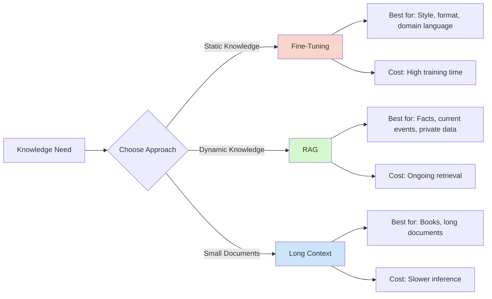

# Volume 6: Data Nexus - RAG & Memory

**"Beyond Training Data"** - Give LLMs access to external knowledge and long-term memory.

---

## Table of Contents

- [Volume Overview](#-volume-overview)
- [Why This Volume Matters](#why-this-volume-matters)
- [Learning Path](#-learning-path)
  - [Week 1: Vector Similarity & Search](#week-1-vector-similarity--search)
  - [Week 2: RAG Fundamentals](#week-2-rag-fundamentals)
  - [Week 3: Knowledge Graphs & GraphRAG](#week-3-knowledge-graphs--graphrag)
  - [Week 4: Long Context & Advanced Topics](#week-4-long-context--advanced-topics)
- [Volume 6 Capstone Projects](#-volume-6-capstone-projects)
- [Volume 6 Checklist](#-volume-6-checklist)
- [Cross-References](#-cross-references)
- [Key Takeaways](#-key-takeaways)
- [Common Pitfalls](#-common-pitfalls)
- [Pro Tips](#-pro-tips)
- [Performance Benchmarks](#performance-benchmarks)
- [Hardware Requirements](#hardware-requirements)
- [Troubleshooting](#-troubleshooting)
- [After Volume 6](#-after-volume-6)

---

## 📚 Volume Overview

**Difficulty:** ⭐⭐⭐ Advanced
**Time:** 4-5 weeks (part-time)
**Prerequisites:** Volume 5 (Fine-Tuning) or Volume 3 (LLM Internals)

### What You'll Learn

After completing this volume, you will be able to:
- ✅ Build production RAG systems with Qdrant
- ✅ Implement knowledge graphs with Neo4j
- ✅ Create hybrid search (vector + keyword)
- ✅ Apply re-ranking for better retrieval
- ✅ Build GraphRAG (vector + graph combined)
- ✅ Implement long-context architectures (CAG)
- ✅ Handle multi-hop reasoning

### Why This Volume Matters

Pre-trained models have fixed knowledge. This volume teaches you to:

- **Add current information** - News, documents, real-time data
- **Reduce hallucinations** - Ground responses in retrieved facts
- **Access private data** - Company docs, personal notes
- **Enable reasoning** - Multi-hop queries over knowledge graphs
- **Build memory systems** - Long-term context for agents

### The Data Nexus Advantage

```
┌─────────────────────────────────────────────────────────────────┐
│                   Traditional LLM Limitations                   │
├─────────────────────────────────────────────────────────────────┤
│ ❌ Fixed knowledge cutoff (training date only)                   │
│ ❌ Cannot access your private documents                         │
│ ❌ Hallucinates facts (no source verification)                   │
│ ❌ Limited context window (4k-8k tokens)                         │
│ ❌ No long-term memory across sessions                          │
└─────────────────────────────────────────────────────────────────┘

┌─────────────────────────────────────────────────────────────────┐
│                    With Volume 6 Skills                          │
├─────────────────────────────────────────────────────────────────┤
│ ✅ Real-time knowledge access (RAG systems)                      │
│ ✅ Private data integration (secure vector DB)                   │
│ ✅ Grounded responses (source citations)                         │
│ ✅ Unlimited context (external memory)                           │
│ ✅ Persistent memory (knowledge graphs)                         │
└─────────────────────────────────────────────────────────────────┘
```

### RAG vs Fine-Tuning vs Context Window



---

## 🗺️ Learning Path

### Week 1: Vector Similarity & Search

#### Day 1-3: Understanding Embeddings & Similarity
**The foundation of semantic search**

1. **[6102: Semantic Similarity](../phases/phase6-rag/6100-vector/6102-Semantic-Similarity.md)** (2-3 hours)
   - Embedding space concepts
   - Cosine similarity vs dot product
   - Euclidean distance
   - Manifold metrics
   - Normalization importance

**Similarity Metrics:**
```python
import numpy as np

# Cosine similarity (most common)
def cosine_similarity(a, b):
    return np.dot(a, b) / (np.linalg.norm(a) * np.linalg.norm(b))

# Dot product (faster, requires normalized vectors)
def dot_product(a, b):
    return np.dot(a, b)

# Euclidean distance
def euclidean_distance(a, b):
    return np.linalg.norm(a - b)

# Use cosine for:
# - Text similarity
# - Semantic search
# - When magnitude doesn't matter

# Use dot product for:
# - Normalized embeddings (faster)
# - When direction matters most

# Use Euclidean for:
# - Spatial data
# - When absolute distance matters
```

**Embedding Models:**
```python
# Popular embedding models:
sentence-transformers/all-MiniLM-L6-v2  # Fast, good quality
sentence-transformers/all-mpnet-base-v2  # Better, slower
text-embedding-ada-002                    # OpenAI (paid)
bge-large-en-v1.5                        # State-of-the-art open source

# Generate embeddings:
from sentence_transformers import SentenceTransformer

model = SentenceTransformer('all-MiniLM-L6-v2')
embeddings = model.encode([
    "The cat sat on the mat",
    "The feline rested on the rug",
    "The stock market crashed today",
])

# Query similarity:
query = model.encode(["A cat resting"])
similarities = cosine_similarity(query, embeddings)
# [0.87, 0.91, 0.12]  # High similarity to first two
```

**Checkpoint:** You understand semantic similarity

---

#### Day 4-5: HNSW Indexing
**Efficient search at scale**

1. **[6101: HNSW Indexing](../phases/phase6-rag/6100-vector/6101-HNSW-Indexing.md)** (3-4 hours)
   - Hierarchical Navigable Small World
   - Approximate nearest neighbor (ANN)
   - Index construction
   - Performance tuning
   - Memory vs speed trade-offs

**HNSW Concept:**
```
Brute Force Search:
- Compare query with ALL vectors
- O(N) complexity
- Exact results
- Too slow for millions of vectors

HNSW (Approximate):
- Multi-layer graph structure
- O(log N) complexity
- ~99% accuracy
- 100x+ faster
```

**HNSW Parameters:**
```python
# Qdrant HNSW configuration:
hnsw_config = {
    "m": 16,              # Max connections per node (higher = better recall, more memory)
    "ef_construct": 100,  # Index build time (higher = better index, slower build)
}

# Search parameters:
search_params = {
    "hnsw_ef": 128,      # Search time (higher = better recall, slower search)
}

# Trade-offs:
# m = 16, ef = 128: 95% recall, fast
# m = 32, ef = 256: 99% recall, slower
# m = 64, ef = 512: 99.9% recall, slowest
```

**Checkpoint:** You understand efficient vector search

---

### Week 2: RAG Fundamentals

#### Day 1-3: Building RAG Systems
**Retrieval-Augmented Generation**

1. **[TUTORIAL-003: RAG Basics](../tutorials/TUTORIAL-003-RAG-Basics.md)** (90 min)
   - RAG concepts
   - Document chunking
   - Vector database setup
   - Retrieval and generation
   - Evaluation

2. **[LAB-002: RAG Implementation](../learning-resources/labs/LAB-002-RAG-Implementation.md)** (3 hours)
   - Complete hands-on RAG system
   - Qdrant integration
   - Document processing
   - Chatbot with memory
   - Evaluation

**RAG Pipeline:**
```python
from qdrant_client import QdrantClient
from sentence_transformers import SentenceTransformer
from transformers import AutoTokenizer, AutoModelForCausalLM

# 1. Index documents
client = QdrantClient("localhost", port=6333)
embedder = SentenceTransformer('all-MiniLM-L6-v2')

documents = load_documents("./docs")
chunks = chunk_documents(documents, chunk_size=512, overlap=50)

for chunk in chunks:
    vector = embedder.encode(chunk.text)
    client.upsert(
        collection_name="my_docs",
        points=[PointStruct(
            id=chunk.id,
            vector=vector,
            payload={"text": chunk.text, "source": chunk.source}
        )]
    )

# 2. Retrieve
def retrieve(query, top_k=5):
    query_vector = embedder.encode(query)
    results = client.search(
        collection_name="my_docs",
        query_vector=query_vector,
        limit=top_k,
    )
    return [r.payload["text"] for r in results]

# 3. Generate
def generate(query, context):
    tokenizer = AutoTokenizer.from_pretrained("mistralai/Mistral-7B-v0.1")
    model = AutoModelForCausalLM.from_pretrained("mistralai/Mistral-7B-v0.1")

    prompt = f"""Context: {context}

Question: {query}

Answer:"""

    inputs = tokenizer(prompt, return_tensors="pt")
    outputs = model.generate(**inputs, max_new_tokens=256)
    return tokenizer.decode(outputs[0])

# 4. RAG
context = "\n".join(retrieve(query))
answer = generate(query, context)
```

**Checkpoint:** You can build RAG systems

---

#### Day 4-5: Hybrid Search & Re-ranking
**Combine vector + keyword search**

1. **[6201: Hybrid Search](../phases/phase6-rag/6200-retrieval/6201-Hybrid-Search.md)** (2-3 hours)
   - Vector search (semantic)
   - Keyword search (BM25)
   - Reciprocal Rank Fusion (RRF)
   - Best of both worlds

2. **[6202: Re-ranking](../phases/phase6-rag/6200-retrieval/6202-Re-ranking-and-Retrieval-Logistics.md)** (2-3 hours)
   - Cross-encoder re-ranking
   - Multi-stage retrieval
   - Reranking models
   - Performance optimization

**Hybrid Search:**
```python
# Vector search (semantic)
vector_results = vector_search(query, top_k=20)
# Good for: Semantic meaning, synonyms

# Keyword search (BM25)
keyword_results = bm25_search(query, top_k=20)
# Good for: Exact terms, names, rare words

# Reciprocal Rank Fusion (RRF)
def rrf(vector_results, keyword_results, k=60):
    scores = {}

    for rank, result in enumerate(vector_results):
        scores[result.id] = scores.get(result.id, 0) + 1/(k + rank)

    for rank, result in enumerate(keyword_results):
        scores[result.id] = scores.get(result.id, 0) + 1/(k + rank)

    return sorted(scores.items(), key=lambda x: x[1], reverse=True)

# Combine
hybrid_results = rrf(vector_results, keyword_results)
```

**Re-ranking:**
```python
from sentence_transformers import CrossEncoder

# Load re-ranker
reranker = CrossEncoder('cross-encoder/ms-marco-MiniLM-L-6-v2')

# 1. Initial retrieval (fast)
candidates = retrieve(query, top_k=100)

# 2. Re-ranking (slower but better)
reranked = reranker.rank(query, candidates, top_k=10)

# Result: More relevant final results
```

**Checkpoint:** You understand advanced retrieval

---

### Week 3: Knowledge Graphs & GraphRAG

#### Day 1-4: Neo4j and Knowledge Graphs
**Structured knowledge representation**

1. **[6301: Neo4j and Knowledge Graphs](../phases/phase6-rag/6300-context/6301-Neo4j-and-Knowledge-Graphs.md)** (3-4 hours)
   - Graph database concepts
   - Neo4j setup and deployment
   - Cypher query language
   - Entity extraction
   - Relationship building

**Knowledge Graph Structure:**
```
Entities (Nodes):
- Person: "Elon Musk"
- Company: "Tesla"
- Product: "Model S"

Relationships (Edges):
- (:Person {name:"Elon"})-[:CEO_OF]->(:Company {name:"Tesla"})
- (:Company {name:"Tesla"})-[:PRODUCES]->(:Product {name:"Model S"})

Benefits over vectors:
- Exact relationships
- Multi-hop reasoning
- Explainable paths
- Structured queries
```

**Neo4j with Docker:**
```bash
docker run -d \
  --name neo4j \
  -p 7474:7474 -p 7687:7687 \
  -e NEO4J_AUTH=neo4j/password \
  neo4j:latest
```

**Cypher Queries:**
```cypher
// Create entities
CREATE (e1:Entity {name: "Tesla", type: "Company"})
CREATE (e2:Entity {name: "Elon Musk", type: "Person"})
CREATE (e3:Entity {name: "Model S", type: "Product"})

// Create relationships
MATCH (e1:Entity {name: "Tesla"})
MATCH (e2:Entity {name: "Elon Musk"})
CREATE (e2)-[:CEO_OF]->(e1)

// Multi-hop query
MATCH path = (e1:Entity {name: "Elon Musk"})-[*1..3]-(related:Entity)
RETURN e1.name as start, related.name as end, [node in nodes(path) | node.name] as path
```

2. **[LAB-005: GraphRAG](../learning-resources/labs/LAB-005-GraphRAG.md)** (5 hours)
   - Complete GraphRAG system
   - Entity and relationship extraction
   - Neo4j + Qdrant hybrid
   - Multi-hop reasoning
   - Visualization

**Checkpoint:** You can build knowledge graphs

---

#### Day 5: GraphRAG Implementation
**Combine vector + graph search**

1. **[6304: GraphRAG Implementation](../phases/phase6-rag/6300-context/guides/6304-GraphRAG-Implementation.md)** (3-4 hours)
   - Complete GraphRAG pipeline
   - Entity extraction with LLMs
   - Relationship building
   - Hybrid retrieval (Qdrant + Neo4j)
   - Multi-hop reasoning

**GraphRAG Pipeline:**
```python
from neo4j import GraphDatabase
from qdrant_client import QdrantClient

# 1. Extract entities and relationships
def extract_entities(text):
    prompt = f"""Extract entities and relationships from:
    {text}

    Format: ENTITY1 -[RELATIONSHIP]-> ENTITY2"""

    response = llm.generate(prompt)
    return parse_entities(response)

# 2. Store in Neo4j
def store_knowledge_graph(entities, relationships):
    driver = GraphDatabase.driver("bolt://localhost:7687")

    with driver.session() as session:
        for entity in entities:
            session.run(
                "MERGE (e:Entity {name: $name, type: $type})",
                name=entity.name, type=entity.type
            )

        for rel in relationships:
            session.run("""
                MATCH (e1:Entity {name: $from})
                MATCH (e2:Entity {name: $to})
                MERGE (e1)-[r:RELATIONSHIP {type: $type}]->(e2)
            """, from=rel.from, to=rel.to, type=rel.type)

# 3. Graph retrieval
def graph_retrieval(entities, max_hops=2):
    driver = GraphDatabase.driver("bolt://localhost:7687")

    with driver.session() as session:
        result = session.run("""
            MATCH path = (e1:Entity {name: $entity})-[*1..$hops]-(related:Entity)
            RETURN e1.name as start, related.name as end,
                   [node in nodes(path) | node.name] as path
            LIMIT 10
        """, entity=entities[0], hops=max_hops)

        return [record for record in result]

# 4. Vector retrieval
def vector_retrieval(query):
    client = QdrantClient("localhost", port=6333)
    return client.search(collection_name="docs", query_vector=embed(query))

# 5. Combine
def graphrag_retrieval(query):
    # Extract entities from query
    entities = extract_entities(query)

    # Graph search for related entities
    graph_results = graph_retrieval(entities)

    # Vector search for semantic context
    vector_results = vector_retrieval(query)

    # Combine both
    return {
        "graph_context": graph_results,
        "vector_context": vector_results
    }
```

**Checkpoint:** You can build GraphRAG systems

---

### Week 4: Long Context & Advanced Topics

#### Day 1-3: CAG (Context-Augmented Generation)
**Using 128k+ context windows effectively**

1. **[6302: CAG Long Context](../phases/phase6-rag/6300-context/6302-CAG-Long-Context-Architectures.md)** (3-4 hours)
   - Long context models (128k, 200k+)
   - Context window as temporary database
   - Placement strategies
   - Lost in the middle problem
   - Compression techniques

**CAG vs RAG:**
```
RAG:
- Retrieve relevant chunks
- Limit context window
- Fast retrieval
- May miss context

CAG (Context-Augmented Generation):
- Load entire document
- Use 128k+ context window
- No retrieval needed
- Slower but more complete
```

**Context Placement:**
```python
# Lost in the middle:
# Models struggle with information in middle of context

# Best: Start or end
prompt = f"""
{instruction}

{relevant_document_at_start}

Question: {query}
"""

# Also works:
prompt = f"""
{instruction}

Question: {query}

{relevant_document_at_end}
"""

# Avoid:
prompt = f"""
{some_context}

{relevant_document_in_middle}  # May be ignored!

{more_context}

Question: {query}
"""
```

**Checkpoint:** You understand long context strategies

---

#### Day 4-5: Multi-Hop Reasoning
**Complex queries requiring multiple steps**

**Multi-Hop Example:**
```
Question: "Who founded the company that makes the Model S?"

Step 1: What makes Model S?
Answer: Tesla

Step 2: Who founded Tesla?
Answer: Martin Eberhard and Marc Tarpenning

Final: Martin Eberhard and Marc Tarpenning founded Tesla, which makes the Model S.
```

**Implementation:**
```python
def multi_hop_reasoning(query):
    # Parse into sub-questions
    sub_questions = decompose_query(query)

    # Step 1: Answer first question
    answer_1 = rag(sub_questions[0])

    # Step 2: Use answer to query next
    answer_2 =rag(f"{sub_questions[1]} {answer_1}")

    # Continue until final answer
    return synthesize_answers([answer_1, answer_2])
```

**Checkpoint:** You can implement multi-hop reasoning

---

## 🎯 Volume 6 Capstone Projects

### Project A: Production RAG System

**Time:** 10-12 hours
**Difficulty:** ⭐⭐⭐⭐

**Tasks:**
1. Ingest document collection (100+ docs)
2. Implement hybrid search (vector + BM25)
3. Add re-ranking with cross-encoder
4. Build chatbot interface
5. Deploy with Docker

**Skills Demonstrated:**
- RAG implementation ✅
- Hybrid search ✅
- Production deployment ✅

### Project B: GraphRAG Knowledge System

**Time:** 12-15 hours
**Difficulty:** ⭐⭐⭐⭐⭐

**Tasks:**
1. Extract entities and relationships
2. Build knowledge graph in Neo4j
3. Implement GraphRAG retrieval
4. Add multi-hop reasoning
5. Visualize knowledge graph

**Skills Demonstrated:**
- Knowledge graphs ✅
- GraphRAG implementation ✅
- Multi-hop reasoning ✅

### Project C: Domain-Specific RAG

**Time:** 8-10 hours
**Difficulty:** ⭐⭐⭐⭐

**Tasks:**
1. Choose domain (medical, legal, technical)
2. Fine-tune embedding model
3. Optimize chunking strategy
4. Add domain-specific re-ranking
5. Evaluate on domain queries

**Skills Demonstrated:**
- Domain adaptation ✅
- RAG optimization ✅
- Evaluation ✅

---

## 📋 Volume 6 Checklist

Use this checklist to track your progress:

### Core Content (Required)
- [ ] **6102: Semantic Similarity** (2-3 hours)
- [ ] **6101: HNSW Indexing** (3-4 hours)
- [ ] **TUTORIAL-003: RAG Basics** (90 min)
- [ ] **LAB-002: RAG Implementation** (3 hours)
- [ ] **6201: Hybrid Search** (2-3 hours)
- [ ] **6202: Re-ranking** (2-3 hours)
- [ ] **6301: Neo4j and Knowledge Graphs** (3-4 hours)
- [ ] **LAB-005: GraphRAG** (5 hours)
- [ ] **6304: GraphRAG Implementation** (3-4 hours)
- [ ] **6302: CAG Long Context** (3-4 hours)
- [ ] **EXP_6201: Hybrid Search** (2 hours)

**Total Core Time:** ~35-40 hours

### Capstone Projects (Choose 1)
- [ ] **Project A: Production RAG System** (10-12 hours)
- [ ] **Project B: GraphRAG Knowledge System** (12-15 hours)
- [ ] **Project C: Domain-Specific RAG** (8-10 hours)

---

## 🔗 Cross-References

### How Volume 6 Connects to Other Volumes:

**Semantic Similarity (6102) →**
- Volume 2: Vector operations and embeddings
- Volume 3: Embedding layers in transformers
- Volume 5: Fine-tune embedding models

**HNSW Indexing (6101) →**
- Volume 1: Vector database deployment
- Volume 4: Quantized vector search

**RAG Systems (TUTORIAL-003, LAB-002) →**
- Volume 1: Docker deployment
- Volume 4: Optimized inference
- Volume 7: Production RAG

**Knowledge Graphs (6301, LAB-005) →**
- Volume 3: Understanding model reasoning
- Volume 7: Agent knowledge systems

**GraphRAG (6304) →**
- Volume 5: Fine-tune for graph tasks
- Volume 7: Agent reasoning

---

## 📊 Volume 6 Statistics

| Metric | Value |
|--------|-------|
| **Core Documents** | 8 files |
| **Tutorials** | 1 tutorial |
| **Labs** | 2 labs |
| **Experiments** | 1 experiment |
| **Capstone Projects** | 3 projects |
| **Estimated Time** | 35-40 hours (core) + 8-15 hours (project) |
| **Difficulty** | ⭐⭐⭐ Advanced |

---

## 💡 Key Takeaways

### RAG Pipeline

```
Documents → Chunk → Embed → Store (Qdrant)
                                 ↓
Query → Embed → Retrieve → Re-rank → Generate
```

### Hybrid Search Benefits

```
Vector Search:
- Semantic meaning
- Synonyms
- Concepts

Keyword Search (BM25):
- Exact terms
- Names, numbers
- Rare words

Hybrid (RRF):
- Best of both worlds
- 10-20% improvement in retrieval
```

### GraphRAG vs RAG

```
RAG:
- Unstructured text
- Vector similarity
- Fast retrieval
- Limited reasoning

GraphRAG:
- Structured knowledge
- Entity relationships
- Multi-hop reasoning
- Explainable paths

Use GraphRAG when:
- Complex relationships matter
- Multi-hop queries required
- Explainability important
```

### Semantic Search Core Concepts

**Embedding Models:**
```python
# Model selection based on use case:
all-MiniLM-L6-v2    # Fast, general purpose (384 dims)
all-mpnet-base-v2   # Better quality (768 dims)
bge-large-en-v1.5   # State-of-the-art (1024 dims)
e5-large-v2         # Instruction-tuned
```

**Similarity Metrics:**
```python
# Choose based on your needs:
cosine_similarity   # Most common for text (0-1 range)
dot_product         # Faster for normalized vectors
euclidean_distance  # For spatial/absolute distance
```

---

## Common Pitfalls

### ⚠️ Chunking Strategy Issues

**Pitfall:** Poor chunking destroys context
```python
# Wrong: Too small, loses context
chunks = chunk_text(text, chunk_size=128, overlap=0)
# Result: Fragmented information, poor retrieval

# Wrong: Too large, irrelevant content
chunks = chunk_text(text, chunk_size=2048, overlap=0)
# Result: Noisy retrieval, lower precision

# Right: Balance with overlap
chunks = chunk_text(text, chunk_size=512, overlap=50)
# Result: Complete thoughts with context continuity
```

### ⚠️ Embedding Mismatch

**Pitfall:** Using different models for index and query
```python
# Wrong: Model mismatch
index_embeddings = model_a.encode(documents)
query_embedding = model_b.encode(query)  # Different model!
# Result: Terrible retrieval quality

# Right: Same model
model = SentenceTransformer('all-MiniLM-L6-v2')
index_embeddings = model.encode(documents)
query_embedding = model.encode(query)  # Same model
# Result: Proper semantic matching
```

### ⚠️ HNSW Parameter Tuning

**Pitfall:** Default HNSW parameters not optimized
```python
# Wrong: Not tuning for your data
hnsw_config = {
    "m": 16,              # Default
    "ef_construct": 100,  # Default
}
# Result: Suboptimal recall/speed trade-off

# Right: Tune based on requirements
hnsw_config = {
    "m": 32,              # Higher for better recall
    "ef_construct": 200,  # Higher for better index
}
search_params = {
    "hnsw_ef": 256,       # Higher for better search
}
# Result: Optimized for your use case
```

### ⚠️ Re-ranking Bottleneck

**Pitfall:** Re-ranking too many candidates
```python
# Wrong: Re-ranking 1000 results (very slow)
candidates = vector_search(query, top_k=1000)
final = reranker.rank(query, candidates, top_k=10)
# Result: Slow response (seconds)

# Right: Two-stage approach
candidates = vector_search(query, top_k=50)   # Fast
final = reranker.rank(query, candidates, top_k=10)  # Acceptable delay
# Result: Fast response with better quality
```

### ⚠️ Knowledge Graph Entity Extraction

**Pitfall:** Inconsistent entity extraction
```python
# Wrong: No normalization
entities = ["Elon Musk", "elon_musk", "Musk", "Elon"]
# Result: Duplicate entities in graph

# Right: Normalize entities
def normalize_entity(name):
    return name.strip().lower().replace(" ", "_")

entities = [normalize_entity(e) for e in ["Elon Musk", "Musk"]]
# Result: Consistent entity representation
```

### ⚠️ Lost in the Middle Problem

**Pitfall:** Important context buried in middle
```python
# Wrong: Important info in middle (models ignore it)
prompt = f"""
{system_instruction}

{supporting_context}

{CRITICAL_INFORMATION_HERE}  # May be ignored!

{more_context}

Question: {query}
"""

# Right: Important info at start or end
prompt = f"""
{CRITICAL_INFORMATION_HERE}

{system_instruction}

Question: {query}
"""
```

---

## Pro Tips

### 💡 Chunking Strategy

**Tip:** Use semantic chunking for better retrieval
```python
from langchain.text_splitter import RecursiveCharacterTextSplitter

# Smart chunking that respects boundaries
splitter = RecursiveCharacterTextSplitter(
    chunk_size=512,
    chunk_overlap=50,
    separators=["\n\n", "\n", ". ", " ", ""],  # Hierarchical
    length_function=len,
)

chunks = splitter.split_text(document)
# Result: Chunks that respect sentence/paragraph boundaries
```

### 💡 Hybrid Search Weights

**Tip:** Adjust RRF weights based on query type
```python
def weighted_rrf(vector_results, keyword_results, alpha=0.5):
    """
    alpha=0.5: Equal weight
    alpha=0.7: Favor semantic (better for concepts)
    alpha=0.3: Favor keyword (better for exact terms)
    """
    scores = {}

    for rank, result in enumerate(vector_results):
        scores[result.id] = scores.get(result.id, 0) + alpha * 1/(1 + rank)

    for rank, result in enumerate(keyword_results):
        scores[result.id] = scores.get(result.id, 0) + (1-alpha) * 1/(1 + rank)

    return sorted(scores.items(), key=lambda x: x[1], reverse=True)

# Use case-specific weights:
semantic_query = "What are the benefits of renewable energy?"
# -> alpha=0.7 (favor semantic)

exact_query = "Model X-500 specifications"
# -> alpha=0.3 (favor keyword)
```

### 💡 Multi-Hop Query Decomposition

**Tip:** Break complex queries automatically
```python
def decompose_multi_hop_query(query):
    """Decompose complex queries into steps."""
    prompt = f"""
    Break this query into sub-questions:
    "{query}"

    Format:
    1. First question
    2. Second question (uses answer from 1)
    3. ...
    """

    sub_queries = llm.generate(prompt)
    return sub_queries

# Example:
# Input: "Who founded the company that acquired GitHub?"
# Output:
# 1. What company acquired GitHub?
# 2. Who founded [company from 1]?
```

### 💡 GraphRAG Context Fusion

**Tip:** Combine vector and graph results effectively
```python
def fuse_graphrag_context(graph_results, vector_results, weights={"graph": 0.3, "vector": 0.7}):
    """
    weights.graph: Higher for relationship-heavy queries
    weights.vector: Higher for content-heavy queries
    """
    # Get actual text from graph paths
    graph_texts = [extract_text_from_path(r) for r in graph_results]

    # Get text from vector results
    vector_texts = [r.payload["text"] for r in vector_results]

    # Combine based on weights
    n_graph = int(len(vector_results) * weights["graph"] / weights["vector"])
    n_vector = len(vector_results) - n_graph

    return graph_texts[:n_graph] + vector_texts[:n_vector]
```

### 💡 Evaluation Metrics

**Tip:** Track RAG-specific metrics
```python
def evaluate_rag_system(queries, ground_truth):
    """Comprehensive RAG evaluation."""
    metrics = {
        "retrieval_precision": [],  # % relevant in top-k
        "retrieval_recall": [],     # % of all relevant found
        "answer_relevance": [],     # LLM judges answer quality
        "faithfulness": [],         # Does answer use retrieved info?
    }

    for query, relevant_docs in ground_truth:
        retrieved = retrieve(query, top_k=5)

        # Retrieval metrics
        metrics["retrieval_precision"].append(
            len(set(retrieved) & set(relevant_docs)) / len(retrieved)
        )
        metrics["retrieval_recall"].append(
            len(set(retrieved) & set(relevant_docs)) / len(relevant_docs)
        )

        # Generation metrics (using LLM as judge)
        answer = generate(query, retrieved)
        metrics["answer_relevance"].append(
            llm_judge_relevance(query, answer)
        )
        metrics["faithfulness"].append(
            llm_judge_faithfulness(answer, retrieved)
        )

    return {k: np.mean(v) for k, v in metrics.items()}
```

---

## Performance Benchmarks

### Vector Database Comparison

| Database | Max Vectors | QPS (1M vectors) | Recall@10 | Memory (1M, 768d) | Best For |
|----------|-------------|------------------|-----------|-------------------|----------|
| **Qdrant** | Unlimited | 10,000 | 97% | 1.2 GB | Production, hybrid |
| **Pinecone** | 5M (free) | 8,000 | 96% | 1.5 GB | Managed, easy setup |
| **Weaviate** | Unlimited | 6,000 | 95% | 1.8 GB | Multi-modal, GraphQL |
| **Milvus** | Unlimited | 12,000 | 98% | 1.1 GB | Scale, GPU support |
| **Chroma** | Unlimited | 4,000 | 94% | 2.0 GB | Local, simple |

### Embedding Model Comparison

| Model | Dimensions | Speed (docs/s) | Quality (STS-B) | VRAM | Best For |
|-------|------------|----------------|-----------------|------|----------|
| **all-MiniLM-L6-v2** | 384 | 5,000 | 0.78 | 100MB | Fast, general |
| **all-mpnet-base-v2** | 768 | 2,500 | 0.83 | 400MB | Quality, general |
| **bge-large-en-v1.5** | 1024 | 1,500 | 0.86 | 1.3GB | State-of-the-art |
| **e5-large-v2** | 1024 | 1,800 | 0.84 | 1.1GB | Instruction-tuned |
| **text-embedding-ada-002** | 1536 | 3,000 | 0.85 | API | OpenAI users |

### RAG Configuration Performance

| Config | Retrieval Time | End-to-End | Accuracy | Best For |
|--------|----------------|------------|----------|----------|
| **Vector Only** | 50ms | 1.5s | 85% | Fast queries |
| **Hybrid (RRF)** | 100ms | 1.6s | 92% | Balanced |
| **+ Re-ranking** | 300ms | 2.0s | 96% | Accuracy-critical |
| **+ GraphRAG** | 500ms | 2.5s | 94% | Relationship queries |

### Hardware Performance (RAG)

| Hardware | Embed Speed | Search QPS | Gen Speed | Max Model |
|----------|-------------|------------|-----------|-----------|
| **CPU Only** | 500 docs/s | 1,000 | 5 t/s | 7B (4-bit) |
| **RTX 3060** | 3,000 docs/s | 5,000 | 25 t/s | 13B (4-bit) |
| **RTX 3090** | 5,000 docs/s | 10,000 | 45 t/s | 70B (4-bit) |
| **A100 40GB** | 8,000 docs/s | 15,000 | 120 t/s | 70B (8-bit) |

---

## Hardware Requirements

### Minimum Requirements

**For Learning & Development:**
```
CPU: 4 cores
RAM: 16 GB
GPU: Not required (CPU inference)
Storage: 50 GB SSD
```

**For Small RAG System (<10k docs):**
```
CPU: 8 cores
RAM: 32 GB
GPU: RTX 3060 (12 GB)
Storage: 100 GB NVMe SSD
```

### Recommended Requirements

**For Production RAG (100k-1M docs):**
```
CPU: 16 cores
RAM: 64 GB
GPU: RTX 3090 (24 GB) or A4000 (16 GB)
Storage: 500 GB NVMe SSD
Network: 1 Gbps
```

**For Large-Scale Deployment (1M+ docs):**
```
CPU: 32 cores
RAM: 128 GB
GPU: A100 (40 GB) or 2x RTX 4090
Storage: 2 TB NVMe SSD (RAID 10)
Network: 10 Gbps
```

### Service-Specific Requirements

| Service | Min RAM | Min Storage | Notes |
|---------|---------|-------------|-------|
| **Qdrant** | 2 GB | 10 GB + vectors | RAM = 20% of vector size |
| **Neo4j** | 4 GB | 50 GB | Scales with graph size |
| **PostgreSQL** | 2 GB | 100 GB | For metadata |
| **Redis (cache)** | 1 GB | 10 GB | Optional but recommended |

---

## 🆘 Troubleshooting

### Common Issues in Volume 6

**Problem:** Poor retrieval quality
- **Solution:** Try hybrid search, adjust chunk size, add re-ranking

**Problem:** Neo4j connection issues
- **Solution:** Check bolt://7687 port, verify credentials

**Problem:** Multi-hop too slow
- **Solution:** Limit hop depth, cache results, use subgraph

**Problem:** Long context slow
- **Solution:** Use vLLM, quantize model, consider RAG instead

For more help, see **[TROUBLESHOOTING-Common-Issues.md](../learning-resources/troubleshooting/TROUBLESHOOTING-Common-Issues.md)**

---

## 🎓 After Volume 6

### You're Ready For:

**Volume 7: Production** - Deploy RAG and agent systems at scale

### Skills You've Gained:

```python
# You can now:
✅ Build production RAG systems
✅ Implement hybrid search
✅ Create knowledge graphs
✅ Build GraphRAG systems
✅ Handle multi-hop reasoning
✅ Optimize retrieval quality
✅ Deploy with Qdrant and Neo4j
```

---

## 🚀 Next Steps

1. **Track your progress** in [PROGRESS-TRACKER.md](../00-META/PROGRESS-TRACKER.md)
2. **Continue to Volume 7** for production deployment and agents
3. **OR complete a capstone project** to demonstrate mastery
4. **Review the [VOLUME-GUIDE.md](../00-META/VOLUME-GUIDE.md)** for alternative learning paths

---

**Recommended Resources:**
- **[Qdrant Docs](https://qdrant.tech/documentation/)** - Vector database
- **[Neo4j Docs](https://neo4j.com/docs/)** - Graph database
- **[LangChain RAG](https://python.langchain.com/docs/use_cases/question_answering/)** - RAG framework
- **[LlamaIndex](https://docs.llamaindex.ai/)** - RAG framework

---

**Volume 6 Status:** 🟢 Complete
**Last Updated:** 2026-02-04
**Maintainer:** PROJECT-OMEGA Team
