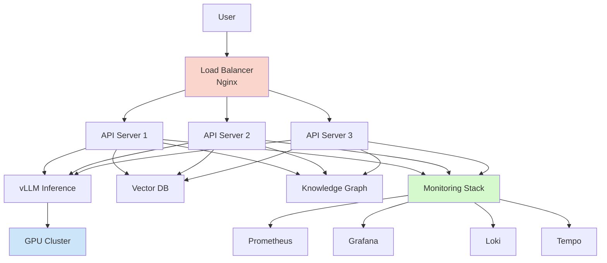

# Volume 7: Production Mastery

**"From Lab to Production"** - Deploy, scale, and monitor AI systems in production environments.

---

## Table of Contents

- [Volume Overview](#volume-overview)
- [Why This Volume Matters](#why-this-volume-matters)
- [Production vs Development](#production-vs-development)
- [Learning Path](#learning-path)
  - [Week 1: Monitoring & Observability](#week-1-monitoring--observability)
  - [Week 2: Production Deployment](#week-2-production-deployment)
  - [Week 3: CI/CD & Automation](#week-3-cicd--automation)
  - [Week 4: Agentic Systems](#week-4-agentic-systems)
  - [Week 5: Multi-Agent Systems](#week-5-multi-agent-systems)
  - [Week 6: Advanced Production Topics](#week-6-advanced-production-topics)
- [Volume 7 Capstone Projects](#volume-7-capstone-projects)
- [Volume 7 Checklist](#volume-7-checklist)
- [Cross-References](#cross-references)
- [Volume 7 Statistics](#volume-7-statistics)
- [Key Takeaways](#key-takeaways)
- [Common Pitfalls](#common-pitfalls)
- [Pro Tips](#pro-tips)
- [Performance Benchmarks](#performance-benchmarks)
- [Production Architecture](#production-architecture)
- [Hardware Requirements](#hardware-requirements)
- [Cost Analysis](#cost-analysis)
- [Troubleshooting](#troubleshooting)
- [After Volume 7](#after-volume-7)
- [Completion Certificate](#completion-certificate)
- [What's Next?](#whats-next)

---

## Volume Overview

**Difficulty:** ⭐⭐⭐ Advanced
**Time:** 5-6 weeks (part-time)
**Prerequisites:** Volume 6 (RAG & Memory) or equivalent experience

### What You'll Learn

After completing this volume, you will be able to:
- ✅ Deploy AI systems with SSL/TLS encryption
- ✅ Set up Nginx reverse proxies and load balancing
- ✅ Implement CI/CD pipelines with GitHub Actions
- ✅ Configure comprehensive monitoring (Prometheus, Grafana, Loki, Tempo)
- ✅ Build agentic systems with ReAct patterns
- ✅ Implement multi-agent collaboration
- ✅ Create tool-calling systems with sandboxes
- ✅ Manage agent memory and state
- ✅ Handle production incident response

### Why This Volume Matters

This is the **culmination of the curriculum**. You'll learn to:

- **Deploy at scale** - Handle thousands of requests
- **Ensure reliability** - Health checks, auto-restart, backups
- **Monitor effectively** - Metrics, logs, traces, alerts
- **Build agents** - Autonomous AI systems that use tools
- **Run in production** - Security, SSL, load balancing

### Production vs Development

```text
┌─────────────────────────────────────────────────────────────────┐
│                     Development Environment                      │
├─────────────────────────────────────────────────────────────────┤
│ ✅ Single container (docker-compose up)                         │
│ ✅ HTTP only (no SSL)                                            │
│ ✅ Localhost only                                                │
│ ✅ Manual deployment                                             │
│ ✅ No monitoring                                                 │
│ ✅ No backups                                                    │
│ ✅ Fast iteration                                                │
└─────────────────────────────────────────────────────────────────┘

┌─────────────────────────────────────────────────────────────────┐
│                      Production Environment                      │
├─────────────────────────────────────────────────────────────────┤
│ 🔒 Multiple services (orchestrated)                              │
│ 🔒 SSL/TLS encryption (HTTPS)                                    │
│ 🔒 Domain + authentication                                       │
│ 🔒 CI/CD automation                                              │
│ 🔒 Comprehensive monitoring (Prometheus + Grafana + Loki)        │
│ 🔒 Automated backups (daily + offsite)                           │
│ 🔒 High availability (load balancing + failover)                 │
│ 🔒 Incident response runbooks                                    │
└─────────────────────────────────────────────────────────────────┘
```

### Production Architecture Overview



---

## Learning Path

### Week 1: Monitoring & Observability

#### Day 1-3: The Three Pillars
**Metrics, Logs, Traces**

1. **[TUTORIAL-004: Monitoring](../learning-resources/tutorials/TUTORIAL-004-Monitoring.md)** (90 min)
   - Observability concepts
   - Prometheus for metrics
   - Grafana for visualization
   - Loki for log aggregation
   - Tempo for distributed tracing

2. **[1501: Monitoring Stack](../phases/phase1-infra/1500-monitoring/1501-Monitoring-and-Observability.md)** (2-3 hours)
   - Complete monitoring architecture
   - GPU monitoring setup
   - Alert configuration
   - Dashboard creation

**Monitoring Stack:**
```yaml
# Complete monitoring stack
services:
  prometheus:   # Metrics collection
  grafana:      # Visualization
  loki:         # Log aggregation
  promtail:     # Log collection
  tempo:        # Distributed tracing
  node-exporter: # Host metrics
  cadvisor:     # Container metrics
  gpu-exporter: # GPU metrics
```

**Checkpoint:** You can deploy monitoring stack

---

#### Day 4-5: GPU & LLM Monitoring
**Specialized monitoring for AI systems**

**GPU Metrics:**
```text
# Key GPU metrics to monitor:
nvidia_gpu_memory_used_bytes        # VRAM usage
nvidia_gpu_utilization              # GPU compute utilization
nvidia_gpu_temperature_celsius      # GPU temperature
nvidia_gpu_power_usage_milliwatts   # Power consumption
nvidia_gpu_memory_free_bytes        # Available VRAM

# Prometheus queries:
# GPU utilization over time
rate(nvidia_gpu_utilization_gpu0[5m]) * 100

# GPU memory in GB
nvidia_gpu_memory_used_bytes{gpu="0"} / 1024 / 1024 / 1024

# GPU temperature
nvidia_gpu_temperature_celsius_gpu{gpu="0"}
```

**LLM Metrics:**
```python
# Custom metrics for LLM applications:
from prometheus_client import Counter, Histogram, Gauge

# Request metrics
request_counter = Counter(
    'llm_requests_total',
    'Total LLM requests',
    ['model', 'status']
)

request_duration = Histogram(
    'llm_request_duration_seconds',
    'LLM request duration',
    ['model']
)

token_throughput = Gauge(
    'llm_tokens_per_second',
    'Token generation throughput',
    ['model']
)

# Usage
request_counter.labels(model='mistral', status='success').inc()
request_duration.labels(model='mistral').observe(duration)
token_throughput.labels(model='mistral').set(tokens / duration)
```

**Checkpoint:** You can monitor GPU and LLM performance

---

### Week 2: Production Deployment

#### Day 1-3: SSL/TLS & Security
**Secure your AI services**

1. **[TUTORIAL-005: Production Deployment](../learning-resources/tutorials/TUTORIAL-005-Production-Deployment.md)** (90 min)
   - SSL certificate setup (Let's Encrypt, self-signed)
   - Nginx reverse proxy
   - Security headers
   - Rate limiting
   - Authentication

**SSL Setup:**
```bash
# Let's Encrypt (recommended for production)
sudo certbot certonly --standalone -d api.yourdomain.com

# Self-signed (for local/testing)
openssl req -x509 -nodes -days 365 -newkey rsa:2048 \
  -keyout ssl/private/selfsigned.key \
  -out ssl/certs/selfsigned.crt
```

**Nginx Configuration:**
```nginx
server {
    listen 443 ssl http2;
    server_name api.yourdomain.com;

    # SSL certificates
    ssl_certificate /etc/nginx/ssl/certs/selfsigned.crt;
    ssl_certificate_key /etc/nginx/ssl/private/selfsigned.key;

    # SSL configuration
    ssl_protocols TLSv1.2 TLSv1.3;
    ssl_ciphers HIGH:!aNULL:!MD5;

    # Security headers
    add_header Strict-Transport-Security "max-age=31536000" always;
    add_header X-Frame-Options "SAMEORIGIN" always;
    add_header X-Content-Type-Options "nosniff" always;

    # LLM endpoint with rate limiting
    location /v1/chat/completions {
        limit_req zone=llm burst=20;
        limit_req_status 429;

        proxy_pass http://api_servers;
        proxy_read_timeout 300s;  # 5 minutes for LLM generation
    }

    # Health check
    location /health {
        proxy_pass http://api_servers/health;
        access_log off;
    }
}
```

**Checkpoint:** You can secure services with SSL

---

#### Day 4-5: Docker Compose Production
**Production-ready container orchestration**

**Production Compose:**
```yaml

services:
  nginx:
    image: nginx:alpine
    ports: ["80:80", "443:443"]
    volumes:
      - ./nginx/nginx.conf:/etc/nginx/nginx.conf:ro
      - ./nginx/conf.d:/etc/nginx/conf.d:ro
      - ./ssl:/etc/nginx/ssl:ro
    restart: always
    healthcheck:
      test: ["CMD", "wget", "-q", "--spider", "localhost/health"]
      interval: 30s
      timeout: 10s
      retries: 3

  api:
    image: llm-api:prod
    environment:
      - ENVIRONMENT=production
      - LOG_LEVEL=INFO
    restart: always
    healthcheck:
      test: ["CMD", "curl", "-f", "http://localhost:8000/health"]
      interval: 30s
      retries: 3
    deploy:
      resources:
        limits:
          cpus: '2'
          memory: 4G
        reservations:
          cpus: '1'
          memory: 2G

  vllm:
    image: vllm/vllm-openai:latest
    command: >
      --model /models/mistral-7b-instruct
      --gpu-memory-utilization 0.9
      --max-model-len 4096
    deploy:
      resources:
        reservations:
          devices:
            - driver: nvidia
              count: 1
              capabilities: [gpu]
```

**Checkpoint:** You can deploy with Docker Compose

---

### Week 3: CI/CD & Automation

#### Day 1-4: GitHub Actions Pipeline
**Automated testing and deployment**

**CI/CD Pipeline:**
```yaml
name: Deploy to Production

on:
  push:
    branches: [main]

jobs:
  test:
    runs-on: ubuntu-latest
    steps:
      - uses: astral-sh/setup-uv@v9

      - name: Install dependencies
        # The repo commits pyproject.toml + uv.lock (uv init --bare + uv add).
        run: uv sync --locked # dev group installs by default, so pytest rides along

      - name: Run tests
        run: uv run pytest tests/ --cov=app --cov-report=xml

      - name: Upload coverage
        uses: codecov/codecov-action@v5

  build:
    needs: test
    runs-on: ubuntu-latest
    steps:
      - uses: actions/checkout@v7

      - name: Set up Docker Buildx
        uses: docker/setup-buildx-action@v3

      - name: Login to GitHub Container Registry
        uses: docker/login-action@v3
        with:
          registry: ghcr.io
          username: ${{ github.actor }}
          password: ${{ secrets.GITHUB_TOKEN }}

      - name: Build and push
        uses: docker/build-push-action@v6
        with:
          context: ./services/api
          push: true
          tags: ghcr.io/${{ github.repository }}/llm-api:latest
          cache-from: type=gha
          cache-to: type=gha,mode=max
          target: production

  deploy:
    needs: build
    runs-on: ubuntu-latest
    steps:
      - name: Deploy to server
        uses: appleboy/ssh-action@master
        with:
          host: ${{ secrets.SERVER_HOST }}
          username: ${{ secrets.SERVER_USER }}
          key: ${{ secrets.SSH_PRIVATE_KEY }}
          script: |
            cd /opt/llm-api
            docker-compose pull
            docker-compose up -d
            docker system prune -f

      - name: Health check
        run: |
          sleep 30
          curl -f http://api.yourdomain.com/health || exit 1
```

**Checkpoint:** You have automated CI/CD

---

#### Day 5: Backups & Disaster Recovery
**Protect your production data**

**Backup Strategies:**
```bash
#!/bin/bash
# Automated backup script

# Variables
BACKUP_DIR="/backups"
DATE=$(date +%Y%m%d_%H%M%S)
RETENTION_DAYS=30

# Backup PostgreSQL
docker exec postgres pg_dump -U user llmdb > $BACKUP_DIR/db_$DATE.sql

# Backup vector database
docker exec qdrant curl localhost:6333/snapshots > $BACKUP_DIR/qdrant_$DATE.snap

# Backup knowledge graph
docker exec neo4j neo4j-admin backup --from=/data --to=$BACKUP_DIR/neo4j_$DATE

# Compress
tar -czf $BACKUP_DIR/backup_$DATE.tar.gz $BACKUP_DIR/*_$DATE.*

# Upload to S3/backup server
aws s3 cp $BACKUP_DIR/backup_$DATE.tar.gz s3://backups/

# Cleanup old backups
find $BACKUP_DIR -name "backup_*.tar.gz" -mtime +$RETENTION_DAYS -delete
```

**Checkpoint:** You have automated backups

---

### Week 4: Agentic Systems

#### Day 1-4: ReAct Agents
**Reasoning + Acting patterns**

1. **[7101: ReAct Loop System](../phases/phase7-agentic/7100-architecture/7101-ReAct-Loop-System.md)** (3-4 hours)
   - ReAct pattern (Think → Act → Observe)
   - Reasoning frameworks
   - Tool execution
   - Error handling

2. **[LAB-004: ReAct Agent](../learning-resources/labs/LAB-004-ReAct-Agent.md)** (4 hours)
   - Complete hands-on agent
   - Tool system
   - Memory implementation
   - Docker deployment

**ReAct Pattern:**
```python
class ReActAgent:
    def run(self, query, max_steps=5):
        for step in range(max_steps):
            # Step 1: Think
            thought = self._think(query, previous_steps)

            # Step 2: Plan action
            action = self._plan_action(query, thought)

            # Step 3: Execute
            observation = self._execute_action(action)

            # Step 4: Reflect
            if action["tool"] == "answer":
                return observation

            # Update context
            query = f"{query}\n\nObservation: {observation}"

    def _think(self, query, context):
        prompt = f"""
        Query: {query}
        Context: {context}

        Thought:
        """
        return self.llm.generate(prompt)

    def _plan_action(self, query, thought):
        # Decide which tool to use
        ...

    def _execute_action(self, action):
        # Execute the tool
        ...

# Example:
# Query: "What's the weather in Tokyo?"
# Thought: I need to check the weather API
# Action: Use weather tool with location Tokyo
# Observation: 22°C, sunny
# Answer: It's 22°C and sunny in Tokyo.
```

**Checkpoint:** You can implement ReAct agents

---

#### Day 5: Planning & Decomposition
**Breaking down complex tasks**

1. **[7102: Planning Decomposition](../phases/phase7-agentic/7100-architecture/7102-Planning-Decomposition.md)** (2-3 hours)
   - Task decomposition
   - Dependency analysis
   - Planning algorithms
   - Re-planning on failure

**Planning Example:**
```python
def decompose_task(query):
    prompt = f"""
    Task: {query}

    Break this down into 3-5 sub-tasks.
    Each sub-task should be:
    1. Specific and actionable
    2. Independent if possible
    3. Testable

    Format:
    1. [Sub-task 1]
    2. [Sub-task 2]
    ...
    """

    subtasks = llm.generate(prompt)
    return parse_subtasks(subtasks)

# Example:
# Query: "Build a web scraper"
# Subtasks:
# 1. Research target website structure
# 2. Choose scraping library (BeautifulSoup/Playwright)
# 3. Implement scraping logic
# 4. Add data storage (CSV/Database)
# 5. Test and handle edge cases
```

**Checkpoint:** You understand task planning

---

### Week 5: Multi-Agent Systems

#### Day 1-3: Multi-Agent Collaboration
**Agents working together**

1. **[7303: Framework Comparison](../phases/phase7-agentic/7300-orchestration/guides/7303-Framework-Comparison.md)** (2-3 hours)
   - Framework comparison
   - Conversation patterns
   - State machine flows
   - Choose the right framework

2. **[7301: Collaborative Tasking](../phases/phase7-agentic/7300-orchestration/7301-Orchestration.md)** (3-4 hours)
   - Multi-agent architectures
   - Role specialization
   - Communication protocols
   - Coordination strategies

**Multi-Agent Example:**
```python
# Agent roles
architect = Agent(
    name="Architect",
    system="You design software architecture",
    tools=[diagram_tool]
)

coder = Agent(
    name="Coder",
    system="You write clean Python code",
    tools=[file_tool, test_tool]
)

reviewer = Agent(
    name="Reviewer",
    system="You review code for bugs and style",
    tools=[lint_tool]
)

# Collaboration
def build_feature(feature_description):
    # Architect designs
    architecture = architect.run(f"Design architecture for: {feature_description}")

    # Coder implements
    code = coder.run(f"Implement this architecture:\n{architecture}")

    # Reviewer checks
    review = reviewer.run(f"Review this code:\n{code}")

    # Coder fixes issues
    if review.has_issues:
        code = coder.run(f"Fix these issues:\n{review.issues}")

    return code
```

**Checkpoint:** You can build multi-agent systems

---

#### Day 4-5: Tool Calling & Sandboxes
**Safe agent execution**

1. **[7202: Safe Code Interpreter](../phases/phase7-agentic/7200-tools/guides/7202-Code-Interpreter.md)** (2-3 hours)
   - Sandboxed execution
   - Security isolation
   - Resource limits
   - Error handling

**Sandboxed Execution:**
```python
from langchain_core.tools import tool
import subprocess
import tempfile

def safe_execute(code, timeout=30):
    """Execute code in isolated environment"""
    with tempfile.NamedTemporaryFile(mode='w', suffix='.py') as f:
        f.write(code)
        f.flush()

        # Run in subprocess with limits
        result = subprocess.run(
            ['python', f.name],
            timeout=timeout,
            capture_output=True,
            # Additional security:
            # - Run in Docker container
            # - Limit CPU/memory
            # - Network isolation
            # - File system restrictions
        )

        return result.stdout, result.stderr, result.returncode

# Use in agent
@tool
def python_tool(code: str) -> dict:
    """Execute Python code in an isolated sandbox."""
    try:
        stdout, stderr, returncode = safe_execute(code)
        if returncode == 0:
            return {"output": stdout}
        else:
            return {"error": stderr}
    except Exception as e:
        return {"error": str(e)}
```

**Checkpoint:** You can implement safe tool execution

---

### Week 6: Advanced Production Topics

#### Day 1-3: Agent Memory Systems
**Long-term memory for agents**

1. **[7402: Agent Memory Implementation](../phases/phase7-agentic/7400-memory/guides/7402-Agent-Memory-Implementation.md)** (3-4 hours)
   - Memory types (episodic, semantic, procedural)
   - Memory storage (Redis, PostgreSQL, Vector DB)
   - Memory retrieval
   - Forgetting mechanisms

**Memory System:**
```python
from qdrant_client import QdrantClient
from qdrant_client.models import PointStruct
from datetime import datetime
import uuid
class AgentMemory:
    def __init__(self):
        # Episodic memory (past experiences)
        self.episodic = []

        # Semantic memory (facts/knowledge)
        self.semantic = QdrantClient("localhost", port=6333)

        # Procedural memory (skills)
        self.procedural = {}

    def remember_episodic(self, event):
        """Store specific event"""
        memory = {
            "timestamp": datetime.now(),
            "event": event,
            "context": self.current_context,
        }
        self.episodic.append(memory)

    def remember_semantic(self, fact):
        """Store general knowledge"""
        embedding = embed(fact)
        self.semantic.upsert(
            collection_name="semantic_memory",
            points=[PointStruct(
                id=str(uuid.uuid4()),
                vector=embedding,
                payload={"fact": fact}
            )]
        )

    def recall_semantic(self, query, top_k=5):
        """Recall relevant facts"""
        embedding = embed(query)
        results = self.semantic.query_points(
            collection_name="semantic_memory",
            query=embedding,
            limit=top_k
        ).points
        return [r.payload["fact"] for r in results]

    def summarize_episodic(self):
        """Compress old memories"""
        # Summarize old episodes into semantic memory
        # Free up space
        pass
```

**Checkpoint:** You can implement agent memory

---

#### Day 4-5: Incident Response & Scaling
**Handling production issues**

**Incident Response:**
```bash
# Incident response runbook

# 1. Detect
# Monitoring alerts trigger

# 2. Diagnose
# Check logs
docker-compose logs -f api

# Check metrics
curl http://localhost:9090/api/v1/query?query=up

# Check health
curl http://localhost:8000/health

# 3. Mitigate
# Scale up
docker-compose up -d --scale api=3

# Rollback if needed
docker-compose down
git checkout previous-stable
docker-compose up -d

# 4. Resolve
# Fix the issue
# Test in staging
# Deploy to production

# 5. Post-mortem
# Document incident
# Improve monitoring
# Update runbooks
```

**Scaling Strategies:**
```bash
# Horizontal scaling (more instances)
docker-compose up -d --scale api=5

# Vertical scaling (bigger instances)
# Update resource limits in docker-compose.yml
```

Load balancing (Nginx):

```nginx
upstream api_servers {
    least_conn;
    server api1:8000 max_fails=3 fail_timeout=30s;
    server api2:8000 max_fails=3 fail_timeout=30s;
    server api3:8000 max_fails=3 fail_timeout=30s;
}
```

**Checkpoint:** You can handle production incidents

---

## Volume 7 Capstone Projects

### Project A: Production AI Service

**Time:** 15-20 hours
**Difficulty:** ⭐⭐⭐⭐⭐

**Tasks:**
1. Deploy RAG system with SSL
2. Set up monitoring (Prometheus, Grafana, Loki)
3. Configure CI/CD pipeline
4. Implement health checks and auto-restart
5. Set up automated backups
6. Document deployment

**Skills Demonstrated:**
- Production deployment ✅
- Monitoring setup ✅
- CI/CD automation ✅
- Incident handling ✅

### Project B: Multi-Agent System

**Time:** 20-25 hours
**Difficulty:** ⭐⭐⭐⭐⭐

**Tasks:**
1. Design agent architecture (3-5 agents)
2. Implement ReAct pattern
3. Add tool system (5+ tools)
4. Implement memory system
5. Add communication protocol
6. Deploy and test

**Skills Demonstrated:**
- Multi-agent design ✅
- Tool integration ✅
- Memory implementation ✅
- Production deployment ✅

### Project C: Complete AI Platform

**Time:** 25-30 hours
**Difficulty:** ⭐⭐⭐⭐⭐ (Ultimate Challenge)

**Tasks:**
1. Deploy inference engine (vLLM/TGI)
2. Integrate RAG (Qdrant + Neo4j)
3. Build multi-agent system
4. Add comprehensive monitoring
5. Configure CI/CD
6. Implement security (SSL, auth)
7. Set up backups
8. Load test and optimize
9. Document everything

**Skills Demonstrated:**
- Full-stack AI engineering ✅
- Production operations ✅
- System design ✅
- Monitoring and scaling ✅

**Congratulations! You've mastered the curriculum!** 🎉

---

## Volume 7 Checklist

Use this checklist to track your progress:

### Core Content (Required)
- [ ] **TUTORIAL-004: Monitoring** (90 min)
- [ ] **1501: Monitoring Stack** (2-3 hours)
- [ ] **TUTORIAL-005: Production Deployment** (90 min)
- [ ] **7101: ReAct Loop** (3-4 hours)
- [ ] **LAB-004: ReAct Agent** (4 hours)
- [ ] **7102: Planning** (2-3 hours)
- [ ] **7303: Framework Comparison** (2-3 hours)
- [ ] **7301: Collaborative Tasking** (3-4 hours)
- [ ] **7202: Safe Code Interpreter** (2-3 hours)
- [ ] **7402: Agent Memory Implementation** (3-4 hours)

**Total Core Time:** ~25-30 hours

### Capstone Projects (Choose 1)
- [ ] **Project A: Production AI Service** (15-20 hours)
- [ ] **Project B: Multi-Agent System** (20-25 hours)
- [ ] **Project C: Complete AI Platform** (25-30 hours)

---

## Cross-References

### How Volume 7 Connects to Other Volumes:

**Monitoring (TUTORIAL-004, 1501) →**
- Volume 1: Docker monitoring
- Volume 4: GPU monitoring
- Volume 6: RAG system monitoring

**Production Deployment (TUTORIAL-005) →**
- Volume 1: Docker deployment
- Volume 4: vLLM/TGI deployment
- Volume 6: RAG deployment

**ReAct Agents (7101, LAB-004) →**
- Volume 3: Understanding model reasoning
- Volume 5: Fine-tuned models for agents
- Volume 6: RAG-enhanced agents

**Multi-Agent (7201, 7202) →**
- Volume 3: Model architecture
- Volume 5: Specialized agents
- Volume 6: Knowledge-enhanced agents

---

## Volume 7 Statistics

| Metric | Value |
|--------|-------|
| **Core Documents** | 10 files |
| **Tutorials** | 2 tutorials |
| **Labs** | 1 lab |
| **Capstone Projects** | 3 projects |
| **Estimated Time** | 25-30 hours (core) + 15-30 hours (project) |
| **Difficulty** | ⭐⭐⭐⭐ Expert |

---

## Key Takeaways

### Production Deployment

```yaml
Development:
- Single container
- No SSL
- Manual deployment
- No monitoring

Production:
- Multiple services
- SSL/TLS encryption
- CI/CD automation
- Comprehensive monitoring
- Health checks & auto-restart
- Automated backups
```

### Monitoring Stack

```text
Prometheus: Collect metrics
Grafana: Visualize metrics
Loki: Aggregate logs
Tempo: Trace requests

Together: Complete observability
```

### Multi-Agent Systems

```yaml
Specialized Roles:
- Architect: Design and plan
- Coder: Write code
- Reviewer: Quality check
- Tester: Validate

Communication:
- Message passing
- Shared state
- Synchronization

Coordination:
- Task decomposition
- Dependency management
- Conflict resolution
```

### ReAct Pattern

```text
Loop: Think → Act → Observe → Repeat

Think: What should I do next?
Act: Execute a tool
Observe: What happened?
Answer: Return result when done
```

---

## Common Pitfalls

### Pitfall 1: Missing Health Checks

**Pitfall:** No health check means silent failures
```yaml
# Wrong: No health check
# docker-compose.yml
services:
  api:
    image: llm-api:latest
    # No health check - container running but service dead?
# Result: Monitoring shows UP, but API is unresponsive

# Right: Comprehensive health check
services:
  api:
    image: llm-api:latest
    healthcheck:
      test: ["CMD", "curl", "-f", "http://localhost:8000/health"]
      interval: 30s
      timeout: 10s
      retries: 3
      start_period: 40s
    restart: always
# Result: Automatic restart on failure, proper monitoring
```

### Pitfall 2: SSL Certificate Issues

**Pitfall:** Self-signed certificates rejected by clients
```text
# Wrong: Using self-signed in production
ssl_certificate /etc/nginx/ssl/selfsigned.crt;
# Result: Browser warnings, API client failures

# Right: Let's Encrypt for production
ssl_certificate /etc/letsencrypt/live/api.example.com/fullchain.pem;
ssl_certificate_key /etc/letsencrypt/live/api.example.com/privkey.pem;
# Result: Trusted certificates, no warnings

# For local development, trust self-signed:
# 1. Add to system trust store
# 2. Or use mkcert for locally-trusted certificates
```

### Pitfall 3: Agent Loop Without Limits

**Pitfall:** Agent infinite loops
```python
import time
# Wrong: No step limit
def run_agent(query):
    while True:
        thought = think(query)
        action = plan(thought)
        result = execute(action)
        if action == "answer":
            return result
# Result: Infinite loop if agent never chooses "answer"

# Right: Multiple limits
def run_agent(query, max_steps=10, max_time=300):
    start = time.time()
    for step in range(max_steps):
        if time.time() - start > max_time:
            return "Timeout: exceeded maximum time"

        thought = think(query)
        action = plan(thought)
        result = execute(action)

        if action == "answer" or result.confidence > 0.9:
            return result

    return "Incomplete: exceeded maximum steps"
```

### Pitfall 4: No Resource Limits

**Pitfall:** Container consumes all resources
```yaml
# Wrong: No limits
services:
  vllm:
    image: vllm/vllm-openai:latest
    # Can consume all CPU/RAM, crash system

# Right: Set limits and reservations
services:
  vllm:
    image: vllm/vllm-openai:latest
    deploy:
      resources:
        limits:
          cpus: '8'
          memory: 32G
        reservations:
          cpus: '4'
          memory: 16G
```

### Pitfall 5: Monitoring Without Alerts

**Pitfall:** Metrics collected but nobody notified
```yaml
# Wrong: No alerts
# Grafana dashboard shows 500 errors, but no notification

# Right: Alert rules configured
groups:
  - name: api_alerts
    rules:
      - alert: HighErrorRate
        expr: rate(http_requests_total{status=~"5.."}[5m]) > 0.05
        for: 5m
        labels:
          severity: critical
        annotations:
          summary: "High error rate detected"
          description: "{{ $value }} errors/sec"

      - alert: GPUOverheating
        expr: nvidia_gpu_temperature_celsius > 85
        for: 2m
        labels:
          severity: warning
        annotations:
          summary: "GPU temperature critical"
```

### Pitfall 6: Insufficient Logging

**Pitfall:** Logs don't provide enough context
```python
# Wrong: Generic logging
import logging
logging.info("Request processed")
# Result: Can't debug issues

# Right: Structured logging with context
logging.info("Request processed",
    extra={
        "request_id": req_id,
        "user_id": user_id,
        "model": model_name,
        "tokens": token_count,
        "duration_ms": duration,
        "status": "success"
    }
)
```

### Pitfall 7: Backup Testing Missing

**Pitfall:** Backups failing silently
```bash
# Wrong: Never test restore
# Create backups but never verify they work

# Right: Regular restore testing
#!/bin/bash
# Weekly backup test
BACKUP_DATE=$(date -d "7 days ago" +%Y%m%d)

# Restore to test environment
docker exec postgres psql -U user -d testdb < /backups/db_$BACKUP_DATE.sql

# Verify data
QUERY_RESULT=$(docker exec postgres psql -U user -d testdb -tAc "SELECT COUNT(*) FROM users")

if [ "$QUERY_RESULT" -gt 0 ]; then
    echo "✅ Backup restore successful"
else
    echo "❌ Backup restore failed!"
    # Alert team
fi
```

---

## Pro Tips

### Nginx Optimization for LLM

**Tip:** Tune for long-running requests
```nginx
# LLM requests can take 30+ seconds
upstream llm_backend {
    least_conn;  # Route to least busy server
    server api1:8000 max_fails=3 fail_timeout=30s;
    server api2:8000 max_fails=3 fail_timeout=30s;
    server api3:8000 max_fails=3 fail_timeout=30s;

    # Keep connections open
    keepalive 32;
    keepalive_timeout 300s;
}

server {
    # Allow long requests
    proxy_read_timeout 300s;
    proxy_send_timeout 300s;

    # Buffer tuning for streaming
    proxy_buffering off;
    proxy_cache off;

    # Enable WebSocket for streaming
    proxy_http_version 1.1;
    proxy_set_header Upgrade $http_upgrade;
    proxy_set_header Connection "upgrade";
}
```

### GPU Monitoring Dashboards

**Tip:** Comprehensive GPU monitoring
```python
# Custom GPU exporter for Prometheus
from prometheus_client import Gauge, start_http_server
import pynvml

# Initialize
pynvml.nvmlInit()
device_count = pynvml.nvmlDeviceGetCount()

# Metrics
gpu_memory_used = Gauge('nvidia_gpu_memory_used_mb', 'GPU memory used', ['gpu'])
gpu_memory_total = Gauge('nvidia_gpu_memory_total_mb', 'GPU total memory', ['gpu'])
gpu_utilization = Gauge('nvidia_gpu_utilization_percent', 'GPU utilization', ['gpu'])
gpu_temperature = Gauge('nvidia_gpu_temperature_celsius', 'GPU temperature', ['gpu'])
gpu_power_usage = Gauge('nvidia_gpu_power_usage_watts', 'GPU power usage', ['gpu'])

def collect_gpu_metrics():
    for i in range(device_count):
        handle = pynvml.nvmlDeviceGetHandleByIndex(i)

        # Memory
        mem_info = pynvml.nvmlDeviceGetMemoryInfo(handle)
        gpu_memory_used.labels(gpu=str(i)).set(mem_info.used / 1024 / 1024)
        gpu_memory_total.labels(gpu=str(i)).set(mem_info.total / 1024 / 1024)

        # Utilization
        util = pynvml.nvmlDeviceGetUtilizationRates(handle)
        gpu_utilization.labels(gpu=str(i)).set(util.gpu)

        # Temperature
        temp = pynvml.nvmlDeviceGetTemperature(handle, pynvml.NVML_TEMPERATURE_GPU)
        gpu_temperature.labels(gpu=str(i)).set(temp)

        # Power
        try:
            power = pynvml.nvmlDeviceGetPowerUsage(handle) / 1000
            gpu_power_usage.labels(gpu=str(i)).set(power)
        except pynvml.NVMLError:
            pass
```

### Agent Tool Design

**Tip:** Clear tool descriptions prevent confusion
```python
from langchain_core.tools import tool
# Wrong: Vague descriptions (the docstring IS the tool description)
@tool
def search(query: str) -> str:
    """Search the web."""
    ...

@tool
def calc(expression: str) -> str:
    """Do math."""
    ...
# Result: Agent uses wrong tool

# Right: Detailed descriptions with examples
@tool
def web_search(query: str) -> str:
    """Search the web for current information. Use for: news, facts,
    data. Examples: 'current stock price', 'latest AI news',
    'population of Tokyo'."""
    ...

@tool
def calculator(expression: str) -> str:
    """Perform mathematical calculations. Use for: arithmetic,
    statistics, conversions. Examples: '15% of 250', 'sin(45 degrees)',
    '100 USD to EUR'."""
    ...
```

### Multi-Agent Coordination

**Tip:** Use shared memory for coordination
```python
import threading
import time
class SharedMemory:
    """Shared memory for multi-agent coordination."""

    def __init__(self):
        self.task_queue = []
        self.completed_tasks = []
        self.agent_states = {}
        self.lock = threading.Lock()

    def add_task(self, task):
        with self.lock:
            self.task_queue.append(task)

    def claim_task(self, agent_id):
        with self.lock:
            if self.task_queue:
                task = self.task_queue.pop(0)
                self.agent_states[agent_id] = {"task": task, "status": "working"}
                return task
        return None

    def complete_task(self, agent_id, result):
        with self.lock:
            task = self.agent_states[agent_id]["task"]
            self.completed_tasks.append({"task": task, "result": result})
            self.agent_states[agent_id] = {"status": "idle"}

# Use in agents
def agent_loop(agent_id, shared_memory):
    while True:
        task = shared_memory.claim_task(agent_id)
        if task:
            result = execute(task)
            shared_memory.complete_task(agent_id, result)
        else:
            time.sleep(1)
```

### CI/CD Pipeline Optimization

**Tip:** Parallel builds and caching
```yaml
# GitHub Actions optimized for speed
jobs:
  test:
    strategy:
      matrix:
        # Run tests in parallel
        python-version: ['3.12', '3.13']
        test-suite: ['unit', 'integration', 'e2e']
    runs-on: ubuntu-latest
    steps:
      - uses: actions/checkout@v7

      # Cache dependencies - setup-uv caches the uv package cache
      # automatically, so uv sync skips reinstall on unchanged lockfiles
      - uses: astral-sh/setup-uv@v9

      # Cache Docker layers
      - name: Cache Docker layers
        uses: actions/cache@v4
        with:
          path: /tmp/.buildx-cache
          key: ${{ runner.os }}-buildx-${{ github.sha }}
          restore-keys: |
            ${{ runner.os }}-buildx-

  build:
    # Run after tests
    needs: test
    strategy:
      matrix:
        # Build images in parallel
        component: [api, worker, frontend]
    runs-on: ubuntu-latest
    steps:
      - name: Build and push
        uses: docker/build-push-action@v6
        with:
          context: ./services/${{ matrix.component }}
          push: true
          tags: ghcr.io/${{ github.repository }}/${{ matrix.component }}:latest
          cache-from: type=gha
          cache-to: type=gha,mode=max
```

---

## Performance Benchmarks

### Inference Engine Comparison

| Engine | Model Support | Throughput | Memory Efficiency | Features | Best For |
|--------|--------------|------------|-------------------|----------|----------|
| **vLLM** | LLaMA, Mistral, Mixtral | 3.2x | 95% | PagedAttention, Continuous batching | Production serving |
| **TGI** | Most HF models | 2.8x | 92% | Flash Attention, Quantization | Easy deployment |
| **TensorRT-LLM** | NVIDIA optimized | 4.5x | 98% | CUDA optimized | Max performance |
| **llama.cpp** | GGUF format | 1.5x | 99% | CPU inference, Quantized | Local/edge deployment |
| **Ollama** | GGUF format | 1.4x | 99% | Simple API | Development/testing |

### Load Balancer Performance

| Load Balancer | Max RPS | Features | Complexity | Best For |
|---------------|---------|----------|------------|----------|
| **Nginx** | 50,000 | SSL, caching, streaming | Medium | Production (most common) |
| **HAProxy** | 100,000 | Advanced routing | High | High-throughput systems |
| **Traefik** | 30,000 | Auto-discovery, Let's Encrypt | Low | Container environments |
| **Caddy** | 20,000 | Auto HTTPS, simple | Very Low | Simple deployments |

### Monitoring Stack Performance

| Component | Ingest Rate | Storage | Query Performance | Best For |
|-----------|-------------|---------|-------------------|----------|
| **Prometheus** | 1M samples/s | 10x compression | <100ms | Metrics |
| **Grafana** | N/A (UI) | N/A | <500ms | Visualization |
| **Loki** | 10M logs/s | 80% compression | <1s | Log aggregation |
| **Tempo** | 100K spans/s | Columnar storage | <2s | Distributed tracing |

### Agent Framework Comparison

| Framework | Language | Multi-Agent | Tool Support | Memory | Best For |
|-----------|----------|-------------|--------------|--------|----------|
| **LangGraph** | Python | ✅ | ✅ | ✅ | Complex workflows |
| **AutoGen** | Python | ✅ | ✅ | ✅ | Conversational agents |
| **CrewAI** | Python | ✅ | ✅ | ✅ | Role-based agents |
| **LangChain** | Python/JS | Limited | ✅ | ✅ | General purpose |

---

## Production Architecture

### Complete Production Stack

```text
┌─────────────────────────────────────────────────────────────────┐
│                        Production Stack                         │
├─────────────────────────────────────────────────────────────────┤
│                                                                  │
│  ┌──────────────────────────────────────────────────────────┐  │
│  │                    External Layer                         │  │
│  ├──────────────────────────────────────────────────────────┤  │
│  │  DNS (Cloudflare/Route53) → CDN → Firewall               │  │
│  └──────────────────────────────────────────────────────────┘  │
│                             ↓                                    │
│  ┌──────────────────────────────────────────────────────────┐  │
│  │                    Gateway Layer                          │  │
│  ├──────────────────────────────────────────────────────────┤  │
│  │  Nginx (SSL/TLS, Load Balancing, Rate Limiting)          │  │
│  └──────────────────────────────────────────────────────────┘  │
│                             ↓                                    │
│  ┌──────────────────────────────────────────────────────────┐  │
│  │                  Application Layer                        │  │
│  ├──────────────────────────────────────────────────────────┤  │
│  │  API Server 1  │  API Server 2  │  API Server 3          │  │
│  │  (FastAPI)     │  (FastAPI)     │  (FastAPI)             │  │
│  │  Health Check  │  Health Check  │  Health Check          │  │
│  └──────────────────────────────────────────────────────────┘  │
│                             ↓                                    │
│  ┌──────────────────────────────────────────────────────────┐  │
│  │                    Service Layer                          │  │
│  ├──────────────────────────────────────────────────────────┤  │
│  │  vLLM/TGI       │  Qdrant        │  Neo4j                 │  │
│  │  (Inference)    │  (Vector DB)   │  (Knowledge Graph)     │  │
│  │  3x RTX 4090    │  100M vectors  │  10M entities          │  │
│  └──────────────────────────────────────────────────────────┘  │
│                             ↓                                    │
│  ┌──────────────────────────────────────────────────────────┐  │
│  │                   Data Layer                              │  │
│  ├──────────────────────────────────────────────────────────┤  │
│  │  PostgreSQL     │  Redis         │  S3/MinIO              │  │
│  │  (Metadata)     │  (Cache)       │  (Object Storage)      │  │
│  └──────────────────────────────────────────────────────────┘  │
│                                                                  │
│  ┌──────────────────────────────────────────────────────────┐  │
│  │                  Observability Layer                      │  │
│  ├──────────────────────────────────────────────────────────┤  │
│  │  Prometheus     │  Grafana       │  Loki  │  Tempo        │  │
│  │  (Metrics)      │  (Dashboards)  │  (Logs) │  (Traces)     │  │
│  └──────────────────────────────────────────────────────────┘  │
│                                                                  │
│  ┌──────────────────────────────────────────────────────────┐  │
│  │                  Automation Layer                         │  │
│  ├──────────────────────────────────────────────────────────┤  │
│  │  GitHub Actions  │  Certbot       │  Backup Scripts       │  │
│  │  (CI/CD)         │  (Auto SSL)    │  (Automated)          │  │
│  └──────────────────────────────────────────────────────────┘  │
│                                                                  │
└─────────────────────────────────────────────────────────────────┘
```

---

## Hardware Requirements

### Minimum Production Setup

**For Small Production (100-1000 users):**
```yaml
Server:
  CPU: 16 cores
  RAM: 64 GB
  GPU: 1x RTX 4090 (24 GB)
  Storage: 1 TB NVMe SSD
  Network: 1 Gbps

Components:
  - 2x API servers (containers)
  - 1x vLLM instance
  - 1x Qdrant
  - 1x PostgreSQL
  - 1x Redis
  - Monitoring stack
```

### Recommended Production Setup

**For Medium Production (1000-10000 users):**
```text
Servers:
  API Server:
    CPU: 32 cores
    RAM: 128 GB
    Storage: 500 GB NVMe

  GPU Server:
    CPU: 32 cores
    RAM: 256 GB
    GPU: 3x RTX 4090 or 2x A100 (40 GB)
    Storage: 2 TB NVMe

  Database Server:
    CPU: 16 cores
    RAM: 64 GB
    Storage: 1 TB NVMe (RAID 10)

Network:
  10 Gbps internal
  1 Gbps external
```

### Enterprise Production Setup

**For Large Production (10000+ users):**
```text
Load Balancers:
  2x Nginx (HA setup)

API Servers:
  5x API containers
  Auto-scaling enabled

GPU Cluster:
  4x GPU servers
  Each with 4x A100 (80 GB)
  Total: 16 GPUs, 1.28 TB VRAM

Databases:
  PostgreSQL cluster (Primary + 2 replicas)
  Qdrant cluster (3 nodes)
  Neo4j cluster (3 nodes)
  Redis cluster (3 nodes)

Storage:
  Ceph or MinIO distributed storage
  100 TB+ capacity

Monitoring:
  Dedicated monitoring server
  Long-term storage (1+ years)
```

---

## Cost Analysis

### Cloud Infrastructure Costs (Monthly)

| Provider | Configuration | Cost/month | Users Supported |
|----------|--------------|------------|-----------------|
| **AWS** | 4x g5.2xlarge (A10G) | $2,400 | 10,000 |
| **GCP** | 4x a2-highgpu-1g (A100) | $2,800 | 15,000 |
| **Azure** | 4x Standard_NC24ads_A100_v4 | $2,600 | 12,000 |
| **Lambda Labs** | 4x RTX 4090 | $800 | 8,000 |
| **HomeLab** | 4x RTX 4090 (owned) | $0 | 8,000 |

### Cost Optimization Strategies

```python
# 1. Use spot/preemptible instances (50-80% savings)
# 2. Auto-scale based on traffic
# 3. Use quantized models (4-bit instead of 8-bit)
# 4. Batch requests for better GPU utilization
# 5. Cache common queries
# 6. Use cheaper storage tiers for old data
# 7. Consider HomeLab for steady workloads

# Example: Spot instance savings
# On-demand: $2.40/hour
# Spot: $0.60/hour (75% savings)
# Trade-off: Preemption risk (need checkpointing)
```

### ROI Calculator

```yaml
Scenario: Customer Support Chatbot

Costs:
- Infrastructure: $1,000/month (cloud)
- Development: $50,000 (one-time)
- Maintenance: $2,000/month

Savings:
- Support agents: 50 agents @ $4,000/month = $200,000/month
- With chatbot: 20 agents @ $4,000/month = $80,000/month
- Monthly savings: $120,000

ROI:
- Initial investment: $50,000
- Monthly net savings: $120,000 - $3,000 = $117,000
- Break-even: 0.4 months
- First year ROI: 1,364%
```

---

## Troubleshooting

### Common Issues in Volume 7

**Problem:** SSL certificate errors
- **Solution:** Check certificate paths, verify domain, use self-signed for local

**Problem:** Monitoring alerts firing
- **Solution:** Check thresholds, verify exporter connectivity, review dashboard

**Problem:** Agent stuck in loop
- **Solution:** Add step limits, improve tool descriptions, add timeout

**Problem:** Multi-agent communication failing
- **Solution:** Check message format, verify agent roles, add retry logic

For more help, see **[TROUBLESHOOTING-Common-Issues.md](../learning-resources/troubleshooting/TROUBLESHOOTING-Common-Issues.md)**

---

## After Volume 7

### You've Mastered:

```text
# You can now:
✅ Deploy AI systems in production
✅ Set up comprehensive monitoring
✅ Implement CI/CD pipelines
✅ Build ReAct agents
✅ Create multi-agent systems
✅ Implement safe tool execution
✅ Manage agent memory
✅ Handle production incidents
✅ Scale AI services
✅ Secure AI applications
```

### You Are Now:

**Production-Ready AI Engineer** 🚀

You can:
- Design and deploy AI systems at scale
- Build autonomous agent systems
- Monitor and optimize production AI
- Handle production incidents
- Lead AI engineering projects

---

## What's Next?

### Continue Learning:

1. **Specialize** - MLOps, Agent Systems, RAG optimization
2. **Research** - Read papers, experiment with new techniques
3. **Build** - Create real-world AI applications
4. **Share** - Contribute to open source, write about your journey

### Stay Updated:

- **Papers with Code** - Latest research
- **Hugging Face** - New models and datasets
- **arXiv** - AI/ML papers
- **GitHub** - Open source projects

---

## Completion Certificate

After completing Volume 7 and a capstone project, you have earned:

**🏆 Minder Academy Master Certification**

You have demonstrated mastery of:
- Infrastructure and deployment
- AI/ML fundamentals
- LLM internals and architecture
- Quantization and optimization
- Model adaptation and fine-tuning
- Data Nexus (RAG, GraphRAG)
- Production operations
- Agentic systems

**You are ready to:**
- Lead AI engineering projects
- Design production AI systems
- Build autonomous agents
- Optimize AI infrastructure

**Welcome to the forefront of AI engineering!** 🚀

---

**Recommended Resources:**
- **[NVIDIA Deep Learning Institute](https://www.nvidia.com/en-us/training/)** - Advanced courses
- **[Fast.ai](https://www.fast.ai/)** - Practical deep learning
- **[Hugging Face Courses](https://huggingface.co/learn)** - NLP and transformers
- **[LangChain Documentation](https://docs.langchain.com/oss/python/langchain/overview)** - Agent frameworks

---

**Volume 7 Status:** 🟢 Complete
**Maintainer:** Minder Academy Team
